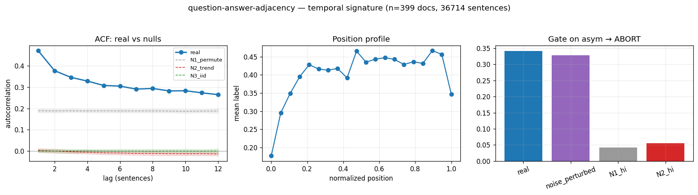

# Calibration record — `question-answer-adjacency`

**Verdict: ABORT** (pre-skeptic PROCEED, killed by skeptic on ['b_leakage'])

Calibration per the frozen [prereg card](../../prereg/question-answer-adjacency.md); domain `text-corpus`, 399 documents / 36714 labeled sentences (doc coverage 0.998).

## 1. Labeler + noise floor

- **Bulk judge:** `claude-haiku-4-5-20251001` (frozen instruction in the card); **second judge:** `claude-sonnet-5` on 12 held-out docs (1174 sentences).
- **Inter-judge:** agreement 0.877, κ = 0.524 → noise floor ε̂ = 0.063 (adequacy floor κ ≥ 0.3: PASS).
- **Independent heuristic cross-check:** accuracy 0.79, κ 0.23 (class 1: F1 0.63, class 2: F1 0.02).

## 2. Temporal signature vs nulls

| statistic | real | N1 permute | N2 trend | N3 iid |
|---|---|---|---|---|
| directed asymmetry (fwd−rev)/(fwd+rev) | **0.342 [0.299, 0.385]** | 0.001 | 0.002 | 0.002 |
| P(dst @ t+1 | src @ t) forward | **0.451 [0.424, 0.484]** | 0.239 | 0.170 | 0.170 |
| same, time-reversed | **0.221 [0.194, 0.250]** | 0.239 | 0.169 | 0.169 |
| self-match ACF(1) | **0.471 [0.450, 0.492]** | 0.189 | 0.003 | 0.000 |
| dwell mean | **4.760 [4.477, 5.079]** | 3.160 | 2.587 | 2.580 |
| dwell CV | **2.163 [2.041, 2.296]** | 2.170 | 1.115 | 1.127 |

Marginal ['0.766', '0.065', '0.169']; Markov order-1 vs 0 p = 0.00e+00.

## 3. Gate (preregistered) + verdict

Primary statistic `asym` (expected sign +): real **0.3418**, after ε̂-noise perturbation **0.3281**; N1 97.5% band hi 0.0417, N2 hi 0.0558.

- clears sampling noise (real > N1 hi AND N2 hi): **True**
- survives labeler noise floor (perturbed likewise): **True**
- labeler adequate (κ ≥ 0.3): **True**
- split-half stability: 0.3248 / 0.3554

**→ ABORT**

## 4. Mirror (Appendix B) + held-out validation

Process `markov`; fit on 279 train docs, validated on 120 held-out docs. Fitted params:

```json
{
 "process": "markov",
 "n_symbols": 3,
 "P": [
  [
   0.8964428105421219,
   0.050121679697613004,
   0.05343550976026511
  ],
  [
   0.3617664851784634,
   0.1808832425892317,
   0.4573502722323049
  ],
  [
   0.31074342701722574,
   0.08794197642792384,
   0.6013145965548504
  ]
 ],
 "pi": [
  0.7620867124142233,
  0.06487835308796007,
  0.1730349344978166
 ]
}
```

| statistic | real (held-out) | synthetic |
|---|---|---|
| acf(1) | 0.456 | 0.489 |
| mi(1) | 0.148 | 0.166 |
| dwell_mean | 4.755 | 4.903 |
| dwell_cv | 2.242 | 1.365 |
| asym (directed) | 0.390 | 0.303 |

Abs errors: acf_lag1_5 0.129, mi_lag1_5 0.041, dwell_mean 0.147, dwell_cv 0.876.

## 5. Adversarial skeptic pass (fixed kill-rubric, Opus)

| item | kill | evidence |
|---|---|---|
| a_noise_floor | clear | real asym=0.342, noise_perturbed=0.328 still far above noise_floor_eps=0.063 and N1_hi=0.042/N2_hi=0.056; gap dwarfs label noise. |
| b_leakage | **KILL** | Class 2 (ANSWER) is DEFINED as 'directly answers a question raised in the PRECEDING context' — the labeler is instructed to use prior context to assign the answer label, so Q->A ordering is built into the label definition, making the forward>reverse asymmetry circular. |
| c_composition | clear | N1 within-doc permutation band hi=0.042 is far below real=0.342, so the effect is genuine within-doc order, not per-doc marginal composition. |
| d_circularity | clear | mirror is a plain forward Markov matrix; its syn asym=0.303 vs real=0.390 (abs err ~0.087) and ACF/MI decay differently, so the spec tests structure beyond what was directly inserted — not vacuous. |
| e_segmentation | clear | pinned regex splitter segments sentences but does not by construction create Q/A alternation; the directedness comes from label content not segmentation cadence. |

_KILL on leakage (b): the ANSWER label explicitly requires a preceding question, so the measured forward Q->A asymmetry is definitionally guaranteed and circular. Note also heuristic crosscheck for class 2 has recall 0.009 / f1 0.018, showing the ANSWER label is almost entirely context-dependent judge inference rather than surface signal, reinforcing that the temporal statistic is baked into the label._



## Reproduction

```bash
.venv/bin/python -m experiments.explorations.synthetic.expansion.calibrate question-answer-adjacency
.venv/bin/python -m experiments.explorations.synthetic.expansion.render_records
```
Deterministic given the cached labels (`labels.json`); judge models pinned in the card; spend after this candidate: $6.15.
