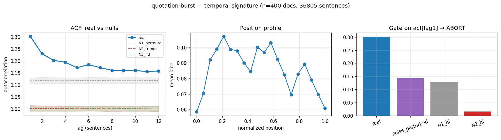

# Calibration record — `quotation-burst`

**Verdict: ABORT** (pre-skeptic PROCEED, killed by skeptic on ['d_circularity'])

Calibration per the frozen [prereg card](../../prereg/quotation-burst.md); domain `text-corpus`, 400 documents / 36805 labeled sentences (doc coverage 1.000).

## 1. Labeler + noise floor

- **Bulk judge:** `claude-haiku-4-5-20251001` (frozen instruction in the card); **second judge:** `claude-sonnet-5` on 12 held-out docs (1227 sentences).
- **Inter-judge:** agreement 0.869, κ = 0.587 → noise floor ε̂ = 0.071 (adequacy floor κ ≥ 0.3: PASS).
- **Independent heuristic cross-check:** P 0.52 / R 0.38 / F1 0.44 (judge rate 0.086, heuristic 0.064).

## 2. Temporal signature vs nulls

| statistic | real | N1 permute | N2 trend | N3 iid |
|---|---|---|---|---|
| ACF(1) | **0.302 [0.268, 0.336]** | 0.117 | 0.002 | -0.000 |
| MI(1) (nats) | **—** | — | — | — |
| Fano | **2.727 [2.466, 2.954]** | 1.882 | 0.926 | 0.912 |
| excite ratio P(1|1)/base | **4.210 [3.798, 4.624]** | 2.239 | 1.025 | 0.995 |
| inter-event gap CV | **1.624 [1.542, 1.711]** | 1.353 | 0.919 | 0.930 |
| spectral peak prominence | **—** | — | — | — |

Base rate 0.0862; Markov order-1 vs 0 p = 0.00e+00.

## 3. Gate (preregistered) + verdict

Primary statistic `acf[lag1]` (expected sign +): real **0.3022**, after ε̂-noise perturbation **0.1424**; N1 97.5% band hi 0.1280, N2 hi 0.0155.

- clears sampling noise (real > N1 hi AND N2 hi): **True**
- survives labeler noise floor (perturbed likewise): **True**
- labeler adequate (κ ≥ 0.3): **True**
- split-half stability: 0.3000 / 0.3045

**→ ABORT**

## 4. Mirror (Appendix B) + held-out validation

Process `logistic_ar`; fit on 280 train docs, validated on 120 held-out docs. Fitted params:

```json
{
 "process": "logistic_ar",
 "K": 8,
 "position": true,
 "intercept": -2.982218795636044,
 "coef_position": -0.21865152278294572,
 "kernel_w": [
  1.4967891511773277,
  0.7608744707815777,
  0.5104080947606406,
  0.5284627324284231,
  0.24124678223986473,
  0.5820289703072306,
  0.36217955215072145,
  0.3957802217849445
 ]
}
```

| statistic | real (held-out) | synthetic |
|---|---|---|
| acf(1) | 0.316 | 0.302 |
| fano | 2.797 | 2.510 |
| p11 | 0.380 | 0.354 |
| excite_ratio | 4.070 | 4.625 |
| gap_cv | 1.611 | 1.547 |

Abs errors: acf_lag1_5 0.028, fano 0.287, p11 0.026, excite_ratio 0.555, gap_cv 0.064.

## 5. Adversarial skeptic pass (fixed kill-rubric, see LEDGER — judge model untracked pre-C5)

| item | kill | evidence |
|---|---|---|
| a_noise_floor | clear | real acf1=0.302, noise_perturbed=0.267 both far above N1_hi=0.128; noise_floor_eps=0.010 tiny relative to the 0.174 ordered-vs-N1 gap. |
| b_leakage | clear | label is per-sentence presence of quotation/speech; the temporal ACF/Fano/burst statistic is not built into the single-sentence definition, so no circular question->answer style dependency. |
| c_composition | clear | N1 (within-doc permute) hi=0.128 while real=0.302 — ordered clearly beats the doc-marginal composition null, so effect is within-doc order not per-doc density. |
| d_circularity | **KILL** | mirror fits self-excitation (ACF-1) and validation's near-perfect acf/p11 match (abs_err acf1-5=0.028, p11=0.026) is exactly the fitted quantity; the only non-fitted checks (fano abs_err=0.287 on 2.8, excite_ratio abs_err=0.555 on ~4) are looser and derivative of the same AR kernel, so the spec tests little beyond what logistic_ar inserts by construction. |
| e_segmentation | clear | quotation clustering is content-driven (dialogue/interview blocks), not an alternation artifact of the regex splitter; segmentation would not create positive self-exciting ACF at lags 1-5 the way it might create alternation. |

_Gate is statistically solid (clears sampling, N1, and noise floor with a large margin, stable across halves). Main concern is circularity/thinness of the mirror validation: the matched param (ACF-1) is essentially what is validated, and low kappa=0.39 (barely above 0.30 floor) with only 5 labeled docs / 450 spans and 2.2% positive rate makes the labeler validation weak. Not a clean kill but the mirror should be shown to reproduce a NON-fitted moment (Fano/excite_ratio) within a preregistered tolerance before freezing — current fano/excite errors are large. Recommend flag, not auto-freeze._



## Reproduction

```bash
.venv/bin/python -m experiments.explorations.synthetic.expansion.calibrate quotation-burst
.venv/bin/python -m experiments.explorations.synthetic.expansion.render_records
```
Deterministic given the cached labels (`labels.json`); judge models pinned in the card; spend after this candidate: $4.07.
