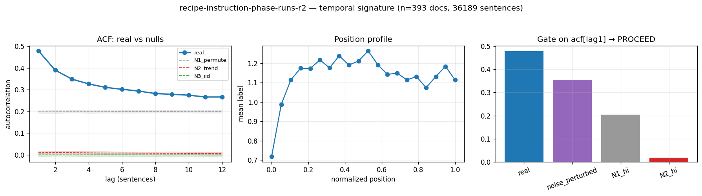

# Calibration record — `recipe-instruction-phase-runs-r2`

**Verdict: PROCEED**

Calibration per the frozen [prereg card](../../prereg/recipe-instruction-phase-runs.md); domain `text-corpus`, 393 documents / 36189 labeled sentences (doc coverage 0.983).

## 1. Labeler + noise floor

- **Bulk judge:** `claude-haiku-4-5-20251001` (frozen instruction in the card); **second judge:** `claude-sonnet-5` on 11 held-out docs (958 sentences).
- **Inter-judge:** agreement 0.745, κ = 0.609 → noise floor ε̂ = 0.137 (adequacy floor κ ≥ 0.3: PASS).
- **Independent heuristic cross-check:** accuracy 0.30, κ 0.03 (class 1: F1 0.08, class 2: F1 0.02, class 3: F1 0.08, class 4: F1 0.06).

## 2. Temporal signature vs nulls

| statistic | real | N1 permute | N2 trend | N3 iid |
|---|---|---|---|---|
| directed asymmetry (fwd−rev)/(fwd+rev) | **—** | — | — | — |
| P(dst @ t+1 | src @ t) forward | **—** | — | — | — |
| same, time-reversed | **—** | — | — | — |
| self-match ACF(1) | **0.479 [0.455, 0.502]** | 0.198 | 0.012 | 0.000 |
| dwell mean | **2.902 [2.763, 3.035]** | 1.908 | 1.554 | 1.536 |
| dwell CV | **1.757 [1.631, 1.889]** | 1.415 | 0.713 | 0.691 |

Marginal ['0.289', '0.505', '0.063', '0.072', '0.072']; Markov order-1 vs 0 p = 0.00e+00.

## 3. Gate (preregistered) + verdict

Primary statistic `acf[lag1]` (expected sign +): real **0.4788**, after ε̂-noise perturbation **0.3556**; N1 97.5% band hi 0.2041, N2 hi 0.0185.

- clears sampling noise (real > N1 hi AND N2 hi): **True**
- survives labeler noise floor (perturbed likewise): **True**
- labeler adequate (κ ≥ 0.3): **True**
- split-half stability: 0.4611 / 0.4952

**→ PROCEED**

## 4. Mirror (Appendix B) + held-out validation

Process `hier_categorical`; fit on 275 train docs, validated on 118 held-out docs. Fitted params:

```json
{
 "process": "hier_categorical",
 "n_symbols": 5,
 "jump_P": [
  [
   0.0,
   0.7507572479446127,
   0.06923409779316313,
   0.09433145824318477,
   0.08567719601903938
  ],
  [
   0.5115975171512578,
   0.0,
   0.10486769029728847,
   0.17379941195687684,
   0.20973538059457694
  ],
  [
   0.260655737704918,
   0.47540983606557374,
   0.0,
   0.12295081967213115,
   0.14098360655737704
  ],
  [
   0.23676323676323677,
   0.47052947052947053,
   0.07292707292707293,
   0.0,
   0.21978021978021978
  ],
  [
   0.3036837376460018,
   0.46001796945193174,
   0.05840071877807727,
   0.1778975741239892,
   0.0
  ]
 ],
 "alpha": 0.9400000000000001,
 "doc_props": [
  [
   0.11043873395166165,
   0.7851434154432754,
   0.004281452312736279,
   0.06218786272423283,
   0.03794853556809382
  ],
  [
   6.921979685810639e-07,
   0.9999972312081259,
   6.921979685810639e-07,
   6.921979685810639e-07,
   6.921979685810639e-07
  ],
  [
   7.89467517345566e-07,
   7.89467517345566e-07,
   0.9999968421299307,
   7.89467517345566e-07,
   7.89467517345566e-07
  ],
  [
   0.24878655443127048,
   0.2219265093251124,
   0.14982341829537796,
   0.16419971641801612,
   0.21526380153022306
  ],
  [
   8.05479141521304e-07,
   0.9999964841098958,
   8.05479141521304e-07,
   8.05479141521304e-07,
   1.0994526797175546e-06
  ],
  [
   0.3022895805941681,
   0.5253418444985654,
   0.008876921140119719,
   0.10817837465384081,
   0.05531327911330588
  ],
  [
   1.2387157338112948e-06,
   0.9999961803409646,
   8.603144339507884e-07,
   8.603144339507884e-07,
   8.603144339507884e-07
  ],
  [
   0.0001078503538828852,
   0.999755925251219,
   2.0041627942173523e-05,
   1.1203976580005064e-05,
   0.00010497879037575651
  ],
  [
   0.07168948023649671,
   0.37323887722611965,
   0.03346481351122536,
   0.1904760852924089,
   0.33113074373374934
  ],
  [
   0.9999964199491778,
   8.784442915039884e-07,
   9.988695717219714e-07,
   8.513684796449723e-07,
   8.513684796449723e-07
  ],
  [
   0.09732781554338094,
   0.2625513668419222,
   0.5510769211200199,
   0.024238391544734696,
   0.0648055049499422
  ],
  [
   0.29482618026914625,
   0.525022607239729,
   0.008695061987879338,
   0.11710746208461087,
   0.05434868841863452
  ],
  [
   1.657348980729862e-06,
   0.9999957819181536,
   8.535776219579433e-07,
   8.535776219579433e-07,
   8.535776219579433e-07
  ],
  [
   1.701151120505052e-05,
   0.9999641491853924,
   2.3244410364231683e-06,
   4.097917743479759e-06,
   1.2416944622675272e-05
  ],
  [
   8.058777020110414e-05,
   0.9997794341586278,
   3.904188143554007e-05,
   2.912188104331022e-05,
   7.18143086923564e-05
  ],
  [
   0.015301706615421271,
   0.9774773399177006,
   0.00044117571562110017,
   0.0005495485297275577,
   0.00623022922152959
  ],
  [
   2.3120542763289386e-05,
   0.9999302629763883,
   9.561414101767537e-06,
   1.0762612932019265e-05,
   2.629245381449442e-05
  ],
  [
   7.351367086200271e-07,
   0.9999970153836482,
   7.351367086200271e-07,
   7.792062261849442e-07,
   7.351367086200271e-07
  ],
  [
   0.9999971927486028,
   7.018128493688349e-07,
   7.018128493688349e-07,
   7.018128493688349e-07,
   7.018128493688349e-07
  ],
  [
   0.9999262287703462,
   3.783805453130989e-05,
   2.1632490985268895e-06,
   6.920474123086637e-06,
   2.684945190091315e-05
  ],
  [
   7.135931769746904e-07,
   0.9999971456272924,
   7.135931769746904e-07,
   7.135931769746904e-07,
   7.135931769746904e-07
  ],
  [
   8.221119460125647e-07,
   0.9999967115522163,
   8.221119460125647e-07,
   8.221119460125647e-07,
   8.221119460125647e-07
  ],
  [
   0.4976118007709833,
   0.33931503221727033,
   0.007793191755760339,
   0.04264283296515069,
   0.11263714229083528
  ],
  [
   0.01687651501049876,
   0.9300658286387561,
   0.03865803232926531,
   0.0025549653175971922,
   0.011844658703882637
  ],
  [
   0.011463475730763813,
   0.07148409324643788,
   0.037255908692314384,
   0.8606754380444747,
   0.019121084286009317
  ],
  [
   7.446056147738589e-07,
   0.9999970215775411,
   7.446056147738589e-07,
   7.446056147738589e-07,
   7.446056147738589e-07
  ],
  [
   0.28827189248702284,
   0.363154008886735,
   0.008755464482663703,
   0.21118750816411505,
   0.12863112597946333
  ],
  [
   0.0006493578694481153,
   0.997728807959858,
   0.00019103157770078078,
   0.0006669289731686102,
   0.0007638736198246237
  ],
  [
   8.12898623237713e-07,
   0.9999967484055073,
   8.12898623237713e-07,
   8.12898623237713e-07,
   8.12898623237713e-07
  ],
  [
   0.00010838206320644352,
   0.0011239367899862087,
   2.687235985053176e-05,
   0.9985010476541046,
   0.00023976113285215726
  ],
  [
   2.451249841436809e-06,
   2.633294997475249e-05,
   0.9999504235182252,
   9.69453808992898e-06,
   1.1097743868631908e-05
  ],
  [
   0.9997470098890424,
   0.00012564369281345557,
   7.587012773473241e-06,
   9.856022041821203e-06,
   0.00010990338332895164
  ],
  [
   0.012033069429698014,
   0.2893344551736148,
   0.3703378257334299,
   0.2607624837897118,
   0.06753216587354566
  ],
  [
   0.06451773770656555,
   0.09696070419861065,
   0.029095308466055132,
   0.8013059122098223,
   0.008120337418946398
  ],
  [
   0.09389896680868103,
   0.28238915631089784,
   0.21675786616868578,
   0.2107797864893864,
   0.19617422422234904
  ],
  [
   2.0352953880926437e-05,
   0.0002710564119225354,
   0.00018231149803023944,
   0.00025171508043630525,
   0.99927456405573
  ],
  [
   0.4844608367433725,
   0.11143837892549306,
   0.007222424149226348,
   0.10622171517200528,
   0.2906566450099029
  ],
  [
   0.06234180566440855,
   0.4762771059339988,
   0.1427878128225593,
   0.10671661762915094,
   0.21187665794988259
  ],
  [
   0.30163780635415,
   0.10542785859420338,
   0.18583205013557946,
   0.2501625576832044,
   0.15693972723286287
  ],
  [
   0.9999290622340969,
   4.9332837299187755e-05,
   1.6280757809263986e-06,
   2.1127891163226885e-06,
   1.786406370667332e-05
  ],
  [
   0.07492312885021192,
   0.018888009679674862,
   0.9004487439626766,
   0.002636246791979389,
   0.0031038707154573096
  ],
  [
   0.9999972670144507,
   6.832463873950696e-07,
   6.832463873950696e-07,
   6.832463873950696e-07,
   6.832463873950696e-07
  ],
  [
   0.05352566267807206,
   0.29767164040356275,
   0.008096156031429333,
   0.28040216190093875,
   0.36030437898599715
  ],
  [
   0.723124678339813,
   0.15873220259299467,
   0.010097173548889879,
   0.06039432332249813,
   0.047651622195804356
  ],
  [
   0.313601179489581,
   0.1887714384192035,
   0.16438257096385173,
   0.2248272149972612,
   0.1084175961301026
  ],
  [
   0.1380491091002477,
   0.3215344103649786,
   0.2238059116639646,
   0.10023806771363393,
   0.21637250115717524
  ],
  [
   2.322213242110651e-05,
   0.9999688590674639,
   1.0363630805701636e-06,
   5.291910494688185e-06,
   1.5905265396013511e-06
  ],
  [
   0.017703854019216467,
   0.07075702968078168,
   0.7580339278285807,
   0.08215359150097092,
   0.07135159697045
  ],
  [
   7.311405488811117e-07,
   0.9999970754378047,
   7.311405488811117e-07,
   7.311405488811117e-07,
   7.311405488811117e-07
  ],
  [
   0.14625163227754254,
   0.47805968300615453,
   0.15801010213986577,
   0.06212200559259572,
   0.15555657698384154
  ],
  [
   0.9995244423285364,
   0.0001614251787100608,
   0.0002335393116154968,
   3.729532266905737e-05,
   4.3297858468820853e-05
  ],
  [
   0.9999974093573352,
   6.476606662539251e-07,
   6.476606662539251e-07,
   6.476606662539251e-07,
   6.476606662539251e-07
  ],
  [
   0.8094004339661939,
   0.1580923976575347,
   0.002336733984710337,
   0.026667245886788683,
   0.003503188504772548
  ],
  [
   0.05020929633948985,
   0.6440511259378653,
   0.07692127254829194,
   0.00773072269476944,
   0.22108758247958354
  ],
  [
   0.01930456086026554,
   0.9610133186144196,
   0.009234507437113253,
   0.006084960438823445,
   0.0043626526493780494
  ],
  [
   4.921138778632345e-07,
   4.921138778632345e-07,
   4.921138778632345e-07,
   0.9999980315444885,
   4.921138778632345e-07
  ],
  [
   0.40623140795519175,
   0.5714104540558285,
   0.005735728893541286,
   0.007656015766699461,
   0.008966393328738866
  ],
  [
   7.964209497705194e-07,
   0.9999968143162011,
   7.964209497705194e-07,
   7.964209497705194e-07,
   7.964209497705194e-07
  ],
  [
   0.11423857822445567,
   0.7599530038269798,
   0.011342508436450923,
   0.019132391579908144,
   0.09533351793220547
  ],
  [
   0.2882905140580341,
   0.11036269111285986,
   0.1730669610269441,
   0.21007639748385043,
   0.21820343631831152
  ],
  [
   0.0034045374614889022,
   0.9962816099302559,
   8.10999736253507e-05,
   0.00010748992661975838,
   0.00012526270800990687
  ],
  [
   0.7138170430398015,
   0.2338379446079054,
   0.018826205739781412,
   0.026391103014743844,
   0.007127703597767817
  ],
  [
   0.9999973152642848,
   6.711839288647535e-07,
   6.711839288647535e-07,
   6.711839288647535e-07,
   6.711839288647535e-07
  ],
  [
   0.07591259986025678,
   0.21248552906256318,
   0.010569929766679656,
   0.5714568854560527,
   0.12957505585444776
  ],
  [
   0.1080090064086424,
   0.37360690826599796,
   0.3917566594593898,
   0.002860584767851334,
   0.12376684109811852
  ],
  [
   0.24728231396254907,
   0.297271936718451,
   0.041335637156019234,
   0.2985531329583716,
   0.11555697920460932
  ],
  [
   0.09797044849336828,
   0.8119028853102823,
   0.0025838390928535917,
   0.06960042146450265,
   0.0179424056389932
  ],
  [
   0.0015811036753285747,
   0.008877209771900799,
   0.1022764319100657,
   0.6768705252164651,
   0.21039472942623988
  ],
  [
   8.672537459748379e-07,
   0.9999930820534394,
   8.672537459748379e-07,
   1.0961555443327025e-06,
   4.0872835245501045e-06
  ],
  [
   0.6413785171329721,
   0.1675567848882429,
   0.048343506034267035,
   0.02339201062246629,
   0.11932918132205173
  ],
  [
   0.0027070339669305796,
   0.9110109804881156,
   0.00464456849795002,
   0.05618227486289916,
   0.025455142184104586
  ],
  [
   0.2620080738688936,
   0.697087292711276,
   0.006606662537531536,
   0.0088462464445557,
   0.025451724437743396
  ],
  [
   1.7754275298391583e-06,
   0.9999956336789835,
   8.636311622914567e-07,
   8.636311622914567e-07,
   8.636311622914567e-07
  ],
  [
   0.02863357944087718,
   0.9647696033166875,
   0.0008248214089297138,
   0.004516711591667178,
   0.0012552842418385346
  ],
  [
   0.1697559138039749,
   0.4998606950902651,
   0.10238190522361615,
   0.07424581489288194,
   0.1537556709892621
  ],
  [
   6.882439940722416e-07,
   0.9999972470240239,
   6.882439940722416e-07,
   6.882439940722416e-07,
   6.882439940722416e-07
  ],
  [
   6.915264905542962e-07,
   0.999997233894038,
   6.915264905542962e-07,
   6.915264905542962e-07,
   6.915264905542962e-07
  ],
  [
   0.00509070874364699,
   0.9909291538783257,
   0.00023856650086324813,
   0.0017426561294015565,
   0.0019989147477626136
  ],
  [
   5.079456643036272e-05,
   1.5245111256655303e-06,
   0.9998873279599158,
   1.393095324306532e-05,
   4.6422009285263575e-05
  ],
  [
   7.373605241941116e-07,
   0.9999970505579034,
   7.373605241941116e-07,
   7.373605241941116e-07,
   7.373605241941116e-07
  ],
  [
   0.99989069696445,
   8.442990409287981e-05,
   3.474126992228191e-06,
   4.662732426586266e-06,
   1.6736272038398725e-05
  ],
  [
   0.017771824757340897,
   0.2924177710026047,
   0.38429870359404245,
   0.23324903821609885,
   0.07226266242991307
  ],
  [
   7.281563019626563e-07,
   0.9999970873747924,
   7.281563019626563e-07,
   7.281563019626563e-07,
   7.281563019626563e-07
  ],
  [
   4.00253784557632e-05,
   0.9999233705858362,
   6.337901874155116e-06,
   8.669211912429354e-06,
   2.1596921921595818e-05
  ],
  [
   0.1960768622407169,
   0.10987252279343439,
   0.05200140368457122,
   0.28074296936702303,
   0.3613062419142546
  ],
  [
   0.999526048334809,
   0.00040331716751765533,
   1.788927333239489e-05,
   2.4388461019301738e-05,
   2.835676332169501e-05
  ],
  [
   7.345610046615236e-07,
   7.345610046615236e-07,
   0.9999970617559815,
   7.345610046615236e-07,
   7.345610046615236e-07
  ],
  [
   0.5841578716817495,
   0.16493583178837795,
   0.08334667053327405,
   0.14961704245370983,
   0.017942583542888635
  ],
  [
   1.882866563398449e-06,
   0.9999955375917715,
   8.598472217424775e-07,
   8.598472217424775e-07,
   8.598472217424775e-07
  ],
  [
   0.28321480200443655,
   0.5914920190239114,
   0.00728505024122781,
   0.08978471539537729,
   0.028223413335046944
  ],
  [
   0.05918031468294058,
   0.42520868292455344,
   0.06883616577636717,
   0.24109343180810525,
   0.20568140480803376
  ],
  [
   0.0037639401173603306,
   0.9764333517934316,
   0.0027580796671934416,
   0.010256984322430837,
   0.006787644099583615
  ],
  [
   0.5139972262973865,
   0.3391436584263933,
   0.054321798132858604,
   0.042854791987025735,
   0.04968252515633596
  ],
  [
   1.2373459135400434e-06,
   0.9999962750094626,
   8.292148746791083e-07,
   8.292148746791083e-07,
   8.292148746791083e-07
  ],
  [
   2.180026697466926e-05,
   0.9999465831821549,
   6.335003303912928e-06,
   1.5276634643068323e-05,
   1.0004912923444199e-05
  ],
  [
   9.569085706493652e-07,
   0.9999965155853172,
   8.425020374805619e-07,
   8.425020374805619e-07,
   8.425020374805619e-07
  ],
  [
   0.29521679510341925,
   0.22771416239267767,
   0.030258926420004037,
   0.3355969553412846,
   0.11121316074261448
  ],
  [
   0.06625324117548914,
   0.6805321746857531,
   0.10995520122835066,
   0.03378829989422269,
   0.10947108301618431
  ],
  [
   6.794729205250727e-07,
   6.794729205250727e-07,
   6.794729205250727e-07,
   6.794729205250727e-07,
   0.999997282108318
  ],
  [
   0.005166477171842659,
   0.9914376089946492,
   0.0002850805293045797,
   0.0014486434344841744,
   0.0016621898697194726
  ],
  [
   0.20704738957244348,
   0.4401871928834828,
   0.0635018909072826,
   0.02371634830929459,
   0.26554717832749647
  ],
  [
   0.5834066375896407,
   0.24308523254200146,
   0.0383648118112434,
   0.04171481638017393,
   0.09342850167694043
  ],
  [
   0.5804841433699666,
   0.18546969910042851,
   0.019810092813599554,
   0.16309044566844466,
   0.051145619047560646
  ],
  [
   0.04704850522660703,
   0.7276774430836315,
   0.03487311171592867,
   0.036398296791530664,
   0.15400264318230214
  ],
  [
   0.0004161390197874788,
   0.999464078589416,
   1.9979476506455126e-05,
   2.68377121782141e-05,
   7.296520211182623e-05
  ],
  [
   2.0664781914193197e-06,
   0.9999953302020963,
   8.677732374868181e-07,
   8.677732374868181e-07,
   8.677732374868181e-07
  ],
  [
   0.04811818721611808,
   0.646527082674483,
   0.023713250570991218,
   0.14294727648246186,
   0.13869420305594587
  ],
  [
   0.044412758207124245,
   0.6616774210849274,
   0.016460210504780186,
   0.23593458561037975,
   0.04151502459278825
  ],
  [
   0.10535911645682364,
   0.3057951676928817,
   0.4273845580216884,
   0.0747057142111575,
   0.08675544361744886
  ],
  [
   0.00034480252607333,
   0.9993351062792767,
   3.306598716259635e-05,
   7.264688951919202e-05,
   0.00021437831796816293
  ],
  [
   7.708568225128264e-07,
   0.9999969165727102,
   7.708568225128264e-07,
   7.708568225128264e-07,
   7.708568225128264e-07
  ],
  [
   0.9926714202708944,
   0.004110239914790388,
   7.447895227719354e-05,
   0.0013483132082855703,
   0.0017955476537523662
  ],
  [
   0.2676422532780446,
   0.20689305741164968,
   0.07108373934432463,
   0.4117560420050661,
   0.04262490796091499
  ],
  [
   0.07084277659154228,
   0.5592061278751372,
   0.06307368555078537,
   0.12169809950574188,
   0.1851793104767933
  ],
  [
   0.003653630742838728,
   0.9950610448056479,
   0.00016224945730153531,
   0.0005224850271184633,
   0.0006005899670934305
  ],
  [
   0.06168052467365837,
   0.8788281146667027,
   0.003790466772055742,
   0.04593552516684789,
   0.009765368720735308
  ],
  [
   0.2029074986859109,
   0.012115386071279243,
   0.012171568334025289,
   0.06983577950459788,
   0.7029697674041867
  ],
  [
   0.6724107581276735,
   0.14794567600476036,
   0.014816649357670672,
   0.007649339294774921,
   0.15717757721512043
  ],
  [
   3.5148161199415626e-06,
   0.9999938802213876,
   8.683208308857199e-07,
   8.683208308857199e-07,
   8.683208308857199e-07
  ],
  [
   0.010918941672856933,
   0.30759338576325124,
   0.03686719264292968,
   0.1450459256061098,
   0.4995745543148523
  ],
  [
   0.34675559203680967,
   0.08499432457793529,
   0.1515968643243583,
   0.1891464879137598,
   0.22750673114713701
  ],
  [
   0.2702728146820261,
   0.08723431798728312,
   0.1264307944542455,
   0.3426723597502207,
   0.17338971312622464
  ],
  [
   0.4610194175660342,
   0.4084031847653812,
   0.006461344958372459,
   0.008142576222751446,
   0.11597347648746066
  ],
  [
   0.1731984580115324,
   0.778406876996488,
   0.0028177787279884074,
   0.01735750190974511,
   0.028219384354246216
  ],
  [
   0.14825280345954817,
   0.13995664016107506,
   0.02455231899317313,
   0.17683493350749704,
   0.5104033038787067
  ],
  [
   6.831948466655084e-07,
   0.9999972672206136,
   6.831948466655084e-07,
   6.831948466655084e-07,
   6.831948466655084e-07
  ],
  [
   0.0107752024657044,
   0.9769741916737307,
   0.00038111614359017613,
   0.0031191719157785984,
   0.008750317801195938
  ],
  [
   0.0264191261947544,
   0.8336322272194048,
   0.02592339446521285,
   0.06433719678838477,
   0.049688055332243054
  ],
  [
   0.2009296201402631,
   0.37154466904062244,
   0.041205268241783076,
   0.2547305218956114,
   0.13158992068172004
  ],
  [
   1.3956534157999314e-05,
   0.9999817906493862,
   8.621431037828605e-07,
   2.4755036769457526e-06,
   9.151696749344735e-07
  ],
  [
   8.231451435905485e-07,
   0.9999961329523873,
   8.231451435905485e-07,
   8.231451435905485e-07,
   1.397612182037251e-06
  ],
  [
   0.36171388369738133,
   0.29733866755772764,
   0.0558452571344853,
   0.06083739120071307,
   0.22426480040969252
  ],
  [
   0.0004392904506103071,
   0.9993596242044755,
   6.837906868567194e-05,
   2.3718256882415508e-05,
   0.00010898801934584966
  ],
  [
   0.9999973446478031,
   6.598891089803765e-07,
   6.598891089803765e-07,
   6.598891089803765e-07,
   6.756848701263739e-07
  ],
  [
   0.5694680044566985,
   0.40813109639941103,
   0.005740373272653863,
   0.0076694289773604814,
   0.008991096893876184
  ],
  [
   2.8023526640769918e-06,
   0.9999945873538851,
   8.700978170071489e-07,
   8.700978170071489e-07,
   8.700978170071489e-07
  ],
  [
   0.9999954614605137,
   2.0753224830293435e-06,
   8.210723345351946e-07,
   8.210723345351946e-07,
   8.210723345351946e-07
  ],
  [
   0.115182923057721,
   0.3490528853959497,
   0.16801171612689628,
   0.11602887211007142,
   0.2517236033093618
  ],
  [
   0.9947468486313357,
   0.0035340816223134665,
   0.00035008482329274075,
   0.00048225043444898356,
   0.00088673448860918
  ],
  [
   0.9999968814686427,
   7.796328393773862e-07,
   7.796328393773862e-07,
   7.796328393773862e-07,
   7.796328393773862e-07
  ],
  [
   0.5981458819940576,
   0.08859305866092756,
   0.00577852183909955,
   0.2235805645455645,
   0.08390197296035097
  ],
  [
   0.1481191750639439,
   0.4620997878272922,
   0.021783239991586958,
   0.11029603994548089,
   0.257701757171696
  ],
  [
   0.9999966558851999,
   8.77970221799547e-07,
   8.220481928517823e-07,
   8.220481928517823e-07,
   8.220481928517823e-07
  ],
  [
   0.1887921342993963,
   0.21456395359113373,
   0.07850401466153632,
   0.009072562016901506,
   0.5090673354310322
  ],
  [
   0.029042547834421856,
   0.1070227062622302,
   0.013829855682127756,
   0.4351683991666861,
   0.41493649105453406
  ],
  [
   2.5989788893074884e-05,
   0.9999618003747887,
   1.2859474613089122e-06,
   8.967739573904962e-06,
   1.956149283096407e-06
  ],
  [
   0.552143106067575,
   0.034200598273593404,
   0.21426717426628802,
   0.18618777919548196,
   0.013201342197061657
  ],
  [
   5.219767804862548e-05,
   0.9997698017112912,
   1.3224178442403236e-05,
   1.73743969000938e-05,
   0.00014740203531765677
  ],
  [
   0.0777527809525024,
   0.6464562912380684,
   0.09268965684546944,
   0.12120387214417543,
   0.06189739881978447
  ],
  [
   0.16073133336162584,
   0.5854200612042505,
   0.057127809221707675,
   0.027284531617952138,
   0.16943626459446387
  ],
  [
   8.258695200689833e-07,
   0.9999967373983117,
   8.122440561104192e-07,
   8.122440561104192e-07,
   8.122440561104192e-07
  ],
  [
   1.9509490900265783e-05,
   0.9999182394763753,
   7.362792318035141e-06,
   3.341016639249048e-05,
   2.1478074014035037e-05
  ],
  [
   0.0628458993703235,
   0.37215892929811034,
   0.3527700247818766,
   0.12393935722619022,
   0.08828578932349944
  ],
  [
   0.9999969253915783,
   7.686521054890242e-07,
   7.686521054890242e-07,
   7.686521054890242e-07,
   7.686521054890242e-07
  ],
  [
   0.14122652230795452,
   0.2825764504540437,
   0.1374810415445707,
   0.3872748877528901,
   0.05144109794054101
  ],
  [
   6.014726897127103e-06,
   0.9999911113308886,
   8.568654345323991e-07,
   1.1602113453645483e-06,
   8.568654345323991e-07
  ],
  [
   0.9997038261941894,
   6.066865623758549e-05,
   2.1597791643084582e-05,
   8.106148503116042e-05,
   0.00013284587289869433
  ],
  [
   0.05531893448719887,
   0.0820377187614941,
   0.05422694851924743,
   0.1455682737383323,
   0.6628481244937273
  ],
  [
   0.12063479796863176,
   0.12676427477210125,
   0.005967245239869179,
   0.44202372786411126,
   0.30460995415528647
  ],
  [
   0.06047794237640543,
   0.036183583656739696,
   0.012232607894611358,
   0.8158187747563947,
   0.07528709131584864
  ],
  [
   8.203135762799799e-07,
   0.9999967187456952,
   8.203135762799799e-07,
   8.203135762799799e-07,
   8.203135762799799e-07
  ],
  [
   0.04893998528269411,
   0.425762641260215,
   0.09683000847717439,
   0.10398853355440713,
   0.32447883142550943
  ],
  [
   8.256772271131251e-07,
   0.9999966972910919,
   8.256772271131251e-07,
   8.256772271131251e-07,
   8.256772271131251e-07
  ],
  [
   0.48479754655712154,
   0.43415851869398525,
   0.006054448210395243,
   0.034742858122777935,
   0.04024662841572014
  ],
  [
   0.1445000771968546,
   0.6443633473222476,
   0.038456541997877326,
   0.02945687841803292,
   0.14322315506498742
  ],
  [
   0.016808430254096226,
   0.9070652204303368,
   0.06416407251070609,
   0.005584937318570293,
   0.006377339486290754
  ],
  [
   0.3776326743179919,
   0.46554516976821947,
   0.09723236594271088,
   0.027617047507534714,
   0.031972742463542994
  ],
  [
   0.003826365332926341,
   0.9271738773487604,
   0.002187686178852044,
   0.04419513392600034,
   0.022616937213460718
  ],
  [
   0.06309620700103866,
   0.6820521817732469,
   0.016945766866607283,
   0.10021690759657652,
   0.13768893676253077
  ],
  [
   0.1502913654250596,
   0.0006327865499332095,
   0.10846651583051825,
   0.013691309618492905,
   0.726918022575996
  ],
  [
   1.6515603823198758e-05,
   0.9997029393562205,
   2.6221862319921217e-05,
   7.357488800314166e-06,
   0.00024696568883632834
  ],
  [
   0.9995527604233971,
   0.00036185323511721225,
   3.739565876073341e-05,
   2.2178355848396824e-05,
   2.5812326876613162e-05
  ],
  [
   0.1135025751991021,
   0.15954632209010888,
   0.007532689594349945,
   0.44435450944587446,
   0.27506390367056466
  ],
  [
   0.2843446318315012,
   0.6552501347408558,
   0.01897601507422577,
   0.010813332934010095,
   0.03061588541940707
  ],
  [
   0.01403034451393934,
   0.9313602669667483,
   0.028601845182134232,
   0.01507045179893976,
   0.010937091538238358
  ],
  [
   0.9999966670875531,
   8.33228111804212e-07,
   8.33228111804212e-07,
   8.33228111804212e-07,
   8.33228111804212e-07
  ],
  [
   0.5448218065281109,
   0.40848129367641145,
   0.02080238924344268,
   0.01196218195190469,
   0.01393232860013022
  ],
  [
   1.0605812227336224e-05,
   0.9999753352183326,
   9.342169088310952e-07,
   9.77682964373609e-06,
   3.347922887662261e-06
  ],
  [
   0.9999974719882083,
   6.320029479699939e-07,
   6.320029479699939e-07,
   6.320029479699939e-07,
   6.320029479699939e-07
  ],
  [
   0.9999959381521978,
   8.277937573197016e-07,
   1.5784665303980656e-06,
   8.277937573197016e-07,
   8.277937573197016e-07
  ],
  [
   0.9999305242971698,
   9.154961145450139e-06,
   4.37411476656703e-06,
   5.856294549418284e-06,
   5.009033236883713e-05
  ],
  [
   0.2650745523764311,
   0.5423372219085487,
   0.008496857905938038,
   0.17155886966977985,
   0.012532498139302125
  ],
  [
   0.9902653964163516,
   0.004020101521063907,
   0.0005753423096701922,
   0.002049297503154576,
   0.003089862249759663
  ],
  [
   0.12237845919498298,
   9.55691937510486e-07,
   0.14707024484720993,
   0.3317195252107534,
   0.39883081505511625
  ],
  [
   0.9999970257432896,
   7.435641776506704e-07,
   7.435641776506704e-07,
   7.435641776506704e-07,
   7.435641776506704e-07
  ],
  [
   0.9964832684981377,
   0.002763413640427117,
   5.696066238728846e-05,
   0.0006100922808450655,
   8.626491820272456e-05
  ],
  [
   0.14639915252285593,
   0.706948300988097,
   0.013330778214463636,
   0.06629110514221875,
   0.06703066313236451
  ],
  [
   0.013920385723087904,
   0.23557125240351945,
   0.3595135618945892,
   0.14934146983327343,
   0.24165333014552995
  ],
  [
   0.9999967248738386,
   8.187815404039318e-07,
   8.187815404039318e-07,
   8.187815404039318e-07,
   8.187815404039318e-07
  ],
  [
   0.23456355134026494,
   0.3578336142002873,
   0.022352900557759434,
   0.01140685012942355,
   0.37384308377226483
  ],
  [
   0.007662934124910571,
   0.9252327692637868,
   0.018706488267335366,
   0.018185392042870466,
   0.030212416301096667
  ],
  [
   0.9773308434191422,
   0.002239016788208959,
   0.0003804441252081978,
   0.0004221360617904345,
   0.019627559605649995
  ],
  [
   4.421935648066236e-05,
   0.9999493325811379,
   1.6488833425895325e-06,
   2.2244744348815363e-06,
   2.5747046040887054e-06
  ],
  [
   0.9999976163514617,
   5.959121346254436e-07,
   5.959121346254436e-07,
   5.959121346254436e-07,
   5.959121346254436e-07
  ],
  [
   0.28728314285815226,
   0.3958691599292818,
   0.15513778428721808,
   0.09913707102983288,
   0.06257284189551507
  ],
  [
   0.18238353789650608,
   0.11727345493077491,
   0.09825139156529007,
   0.5488602032641913,
   0.05323141234323759
  ],
  [
   8.716126427866731e-07,
   0.9999966298284597,
   8.328529659363726e-07,
   8.328529659363726e-07,
   8.328529659363726e-07
  ],
  [
   0.04719970072236814,
   0.13074497351964795,
   0.014848498382909022,
   0.4851675264557652,
   0.3220393009193096
  ],
  [
   0.3158121061909596,
   0.6438293529254467,
   0.008835206672110173,
   0.017574359467217,
   0.013948974744266486
  ],
  [
   0.001945432568593822,
   0.9585151589820098,
   0.00076689031224993,
   0.021860424495668725,
   0.016912093641477766
  ],
  [
   0.523480940943086,
   0.10427926952894766,
   0.07260062755133757,
   0.21281323462667537,
   0.08682592734995345
  ],
  [
   0.990832810369282,
   0.006064103530265497,
   0.0007108245538933675,
   0.0021298414511345012,
   0.0002624200954247361
  ],
  [
   8.656966527969326e-07,
   0.9999954708513967,
   8.656966527969326e-07,
   9.391837992594285e-07,
   1.858571498476066e-06
  ],
  [
   0.9999974350180538,
   6.412454866061648e-07,
   6.412454866061648e-07,
   6.412454866061648e-07,
   6.412454866061648e-07
  ],
  [
   1.5929239490792797e-06,
   0.9999958559688442,
   8.503690689417229e-07,
   8.503690689417229e-07,
   8.503690689417229e-07
  ],
  [
   1.9500872540601657e-05,
   0.9999745534575378,
   9.948567387004903e-07,
   1.3384164843927754e-06,
   3.612396698537124e-06
  ],
  [
   8.335801852768688e-07,
   0.9999967324110484,
   8.113362555190593e-07,
   8.113362555190593e-07,
   8.113362555190593e-07
  ],
  [
   0.19849260763127388,
   0.17116124687179693,
   0.1246960064267619,
   0.1353494073453601,
   0.37030073172480726
  ],
  [
   0.18743934482245603,
   0.5471083345436147,
   0.050434884064066904,
   0.0367269259100061,
   0.17829051065985602
  ],
  [
   0.11611750143859954,
   0.5502401782556202,
   0.06736039317598978,
   0.0777849816969559,
   0.1884969454328347
  ],
  [
   0.0400328642550971,
   0.8599797686072125,
   0.05195213306472754,
   0.031653892923039745,
   0.016381341149923182
  ],
  [
   0.9999974173285371,
   6.456678657783838e-07,
   6.456678657783838e-07,
   6.456678657783838e-07,
   6.456678657783838e-07
  ],
  [
   0.012248924327797225,
   0.8877049692516058,
   0.005259976833225525,
   0.031704788575290334,
   0.06308134101208099
  ],
  [
   0.28422254357469273,
   0.14925371699538503,
   0.004225362105353844,
   0.4923663104921269,
   0.0699320668324414
  ],
  [
   0.9999974301776388,
   6.424555903645136e-07,
   6.424555903645136e-07,
   6.424555903645136e-07,
   6.424555903645136e-07
  ],
  [
   0.12675837549988617,
   0.2870244218722247,
   0.14359066997051823,
   0.2976754365772958,
   0.14495109608007523
  ],
  [
   8.202839331560804e-06,
   0.9999832055975614,
   8.790174942419454e-07,
   1.699092236491621e-06,
   6.013453376498681e-06
  ],
  [
   0.9972496727993182,
   0.001084244949300595,
   0.00030442562196347566,
   0.0010099909918734754,
   0.00035166563754436954
  ],
  [
   0.06400706200568046,
   0.7447112916601091,
   0.0317762463257693,
   0.04440409713796156,
   0.11510130287047947
  ],
  [
   0.21184710613564858,
   0.0850047537151983,
   0.023962567863614642,
   0.4964588238805926,
   0.182726748404946
  ],
  [
   0.03880800994797765,
   0.9544896225788958,
   0.0010767946355975705,
   0.0014223999282011604,
   0.004203172909327958
  ],
  [
   2.0865696858763264e-06,
   0.9999953047734493,
   8.695522883513572e-07,
   8.695522883513572e-07,
   8.695522883513572e-07
  ],
  [
   0.9999766117412657,
   1.9706196772647124e-05,
   9.317075890172025e-07,
   1.2721889066739183e-06,
   1.4781654657927168e-06
  ],
  [
   7.877327219201869e-07,
   0.9999968490691126,
   7.877327219201869e-07,
   7.877327219201869e-07,
   7.877327219201869e-07
  ],
  [
   1.253393589175395e-06,
   0.9999916925674869,
   1.951864284322478e-06,
   8.845010970656815e-07,
   4.217673542519564e-06
  ],
  [
   0.25707584618267326,
   0.6794466647437305,
   0.007497346144107851,
   0.009984441130455999,
   0.04599570179903249
  ],
  [
   0.9999974080716575,
   6.479820856845538e-07,
   6.479820856845538e-07,
   6.479820856845538e-07,
   6.479820856845538e-07
  ],
  [
   8.392443836718118e-07,
   3.354943926083935e-06,
   0.9999841307206976,
   3.1963114318383943e-06,
   8.478779560862678e-06
  ],
  [
   0.1524956656071484,
   0.465564443587541,
   0.012697034444821745,
   0.2444833471226029,
   0.12475950923788591
  ],
  [
   0.09538350855189891,
   0.7797836935801148,
   0.03148177977198908,
   0.005592228015704185,
   0.08775879008029311
  ],
  [
   0.004513085961437441,
   0.988256512045345,
   0.0006031012229535638,
   0.003924572746926872,
   0.0027027280233370087
  ],
  [
   7.157956248922967e-07,
   0.9999971368175007,
   7.157956248922967e-07,
   7.157956248922967e-07,
   7.157956248922967e-07
  ],
  [
   5.542954178992349e-05,
   3.4957092859642004e-05,
   4.024797848402803e-06,
   0.9997946726336724,
   0.00011091593382961435
  ],
  [
   7.466446441705926e-07,
   0.9999970134214236,
   7.466446441705926e-07,
   7.466446441705926e-07,
   7.466446441705926e-07
  ],
  [
   0.07933842379699106,
   0.24901969860938108,
   0.20379628110957493,
   0.30747193375435783,
   0.1603736627296951
  ],
  [
   0.016493039037888194,
   0.21042908796474036,
   0.0074156369317066135,
   0.3809516977226515,
   0.3847105383430133
  ],
  [
   0.7390558469001102,
   0.03639684745916855,
   0.021688069798501613,
   0.012845124170289785,
   0.1900141116719299
  ],
  [
   0.1383092454237702,
   0.3382987729003706,
   0.18077202601361866,
   0.11367779175401975,
   0.22894216390822078
  ],
  [
   0.997883330302472,
   0.00048268571225958123,
   0.00032555111530973164,
   8.569135992782179e-05,
   0.0012227415100309266
  ],
  [
   0.0011825577457455197,
   0.9947445404337011,
   0.0001648414038337789,
   0.0011470259239195085,
   0.0027610344928000303
  ],
  [
   0.9999976427996927,
   5.893000768732985e-07,
   5.893000768732985e-07,
   5.893000768732985e-07,
   5.893000768732985e-07
  ],
  [
   0.9999967936227752,
   8.015943062688183e-07,
   8.015943062688183e-07,
   8.015943062688183e-07,
   8.015943062688183e-07
  ],
  [
   0.06235276338087527,
   0.3089518839640716,
   0.10478227739535971,
   0.02273754336499857,
   0.501175531894695
  ],
  [
   0.7138245827729662,
   0.21324684985619063,
   0.00586439552532838,
   0.04432741968829066,
   0.02273675215722417
  ],
  [
   0.3596784969840592,
   0.5052752569651079,
   0.03344589376388193,
   0.04706422751643023,
   0.05453612477052085
  ],
  [
   0.0746373711434528,
   0.5422058627792224,
   0.019951228052864905,
   0.061646227570646646,
   0.3015593104538133
  ],
  [
   0.9948445034520841,
   0.0014671650247914864,
   0.0005648989028385408,
   0.001652154434036927,
   0.0014712781862490393
  ],
  [
   7.76700997943036e-07,
   6.525006724228795e-05,
   4.132825681162031e-06,
   0.9999277981402539,
   2.04226582472821e-06
  ],
  [
   0.0004125839062074977,
   0.9995163977130138,
   4.230012413582709e-06,
   4.548085792495857e-05,
   2.130751044029057e-05
  ],
  [
   0.11143770951035617,
   0.02461856303239941,
   0.1662893034740704,
   0.4178938011063093,
   0.27976062287686465
  ],
  [
   0.02621542279641888,
   0.4462688160780862,
   0.056968924334324454,
   0.24235468095457524,
   0.22819215583659536
  ],
  [
   1.796550476414651e-05,
   4.825175621856991e-06,
   1.3294095719212541e-05,
   0.9999556820354359,
   8.233188458843326e-06
  ],
  [
   0.999997079121862,
   7.302195345558683e-07,
   7.302195345558683e-07,
   7.302195345558683e-07,
   7.302195345558683e-07
  ],
  [
   0.0001416395763088511,
   0.999543517971856,
   4.1700448423341764e-05,
   5.66760619252752e-05,
   0.0002164659414863808
  ],
  [
   0.9999974324318671,
   6.418920332717572e-07,
   6.418920332717572e-07,
   6.418920332717572e-07,
   6.418920332717572e-07
  ],
  [
   0.9999970057203428,
   7.390820000275204e-07,
   7.390820000275204e-07,
   7.390820000275204e-07,
   7.770336574145127e-07
  ],
  [
   0.08726101044438853,
   0.4133265892492983,
   0.31319558890415367,
   0.00844535923926654,
   0.17777145216289292
  ],
  [
   0.00023880756177436336,
   0.9995597608340151,
   7.051087016149828e-05,
   1.8237394079787467e-05,
   0.0001126833399691385
  ],
  [
   0.0002121249926670716,
   0.9995088488591022,
   3.3327800735303335e-05,
   9.984229880402564e-05,
   0.00014585604869150483
  ],
  [
   0.999997737402984,
   5.656492540378656e-07,
   5.656492540378656e-07,
   5.656492540378656e-07,
   5.656492540378656e-07
  ],
  [
   0.9999976262209302,
   5.934447674988299e-07,
   5.934447674988299e-07,
   5.934447674988299e-07,
   5.934447674988299e-07
  ],
  [
   0.14346838914330218,
   0.6519707953727548,
   0.007609077898330048,
   0.09095733716865834,
   0.10599440041695461
  ],
  [
   0.08229980330738294,
   0.8910139314414602,
   0.017125459168124198,
   0.00671908956587662,
   0.002841716517156031
  ],
  [
   0.10965390890428925,
   0.3865229550533329,
   0.00505744335981237,
   0.3006100198169954,
   0.1981556728655701
  ],
  [
   0.06117228476307534,
   0.35956462081938295,
   0.08981911803616979,
   0.1798427109544831,
   0.309601265426889
  ],
  [
   0.0002680122665919896,
   0.9996774483795723,
   1.3873627257262088e-05,
   1.888107247412995e-05,
   2.178465410453072e-05
  ],
  [
   0.9999976460024083,
   5.884993979976116e-07,
   5.884993979976116e-07,
   5.884993979976116e-07,
   5.884993979976116e-07
  ],
  [
   1.730437070416828e-06,
   0.9999957042216229,
   8.551137689825635e-07,
   8.551137689825635e-07,
   8.551137689825635e-07
  ],
  [
   6.87654849594456e-07,
   6.87654849594456e-07,
   6.87654849594456e-07,
   6.87654849594456e-07,
   0.9999972493806017
  ],
  [
   0.9999976778609996,
   5.805347501487745e-07,
   5.805347501487745e-07,
   5.805347501487745e-07,
   5.805347501487745e-07
  ],
  [
   0.07943574373072053,
   0.07489234688937373,
   0.004602050747817473,
   0.5195098130811487,
   0.3215600455509395
  ],
  [
   7.743662175051636e-07,
   0.9999969025351302,
   7.743662175051636e-07,
   7.743662175051636e-07,
   7.743662175051636e-07
  ],
  [
   0.999997372281978,
   6.56929505547317e-07,
   6.56929505547317e-07,
   6.56929505547317e-07,
   6.56929505547317e-07
  ],
  [
   0.29894885309999786,
   0.08785740657990222,
   0.021902232477620815,
   0.054271333388910555,
   0.5370201744535684
  ],
  [
   0.9999189558435536,
   5.063592602895637e-05,
   1.882739528683987e-05,
   9.0792723511743e-06,
   2.5015627795783203e-06
  ]
 ],
 "doc_marginals": [
  [
   0.2625,
   0.5875,
   0.0125,
   0.0875,
   0.05
  ],
  [
   0.03409090909090909,
   0.9204545454545454,
   0.011363636363636364,
   0.011363636363636364,
   0.022727272727272728
  ],
  [
   0.05263157894736842,
   0.2631578947368421,
   0.5921052631578947,
   0.013157894736842105,
   0.07894736842105263
  ],
  [
   0.27419354838709675,
   0.3467741935483871,
   0.14516129032258066,
   0.11290322580645161,
   0.12096774193548387
  ],
  [
   0.08333333333333333,
   0.7976190476190477,
   0.011904761904761904,
   0.011904761904761904,
   0.09523809523809523
  ],
  [
   0.3333333333333333,
   0.5217391304347826,
   0.014492753623188406,
   0.08695652173913043,
   0.043478260869565216
  ],
  [
   0.19230769230769232,
   0.7307692307692307,
   0.019230769230769232,
   0.009615384615384616,
   0.04807692307692308
  ],
  [
   0.18309859154929578,
   0.6901408450704225,
   0.028169014084507043,
   0.014084507042253521,
   0.08450704225352113
  ],
  [
   0.125,
   0.5089285714285714,
   0.044642857142857144,
   0.14285714285714285,
   0.17857142857142858
  ],
  [
   0.6212121212121212,
   0.21212121212121213,
   0.12121212121212122,
   0.030303030303030304,
   0.015151515151515152
  ],
  [
   0.15789473684210525,
   0.4342105263157895,
   0.32894736842105265,
   0.02631578947368421,
   0.05263157894736842
  ],
  [
   0.32857142857142857,
   0.5214285714285715,
   0.014285714285714285,
   0.09285714285714286,
   0.04285714285714286
  ],
  [
   0.22857142857142856,
   0.7285714285714285,
   0.014285714285714285,
   0.014285714285714285,
   0.014285714285714285
  ],
  [
   0.1837837837837838,
   0.7027027027027027,
   0.021621621621621623,
   0.02702702702702703,
   0.06486486486486487
  ],
  [
   0.15447154471544716,
   0.6910569105691057,
   0.056910569105691054,
   0.032520325203252036,
   0.06504065040650407
  ],
  [
   0.29591836734693877,
   0.6224489795918368,
   0.01020408163265306,
   0.01020408163265306,
   0.061224489795918366
  ],
  [
   0.1386861313868613,
   0.708029197080292,
   0.043795620437956206,
   0.0364963503649635,
   0.072992700729927
  ],
  [
   0.013245033112582781,
   0.8675496688741722,
   0.006622516556291391,
   0.09933774834437085,
   0.013245033112582781
  ],
  [
   0.7666666666666667,
   0.18888888888888888,
   0.022222222222222223,
   0.011111111111111112,
   0.011111111111111112
  ],
  [
   0.5875,
   0.3,
   0.0125,
   0.025,
   0.075
  ],
  [
   0.08035714285714286,
   0.8928571428571429,
   0.008928571428571428,
   0.008928571428571428,
   0.008928571428571428
  ],
  [
   0.0875,
   0.775,
   0.025,
   0.05,
   0.0625
  ],
  [
   0.39473684210526316,
   0.47368421052631576,
   0.013157894736842105,
   0.039473684210526314,
   0.07894736842105263
  ],
  [
   0.12857142857142856,
   0.6142857142857143,
   0.2,
   0.014285714285714285,
   0.04285714285714286
  ],
  [
   0.07228915662650602,
   0.42168674698795183,
   0.13253012048192772,
   0.3253012048192771,
   0.04819277108433735
  ],
  [
   0.041237113402061855,
   0.8556701030927835,
   0.041237113402061855,
   0.041237113402061855,
   0.020618556701030927
  ],
  [
   0.3055555555555556,
   0.4583333333333333,
   0.013888888888888888,
   0.1388888888888889,
   0.08333333333333333
  ],
  [
   0.1368421052631579,
   0.6842105263157895,
   0.031578947368421054,
   0.07368421052631578,
   0.07368421052631578
  ],
  [
   0.05405405405405406,
   0.7837837837837838,
   0.05405405405405406,
   0.04054054054054054,
   0.06756756756756757
  ],
  [
   0.056818181818181816,
   0.5113636363636364,
   0.011363636363636364,
   0.375,
   0.045454545454545456
  ],
  [
   0.039473684210526314,
   0.32894736842105265,
   0.5263157894736842,
   0.05263157894736842,
   0.05263157894736842
  ],
  [
   0.5789473684210527,
   0.3026315789473684,
   0.013157894736842105,
   0.013157894736842105,
   0.09210526315789473
  ],
  [
   0.04,
   0.44,
   0.29333333333333333,
   0.17333333333333334,
   0.05333333333333334
  ],
  [
   0.20754716981132076,
   0.39622641509433965,
   0.07547169811320754,
   0.3018867924528302,
   0.018867924528301886
  ],
  [
   0.13953488372093023,
   0.4069767441860465,
   0.19767441860465115,
   0.13953488372093023,
   0.11627906976744186
  ],
  [
   0.04054054054054054,
   0.32432432432432434,
   0.12162162162162163,
   0.12162162162162163,
   0.3918918918918919
  ],
  [
   0.4444444444444444,
   0.2638888888888889,
   0.013888888888888888,
   0.09722222222222222,
   0.18055555555555555
  ],
  [
   0.10869565217391304,
   0.5217391304347826,
   0.15217391304347827,
   0.08695652173913043,
   0.13043478260869565
  ],
  [
   0.32653061224489793,
   0.22448979591836735,
   0.1836734693877551,
   0.16326530612244897,
   0.10204081632653061
  ],
  [
   0.56,
   0.37,
   0.01,
   0.01,
   0.05
  ],
  [
   0.38271604938271603,
   0.1728395061728395,
   0.41975308641975306,
   0.012345679012345678,
   0.012345679012345678
  ],
  [
   0.7875,
   0.175,
   0.0125,
   0.0125,
   0.0125
  ],
  [
   0.10606060606060606,
   0.48484848484848486,
   0.015151515151515152,
   0.19696969696969696,
   0.19696969696969696
  ],
  [
   0.4479166666666667,
   0.40625,
   0.020833333333333332,
   0.07291666666666667,
   0.052083333333333336
  ],
  [
   0.3142857142857143,
   0.3142857142857143,
   0.15714285714285714,
   0.14285714285714285,
   0.07142857142857142
  ],
  [
   0.18181818181818182,
   0.42424242424242425,
   0.19696969696969696,
   0.07575757575757576,
   0.12121212121212122
  ],
  [
   0.26506024096385544,
   0.6746987951807228,
   0.012048192771084338,
   0.03614457831325301,
   0.012048192771084338
  ],
  [
   0.06944444444444445,
   0.2777777777777778,
   0.4305555555555556,
   0.125,
   0.09722222222222222
  ],
  [
   0.09285714285714286,
   0.8714285714285714,
   0.007142857142857143,
   0.014285714285714285,
   0.014285714285714285
  ],
  [
   0.19607843137254902,
   0.49673202614379086,
   0.1568627450980392,
   0.05228758169934641,
   0.09803921568627451
  ],
  [
   0.5666666666666667,
   0.2222222222222222,
   0.16666666666666666,
   0.022222222222222223,
   0.022222222222222223
  ],
  [
   0.8307692307692308,
   0.1076923076923077,
   0.015384615384615385,
   0.015384615384615385,
   0.03076923076923077
  ],
  [
   0.4434782608695652,
   0.4956521739130435,
   0.008695652173913044,
   0.043478260869565216,
   0.008695652173913044
  ],
  [
   0.1111111111111111,
   0.5972222222222222,
   0.1111111111111111,
   0.013888888888888888,
   0.16666666666666666
  ],
  [
   0.22857142857142856,
   0.6142857142857143,
   0.08571428571428572,
   0.04285714285714286,
   0.02857142857142857
  ],
  [
   0.10655737704918032,
   0.05737704918032787,
   0.03278688524590164,
   0.7540983606557377,
   0.04918032786885246
  ],
  [
   0.4111111111111111,
   0.5555555555555556,
   0.011111111111111112,
   0.011111111111111112,
   0.011111111111111112
  ],
  [
   0.1125,
   0.8,
   0.0125,
   0.05,
   0.025
  ],
  [
   0.2524752475247525,
   0.5891089108910891,
   0.024752475247524754,
   0.0297029702970297,
   0.10396039603960396
  ],
  [
   0.3188405797101449,
   0.2318840579710145,
   0.17391304347826086,
   0.14492753623188406,
   0.13043478260869565
  ],
  [
   0.35294117647058826,
   0.6176470588235294,
   0.00980392156862745,
   0.00980392156862745,
   0.00980392156862745
  ],
  [
   0.42857142857142855,
   0.4945054945054945,
   0.03296703296703297,
   0.03296703296703297,
   0.01098901098901099
  ],
  [
   0.8016528925619835,
   0.1652892561983471,
   0.008264462809917356,
   0.008264462809917356,
   0.01652892561983471
  ],
  [
   0.15151515151515152,
   0.4444444444444444,
   0.020202020202020204,
   0.2727272727272727,
   0.1111111111111111
  ],
  [
   0.15671641791044777,
   0.4701492537313433,
   0.2835820895522388,
   0.007462686567164179,
   0.08208955223880597
  ],
  [
   0.27972027972027974,
   0.4195804195804196,
   0.04895104895104895,
   0.17482517482517482,
   0.07692307692307693
  ],
  [
   0.2621359223300971,
   0.5922330097087378,
   0.009708737864077669,
   0.10679611650485436,
   0.02912621359223301
  ],
  [
   0.030303030303030304,
   0.09090909090909091,
   0.22727272727272727,
   0.3939393939393939,
   0.25757575757575757
  ],
  [
   0.014705882352941176,
   0.7794117647058824,
   0.029411764705882353,
   0.04411764705882353,
   0.1323529411764706
  ],
  [
   0.43661971830985913,
   0.36619718309859156,
   0.07042253521126761,
   0.028169014084507043,
   0.09859154929577464
  ],
  [
   0.03896103896103896,
   0.6753246753246753,
   0.025974025974025976,
   0.18181818181818182,
   0.07792207792207792
  ],
  [
   0.3835616438356164,
   0.5616438356164384,
   0.0136986301369863,
   0.0136986301369863,
   0.0273972602739726
  ],
  [
   0.21311475409836064,
   0.7131147540983607,
   0.01639344262295082,
   0.01639344262295082,
   0.040983606557377046
  ],
  [
   0.3409090909090909,
   0.6022727272727273,
   0.011363636363636364,
   0.03409090909090909,
   0.011363636363636364
  ],
  [
   0.2222222222222222,
   0.5061728395061729,
   0.1111111111111111,
   0.06172839506172839,
   0.09876543209876543
  ],
  [
   0.04950495049504951,
   0.9257425742574258,
   0.0049504950495049506,
   0.0049504950495049506,
   0.01485148514851485
  ],
  [
   0.02247191011235955,
   0.9213483146067416,
   0.011235955056179775,
   0.011235955056179775,
   0.033707865168539325
  ],
  [
   0.24691358024691357,
   0.6419753086419753,
   0.012345679012345678,
   0.04938271604938271,
   0.04938271604938271
  ],
  [
   0.23376623376623376,
   0.05194805194805195,
   0.5714285714285714,
   0.03896103896103896,
   0.1038961038961039
  ],
  [
   0.019417475728155338,
   0.8640776699029126,
   0.009708737864077669,
   0.038834951456310676,
   0.06796116504854369
  ],
  [
   0.54375,
   0.4,
   0.0125,
   0.0125,
   0.03125
  ],
  [
   0.048,
   0.44,
   0.296,
   0.16,
   0.056
  ],
  [
   0.08653846153846154,
   0.875,
   0.019230769230769232,
   0.009615384615384616,
   0.009615384615384616
  ],
  [
   0.20270270270270271,
   0.6891891891891891,
   0.02702702702702703,
   0.02702702702702703,
   0.05405405405405406
  ],
  [
   0.27906976744186046,
   0.2558139534883721,
   0.06976744186046512,
   0.19767441860465115,
   0.19767441860465115
  ],
  [
   0.5179856115107914,
   0.43884892086330934,
   0.014388489208633094,
   0.014388489208633094,
   0.014388489208633094
  ],
  [
   0.06293706293706294,
   0.27972027972027974,
   0.6363636363636364,
   0.006993006993006993,
   0.013986013986013986
  ],
  [
   0.41904761904761906,
   0.3333333333333333,
   0.10476190476190476,
   0.12380952380952381,
   0.01904761904761905
  ],
  [
   0.21656050955414013,
   0.7133757961783439,
   0.006369426751592357,
   0.025477707006369428,
   0.03821656050955414
  ],
  [
   0.34210526315789475,
   0.5394736842105263,
   0.013157894736842105,
   0.07894736842105263,
   0.02631578947368421
  ],
  [
   0.10588235294117647,
   0.5176470588235295,
   0.08235294117647059,
   0.16470588235294117,
   0.12941176470588237
  ],
  [
   0.09411764705882353,
   0.6705882352941176,
   0.047058823529411764,
   0.11764705882352941,
   0.07058823529411765
  ],
  [
   0.38961038961038963,
   0.4675324675324675,
   0.06493506493506493,
   0.03896103896103896,
   0.03896103896103896
  ],
  [
   0.20496894409937888,
   0.7577639751552795,
   0.006211180124223602,
   0.012422360248447204,
   0.018633540372670808
  ],
  [
   0.1625,
   0.7,
   0.0375,
   0.0625,
   0.0375
  ],
  [
   0.1728395061728395,
   0.7530864197530864,
   0.012345679012345678,
   0.012345679012345678,
   0.04938271604938271
  ],
  [
   0.32051282051282054,
   0.3717948717948718,
   0.038461538461538464,
   0.19230769230769232,
   0.07692307692307693
  ],
  [
   0.13709677419354838,
   0.5725806451612904,
   0.1532258064516129,
   0.04032258064516129,
   0.0967741935483871
  ],
  [
   0.1724137931034483,
   0.1724137931034483,
   0.10344827586206896,
   0.05747126436781609,
   0.4942528735632184
  ],
  [
   0.2608695652173913,
   0.6376811594202898,
   0.014492753623188406,
   0.043478260869565216,
   0.043478260869565216
  ],
  [
   0.25609756097560976,
   0.5,
   0.07317073170731707,
   0.024390243902439025,
   0.14634146341463414
  ],
  [
   0.41237113402061853,
   0.422680412371134,
   0.05154639175257732,
   0.041237113402061855,
   0.07216494845360824
  ],
  [
   0.4253731343283582,
   0.3656716417910448,
   0.029850746268656716,
   0.13432835820895522,
   0.04477611940298507
  ],
  [
   0.12142857142857143,
   0.6142857142857143,
   0.06428571428571428,
   0.05,
   0.15
  ],
  [
   0.29577464788732394,
   0.647887323943662,
   0.014084507042253521,
   0.014084507042253521,
   0.028169014084507043
  ],
  [
   0.2463768115942029,
   0.7101449275362319,
   0.014492753623188406,
   0.014492753623188406,
   0.014492753623188406
  ],
  [
   0.10784313725490197,
   0.5980392156862745,
   0.0392156862745098,
   0.13725490196078433,
   0.11764705882352941
  ],
  [
   0.1044776119402985,
   0.6119402985074627,
   0.029850746268656716,
   0.208955223880597,
   0.04477611940298507
  ],
  [
   0.15384615384615385,
   0.4307692307692308,
   0.2923076923076923,
   0.06153846153846154,
   0.06153846153846154
  ],
  [
   0.21495327102803738,
   0.6728971962616822,
   0.018691588785046728,
   0.028037383177570093,
   0.06542056074766354
  ],
  [
   0.09183673469387756,
   0.826530612244898,
   0.01020408163265306,
   0.030612244897959183,
   0.04081632653061224
  ],
  [
   0.5285714285714286,
   0.35714285714285715,
   0.007142857142857143,
   0.05,
   0.05714285714285714
  ],
  [
   0.30952380952380953,
   0.35714285714285715,
   0.08333333333333333,
   0.21428571428571427,
   0.03571428571428571
  ],
  [
   0.12790697674418605,
   0.5581395348837209,
   0.08139534883720931,
   0.10465116279069768,
   0.12790697674418605
  ],
  [
   0.3013698630136986,
   0.6301369863013698,
   0.0136986301369863,
   0.0273972602739726,
   0.0273972602739726
  ],
  [
   0.25,
   0.6048387096774194,
   0.016129032258064516,
   0.10483870967741936,
   0.024193548387096774
  ],
  [
   0.46153846153846156,
   0.1,
   0.03076923076923077,
   0.1076923076923077,
   0.3
  ],
  [
   0.4594594594594595,
   0.36486486486486486,
   0.02702702702702703,
   0.013513513513513514,
   0.13513513513513514
  ],
  [
   0.2773109243697479,
   0.6890756302521008,
   0.008403361344537815,
   0.008403361344537815,
   0.01680672268907563
  ],
  [
   0.044444444444444446,
   0.5333333333333333,
   0.05555555555555555,
   0.13333333333333333,
   0.23333333333333334
  ],
  [
   0.36153846153846153,
   0.2,
   0.16153846153846155,
   0.13846153846153847,
   0.13846153846153847
  ],
  [
   0.3246753246753247,
   0.2077922077922078,
   0.14285714285714285,
   0.2077922077922078,
   0.11688311688311688
  ],
  [
   0.39080459770114945,
   0.5057471264367817,
   0.011494252873563218,
   0.011494252873563218,
   0.08045977011494253
  ],
  [
   0.35454545454545455,
   0.5727272727272728,
   0.00909090909090909,
   0.02727272727272727,
   0.03636363636363636
  ],
  [
   0.24675324675324675,
   0.3246753246753247,
   0.03896103896103896,
   0.15584415584415584,
   0.23376623376623376
  ],
  [
   0.033707865168539325,
   0.9325842696629213,
   0.011235955056179775,
   0.011235955056179775,
   0.011235955056179775
  ],
  [
   0.22115384615384615,
   0.6442307692307693,
   0.009615384615384616,
   0.038461538461538464,
   0.08653846153846154
  ],
  [
   0.10465116279069768,
   0.627906976744186,
   0.06976744186046512,
   0.11627906976744186,
   0.08139534883720931
  ],
  [
   0.24390243902439024,
   0.4634146341463415,
   0.04878048780487805,
   0.15853658536585366,
   0.08536585365853659
  ],
  [
   0.27058823529411763,
   0.6764705882352942,
   0.011764705882352941,
   0.029411764705882353,
   0.011764705882352941
  ],
  [
   0.07142857142857142,
   0.7857142857142857,
   0.011904761904761904,
   0.023809523809523808,
   0.10714285714285714
  ],
  [
   0.34177215189873417,
   0.4177215189873418,
   0.06329113924050633,
   0.05063291139240506,
   0.12658227848101267
  ],
  [
   0.26744186046511625,
   0.6511627906976745,
   0.03488372093023256,
   0.011627906976744186,
   0.03488372093023256
  ],
  [
   0.8160919540229885,
   0.022988505747126436,
   0.034482758620689655,
   0.022988505747126436,
   0.10344827586206896
  ],
  [
   0.4222222222222222,
   0.5444444444444444,
   0.011111111111111112,
   0.011111111111111112,
   0.011111111111111112
  ],
  [
   0.2647058823529412,
   0.696078431372549,
   0.00980392156862745,
   0.00980392156862745,
   0.0196078431372549
  ],
  [
   0.6016260162601627,
   0.3008130081300813,
   0.032520325203252036,
   0.024390243902439025,
   0.04065040650406504
  ],
  [
   0.1625,
   0.45,
   0.1625,
   0.0875,
   0.1375
  ],
  [
   0.5128205128205128,
   0.3974358974358974,
   0.02564102564102564,
   0.02564102564102564,
   0.038461538461538464
  ],
  [
   0.6901408450704225,
   0.22535211267605634,
   0.014084507042253521,
   0.04225352112676056,
   0.028169014084507043
  ],
  [
   0.47435897435897434,
   0.24358974358974358,
   0.01282051282051282,
   0.19230769230769232,
   0.07692307692307693
  ],
  [
   0.208955223880597,
   0.5223880597014925,
   0.029850746268656716,
   0.08955223880597014,
   0.14925373134328357
  ],
  [
   0.6517857142857143,
   0.26785714285714285,
   0.017857142857142856,
   0.026785714285714284,
   0.03571428571428571
  ],
  [
   0.2714285714285714,
   0.4,
   0.1,
   0.014285714285714285,
   0.21428571428571427
  ],
  [
   0.08450704225352113,
   0.30985915492957744,
   0.028169014084507043,
   0.30985915492957744,
   0.2676056338028169
  ],
  [
   0.24691358024691357,
   0.6790123456790124,
   0.012345679012345678,
   0.04938271604938271,
   0.012345679012345678
  ],
  [
   0.45652173913043476,
   0.125,
   0.24456521739130435,
   0.15760869565217392,
   0.016304347826086956
  ],
  [
   0.10752688172043011,
   0.7204301075268817,
   0.021505376344086023,
   0.021505376344086023,
   0.12903225806451613
  ],
  [
   0.14606741573033707,
   0.5617977528089888,
   0.12359550561797752,
   0.11235955056179775,
   0.056179775280898875
  ],
  [
   0.23529411764705882,
   0.5441176470588235,
   0.07352941176470588,
   0.029411764705882353,
   0.11764705882352941
  ],
  [
   0.168,
   0.784,
   0.008,
   0.008,
   0.032
  ],
  [
   0.10687022900763359,
   0.7175572519083969,
   0.030534351145038167,
   0.0916030534351145,
   0.05343511450381679
  ],
  [
   0.10416666666666667,
   0.46875,
   0.2708333333333333,
   0.09375,
   0.0625
  ],
  [
   0.7,
   0.18571428571428572,
   0.014285714285714285,
   0.014285714285714285,
   0.08571428571428572
  ],
  [
   0.19387755102040816,
   0.41836734693877553,
   0.14285714285714285,
   0.20408163265306123,
   0.04081632653061224
  ],
  [
   0.2537313432835821,
   0.6865671641791045,
   0.014925373134328358,
   0.029850746268656716,
   0.014925373134328358
  ],
  [
   0.6268656716417911,
   0.16417910447761194,
   0.029850746268656716,
   0.07462686567164178,
   0.1044776119402985
  ],
  [
   0.14925373134328357,
   0.2835820895522388,
   0.1044776119402985,
   0.1791044776119403,
   0.2835820895522388
  ],
  [
   0.21333333333333335,
   0.30666666666666664,
   0.013333333333333334,
   0.26666666666666666,
   0.2
  ],
  [
   0.23943661971830985,
   0.22535211267605634,
   0.04225352112676056,
   0.352112676056338,
   0.14084507042253522
  ],
  [
   0.08737864077669903,
   0.7766990291262136,
   0.06796116504854369,
   0.02912621359223301,
   0.038834951456310676
  ],
  [
   0.09433962264150944,
   0.5283018867924528,
   0.11320754716981132,
   0.0880503144654088,
   0.1761006289308176
  ],
  [
   0.14173228346456693,
   0.7716535433070866,
   0.047244094488188976,
   0.031496062992125984,
   0.007874015748031496
  ],
  [
   0.4,
   0.5222222222222223,
   0.011111111111111112,
   0.03333333333333333,
   0.03333333333333333
  ],
  [
   0.23595505617977527,
   0.5617977528089888,
   0.056179775280898875,
   0.033707865168539325,
   0.11235955056179775
  ],
  [
   0.10309278350515463,
   0.6082474226804123,
   0.24742268041237114,
   0.020618556701030927,
   0.020618556701030927
  ],
  [
   0.35064935064935066,
   0.4935064935064935,
   0.1038961038961039,
   0.025974025974025976,
   0.025974025974025976
  ],
  [
   0.049586776859504134,
   0.6776859504132231,
   0.01652892561983471,
   0.17355371900826447,
   0.08264462809917356
  ],
  [
   0.13846153846153847,
   0.6,
   0.03076923076923077,
   0.1076923076923077,
   0.12307692307692308
  ],
  [
   0.38571428571428573,
   0.05714285714285714,
   0.22857142857142856,
   0.02857142857142857,
   0.3
  ],
  [
   0.043010752688172046,
   0.7419354838709677,
   0.03225806451612903,
   0.010752688172043012,
   0.17204301075268819
  ],
  [
   0.5211267605633803,
   0.4225352112676056,
   0.028169014084507043,
   0.014084507042253521,
   0.014084507042253521
  ],
  [
   0.19696969696969696,
   0.3484848484848485,
   0.015151515151515152,
   0.25757575757575757,
   0.18181818181818182
  ],
  [
   0.373134328358209,
   0.5522388059701493,
   0.029850746268656716,
   0.014925373134328358,
   0.029850746268656716
  ],
  [
   0.11458333333333333,
   0.625,
   0.15625,
   0.0625,
   0.041666666666666664
  ],
  [
   0.6463414634146342,
   0.21951219512195122,
   0.036585365853658534,
   0.024390243902439025,
   0.07317073170731707
  ],
  [
   0.4117647058823529,
   0.5294117647058824,
   0.029411764705882353,
   0.014705882352941176,
   0.014705882352941176
  ],
  [
   0.16666666666666666,
   0.7083333333333334,
   0.013888888888888888,
   0.08333333333333333,
   0.027777777777777776
  ],
  [
   0.8513513513513513,
   0.05405405405405406,
   0.02702702702702703,
   0.05405405405405406,
   0.013513513513513514
  ],
  [
   0.6491228070175439,
   0.13157894736842105,
   0.19298245614035087,
   0.008771929824561403,
   0.017543859649122806
  ],
  [
   0.6637931034482759,
   0.1206896551724138,
   0.02586206896551724,
   0.02586206896551724,
   0.16379310344827586
  ],
  [
   0.3142857142857143,
   0.5285714285714286,
   0.014285714285714285,
   0.12857142857142856,
   0.014285714285714285
  ],
  [
   0.5470085470085471,
   0.2905982905982906,
   0.02564102564102564,
   0.05982905982905983,
   0.07692307692307693
  ],
  [
   0.24285714285714285,
   0.014285714285714285,
   0.21428571428571427,
   0.2714285714285714,
   0.2571428571428571
  ],
  [
   0.7236180904522613,
   0.24120603015075376,
   0.01507537688442211,
   0.005025125628140704,
   0.01507537688442211
  ],
  [
   0.5042735042735043,
   0.4358974358974359,
   0.008547008547008548,
   0.042735042735042736,
   0.008547008547008548
  ],
  [
   0.2644628099173554,
   0.5702479338842975,
   0.024793388429752067,
   0.0743801652892562,
   0.06611570247933884
  ],
  [
   0.04411764705882353,
   0.39705882352941174,
   0.29411764705882354,
   0.11764705882352941,
   0.14705882352941177
  ],
  [
   0.6571428571428571,
   0.21428571428571427,
   0.014285714285714285,
   0.05714285714285714,
   0.05714285714285714
  ],
  [
   0.2878787878787879,
   0.48484848484848486,
   0.030303030303030304,
   0.015151515151515152,
   0.18181818181818182
  ],
  [
   0.07246376811594203,
   0.6521739130434783,
   0.10144927536231885,
   0.07246376811594203,
   0.10144927536231885
  ],
  [
   0.6222222222222222,
   0.12222222222222222,
   0.011111111111111112,
   0.011111111111111112,
   0.23333333333333334
  ],
  [
   0.3058823529411765,
   0.6588235294117647,
   0.011764705882352941,
   0.011764705882352941,
   0.011764705882352941
  ],
  [
   0.9029126213592233,
   0.05825242718446602,
   0.009708737864077669,
   0.009708737864077669,
   0.019417475728155338
  ],
  [
   0.2898550724637681,
   0.4492753623188406,
   0.14492753623188406,
   0.07246376811594203,
   0.043478260869565216
  ],
  [
   0.28,
   0.28,
   0.13,
   0.26,
   0.05
  ],
  [
   0.16666666666666666,
   0.7638888888888888,
   0.013888888888888888,
   0.013888888888888888,
   0.041666666666666664
  ],
  [
   0.11267605633802817,
   0.3380281690140845,
   0.028169014084507043,
   0.29577464788732394,
   0.22535211267605634
  ],
  [
   0.3915343915343915,
   0.5555555555555556,
   0.015873015873015872,
   0.021164021164021163,
   0.015873015873015872
  ],
  [
   0.04597701149425287,
   0.6896551724137931,
   0.011494252873563218,
   0.14942528735632185,
   0.10344827586206896
  ],
  [
   0.43023255813953487,
   0.2441860465116279,
   0.09302325581395349,
   0.16279069767441862,
   0.06976744186046512
  ],
  [
   0.504950495049505,
   0.39603960396039606,
   0.0297029702970297,
   0.0594059405940594,
   0.009900990099009901
  ],
  [
   0.05714285714285714,
   0.7619047619047619,
   0.02857142857142857,
   0.05714285714285714,
   0.09523809523809523
  ],
  [
   0.8390804597701149,
   0.08045977011494253,
   0.011494252873563218,
   0.05747126436781609,
   0.011494252873563218
  ],
  [
   0.22535211267605634,
   0.7323943661971831,
   0.014084507042253521,
   0.014084507042253521,
   0.014084507042253521
  ],
  [
   0.2702702702702703,
   0.6756756756756757,
   0.013513513513513514,
   0.013513513513513514,
   0.02702702702702703
  ],
  [
   0.16923076923076924,
   0.7846153846153846,
   0.015384615384615385,
   0.015384615384615385,
   0.015384615384615385
  ],
  [
   0.25757575757575757,
   0.3181818181818182,
   0.13636363636363635,
   0.10606060606060606,
   0.18181818181818182
  ],
  [
   0.25225225225225223,
   0.5315315315315315,
   0.06306306306306306,
   0.036036036036036036,
   0.11711711711711711
  ],
  [
   0.18055555555555555,
   0.5416666666666666,
   0.08333333333333333,
   0.06944444444444445,
   0.125
  ],
  [
   0.15555555555555556,
   0.6,
   0.14444444444444443,
   0.06666666666666667,
   0.03333333333333333
  ],
  [
   0.8333333333333334,
   0.0641025641025641,
   0.02564102564102564,
   0.01282051282051282,
   0.0641025641025641
  ],
  [
   0.08,
   0.664,
   0.024,
   0.088,
   0.144
  ],
  [
   0.36,
   0.32,
   0.01,
   0.25,
   0.06
  ],
  [
   0.8375,
   0.025,
   0.0875,
   0.0375,
   0.0125
  ],
  [
   0.17525773195876287,
   0.41237113402061853,
   0.14432989690721648,
   0.17525773195876287,
   0.09278350515463918
  ],
  [
   0.18787878787878787,
   0.7090909090909091,
   0.012121212121212121,
   0.024242424242424242,
   0.06666666666666667
  ],
  [
   0.5591397849462365,
   0.26881720430107525,
   0.043010752688172046,
   0.0967741935483871,
   0.03225806451612903
  ],
  [
   0.1566265060240964,
   0.6024096385542169,
   0.060240963855421686,
   0.060240963855421686,
   0.12048192771084337
  ],
  [
   0.32051282051282054,
   0.23076923076923078,
   0.038461538461538464,
   0.2692307692307692,
   0.14102564102564102
  ],
  [
   0.3563218390804598,
   0.5977011494252874,
   0.011494252873563218,
   0.011494252873563218,
   0.022988505747126436
  ],
  [
   0.24,
   0.7066666666666667,
   0.013333333333333334,
   0.013333333333333334,
   0.02666666666666667
  ],
  [
   0.5492957746478874,
   0.4084507042253521,
   0.014084507042253521,
   0.014084507042253521,
   0.014084507042253521
  ],
  [
   0.029411764705882353,
   0.8088235294117647,
   0.08823529411764706,
   0.014705882352941176,
   0.058823529411764705
  ],
  [
   0.07407407407407407,
   0.7407407407407407,
   0.07407407407407407,
   0.012345679012345678,
   0.09876543209876543
  ],
  [
   0.36764705882352944,
   0.5588235294117647,
   0.014705882352941176,
   0.014705882352941176,
   0.04411764705882353
  ],
  [
   0.8303571428571429,
   0.05357142857142857,
   0.008928571428571428,
   0.07142857142857142,
   0.03571428571428571
  ],
  [
   0.03614457831325301,
   0.1686746987951807,
   0.6024096385542169,
   0.060240963855421686,
   0.13253012048192772
  ],
  [
   0.21153846153846154,
   0.5192307692307693,
   0.019230769230769232,
   0.16346153846153846,
   0.08653846153846154
  ],
  [
   0.23076923076923078,
   0.5897435897435898,
   0.0641025641025641,
   0.01282051282051282,
   0.10256410256410256
  ],
  [
   0.1827956989247312,
   0.6559139784946236,
   0.021505376344086023,
   0.08602150537634409,
   0.053763440860215055
  ],
  [
   0.07142857142857142,
   0.8901098901098901,
   0.027472527472527472,
   0.005494505494505495,
   0.005494505494505495
  ],
  [
   0.17567567567567569,
   0.17567567567567569,
   0.013513513513513514,
   0.47297297297297297,
   0.16216216216216217
  ],
  [
   0.06666666666666667,
   0.8533333333333334,
   0.04,
   0.013333333333333334,
   0.02666666666666667
  ],
  [
   0.12643678160919541,
   0.39080459770114945,
   0.19540229885057472,
   0.1839080459770115,
   0.10344827586206896
  ],
  [
   0.05511811023622047,
   0.4409448818897638,
   0.015748031496062992,
   0.25984251968503935,
   0.2283464566929134
  ],
  [
   0.5432098765432098,
   0.1728395061728395,
   0.04938271604938271,
   0.024691358024691357,
   0.20987654320987653
  ],
  [
   0.18309859154929578,
   0.43661971830985913,
   0.16901408450704225,
   0.08450704225352113,
   0.1267605633802817
  ],
  [
   0.6,
   0.18461538461538463,
   0.06153846153846154,
   0.015384615384615385,
   0.13846153846153847
  ],
  [
   0.11764705882352941,
   0.6911764705882353,
   0.014705882352941176,
   0.058823529411764705,
   0.11764705882352941
  ],
  [
   0.9130434782608695,
   0.043478260869565216,
   0.014492753623188406,
   0.014492753623188406,
   0.014492753623188406
  ],
  [
   0.6712328767123288,
   0.1917808219178082,
   0.0821917808219178,
   0.0273972602739726,
   0.0273972602739726
  ],
  [
   0.12021857923497267,
   0.5027322404371585,
   0.13114754098360656,
   0.0273224043715847,
   0.2185792349726776
  ],
  [
   0.4342105263157895,
   0.47368421052631576,
   0.013157894736842105,
   0.05263157894736842,
   0.02631578947368421
  ],
  [
   0.35789473684210527,
   0.5157894736842106,
   0.042105263157894736,
   0.042105263157894736,
   0.042105263157894736
  ],
  [
   0.13846153846153847,
   0.5846153846153846,
   0.03076923076923077,
   0.06153846153846154,
   0.18461538461538463
  ],
  [
   0.5741935483870968,
   0.21935483870967742,
   0.04516129032258064,
   0.09032258064516129,
   0.07096774193548387
  ],
  [
   0.012345679012345678,
   0.5555555555555556,
   0.024691358024691357,
   0.3950617283950617,
   0.012345679012345678
  ],
  [
   0.3181818181818182,
   0.6420454545454546,
   0.005681818181818182,
   0.022727272727272728,
   0.011363636363636364
  ],
  [
   0.205607476635514,
   0.11214953271028037,
   0.21495327102803738,
   0.27102803738317754,
   0.19626168224299065
  ],
  [
   0.06363636363636363,
   0.5454545454545454,
   0.07272727272727272,
   0.17272727272727273,
   0.14545454545454545
  ],
  [
   0.23076923076923078,
   0.12087912087912088,
   0.13186813186813187,
   0.46153846153846156,
   0.054945054945054944
  ],
  [
   0.7368421052631579,
   0.19736842105263158,
   0.013157894736842105,
   0.02631578947368421,
   0.02631578947368421
  ],
  [
   0.13978494623655913,
   0.6989247311827957,
   0.03225806451612903,
   0.03225806451612903,
   0.0967741935483871
  ],
  [
   0.8382352941176471,
   0.10294117647058823,
   0.007352941176470588,
   0.03676470588235294,
   0.014705882352941176
  ],
  [
   0.7294117647058823,
   0.047058823529411764,
   0.10588235294117647,
   0.023529411764705882,
   0.09411764705882353
  ],
  [
   0.13414634146341464,
   0.4878048780487805,
   0.25609756097560976,
   0.012195121951219513,
   0.10975609756097561
  ],
  [
   0.21794871794871795,
   0.6666666666666666,
   0.05128205128205128,
   0.01282051282051282,
   0.05128205128205128
  ],
  [
   0.18292682926829268,
   0.6829268292682927,
   0.024390243902439025,
   0.04878048780487805,
   0.06097560975609756
  ],
  [
   0.9512195121951219,
   0.012195121951219513,
   0.012195121951219513,
   0.012195121951219513,
   0.012195121951219513
  ],
  [
   0.9066666666666666,
   0.02666666666666667,
   0.013333333333333334,
   0.013333333333333334,
   0.04
  ],
  [
   0.23880597014925373,
   0.5671641791044776,
   0.014925373134328358,
   0.08955223880597014,
   0.08955223880597014
  ],
  [
   0.33,
   0.58,
   0.06,
   0.02,
   0.01
  ],
  [
   0.16842105263157894,
   0.5052631578947369,
   0.010526315789473684,
   0.18947368421052632,
   0.12631578947368421
  ],
  [
   0.10837438423645321,
   0.4876847290640394,
   0.10344827586206896,
   0.1330049261083744,
   0.16748768472906403
  ],
  [
   0.3076923076923077,
   0.6461538461538462,
   0.015384615384615385,
   0.015384615384615385,
   0.015384615384615385
  ],
  [
   0.9142857142857143,
   0.014285714285714285,
   0.014285714285714285,
   0.014285714285714285,
   0.04285714285714286
  ],
  [
   0.2328767123287671,
   0.726027397260274,
   0.0136986301369863,
   0.0136986301369863,
   0.0136986301369863
  ],
  [
   0.06976744186046512,
   0.3488372093023256,
   0.011627906976744186,
   0.08139534883720931,
   0.4883720930232558
  ],
  [
   0.926829268292683,
   0.024390243902439025,
   0.012195121951219513,
   0.024390243902439025,
   0.012195121951219513
  ],
  [
   0.1794871794871795,
   0.24358974358974358,
   0.01282051282051282,
   0.32051282051282054,
   0.24358974358974358
  ],
  [
   0.13924050632911392,
   0.8227848101265823,
   0.012658227848101266,
   0.012658227848101266,
   0.012658227848101266
  ],
  [
   0.819047619047619,
   0.1523809523809524,
   0.009523809523809525,
   0.009523809523809525,
   0.009523809523809525
  ],
  [
   0.4146341463414634,
   0.24390243902439024,
   0.036585365853658534,
   0.06097560975609756,
   0.24390243902439024
  ],
  [
   0.5545454545454546,
   0.33636363636363636,
   0.07272727272727272,
   0.02727272727272727,
   0.00909090909090909
  ]
 ],
 "dwell": [
  [
   1,
   1,
   1,
   1,
   2,
   1,
   5,
   2,
   2,
   1,
   1,
   1,
   1,
   1,
   1,
   2,
   1,
   2,
   2,
   8,
   1,
   1,
   2,
   2,
   1,
   1,
   1,
   1,
   2,
   3,
   1,
   1,
   1,
   1,
   1,
   1,
   1,
   1,
   1,
   1,
   1,
   1,
   4,
   1,
   1,
   1,
   1,
   14,
   5,
   1,
   1,
   1,
   2,
   1,
   2,
   1,
   1,
   1,
   1,
   1,
   1,
   6,
   2,
   1,
   1,
   1,
   1,
   1,
   1,
   1,
   7,
   1,
   1,
   1,
   4,
   3,
   2,
   1,
   1,
   1,
   1,
   1,
   1,
   8,
   1,
   11,
   1,
   1,
   3,
   1,
   1,
   3,
   1,
   1,
   2,
   2,
   1,
   1,
   2,
   2,
   2,
   2,
   2,
   2,
   2,
   2,
   2,
   2,
   2,
   2,
   2,
   2,
   2,
   2,
   2,
   2,
   2,
   1,
   2,
   2,
   2,
   10,
   3,
   1,
   2,
   1,
   3,
   2,
   5,
   2,
   4,
   2,
   2,
   1,
   1,
   2,
   1,
   1,
   3,
   1,
   1,
   2,
   2,
   1,
   1,
   1,
   1,
   1,
   1,
   3,
   1,
   2,
   1,
   1,
   1,
   3,
   4,
   1,
   1,
   4,
   1,
   1,
   1,
   1,
   1,
   3,
   1,
   3,
   2,
   4,
   1,
   1,
   2,
   2,
   2,
   1,
   1,
   1,
   1,
   1,
   2,
   2,
   4,
   1,
   2,
   7,
   11,
   4,
   35,
   2,
   1,
   17,
   19,
   4,
   1,
   1,
   1,
   2,
   1,
   1,
   1,
   1,
   1,
   1,
   4,
   1,
   1,
   3,
   1,
   1,
   1,
   15,
   1,
   7,
   1,
   1,
   1,
   1,
   1,
   1,
   1,
   1,
   1,
   1,
   1,
   1,
   1,
   2,
   1,
   2,
   5,
   1,
   1,
   1,
   4,
   2,
   3,
   1,
   1,
   1,
   1,
   1,
   2,
   3,
   3,
   1,
   1,
   1,
   1,
   1,
   1,
   1,
   1,
   2,
   11,
   3,
   1,
   3,
   1,
   2,
   4,
   3,
   3,
   2,
   2,
   4,
   4,
   1,
   1,
   6,
   1,
   1,
   2,
   1,
   1,
   1,
   6,
   1,
   1,
   2,
   1,
   1,
   1,
   1,
   1,
   1,
   1,
   1,
   1,
   1,
   1,
   1,
   7,
   1,
   2,
   17,
   3,
   1,
   1,
   2,
   2,
   1,
   1,
   1,
   9,
   1,
   3,
   1,
   1,
   1,
   1,
   2,
   3,
   1,
   1,
   1,
   1,
   5,
   2,
   3,
   1,
   7,
   1,
   1,
   6,
   1,
   16,
   17,
   1,
   1,
   1,
   1,
   26,
   1,
   1,
   60,
   1,
   1,
   1,
   1,
   2,
   1,
   1,
   2,
   3,
   3,
   2,
   1,
   2,
   4,
   2,
   5,
   4,
   4,
   2,
   1,
   2,
   3,
   1,
   1,
   2,
   1,
   1,
   15,
   1,
   1,
   2,
   1,
   1,
   1,
   1,
   1,
   2,
   1,
   1,
   1,
   2,
   1,
   1,
   1,
   1,
   1,
   3,
   2,
   1,
   1,
   1,
   1,
   2,
   3,
   1,
   1,
   1,
   2,
   2,
   1,
   2,
   1,
   1,
   1,
   2,
   2,
   4,
   2,
   2,
   3,
   1,
   1,
   2,
   3,
   4,
   3,
   50,
   8,
   8,
   18,
   17,
   2,
   50,
   3,
   2,
   2,
   1,
   1,
   6,
   3,
   4,
   3,
   3,
   2,
   1,
   3,
   2,
   34,
   1,
   1,
   1,
   3,
   2,
   3,
   4,
   1,
   1,
   5,
   3,
   1,
   1,
   3,
   1,
   1,
   1,
   4,
   1,
   4,
   1,
   1,
   1,
   1,
   1,
   1,
   1,
   1,
   1,
   7,
   3,
   1,
   1,
   2,
   2,
   2,
   1,
   1,
   2,
   1,
   2,
   1,
   1,
   1,
   6,
   2,
   1,
   5,
   11,
   2,
   1,
   1,
   1,
   1,
   1,
   1,
   1,
   1,
   1,
   2,
   1,
   6,
   1,
   1,
   1,
   1,
   4,
   4,
   1,
   4,
   2,
   1,
   2,
   2,
   2,
   2,
   51,
   2,
   2,
   3,
   2,
   2,
   1,
   1,
   24,
   8,
   1,
   1,
   2,
   1,
   1,
   1,
   1,
   1,
   1,
   1,
   1,
   1,
   1,
   1,
   1,
   1,
   1,
   2,
   2,
   1,
   3,
   1,
   2,
   1,
   1,
   1,
   1,
   1,
   1,
   4,
   11,
   2,
   1,
   1,
   2,
   1,
   1,
   1,
   1,
   11,
   1,
   1,
   1,
   1,
   1,
   1,
   14,
   3,
   1,
   1,
   1,
   1,
   1,
   1,
   2,
   2,
   4,
   1,
   4,
   2,
   2,
   2,
   1,
   1,
   1,
   2,
   1,
   2,
   1,
   2,
   1,
   1,
   3,
   3,
   2,
   1,
   2,
   2,
   1,
   2,
   1,
   2,
   8,
   8,
   1,
   1,
   1,
   14,
   1,
   1,
   1,
   1,
   2,
   1,
   1,
   2,
   1,
   1,
   1,
   1,
   1,
   1,
   1,
   1,
   2,
   1,
   1,
   1,
   1,
   1,
   1,
   1,
   1,
   1,
   2,
   1,
   2,
   1,
   1,
   1,
   1,
   1,
   1,
   2,
   1,
   1,
   1,
   1,
   1,
   1,
   1,
   1,
   1,
   1,
   1,
   1,
   1,
   1,
   3,
   1,
   2,
   1,
   1,
   2,
   2,
   2,
   1,
   1,
   1,
   1,
   1,
   1,
   1,
   1,
   1,
   2,
   9,
   1,
   1,
   1,
   2,
   1,
   1,
   5,
   1,
   76,
   1,
   1,
   1,
   1,
   1,
   6,
   1,
   1,
   9,
   1,
   4,
   5,
   1,
   2,
   1,
   3,
   1,
   1,
   4,
   1,
   3,
   1,
   1,
   1,
   9,
   9,
   6,
   1,
   2,
   4,
   2,
   2,
   2,
   3,
   15,
   8,
   6,
   1,
   2,
   1,
   2,
   1,
   1,
   1,
   2,
   2,
   1,
   1,
   1,
   1,
   1,
   1,
   7,
   1,
   2,
   22,
   1,
   1,
   1,
   1,
   1,
   1,
   1,
   24,
   2,
   1,
   1,
   1,
   1,
   1,
   1,
   1,
   1,
   1,
   1,
   1,
   1,
   1,
   4,
   1,
   1,
   4,
   1,
   1,
   1,
   1,
   1,
   1,
   1,
   1,
   1,
   1,
   1,
   6,
   1,
   1,
   1,
   1,
   1,
   1,
   1,
   22,
   1,
   1,
   1,
   10,
   1,
   2,
   1,
   2,
   1,
   1,
   2,
   3,
   6,
   1,
   1,
   1,
   2,
   1,
   1,
   1,
   1,
   1,
   2,
   1,
   12,
   2,
   2,
   1,
   2,
   1,
   2,
   2,
   3,
   5,
   1,
   1,
   2,
   1,
   2,
   1,
   1,
   1,
   1,
   1,
   1,
   1,
   1,
   2,
   1,
   2,
   1,
   3,
   5,
   5,
   1,
   1,
   1,
   1,
   1,
   1,
   5,
   3,
   3,
   1,
   1,
   1,
   1,
   3,
   7,
   6,
   4,
   6,
   3,
   5,
   1,
   5,
   6,
   5,
   4,
   2,
   1,
   3,
   2,
   5,
   1,
   2,
   1,
   3,
   1,
   8,
   2,
   3,
   2,
   4,
   3,
   1,
   3,
   1,
   1,
   2,
   2,
   2,
   1,
   1,
   1,
   1,
   1,
   3,
   1,
   1,
   2,
   1,
   2,
   2,
   7,
   11,
   1,
   1,
   10,
   1,
   1,
   1,
   1,
   2,
   3,
   1,
   1,
   1,
   1,
   1,
   1,
   1,
   1,
   1,
   1,
   1,
   1,
   1,
   1,
   1,
   1,
   1,
   1,
   2,
   2,
   1,
   8,
   1,
   1,
   1,
   1,
   1,
   1,
   1,
   1,
   5,
   1,
   1,
   1,
   1,
   4,
   1,
   2,
   1,
   54,
   1,
   9,
   1,
   2,
   1,
   1,
   2,
   1,
   1,
   1,
   2,
   1,
   1,
   1,
   1,
   2,
   1,
   1,
   3,
   1,
   1,
   1,
   1,
   1,
   1,
   1,
   1,
   1,
   1,
   1,
   2,
   1,
   1,
   1,
   1,
   4,
   1,
   1,
   2,
   1,
   8,
   3,
   1,
   3,
   2,
   1,
   4,
   2,
   1,
   3,
   1,
   1,
   1,
   1,
   1,
   1,
   1,
   5,
   2,
   6,
   8,
   2,
   1,
   1,
   1,
   2,
   1,
   1,
   6,
   1,
   2,
   9,
   3,
   1,
   1,
   1,
   1,
   2,
   1,
   8,
   4,
   3,
   1,
   1,
   2,
   1,
   1,
   1,
   1,
   3,
   2,
   2,
   3,
   1,
   1,
   6,
   2,
   1,
   2,
   1,
   1,
   1,
   1,
   2,
   1,
   1,
   4,
   1,
   2,
   1,
   5,
   6,
   1,
   1,
   1,
   2,
   2,
   1,
   2,
   2,
   1,
   1,
   3,
   1,
   5,
   2,
   9,
   4,
   1,
   3,
   1,
   2,
   1,
   1,
   1,
   1,
   1,
   1,
   10,
   3,
   1,
   3,
   4,
   1,
   1,
   1,
   1,
   1,
   6,
   3,
   1,
   1,
   1,
   2,
   8,
   2,
   3,
   2,
   2,
   2,
   2,
   2,
   2,
   2,
   2,
   2,
   2,
   2,
   2,
   2,
   2,
   2,
   3,
   2,
   3,
   2,
   2,
   1,
   1,
   1,
   1,
   3,
   1,
   1,
   1,
   1,
   1,
   4,
   1,
   1,
   1,
   1,
   2,
   2,
   1,
   1,
   1,
   1,
   1,
   3,
   1,
   1,
   2,
   1,
   1,
   1,
   1,
   1,
   1,
   1,
   1,
   1,
   1,
   1,
   1,
   2,
   5,
   2,
   3,
   1,
   2,
   1,
   3,
   1,
   2,
   2,
   7,
   5,
   14,
   1,
   1,
   1,
   1,
   1,
   1,
   1,
   1,
   1,
   4,
   1,
   1,
   1,
   1,
   1,
   1,
   1,
   1,
   2,
   1,
   1,
   1,
   10,
   7,
   2,
   5,
   5,
   2,
   1,
   2,
   2,
   1,
   1,
   1,
   1,
   1,
   11,
   6,
   5,
   3,
   2,
   1,
   11,
   1,
   25,
   1,
   2,
   2,
   1,
   1,
   35,
   4,
   1,
   2,
   1,
   6,
   1,
   3,
   6,
   2,
   3,
   1,
   1,
   2,
   1,
   1,
   3,
   2,
   1,
   1,
   1,
   1,
   1,
   4,
   3,
   6,
   1,
   2,
   2,
   4,
   4,
   4,
   2,
   5,
   3,
   11,
   3,
   1,
   1,
   2,
   1,
   1,
   2,
   2,
   1,
   1,
   3,
   2,
   2,
   2,
   2,
   2,
   2,
   2,
   3,
   2,
   1,
   2,
   2,
   2,
   2,
   1,
   1,
   1,
   1,
   3,
   1,
   11,
   1,
   3,
   10,
   1,
   3,
   5,
   9,
   5,
   5,
   4,
   2,
   1,
   2,
   3,
   1,
   1,
   4,
   1,
   2,
   1,
   4,
   1,
   4,
   5,
   2,
   1,
   1,
   1,
   1,
   1,
   1,
   4,
   3,
   1,
   1,
   1,
   62,
   2,
   1,
   1,
   1,
   1,
   1,
   1,
   5,
   5,
   1,
   1,
   1,
   2,
   1,
   1,
   1,
   1,
   1,
   6,
   8,
   3,
   3,
   1,
   1,
   2,
   2,
   3,
   2,
   1,
   1,
   2,
   4,
   2,
   4,
   4,
   2,
   4,
   4,
   3,
   2,
   3,
   2,
   4,
   4,
   4,
   5,
   4,
   4,
   3,
   1,
   1,
   1,
   1,
   1,
   1,
   1,
   1,
   1,
   1,
   1,
   1,
   1,
   2,
   1,
   1,
   1,
   1,
   1,
   1,
   3,
   3,
   1,
   1,
   1,
   1,
   1,
   1,
   1,
   1,
   1,
   1,
   1,
   1,
   1,
   1,
   1,
   1,
   2,
   1,
   2,
   1,
   1,
   2,
   1,
   1,
   1,
   1,
   1,
   1,
   1,
   1,
   5,
   1,
   2,
   1,
   1,
   1,
   1,
   1,
   1,
   4,
   1,
   8,
   39,
   14,
   3,
   1,
   1,
   2,
   1,
   1,
   1,
   1,
   2,
   1,
   6,
   1,
   1,
   1,
   9,
   6,
   2,
   3,
   1,
   1,
   4,
   1,
   3,
   7,
   1,
   1,
   1,
   1,
   1,
   1,
   1,
   1,
   2,
   10,
   1,
   1,
   1,
   1,
   1,
   8,
   1,
   1,
   1,
   1,
   1,
   1,
   1,
   1,
   1,
   1,
   1,
   1,
   1,
   2,
   1,
   1,
   1,
   1,
   1,
   1,
   1,
   1,
   1,
   2,
   1,
   1,
   1,
   1,
   1,
   3,
   1,
   2,
   1,
   1,
   1,
   1,
   1,
   1,
   1,
   1,
   2,
   35,
   1,
   1,
   1,
   1,
   1,
   1,
   1,
   2,
   1,
   2,
   2,
   1,
   1,
   2,
   2,
   1,
   1,
   1,
   1,
   1,
   1,
   1,
   2,
   2,
   1,
   1,
   1,
   1,
   20,
   1,
   1,
   1,
   1,
   1,
   1,
   2,
   1,
   1,
   2,
   1,
   2,
   1,
   22,
   1,
   1,
   1,
   1,
   2,
   2,
   1,
   1,
   1,
   1,
   1,
   27,
   2,
   3,
   1,
   1,
   3,
   1,
   1,
   3,
   2,
   1,
   1,
   2,
   2,
   2,
   5,
   2,
   4,
   1,
   1,
   1,
   7,
   15,
   12,
   1,
   1,
   1,
   21,
   1,
   1,
   9,
   3,
   1,
   1,
   1,
   3,
   1,
   6,
   1,
   1,
   1,
   5,
   3,
   1,
   5,
   1,
   56,
   1,
   2,
   3,
   63,
   1,
   1,
   1,
   1,
   6,
   1,
   3,
   2,
   9,
   3,
   2,
   3,
   2,
   6,
   3,
   4,
   1,
   7,
   8,
   5,
   1,
   1,
   4,
   5,
   2,
   3,
   4,
   2,
   2,
   10,
   6,
   11,
   3,
   1,
   1,
   1,
   6,
   4,
   15,
   3,
   9,
   1,
   3,
   3,
   5,
   1,
   6,
   3,
   1,
   2,
   1,
   1,
   1,
   1,
   3,
   1,
   1,
   2,
   2,
   1,
   15,
   1,
   4,
   76,
   5,
   4,
   1,
   1,
   8,
   1,
   1,
   4,
   21,
   1,
   1,
   1,
   2,
   2,
   1,
   1,
   1,
   46,
   3,
   1,
   1,
   1,
   1,
   5,
   1,
   1,
   4,
   1,
   2,
   1,
   1,
   1,
   1,
   1,
   1,
   1,
   3,
   1,
   2,
   1,
   1,
   10,
   4,
   3,
   1,
   2,
   8,
   17,
   2,
   1,
   1,
   1,
   2,
   11,
   1,
   1,
   1,
   1,
   1,
   1,
   1,
   4,
   5,
   1,
   7,
   3,
   2,
   1,
   9,
   6,
   5,
   4,
   5,
   3,
   1,
   3,
   2,
   3,
   1,
   6,
   1,
   4,
   1,
   35,
   17,
   6,
   29,
   5,
   1,
   1,
   1,
   1,
   1,
   1,
   2,
   1,
   1,
   4,
   2,
   1,
   2,
   6,
   4,
   1,
   15,
   1,
   2,
   1,
   8,
   2,
   1,
   2,
   1,
   1,
   10,
   3,
   2,
   1,
   1,
   1,
   1,
   8,
   1,
   3,
   1,
   2,
   5,
   2,
   1,
   1,
   2,
   13,
   3,
   12,
   1,
   1,
   1,
   7,
   1,
   1,
   2,
   1,
   17,
   5,
   2,
   6,
   1,
   2,
   5,
   2,
   24,
   1,
   1,
   1,
   2,
   1,
   4,
   1,
   1,
   1,
   1,
   1,
   52,
   5,
   6,
   6,
   3,
   1,
   1,
   1,
   1,
   1,
   1,
   2,
   5,
   1,
   1,
   19,
   1,
   1,
   1,
   1,
   6,
   1,
   3,
   1,
   2,
   2,
   1,
   1,
   1,
   1,
   1,
   1,
   1,
   1,
   1,
   3,
   2,
   2,
   2,
   3,
   3,
   2,
   2,
   3,
   2,
   1,
   3,
   3,
   3,
   1,
   2,
   1,
   2,
   1,
   1,
   1,
   2,
   1,
   4,
   19,
   8,
   5,
   2,
   1,
   29,
   1,
   2,
   1,
   1,
   1,
   3,
   5,
   3,
   5,
   3,
   3,
   3,
   3,
   1,
   1,
   1,
   7,
   11,
   23,
   13,
   17,
   2,
   1,
   1,
   2,
   1,
   1,
   1,
   1,
   2,
   1,
   1,
   1,
   1,
   1,
   1,
   10,
   1,
   1,
   1,
   16,
   1,
   19,
   5,
   7,
   4,
   6,
   1,
   1,
   1,
   1,
   2,
   4,
   1,
   1,
   1,
   1,
   1,
   1,
   3,
   1,
   1,
   1,
   1,
   2,
   2,
   1,
   1,
   1,
   2,
   1,
   1,
   2,
   8,
   2,
   2,
   3,
   1,
   2,
   1,
   4,
   1,
   16,
   1,
   4,
   1,
   2,
   1,
   3,
   1,
   2,
   2,
   2,
   2,
   1,
   1,
   1,
   1,
   8,
   22,
   1,
   1,
   1,
   1,
   2,
   3,
   1,
   5,
   3,
   2,
   4,
   4,
   2,
   8,
   2,
   1,
   1,
   15,
   1,
   2,
   1,
   2,
   59,
   1,
   1,
   4,
   6,
   2,
   1,
   1,
   1,
   1,
   1,
   1,
   2,
   1,
   2,
   1,
   1,
   2,
   1,
   1,
   1,
   3,
   2,
   1,
   1,
   1,
   1,
   1,
   1,
   1,
   1,
   1,
   1,
   1,
   1,
   2,
   1,
   1,
   1,
   1,
   1,
   1,
   1,
   2,
   1,
   1,
   1,
   1,
   1,
   1,
   2,
   1,
   1,
   2,
   1,
   1,
   2,
   4,
   2,
   1,
   1,
   5,
   1,
   1,
   3,
   1,
   1,
   1,
   1,
   2,
   7,
   10,
   2,
   3,
   11,
   10,
   1,
   10,
   1,
   12,
   2,
   3,
   1,
   4,
   5,
   11,
   1,
   1,
   1,
   1,
   1,
   1,
   1,
   39,
   23,
   9,
   29,
   1,
   5,
   1,
   3,
   1,
   1,
   1,
   1,
   1,
   1,
   1,
   2,
   1,
   1,
   2,
   1,
   2,
   1,
   1,
   2,
   1,
   4,
   7,
   1,
   1,
   1,
   1,
   1,
   1,
   1,
   4,
   9,
   1,
   6,
   14,
   9,
   3,
   1,
   1,
   2,
   5,
   16,
   2,
   1,
   17,
   26,
   1,
   3,
   1,
   1,
   3,
   1,
   1,
   1,
   1,
   1,
   1,
   1,
   1,
   3,
   6,
   3,
   2,
   1,
   2,
   3,
   2,
   3,
   5,
   1,
   1,
   1,
   1,
   1,
   2,
   1,
   1,
   7,
   2,
   3,
   1,
   2,
   1,
   1,
   2,
   2,
   1,
   1,
   1,
   1,
   3,
   3,
   1,
   1,
   1,
   1,
   1,
   2,
   1,
   7,
   1,
   1,
   1,
   1,
   1,
   1,
   10,
   1,
   1,
   1,
   1,
   2,
   1,
   1,
   2,
   7,
   7,
   28,
   4,
   1,
   2,
   6,
   3,
   1,
   1,
   1,
   1,
   1,
   1,
   1,
   2,
   4,
   1,
   1,
   1,
   1,
   13,
   1,
   63,
   28,
   10,
   8,
   4,
   12,
   1,
   16,
   5,
   2,
   3,
   2,
   1,
   1,
   1,
   1,
   1,
   1,
   1,
   1,
   1,
   1,
   2,
   1,
   11,
   1,
   1,
   1,
   1,
   1,
   1,
   4,
   4,
   77,
   1,
   66,
   2,
   1,
   1,
   1,
   3,
   5,
   2,
   3,
   1,
   5,
   1,
   2,
   1,
   2,
   1,
   2,
   2,
   1,
   2,
   1,
   2,
   2,
   1,
   2,
   1,
   1,
   1,
   1,
   1,
   1,
   1,
   1,
   1,
   1,
   1,
   5,
   1,
   1,
   2,
   1,
   1,
   1,
   2,
   1,
   1,
   1,
   3,
   1,
   1,
   1,
   1,
   2,
   2,
   1,
   3,
   1,
   1,
   11,
   30,
   17,
   16,
   3,
   1,
   1,
   5,
   2,
   4,
   1,
   1,
   1,
   1,
   1,
   51,
   21,
   3,
   3,
   1,
   1,
   1,
   1,
   1,
   1,
   1,
   1,
   1,
   1,
   1,
   1,
   4,
   1,
   1,
   1,
   1,
   11,
   6,
   6,
   2,
   5,
   55,
   3,
   2,
   2,
   2,
   1,
   6,
   1,
   16,
   2,
   2,
   1,
   1,
   2,
   5,
   1,
   2,
   1,
   2,
   1,
   2,
   1,
   1,
   2,
   1,
   1,
   1,
   5,
   2,
   3,
   5,
   8,
   2,
   3,
   2,
   1
  ],
  [
   1,
   2,
   1,
   8,
   4,
   3,
   1,
   2,
   1,
   3,
   5,
   1,
   1,
   1,
   1,
   6,
   1,
   1,
   3,
   39,
   20,
   21,
   1,
   1,
   3,
   1,
   2,
   5,
   6,
   1,
   2,
   2,
   4,
   9,
   1,
   1,
   1,
   1,
   1,
   1,
   2,
   1,
   1,
   1,
   1,
   1,
   1,
   1,
   1,
   1,
   6,
   1,
   11,
   1,
   7,
   11,
   3,
   10,
   1,
   1,
   2,
   17,
   2,
   1,
   6,
   2,
   17,
   2,
   2,
   3,
   2,
   13,
   4,
   13,
   12,
   5,
   1,
   6,
   1,
   6,
   1,
   6,
   1,
   1,
   3,
   2,
   12,
   5,
   8,
   4,
   6,
   8,
   4,
   1,
   4,
   1,
   1,
   1,
   2,
   1,
   2,
   1,
   1,
   13,
   1,
   2,
   4,
   1,
   3,
   3,
   1,
   5,
   1,
   5,
   2,
   1,
   1,
   1,
   1,
   1,
   2,
   1,
   1,
   1,
   2,
   1,
   1,
   1,
   7,
   3,
   4,
   7,
   4,
   2,
   3,
   1,
   1,
   2,
   3,
   4,
   3,
   5,
   2,
   1,
   3,
   1,
   2,
   2,
   2,
   3,
   3,
   4,
   4,
   4,
   2,
   4,
   2,
   3,
   2,
   4,
   6,
   48,
   2,
   1,
   4,
   3,
   20,
   12,
   3,
   2,
   1,
   2,
   6,
   6,
   10,
   2,
   5,
   14,
   2,
   4,
   11,
   2,
   9,
   2,
   3,
   3,
   2,
   1,
   2,
   1,
   1,
   2,
   10,
   4,
   7,
   4,
   8,
   1,
   1,
   1,
   1,
   2,
   11,
   8,
   12,
   1,
   3,
   3,
   1,
   9,
   1,
   8,
   5,
   11,
   2,
   4,
   2,
   3,
   2,
   3,
   1,
   3,
   4,
   1,
   3,
   9,
   26,
   1,
   3,
   2,
   13,
   1,
   4,
   5,
   5,
   2,
   1,
   2,
   1,
   3,
   1,
   7,
   7,
   17,
   3,
   33,
   5,
   3,
   13,
   25,
   11,
   3,
   6,
   11,
   1,
   2,
   3,
   4,
   4,
   1,
   1,
   2,
   1,
   1,
   5,
   2,
   1,
   11,
   24,
   1,
   4,
   66,
   1,
   3,
   1,
   34,
   14,
   2,
   1,
   2,
   7,
   4,
   5,
   1,
   6,
   6,
   2,
   2,
   6,
   1,
   1,
   1,
   1,
   6,
   25,
   3,
   6,
   1,
   2,
   2,
   6,
   2,
   1,
   4,
   1,
   3,
   1,
   1,
   1,
   3,
   1,
   3,
   2,
   1,
   44,
   12,
   13,
   13,
   8,
   2,
   3,
   4,
   5,
   2,
   1,
   2,
   1,
   1,
   2,
   1,
   4,
   22,
   12,
   11,
   2,
   2,
   5,
   5,
   1,
   3,
   36,
   14,
   3,
   1,
   4,
   1,
   1,
   1,
   7,
   3,
   4,
   2,
   1,
   1,
   4,
   1,
   2,
   2,
   9,
   1,
   7,
   1,
   1,
   1,
   14,
   2,
   1,
   2,
   4,
   1,
   3,
   3,
   2,
   1,
   3,
   6,
   1,
   3,
   3,
   1,
   8,
   1,
   3,
   1,
   4,
   1,
   4,
   1,
   6,
   2,
   1,
   1,
   1,
   1,
   5,
   3,
   1,
   2,
   2,
   11,
   1,
   3,
   1,
   6,
   2,
   2,
   2,
   1,
   1,
   2,
   1,
   4,
   1,
   2,
   1,
   2,
   2,
   3,
   4,
   1,
   2,
   1,
   1,
   2,
   1,
   1,
   1,
   1,
   5,
   3,
   2,
   4,
   3,
   1,
   4,
   1,
   3,
   2,
   4,
   2,
   1,
   1,
   2,
   1,
   5,
   2,
   1,
   2,
   5,
   2,
   1,
   1,
   1,
   3,
   2,
   5,
   1,
   1,
   2,
   1,
   2,
   2,
   2,
   2,
   1,
   2,
   1,
   1,
   1,
   3,
   9,
   4,
   1,
   3,
   1,
   13,
   3,
   1,
   1,
   5,
   1,
   3,
   4,
   1,
   12,
   1,
   1,
   1,
   8,
   1,
   3,
   1,
   1,
   3,
   6,
   1,
   1,
   1,
   2,
   1,
   4,
   2,
   3,
   1,
   1,
   2,
   1,
   7,
   1,
   1,
   2,
   1,
   2,
   1,
   1,
   1,
   4,
   1,
   1,
   3,
   1,
   2,
   2,
   4,
   6,
   3,
   1,
   5,
   2,
   2,
   1,
   1,
   1,
   2,
   1,
   1,
   1,
   1,
   1,
   1,
   2,
   1,
   1,
   1,
   1,
   8,
   4,
   2,
   5,
   7,
   3,
   4,
   4,
   3,
   1,
   2,
   1,
   1,
   4,
   3,
   3,
   1,
   2,
   2,
   2,
   2,
   4,
   1,
   5,
   1,
   6,
   3,
   22,
   11,
   9,
   2,
   49,
   6,
   12,
   4,
   1,
   1,
   2,
   1,
   2,
   1,
   1,
   1,
   5,
   1,
   4,
   1,
   1,
   1,
   10,
   4,
   4,
   8,
   1,
   1,
   10,
   5,
   1,
   2,
   1,
   1,
   4,
   2,
   2,
   2,
   3,
   1,
   2,
   2,
   1,
   1,
   1,
   2,
   2,
   1,
   3,
   4,
   48,
   3,
   14,
   5,
   3,
   13,
   2,
   2,
   4,
   2,
   3,
   6,
   3,
   5,
   18,
   1,
   1,
   1,
   2,
   2,
   49,
   6,
   1,
   7,
   1,
   24,
   24,
   2,
   2,
   2,
   2,
   3,
   5,
   4,
   7,
   6,
   7,
   1,
   10,
   4,
   3,
   4,
   1,
   8,
   2,
   4,
   4,
   4,
   7,
   1,
   11,
   5,
   4,
   5,
   3,
   5,
   2,
   1,
   1,
   2,
   1,
   1,
   4,
   3,
   1,
   4,
   7,
   11,
   4,
   3,
   8,
   5,
   3,
   8,
   1,
   2,
   1,
   2,
   2,
   2,
   10,
   4,
   1,
   1,
   2,
   2,
   2,
   2,
   1,
   2,
   1,
   1,
   5,
   8,
   1,
   1,
   2,
   1,
   1,
   3,
   2,
   8,
   3,
   5,
   1,
   1,
   2,
   1,
   2,
   1,
   1,
   12,
   2,
   2,
   1,
   1,
   4,
   8,
   2,
   10,
   13,
   13,
   1,
   6,
   1,
   1,
   3,
   1,
   10,
   6,
   2,
   2,
   3,
   2,
   2,
   2,
   1,
   1,
   2,
   1,
   3,
   1,
   1,
   1,
   2,
   1,
   1,
   5,
   1,
   3,
   5,
   2,
   2,
   4,
   8,
   6,
   2,
   2,
   2,
   8,
   7,
   1,
   1,
   4,
   4,
   3,
   4,
   3,
   1,
   1,
   10,
   12,
   1,
   2,
   3,
   2,
   4,
   18,
   1,
   2,
   2,
   2,
   1,
   1,
   1,
   1,
   1,
   3,
   2,
   2,
   3,
   1,
   1,
   1,
   8,
   1,
   2,
   2,
   3,
   2,
   2,
   2,
   6,
   2,
   1,
   8,
   1,
   1,
   5,
   1,
   1,
   3,
   3,
   8,
   1,
   6,
   1,
   2,
   7,
   2,
   3,
   7,
   15,
   12,
   17,
   15,
   16,
   8,
   2,
   1,
   1,
   2,
   2,
   3,
   1,
   1,
   2,
   3,
   2,
   3,
   2,
   2,
   2,
   3,
   1,
   1,
   2,
   2,
   2,
   3,
   4,
   2,
   2,
   2,
   2,
   1,
   3,
   4,
   3,
   2,
   5,
   1,
   1,
   1,
   1,
   2,
   1,
   9,
   4,
   1,
   1,
   50,
   16,
   35,
   5,
   4,
   9,
   4,
   15,
   9,
   2,
   37,
   10,
   50,
   21,
   8,
   4,
   6,
   3,
   4,
   5,
   4,
   4,
   1,
   2,
   4,
   2,
   2,
   1,
   1,
   3,
   10,
   30,
   4,
   1,
   4,
   13,
   6,
   2,
   4,
   14,
   9,
   3,
   11,
   23,
   9,
   6,
   2,
   7,
   2,
   4,
   4,
   2,
   4,
   1,
   8,
   4,
   5,
   1,
   1,
   8,
   2,
   1,
   4,
   36,
   11,
   12,
   27,
   29,
   18,
   1,
   2,
   7,
   4,
   1,
   2,
   1,
   1,
   1,
   2,
   2,
   1,
   3,
   2,
   4,
   1,
   13,
   5,
   3,
   1,
   8,
   3,
   3,
   10,
   1,
   2,
   17,
   1,
   12,
   9,
   1,
   2,
   2,
   1,
   1,
   1,
   1,
   2,
   6,
   1,
   3,
   13,
   2,
   1,
   1,
   2,
   3,
   9,
   12,
   1,
   10,
   6,
   3,
   17,
   28,
   16,
   2,
   1,
   1,
   3,
   3,
   1,
   1,
   1,
   1,
   6,
   3,
   8,
   6,
   2,
   1,
   6,
   1,
   8,
   2,
   9,
   2,
   2,
   2,
   1,
   3,
   1,
   2,
   1,
   1,
   2,
   6,
   16,
   1,
   1,
   4,
   3,
   5,
   3,
   2,
   1,
   1,
   2,
   6,
   1,
   4,
   8,
   3,
   3,
   8,
   1,
   6,
   3,
   2,
   1,
   1,
   1,
   1,
   4,
   8,
   2,
   4,
   2,
   7,
   6,
   7,
   18,
   2,
   7,
   51,
   13,
   4,
   3,
   5,
   1,
   6,
   6,
   1,
   2,
   3,
   2,
   9,
   20,
   24,
   14,
   2,
   3,
   1,
   1,
   2,
   4,
   1,
   2,
   1,
   3,
   3,
   2,
   2,
   1,
   2,
   1,
   6,
   2,
   3,
   4,
   1,
   6,
   6,
   18,
   6,
   1,
   2,
   4,
   5,
   2,
   1,
   1,
   1,
   5,
   1,
   6,
   1,
   1,
   2,
   4,
   10,
   15,
   7,
   2,
   1,
   2,
   1,
   1,
   2,
   3,
   1,
   3,
   4,
   1,
   7,
   6,
   5,
   2,
   2,
   2,
   1,
   1,
   1,
   1,
   1,
   1,
   1,
   1,
   1,
   8,
   4,
   19,
   3,
   4,
   1,
   2,
   2,
   5,
   3,
   8,
   1,
   2,
   1,
   2,
   3,
   2,
   1,
   1,
   3,
   1,
   1,
   2,
   4,
   4,
   9,
   1,
   2,
   1,
   2,
   2,
   9,
   2,
   3,
   18,
   7,
   1,
   2,
   2,
   2,
   4,
   1,
   6,
   1,
   1,
   1,
   32,
   5,
   5,
   3,
   15,
   13,
   1,
   14,
   5,
   3,
   2,
   2,
   2,
   2,
   1,
   4,
   1,
   1,
   4,
   1,
   2,
   4,
   7,
   3,
   2,
   4,
   3,
   1,
   1,
   3,
   2,
   3,
   2,
   9,
   6,
   3,
   2,
   1,
   2,
   2,
   2,
   1,
   3,
   1,
   5,
   2,
   1,
   5,
   1,
   8,
   2,
   1,
   5,
   4,
   1,
   13,
   5,
   1,
   4,
   5,
   5,
   2,
   3,
   9,
   9,
   2,
   2,
   1,
   7,
   3,
   1,
   3,
   19,
   23,
   4,
   14,
   3,
   2,
   11,
   3,
   37,
   3,
   3,
   1,
   2,
   3,
   2,
   1,
   1,
   3,
   1,
   1,
   1,
   1,
   1,
   1,
   1,
   2,
   1,
   2,
   1,
   3,
   1,
   2,
   6,
   1,
   8,
   1,
   5,
   2,
   3,
   2,
   5,
   1,
   1,
   3,
   1,
   1,
   1,
   1,
   1,
   3,
   1,
   7,
   4,
   15,
   3,
   10,
   1,
   2,
   2,
   1,
   4,
   6,
   1,
   4,
   1,
   2,
   2,
   8,
   2,
   10,
   15,
   11,
   5,
   2,
   1,
   1,
   1,
   1,
   1,
   8,
   1,
   1,
   1,
   2,
   1,
   3,
   3,
   6,
   1,
   1,
   4,
   2,
   2,
   2,
   7,
   5,
   2,
   7,
   5,
   4,
   1,
   1,
   22,
   9,
   4,
   7,
   3,
   6,
   7,
   8,
   1,
   1,
   3,
   1,
   2,
   1,
   1,
   5,
   1,
   3,
   1,
   1,
   1,
   1,
   1,
   1,
   1,
   1,
   4,
   6,
   11,
   2,
   1,
   5,
   3,
   3,
   1,
   1,
   1,
   1,
   5,
   5,
   2,
   1,
   3,
   3,
   16,
   3,
   1,
   1,
   1,
   1,
   1,
   3,
   5,
   3,
   3,
   2,
   2,
   4,
   4,
   4,
   3,
   1,
   1,
   2,
   5,
   5,
   4,
   1,
   3,
   4,
   3,
   6,
   2,
   2,
   2,
   1,
   1,
   3,
   3,
   1,
   2,
   1,
   49,
   33,
   2,
   3,
   1,
   17,
   2,
   2,
   2,
   8,
   2,
   4,
   1,
   3,
   4,
   4,
   2,
   1,
   4,
   1,
   3,
   1,
   9,
   2,
   2,
   3,
   1,
   6,
   4,
   1,
   2,
   7,
   10,
   3,
   2,
   1,
   2,
   1,
   10,
   6,
   1,
   1,
   3,
   1,
   1,
   3,
   1,
   1,
   5,
   3,
   4,
   4,
   1,
   2,
   3,
   6,
   9,
   1,
   12,
   3,
   2,
   5,
   2,
   7,
   9,
   33,
   1,
   1,
   2,
   1,
   3,
   6,
   2,
   1,
   5,
   11,
   9,
   9,
   1,
   4,
   13,
   2,
   2,
   3,
   1,
   2,
   3,
   2,
   2,
   6,
   1,
   11,
   1,
   5,
   9,
   4,
   9,
   4,
   1,
   6,
   2,
   8,
   1,
   2,
   1,
   3,
   1,
   3,
   45,
   49,
   6,
   1,
   2,
   4,
   1,
   1,
   2,
   4,
   6,
   1,
   1,
   5,
   1,
   1,
   3,
   2,
   1,
   1,
   1,
   1,
   1,
   1,
   1,
   2,
   1,
   1,
   1,
   1,
   1,
   1,
   1,
   4,
   1,
   4,
   4,
   3,
   3,
   2,
   3,
   3,
   1,
   2,
   1,
   1,
   3,
   1,
   1,
   1,
   1,
   1,
   1,
   2,
   1,
   1,
   1,
   2,
   1,
   1,
   2,
   5,
   2,
   1,
   2,
   2,
   1,
   5,
   4,
   1,
   2,
   2,
   1,
   1,
   1,
   1,
   1,
   1,
   2,
   1,
   1,
   1,
   6,
   2,
   5,
   1,
   1,
   4,
   4,
   1,
   1,
   4,
   3,
   7,
   2,
   1,
   3,
   2,
   2,
   9,
   7,
   2,
   4,
   9,
   3,
   3,
   2,
   2,
   3,
   1,
   2,
   2,
   7,
   2,
   1,
   2,
   1,
   2,
   1,
   1,
   1,
   1,
   1,
   1,
   1,
   1,
   15,
   1,
   12,
   12,
   9,
   3,
   1,
   1,
   2,
   1,
   1,
   1,
   2,
   1,
   1,
   1,
   1,
   1,
   1,
   5,
   2,
   1,
   15,
   2,
   11,
   4,
   3,
   4,
   1,
   1,
   3,
   2,
   1,
   2,
   3,
   3,
   2,
   1,
   3,
   4,
   4,
   1,
   1,
   3,
   4,
   11,
   2,
   2,
   2,
   1,
   7,
   1,
   1,
   1,
   1,
   1,
   1,
   1,
   2,
   1,
   1,
   2,
   3,
   7,
   7,
   1,
   2,
   1,
   3,
   1,
   3,
   2,
   1,
   1,
   2,
   2,
   6,
   1,
   3,
   2,
   6,
   13,
   6,
   6,
   2,
   2,
   11,
   6,
   20,
   4,
   4,
   3,
   36,
   6,
   1,
   11,
   3,
   10,
   14,
   2,
   3,
   4,
   2,
   1,
   4,
   18,
   2,
   1,
   1,
   2,
   4,
   4,
   6,
   1,
   1,
   7,
   4,
   1,
   1,
   1,
   3,
   3,
   1,
   5,
   3,
   3,
   2,
   6,
   2,
   1,
   1,
   1,
   2,
   2,
   3,
   5,
   7,
   5,
   12,
   9,
   1,
   4,
   1,
   1,
   1,
   1,
   1,
   1,
   1,
   1,
   1,
   1,
   2,
   1,
   4,
   1,
   2,
   2,
   1,
   1,
   1,
   5,
   16,
   6,
   1,
   1,
   1,
   1,
   1,
   1,
   1,
   1,
   1,
   2,
   1,
   1,
   1,
   1,
   6,
   1,
   2,
   5,
   3,
   19,
   8,
   1,
   10,
   1,
   1,
   5,
   16,
   1,
   1,
   1,
   1,
   5,
   2,
   1,
   1,
   1,
   4,
   2,
   2,
   2,
   2,
   1,
   8,
   5,
   4,
   1,
   3,
   1,
   1,
   1,
   2,
   9,
   1,
   3,
   9,
   5,
   4,
   5,
   1,
   1,
   1,
   1,
   4,
   1,
   3,
   1,
   5,
   1,
   3,
   7,
   17,
   13,
   9,
   2,
   22,
   6,
   13,
   8,
   3,
   16,
   1,
   7,
   1,
   1,
   4,
   1,
   4,
   2,
   1,
   2,
   1,
   1,
   2,
   1,
   1,
   2,
   4,
   9,
   2,
   2,
   13,
   1,
   7,
   8,
   1,
   1,
   1,
   2,
   16,
   4,
   1,
   1,
   2,
   4,
   11,
   1,
   4,
   7,
   7,
   1,
   2,
   6,
   1,
   1,
   6,
   4,
   12,
   2,
   1,
   4,
   9,
   2,
   2,
   3,
   4,
   10,
   6,
   3,
   5,
   4,
   6,
   9,
   13,
   1,
   1,
   1,
   3,
   1,
   1,
   1,
   12,
   17,
   11,
   13,
   5,
   8,
   2,
   3,
   6,
   5,
   1,
   6,
   1,
   6,
   1,
   5,
   5,
   1,
   1,
   1,
   2,
   1,
   2,
   1,
   2,
   1,
   5,
   6,
   5,
   3,
   1,
   2,
   2,
   7,
   1,
   4,
   1,
   4,
   3,
   2,
   2,
   1,
   5,
   8,
   11,
   6,
   2,
   4,
   2,
   4,
   4,
   2,
   2,
   1,
   5,
   2,
   1,
   4,
   1,
   1,
   4,
   3,
   6,
   3,
   2,
   8,
   1,
   6,
   18,
   1,
   16,
   8,
   1,
   1,
   5,
   3,
   2,
   6,
   3,
   1,
   1,
   1,
   1,
   1,
   1,
   1,
   1,
   2,
   1,
   1,
   1,
   3,
   2,
   2,
   1,
   1,
   2,
   1,
   2,
   2,
   10,
   4,
   8,
   2,
   33,
   3,
   7,
   3,
   4,
   1,
   2,
   8,
   4,
   1,
   1,
   1,
   1,
   1,
   2,
   27,
   2,
   1,
   3,
   3,
   3,
   1,
   2,
   2,
   1,
   7,
   1,
   1,
   1,
   7,
   1,
   5,
   6,
   7,
   9,
   4,
   5,
   2,
   2,
   4,
   1,
   4,
   8,
   1,
   4,
   1,
   2,
   1,
   1,
   1,
   7,
   2,
   7,
   7,
   3,
   1,
   2,
   2,
   2,
   6,
   4,
   2,
   2,
   6,
   1,
   2,
   1,
   3,
   5,
   1,
   2,
   1,
   2,
   7,
   3,
   2,
   9,
   2,
   1,
   6,
   1,
   1,
   1,
   12,
   4,
   1,
   1,
   7,
   14,
   1,
   1,
   1,
   1,
   1,
   1,
   2,
   2,
   1,
   1,
   1,
   8,
   17,
   18,
   1,
   1,
   2,
   3,
   3,
   2,
   1,
   1,
   3,
   1,
   1,
   5,
   3,
   1,
   1,
   1,
   1,
   2,
   1,
   3,
   3,
   5,
   2,
   1,
   8,
   8,
   1,
   3,
   4,
   1,
   1,
   50,
   2,
   2,
   3,
   3,
   1,
   1,
   1,
   2,
   1,
   1,
   1,
   2,
   1,
   1,
   1,
   4,
   16,
   1,
   6,
   3,
   1,
   3,
   1,
   7,
   20,
   3,
   13,
   4,
   6,
   3,
   5,
   6,
   1,
   2,
   1,
   2,
   6,
   19,
   13,
   7,
   1,
   2,
   8,
   3,
   3,
   1,
   3,
   1,
   5,
   1,
   1,
   1,
   2,
   2,
   1,
   1,
   3,
   1,
   4,
   5,
   1,
   3,
   5,
   12,
   3,
   15,
   8,
   3,
   2,
   13,
   1,
   10,
   15,
   9,
   3,
   4,
   2,
   2,
   6,
   7,
   2,
   2,
   8,
   7,
   4,
   8,
   5,
   47,
   2,
   2,
   5,
   40,
   3,
   5,
   1,
   1,
   1,
   1,
   1,
   1,
   1,
   1,
   1,
   1,
   1,
   4,
   1,
   2,
   7,
   3,
   2,
   8,
   1,
   3,
   2,
   4,
   2,
   1,
   1,
   3,
   8,
   4,
   2,
   1,
   1,
   2,
   3,
   2,
   1,
   4,
   3,
   11,
   12,
   2,
   1,
   4,
   1,
   3,
   5,
   1,
   4,
   3,
   1,
   3,
   4,
   7,
   11,
   1,
   4,
   4,
   1,
   2,
   4,
   1,
   4,
   1,
   2,
   2,
   3,
   1,
   3,
   8,
   5,
   3,
   7,
   7,
   3,
   1,
   7,
   17,
   2,
   1,
   1,
   1,
   2,
   3,
   11,
   10,
   1,
   1,
   1,
   1,
   4,
   1,
   4,
   1,
   5,
   3,
   3,
   2,
   1,
   1,
   1,
   1,
   4,
   3,
   2,
   7,
   3,
   3,
   21,
   29,
   20,
   14,
   17,
   2,
   2,
   3,
   2,
   3,
   1,
   9,
   2,
   1,
   1,
   1,
   4,
   2,
   3,
   2,
   2,
   4,
   3,
   6,
   4,
   2,
   2,
   3,
   5,
   1,
   5,
   1,
   1,
   5,
   2,
   1,
   1,
   2,
   1,
   3,
   3,
   5,
   36,
   1,
   1,
   1,
   2,
   1,
   1,
   4,
   13,
   10,
   6,
   9,
   2,
   1,
   2,
   2,
   3,
   8,
   1,
   2,
   10,
   4,
   2,
   1,
   6,
   11,
   18,
   3,
   11,
   5,
   14,
   9,
   3,
   15,
   5,
   4,
   2,
   4,
   3,
   2,
   19,
   1,
   6,
   1,
   2,
   3,
   2,
   1,
   1,
   1,
   1,
   2,
   1,
   1,
   11,
   10,
   5,
   1,
   5,
   3,
   2,
   1,
   1,
   2,
   1,
   1,
   3,
   1,
   1,
   9,
   5,
   1,
   1,
   1,
   2,
   1,
   2,
   2,
   1,
   1,
   5,
   2,
   14,
   4,
   4,
   6,
   3,
   2,
   1,
   2,
   9,
   4,
   3,
   3,
   4,
   2,
   3,
   4,
   2,
   3,
   3,
   4,
   1,
   6,
   1,
   1,
   5,
   8,
   11,
   63,
   3,
   6,
   12,
   10,
   24,
   5,
   9,
   4,
   1,
   1,
   1,
   1,
   3,
   1,
   1,
   1,
   2,
   3,
   8,
   36,
   3,
   9,
   4,
   5,
   5,
   4,
   1,
   3,
   1,
   5,
   1,
   3,
   5,
   1,
   1,
   1,
   1,
   1,
   1,
   2,
   2,
   3,
   1,
   3,
   2,
   1,
   2,
   3,
   2,
   9,
   2,
   2,
   1,
   3,
   6,
   1,
   1,
   1,
   2,
   4,
   5,
   1,
   1,
   1,
   1,
   4,
   6,
   2,
   1,
   2,
   2,
   4,
   4,
   1,
   3,
   1,
   1,
   4,
   2,
   1,
   1,
   1,
   1,
   5,
   5,
   16,
   1,
   5,
   1,
   1,
   3,
   6,
   1,
   2,
   1,
   1,
   4,
   3,
   2,
   1,
   3,
   4,
   4,
   2,
   2,
   1,
   3,
   1,
   1,
   1,
   5,
   10,
   4,
   6,
   13,
   2,
   1,
   4,
   1,
   1,
   2,
   3,
   5,
   2,
   3,
   4,
   1,
   1,
   1,
   1,
   1,
   1,
   3,
   2,
   4,
   2,
   1,
   4,
   1,
   8,
   6,
   4,
   6,
   1,
   3,
   3,
   2,
   2,
   23,
   2,
   1,
   2,
   1,
   2,
   3,
   1,
   5,
   3,
   2,
   5,
   4,
   6,
   2,
   2,
   3,
   1,
   4,
   6,
   1,
   1,
   1,
   1,
   1,
   3,
   3,
   1,
   2,
   2,
   1,
   2,
   2,
   1,
   1,
   13,
   2,
   1,
   8,
   1,
   1,
   8,
   1,
   1,
   1,
   3,
   4,
   6,
   1,
   4,
   3,
   2,
   2,
   1,
   1,
   10,
   5,
   1,
   3,
   17,
   3,
   2,
   3,
   3,
   1,
   2,
   2,
   2,
   1,
   6,
   13,
   5,
   1,
   5,
   3,
   1,
   1,
   1,
   1,
   1,
   2,
   1,
   1,
   2,
   1,
   1,
   1,
   1,
   4,
   1,
   2,
   1,
   1,
   1,
   5,
   5,
   2,
   4,
   3,
   3,
   1,
   5,
   14,
   2,
   2,
   3,
   1,
   1,
   1,
   1,
   1,
   1,
   1,
   1,
   1,
   1,
   1,
   3,
   2,
   7,
   1,
   9,
   11,
   13,
   3,
   6,
   2,
   2,
   2,
   2,
   1,
   3,
   3,
   1,
   6,
   4,
   2,
   1,
   3,
   1,
   1,
   1,
   1,
   1,
   1,
   16,
   7,
   4,
   1,
   1,
   2,
   1,
   1,
   1,
   1,
   1,
   1,
   2,
   16,
   2,
   1,
   4,
   13,
   3,
   4,
   3,
   4,
   1,
   1,
   9,
   15,
   1,
   4,
   6,
   4,
   11,
   4,
   1,
   2,
   1,
   2,
   4,
   1,
   9,
   1,
   3,
   1,
   3,
   7,
   2,
   1,
   7,
   8,
   4,
   3,
   2,
   2,
   1,
   2,
   2,
   3,
   3,
   3,
   1,
   1,
   3,
   4,
   4,
   1,
   3,
   3,
   2,
   1,
   2,
   3,
   5,
   1,
   1,
   1,
   5,
   1,
   1,
   3,
   4,
   1,
   4,
   1,
   4,
   2,
   1,
   1,
   7,
   1,
   6,
   1,
   1,
   1,
   1,
   1,
   1,
   3,
   3,
   1,
   6,
   1,
   1,
   1,
   1,
   2,
   1,
   1,
   4,
   3,
   1,
   3,
   1,
   2,
   1,
   2,
   2,
   1,
   3,
   3,
   2,
   3,
   24,
   2,
   8,
   11,
   10,
   4,
   8,
   6,
   7,
   32,
   4,
   3,
   8,
   3,
   3,
   1,
   2,
   2,
   2,
   1,
   2,
   1,
   1,
   2,
   1,
   1,
   2,
   1,
   2,
   1,
   1,
   1,
   1,
   1,
   1,
   2,
   1,
   1,
   1,
   1,
   1,
   7,
   7,
   10,
   24,
   8,
   8,
   2,
   4,
   1,
   3,
   5,
   2,
   2,
   1,
   1,
   1,
   2,
   1,
   1,
   1,
   1,
   1,
   2,
   3,
   2,
   1,
   2,
   1,
   1,
   2,
   3,
   1,
   1,
   2,
   1,
   1,
   1,
   1,
   3,
   1,
   3,
   2,
   3,
   2,
   2
  ],
  [
   1,
   1,
   42,
   6,
   1,
   1,
   3,
   1,
   1,
   1,
   1,
   2,
   1,
   1,
   1,
   1,
   1,
   1,
   1,
   2,
   2,
   2,
   1,
   2,
   10,
   11,
   1,
   1,
   2,
   1,
   1,
   1,
   1,
   2,
   1,
   1,
   1,
   1,
   1,
   1,
   1,
   3,
   3,
   1,
   6,
   2,
   6,
   1,
   1,
   3,
   1,
   1,
   1,
   2,
   20,
   18,
   1,
   2,
   4,
   1,
   6,
   6,
   1,
   1,
   1,
   1,
   5,
   7,
   1,
   1,
   1,
   3,
   2,
   1,
   1,
   1,
   1,
   1,
   1,
   1,
   2,
   3,
   1,
   1,
   3,
   1,
   2,
   1,
   1,
   5,
   4,
   3,
   4,
   1,
   23,
   10,
   1,
   3,
   3,
   4,
   1,
   1,
   1,
   1,
   1,
   1,
   1,
   1,
   1,
   1,
   1,
   1,
   18,
   5,
   3,
   3,
   1,
   1,
   1,
   2,
   2,
   1,
   2,
   1,
   1,
   1,
   2,
   2,
   2,
   3,
   2,
   1,
   2,
   2,
   3,
   2,
   2,
   1,
   1,
   1,
   1,
   1,
   1,
   3,
   1,
   1,
   1,
   2,
   2,
   1,
   1,
   3,
   1,
   1,
   6,
   3,
   1,
   1,
   1,
   1,
   1,
   1,
   5,
   4,
   2,
   1,
   4,
   6,
   6,
   6,
   1,
   1,
   1,
   2,
   1,
   14,
   1,
   1,
   1,
   1,
   1,
   1,
   1,
   1,
   1,
   1,
   1,
   1,
   1,
   1,
   1,
   7,
   30,
   3,
   1,
   2,
   1,
   6,
   6,
   6,
   6,
   6,
   6,
   1,
   1,
   1,
   3,
   1,
   1,
   15,
   23,
   23,
   29,
   7,
   2,
   1,
   3,
   1,
   2,
   1,
   1,
   1,
   4,
   1,
   1,
   1,
   1,
   4,
   10,
   2,
   1,
   1,
   1,
   1,
   3,
   3,
   1,
   1,
   1,
   1,
   1,
   2,
   2,
   1,
   1,
   1,
   6,
   2,
   1,
   2,
   1,
   3,
   1,
   3,
   6,
   4,
   1,
   1,
   1,
   1,
   1,
   1,
   1,
   1,
   1,
   1,
   1,
   1,
   1,
   1,
   1,
   3,
   1,
   1,
   1,
   1,
   1,
   3,
   7,
   3,
   1,
   1,
   2,
   2,
   1,
   2,
   8,
   2,
   3,
   1,
   1,
   1,
   1,
   1,
   1,
   1,
   1,
   1,
   1,
   1,
   1,
   1,
   1,
   1,
   1,
   1,
   1,
   2,
   1,
   1,
   1,
   1,
   2,
   1,
   2,
   1,
   1,
   1,
   1,
   1,
   1,
   1,
   1,
   1,
   1,
   1,
   1,
   1,
   1,
   1,
   1,
   1,
   1,
   1,
   1,
   1,
   1,
   1,
   1,
   1,
   29,
   1,
   1,
   1,
   1,
   1,
   1,
   2,
   1,
   1,
   1,
   1,
   1,
   1,
   1,
   1,
   1,
   1,
   6,
   5,
   5,
   4,
   4,
   1,
   1,
   2,
   1,
   1,
   1,
   3,
   2,
   1,
   1,
   1,
   2,
   3,
   1,
   1,
   1,
   3,
   3,
   1,
   1,
   1,
   2,
   2,
   1,
   1,
   1,
   1,
   1,
   1,
   1,
   1,
   2,
   1,
   4,
   1,
   1,
   2,
   1,
   3,
   17,
   1,
   1,
   3,
   4,
   1,
   1,
   15,
   2,
   1,
   1,
   1,
   1,
   1,
   1,
   2,
   1,
   3,
   1,
   1,
   1,
   1,
   2,
   1,
   1,
   2,
   7,
   7,
   1,
   1,
   1,
   1,
   1,
   1,
   1,
   1,
   1,
   1,
   4,
   6,
   1,
   2,
   1,
   1,
   1,
   1,
   1,
   11,
   3,
   1,
   1,
   1,
   1,
   1,
   1,
   1,
   1,
   2,
   2,
   1,
   2,
   2,
   1,
   3,
   8,
   1,
   1,
   1,
   1,
   1,
   1,
   1,
   4,
   1,
   1,
   1,
   2,
   1,
   1,
   1,
   1,
   2,
   1,
   3,
   1,
   1,
   2,
   1,
   1,
   5,
   3,
   3,
   1,
   1,
   1,
   1,
   2,
   1,
   2,
   6,
   1,
   5,
   1,
   1,
   5,
   1,
   1,
   1,
   1,
   1,
   1,
   2,
   1,
   1,
   1,
   1,
   3,
   1,
   2,
   2,
   1,
   8,
   40,
   1,
   1,
   1,
   2,
   1,
   2,
   1,
   1,
   1,
   1,
   6,
   2,
   1,
   1,
   1,
   4,
   1,
   1,
   1,
   2,
   1,
   1,
   1,
   1,
   1,
   6,
   3,
   4,
   1,
   1,
   1,
   3,
   1,
   6,
   4,
   3,
   1,
   1,
   2,
   2,
   1,
   1,
   1,
   1,
   4,
   1,
   1,
   1,
   20,
   3,
   4,
   5,
   1,
   1,
   1,
   3,
   1,
   1,
   8,
   2,
   2,
   4,
   2,
   2,
   3,
   2,
   3,
   1,
   2,
   1,
   1,
   1,
   2,
   1,
   2,
   1,
   1,
   1,
   1,
   2,
   1,
   2,
   1,
   7,
   1,
   2,
   1,
   2,
   1,
   1,
   2
  ],
  [
   1,
   1,
   4,
   2,
   1,
   2,
   1,
   1,
   1,
   2,
   1,
   2,
   1,
   3,
   1,
   1,
   2,
   1,
   1,
   1,
   1,
   1,
   2,
   1,
   2,
   1,
   1,
   1,
   1,
   7,
   2,
   3,
   1,
   1,
   2,
   1,
   1,
   1,
   1,
   2,
   1,
   1,
   1,
   4,
   1,
   3,
   1,
   1,
   2,
   1,
   1,
   1,
   1,
   1,
   1,
   6,
   6,
   1,
   1,
   2,
   1,
   1,
   1,
   4,
   3,
   2,
   1,
   1,
   1,
   1,
   1,
   1,
   1,
   1,
   1,
   1,
   2,
   1,
   3,
   1,
   1,
   1,
   5,
   1,
   1,
   2,
   3,
   9,
   1,
   1,
   1,
   2,
   1,
   2,
   2,
   1,
   1,
   1,
   1,
   1,
   2,
   1,
   2,
   2,
   2,
   1,
   2,
   8,
   4,
   4,
   3,
   1,
   2,
   2,
   1,
   1,
   3,
   1,
   1,
   1,
   1,
   1,
   1,
   1,
   1,
   1,
   2,
   1,
   2,
   1,
   1,
   1,
   2,
   1,
   2,
   2,
   1,
   1,
   1,
   3,
   2,
   1,
   4,
   4,
   1,
   1,
   3,
   1,
   1,
   1,
   2,
   1,
   1,
   1,
   2,
   1,
   2,
   1,
   1,
   1,
   1,
   1,
   1,
   1,
   8,
   1,
   1,
   2,
   1,
   1,
   6,
   1,
   1,
   1,
   1,
   2,
   1,
   2,
   1,
   1,
   1,
   2,
   1,
   2,
   15,
   62,
   3,
   2,
   4,
   5,
   1,
   2,
   2,
   1,
   1,
   1,
   1,
   2,
   4,
   2,
   2,
   3,
   1,
   4,
   1,
   5,
   1,
   1,
   7,
   3,
   7,
   3,
   2,
   1,
   1,
   1,
   3,
   4,
   2,
   1,
   2,
   2,
   1,
   3,
   1,
   8,
   4,
   5,
   2,
   1,
   2,
   1,
   1,
   1,
   2,
   1,
   1,
   1,
   1,
   1,
   3,
   1,
   1,
   2,
   1,
   1,
   1,
   1,
   1,
   1,
   3,
   1,
   1,
   1,
   1,
   1,
   1,
   1,
   1,
   1,
   2,
   2,
   4,
   1,
   2,
   1,
   1,
   3,
   2,
   1,
   1,
   8,
   5,
   1,
   1,
   1,
   1,
   1,
   1,
   1,
   2,
   3,
   2,
   1,
   1,
   1,
   1,
   1,
   1,
   1,
   1,
   2,
   6,
   1,
   1,
   1,
   2,
   1,
   1,
   1,
   1,
   1,
   2,
   1,
   1,
   1,
   1,
   1,
   1,
   1,
   2,
   2,
   3,
   1,
   1,
   3,
   2,
   1,
   1,
   1,
   1,
   1,
   2,
   1,
   2,
   2,
   2,
   1,
   1,
   1,
   1,
   1,
   1,
   1,
   1,
   1,
   1,
   1,
   1,
   2,
   1,
   1,
   1,
   1,
   3,
   1,
   1,
   3,
   1,
   1,
   1,
   2,
   1,
   1,
   1,
   1,
   1,
   3,
   1,
   1,
   1,
   1,
   2,
   1,
   1,
   1,
   2,
   2,
   1,
   1,
   1,
   1,
   1,
   1,
   1,
   1,
   1,
   1,
   2,
   1,
   1,
   2,
   1,
   1,
   1,
   1,
   2,
   1,
   2,
   1,
   1,
   1,
   1,
   1,
   1,
   1,
   1,
   2,
   1,
   1,
   1,
   1,
   1,
   2,
   6,
   4,
   1,
   1,
   1,
   1,
   2,
   1,
   2,
   4,
   1,
   2,
   1,
   1,
   1,
   2,
   1,
   1,
   1,
   2,
   1,
   1,
   1,
   1,
   1,
   1,
   1,
   1,
   1,
   1,
   1,
   1,
   1,
   1,
   1,
   5,
   1,
   3,
   2,
   1,
   1,
   1,
   1,
   1,
   1,
   3,
   1,
   1,
   1,
   1,
   1,
   1,
   1,
   1,
   1,
   1,
   1,
   4,
   2,
   3,
   1,
   1,
   1,
   1,
   5,
   1,
   1,
   1,
   1,
   1,
   1,
   1,
   1,
   1,
   1,
   1,
   1,
   1,
   1,
   1,
   1,
   1,
   1,
   1,
   1,
   1,
   1,
   1,
   2,
   1,
   1,
   2,
   1,
   5,
   2,
   1,
   1,
   1,
   2,
   1,
   1,
   1,
   2,
   1,
   1,
   1,
   2,
   3,
   2,
   1,
   1,
   2,
   1,
   1,
   1,
   1,
   1,
   2,
   2,
   4,
   2,
   1,
   3,
   2,
   3,
   2,
   2,
   3,
   2,
   2,
   1,
   1,
   2,
   1,
   1,
   1,
   1,
   1,
   1,
   1,
   1,
   1,
   3,
   4,
   2,
   1,
   4,
   2,
   1,
   2,
   2,
   1,
   2,
   2,
   1,
   2,
   1,
   1,
   1,
   1,
   1,
   2,
   1,
   1,
   1,
   1,
   1,
   2,
   6,
   2,
   1,
   1,
   4,
   2,
   4,
   8,
   4,
   2,
   2,
   4,
   1,
   3,
   1,
   1,
   1,
   1,
   3,
   1,
   1,
   1,
   3,
   1,
   1,
   2,
   1,
   3,
   1,
   1,
   1,
   1,
   1,
   1,
   1,
   1,
   1,
   1,
   1,
   2,
   1,
   1,
   1,
   1,
   2,
   2,
   4,
   1,
   1,
   3,
   1,
   1,
   2,
   1,
   2,
   1,
   3,
   2,
   2,
   2,
   3,
   1,
   1,
   2,
   1,
   1,
   1,
   1,
   1,
   1,
   1,
   1,
   1,
   1,
   1,
   3,
   1,
   1,
   1,
   2,
   1,
   1,
   1,
   1,
   6,
   1,
   1,
   1,
   1,
   1,
   1,
   1,
   2,
   1,
   1,
   1,
   1,
   5,
   1,
   2,
   1,
   2,
   2,
   1,
   1,
   2,
   1,
   1,
   2,
   2,
   2,
   2,
   3,
   1,
   2,
   1,
   3,
   1,
   1,
   1,
   1,
   1,
   1,
   1,
   1,
   20,
   5,
   2,
   1,
   1,
   2,
   1,
   1,
   1,
   1,
   1,
   1,
   2,
   1,
   1,
   1,
   2,
   1,
   1,
   2,
   1,
   1,
   1,
   3,
   4,
   2,
   1,
   3,
   6,
   1,
   2,
   4,
   1,
   1,
   1,
   1,
   1,
   1,
   2,
   1,
   1,
   1,
   1,
   1,
   1,
   1,
   1,
   1,
   1,
   1,
   1,
   1,
   1,
   1,
   2,
   1,
   2,
   3,
   2,
   1,
   1,
   1,
   1,
   1,
   2,
   2,
   2,
   5,
   1,
   4,
   1,
   1,
   1,
   3,
   2,
   1,
   1,
   2,
   6,
   1,
   2,
   1,
   1,
   1,
   2,
   1,
   1,
   1,
   1,
   1,
   1,
   5,
   1,
   1,
   1,
   1,
   1,
   1,
   2,
   2,
   1,
   4,
   2,
   3,
   1,
   1,
   2,
   1,
   2,
   1,
   1,
   2,
   4,
   6,
   5,
   1,
   1,
   2,
   1,
   5,
   1,
   1,
   1,
   1,
   4,
   6,
   6,
   5,
   7,
   1,
   2,
   1,
   1,
   5,
   4,
   3,
   1,
   1,
   1,
   1,
   1,
   2,
   1,
   1,
   2,
   5,
   1,
   1,
   1,
   1,
   1,
   1,
   1,
   1,
   1,
   1,
   1,
   1,
   1,
   1,
   1,
   3,
   1,
   1,
   1,
   2,
   1,
   2,
   1,
   1,
   1,
   1,
   1,
   1,
   2,
   1,
   1,
   1,
   1,
   1,
   1,
   1,
   1,
   1,
   2,
   1,
   3,
   5,
   2,
   6,
   2,
   7,
   1,
   3,
   3,
   5,
   1,
   1,
   1,
   2,
   1,
   1,
   1,
   1,
   1,
   1,
   2,
   1,
   3,
   1,
   1,
   1,
   1,
   1,
   1,
   3,
   1,
   2,
   4,
   3,
   2,
   1,
   2,
   1,
   1,
   1,
   1,
   2,
   1,
   1,
   2,
   2,
   1,
   1,
   1,
   1,
   3,
   10,
   1,
   4,
   1,
   8,
   1,
   3,
   1,
   2,
   1,
   1,
   1,
   1,
   3,
   1,
   1,
   2,
   1,
   1,
   1,
   1,
   1,
   1,
   1,
   1,
   1,
   1,
   1,
   1,
   2,
   1,
   1,
   1,
   1,
   1,
   3,
   1,
   1,
   1,
   1,
   1,
   1,
   1,
   3,
   1,
   1,
   1,
   1,
   1,
   2,
   2,
   2,
   1,
   1,
   1,
   3,
   1,
   1,
   1,
   2,
   1,
   1,
   1,
   1,
   1,
   3,
   1,
   1,
   2,
   1,
   1,
   1,
   1,
   1,
   2,
   1,
   1,
   2,
   1,
   2,
   1,
   1,
   1,
   1,
   1,
   1,
   1
  ],
  [
   1,
   1,
   1,
   1,
   1,
   1,
   1,
   2,
   7,
   1,
   1,
   1,
   2,
   1,
   1,
   3,
   1,
   1,
   1,
   1,
   2,
   1,
   2,
   1,
   1,
   1,
   3,
   1,
   3,
   2,
   1,
   5,
   2,
   1,
   1,
   1,
   2,
   1,
   2,
   2,
   1,
   1,
   1,
   1,
   2,
   1,
   1,
   1,
   1,
   1,
   1,
   1,
   1,
   2,
   1,
   1,
   2,
   1,
   1,
   1,
   1,
   1,
   1,
   1,
   1,
   1,
   1,
   1,
   1,
   1,
   1,
   1,
   1,
   2,
   1,
   2,
   1,
   1,
   1,
   1,
   1,
   1,
   1,
   2,
   2,
   1,
   1,
   1,
   1,
   3,
   1,
   1,
   1,
   2,
   1,
   1,
   1,
   1,
   1,
   1,
   1,
   1,
   1,
   1,
   1,
   2,
   1,
   1,
   2,
   2,
   1,
   1,
   1,
   1,
   1,
   2,
   1,
   1,
   1,
   1,
   1,
   1,
   1,
   3,
   1,
   1,
   2,
   1,
   3,
   1,
   2,
   6,
   1,
   3,
   1,
   2,
   1,
   1,
   3,
   4,
   3,
   2,
   1,
   2,
   1,
   2,
   1,
   1,
   1,
   2,
   1,
   4,
   1,
   1,
   4,
   2,
   1,
   2,
   1,
   1,
   1,
   2,
   1,
   1,
   1,
   1,
   2,
   2,
   2,
   1,
   1,
   1,
   1,
   3,
   1,
   3,
   2,
   1,
   1,
   1,
   1,
   1,
   1,
   1,
   1,
   2,
   1,
   2,
   1,
   1,
   1,
   1,
   2,
   9,
   1,
   3,
   1,
   1,
   1,
   1,
   1,
   1,
   1,
   1,
   3,
   1,
   1,
   1,
   2,
   1,
   1,
   1,
   1,
   3,
   4,
   1,
   1,
   1,
   1,
   1,
   1,
   1,
   1,
   2,
   1,
   1,
   3,
   1,
   1,
   1,
   1,
   1,
   2,
   1,
   2,
   1,
   2,
   1,
   1,
   1,
   1,
   1,
   1,
   1,
   2,
   2,
   1,
   1,
   1,
   6,
   2,
   2,
   1,
   1,
   1,
   2,
   1,
   1,
   2,
   1,
   1,
   1,
   1,
   1,
   1,
   1,
   1,
   1,
   1,
   1,
   1,
   1,
   1,
   1,
   1,
   1,
   1,
   1,
   1,
   2,
   1,
   1,
   1,
   1,
   1,
   1,
   1,
   1,
   1,
   1,
   1,
   2,
   1,
   1,
   1,
   1,
   1,
   1,
   1,
   1,
   1,
   1,
   1,
   1,
   1,
   1,
   1,
   2,
   1,
   1,
   1,
   1,
   6,
   3,
   2,
   2,
   1,
   1,
   1,
   1,
   1,
   1,
   1,
   1,
   2,
   1,
   1,
   1,
   1,
   1,
   3,
   1,
   1,
   1,
   1,
   1,
   1,
   1,
   1,
   1,
   1,
   1,
   1,
   1,
   2,
   1,
   1,
   1,
   1,
   1,
   2,
   1,
   1,
   1,
   2,
   1,
   1,
   1,
   1,
   2,
   1,
   2,
   5,
   9,
   9,
   17,
   2,
   1,
   1,
   2,
   2,
   1,
   1,
   2,
   1,
   1,
   1,
   1,
   3,
   1,
   2,
   2,
   1,
   1,
   2,
   1,
   2,
   1,
   2,
   3,
   1,
   1,
   1,
   3,
   1,
   1,
   1,
   1,
   1,
   1,
   1,
   1,
   1,
   1,
   1,
   1,
   1,
   1,
   1,
   2,
   1,
   1,
   2,
   1,
   1,
   1,
   2,
   1,
   1,
   1,
   1,
   1,
   1,
   1,
   1,
   1,
   1,
   1,
   3,
   1,
   1,
   2,
   1,
   1,
   1,
   1,
   1,
   2,
   1,
   1,
   1,
   10,
   10,
   5,
   3,
   2,
   3,
   1,
   2,
   1,
   2,
   1,
   1,
   1,
   1,
   1,
   3,
   1,
   1,
   1,
   1,
   1,
   1,
   4,
   1,
   1,
   1,
   2,
   1,
   4,
   1,
   1,
   1,
   1,
   1,
   2,
   3,
   1,
   2,
   1,
   1,
   1,
   1,
   1,
   1,
   1,
   1,
   1,
   1,
   2,
   1,
   1,
   2,
   1,
   2,
   1,
   1,
   1,
   3,
   2,
   1,
   1,
   1,
   3,
   1,
   2,
   1,
   1,
   3,
   1,
   2,
   1,
   1,
   2,
   1,
   2,
   1,
   1,
   1,
   1,
   1,
   1,
   1,
   1,
   1,
   1,
   2,
   1,
   1,
   2,
   1,
   1,
   1,
   2,
   1,
   1,
   1,
   1,
   1,
   1,
   1,
   1,
   1,
   1,
   1,
   1,
   1,
   1,
   1,
   1,
   1,
   1,
   1,
   1,
   1,
   2,
   1,
   1,
   1,
   1,
   1,
   1,
   2,
   2,
   1,
   1,
   2,
   2,
   2,
   1,
   1,
   1,
   1,
   4,
   3,
   2,
   1,
   3,
   1,
   1,
   1,
   3,
   1,
   2,
   1,
   1,
   1,
   4,
   1,
   1,
   1,
   1,
   1,
   1,
   1,
   1,
   1,
   1,
   2,
   1,
   1,
   2,
   1,
   1,
   1,
   1,
   1,
   1,
   2,
   1,
   1,
   1,
   3,
   1,
   1,
   1,
   1,
   1,
   1,
   1,
   1,
   1,
   1,
   1,
   4,
   1,
   1,
   1,
   1,
   1,
   2,
   1,
   1,
   1,
   2,
   1,
   1,
   2,
   1,
   1,
   1,
   1,
   3,
   2,
   1,
   2,
   1,
   5,
   5,
   3,
   1,
   1,
   2,
   1,
   1,
   1,
   1,
   1,
   1,
   2,
   1,
   1,
   2,
   1,
   2,
   1,
   3,
   3,
   1,
   2,
   2,
   1,
   1,
   1,
   1,
   1,
   1,
   1,
   1,
   1,
   1,
   1,
   1,
   1,
   2,
   4,
   1,
   1,
   4,
   2,
   1,
   1,
   1,
   2,
   1,
   2,
   1,
   1,
   9,
   11,
   3,
   4,
   2,
   1,
   1,
   4,
   2,
   2,
   1,
   1,
   2,
   1,
   1,
   1,
   1,
   1,
   2,
   3,
   2,
   1,
   1,
   1,
   1,
   2,
   3,
   2,
   1,
   1,
   1,
   1,
   1,
   1,
   2,
   1,
   1,
   2,
   2,
   1,
   1,
   1,
   1,
   2,
   1,
   1,
   1,
   12,
   1,
   1,
   1,
   1,
   1,
   1,
   1,
   1,
   1,
   1,
   1,
   2,
   2,
   1,
   2,
   1,
   1,
   1,
   1,
   1,
   3,
   2,
   3,
   1,
   1,
   2,
   1,
   1,
   1,
   2,
   2,
   1,
   4,
   3,
   2,
   2,
   1,
   2,
   1,
   1,
   1,
   1,
   1,
   2,
   1,
   2,
   1,
   1,
   1,
   3,
   1,
   1,
   1,
   1,
   1,
   2,
   1,
   1,
   2,
   1,
   1,
   1,
   5,
   1,
   1,
   1,
   1,
   1,
   1,
   3,
   1,
   2,
   1,
   1,
   1,
   1,
   1,
   3,
   3,
   1,
   2,
   1,
   2,
   1,
   2,
   1,
   2,
   2,
   1,
   2,
   4,
   2,
   1,
   1,
   1,
   1,
   1,
   1,
   1,
   1,
   1,
   3,
   1,
   1,
   1,
   1,
   3,
   1,
   1,
   1,
   1,
   1,
   1,
   2,
   1,
   1,
   1,
   2,
   1,
   2,
   1,
   3,
   1,
   4,
   1,
   1,
   1,
   1,
   3,
   1,
   1,
   1,
   1,
   1,
   1,
   1,
   1,
   3,
   1,
   1,
   1,
   1,
   1,
   1,
   1,
   1,
   1,
   1,
   1,
   1,
   1,
   3,
   1,
   1,
   1,
   1,
   1,
   1,
   1,
   1,
   8,
   2,
   1,
   2,
   2,
   1,
   2,
   1,
   1,
   3,
   1,
   2,
   1,
   1,
   1,
   1,
   2,
   2,
   1,
   1,
   2,
   1,
   1,
   2,
   4,
   1,
   1,
   1,
   2,
   1,
   1,
   1,
   1,
   1,
   3,
   1,
   1,
   1,
   1,
   3,
   2,
   2,
   3,
   2,
   1,
   5,
   4,
   4,
   1,
   1,
   2,
   2,
   1,
   1,
   2,
   1,
   7,
   1,
   1,
   1,
   1,
   1,
   1,
   1,
   1,
   2,
   1,
   1,
   2,
   1,
   1,
   1,
   1,
   1,
   2,
   4,
   1,
   4,
   5,
   1,
   2,
   2,
   5,
   1,
   1,
   1,
   1,
   1,
   1,
   1,
   1,
   2,
   1,
   1,
   4,
   1,
   1,
   1,
   1,
   1,
   1,
   1,
   1,
   1,
   1,
   1,
   1,
   1,
   1,
   1,
   1,
   1,
   1,
   1,
   3,
   1,
   1,
   1,
   1,
   2,
   1,
   3,
   1,
   1,
   2,
   1,
   1,
   1,
   1,
   2,
   1,
   1,
   1,
   1,
   1,
   1,
   3,
   1,
   1,
   1,
   1,
   1,
   2,
   2,
   1,
   1,
   1,
   1,
   1,
   1,
   2,
   2,
   1,
   1,
   2,
   2,
   1,
   1,
   1,
   2,
   1,
   1,
   2,
   1,
   1,
   2,
   1,
   1,
   1,
   1,
   1,
   1,
   1,
   1,
   1,
   2,
   1,
   2,
   1,
   1,
   1,
   1,
   1,
   1,
   1,
   1,
   2,
   1,
   4,
   2,
   1,
   2,
   1,
   4,
   1,
   1,
   2,
   1,
   1,
   1,
   1,
   1,
   2,
   1,
   1,
   1,
   3,
   1,
   1,
   1,
   12,
   2,
   1,
   9,
   5,
   1,
   1,
   1,
   1,
   1,
   1,
   2,
   2,
   1,
   1,
   2,
   1,
   1,
   1,
   1,
   1,
   2,
   2,
   2,
   5,
   1,
   1,
   2,
   1,
   2
  ]
 ]
}
```

| statistic | real (held-out) | synthetic |
|---|---|---|
| acf(1) | 0.454 | 0.463 |
| mi(1) | 0.256 | 0.286 |
| dwell_mean | 2.788 | 2.600 |
| dwell_cv | 1.837 | 1.502 |

Abs errors: acf_lag1_5 0.013, mi_lag1_5 0.017, dwell_mean 0.189, dwell_cv 0.335.

**Gate 8 (preregistered non-fitted moment)** — `acf[lag4]`: held-out real 0.2944 vs synthetic 0.2764, |err| 0.0180 vs tolerance ±0.0589 (±20% rel of |real| (floor 0.01)) → **PASS**.

**Gate 8 (preregistered non-fitted moment)** — `mi[lag2]`: held-out real 0.1776 vs synthetic 0.2070, |err| 0.0294 vs tolerance ±0.0355 (±20% rel of |real| (floor 0.003)) → **PASS**.

## 5. Adversarial skeptic pass (fixed kill-rubric, see LEDGER — judge model untracked pre-C5)

| item | kill | evidence |
|---|---|---|
| a_noise_floor | clear | Ordered acf1=0.479 vs N1_hi=0.204, a gap of ~0.275; symmetric-flip noise floor eps=0.137 and the noise-perturbed stat (0.356) still clears N1_hi by ~0.15. Split-half 0.461/0.495 is stable. Label noise alone cannot produce this gap. |
| b_leakage | clear | Label is a per-sentence functional class judged at ctx=0 from the sentence's own wording; the equality [c_t=c_{t-1}] lives only in the statistic. No class definition references neighboring sentences (unlike an 'answer requires prior question' construction), so the adjacency cannot be circular. Judge-judge kappa=0.609 supports the label being sentence-intrinsic. |
| c_composition | clear | N1 (within-doc permutation, marginals preserved) sits at ~0.198 while ordered is 0.479 — the effect is 2.4x the pure-composition ceiling. Composition does contribute (N1 0.198 vs N3 ~0.0001, driven by class-1 dominance at 50.5%), but the within-doc order signal clearly exceeds it beyond both sampling bands and eps. |
| d_circularity | clear | Gate-8 moments acf[lag4] (err 0.018, tol 0.059) and mi[lag2] (err 0.029, tol 0.036) are not directly fitted (dwell/jump/doc-props/alpha are the fitted quantities) and are evaluated on held-out docs. The test has demonstrated teeth: the C3 semi_markov mirror FAILED exactly this lag-4 check (0.201 vs 0.294), so passing is not by construction. Caveat: mi[lag2] passed with only ~17% margin, and the deconvolved doc-propensity list (many near-one-hot vectors) inserts most of the cross-doc heterogeneity that drives the long-lag plateau — this was preregistered with hier_ar1 precedent, so it survives, narrowly. |
| e_segmentation | clear | The signature is same-class runs, not alternation, so the classic splitter-alternation artifact doesn't apply. A regex splitter fragmenting ingredient lists could inflate class-2 runs, but class 2 is only 6.3% of labels; the run structure is dominated by class 1 prose (judge rate 0.505). Extreme dwells (60-76) trace to homogeneous non-instructional docs labeled uniformly class 1, which is a labeler-granularity/composition feature already bounded by N1, not a windowing artifact. |

_No rubric item kills the spec: the ordered-vs-null gap is far above both sampling noise and the flip-noise floor, the label is sentence-intrinsic at ctx=0, N1 rules out pure composition, gate-8 is non-vacuous (it killed the C3 mir [TRUNCATED at max_tokens]_



## Reproduction

```bash
.venv/bin/python -m experiments.explorations.synthetic.expansion.calibrate recipe-instruction-phase-runs-r2
.venv/bin/python -m experiments.explorations.synthetic.expansion.render_records
```
Deterministic given the cached labels (`labels.json`); judge models pinned in the card; spend after this candidate: $10.82.
