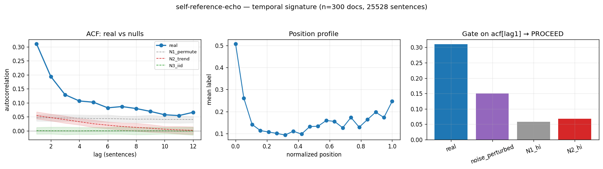

# Calibration record — `self-reference-echo`

**Verdict: PROCEED**

Calibration per the frozen [prereg card](../../prereg/self-reference-echo.md); domain `reasoning-trace`, 300 documents / 25528 labeled sentences (doc coverage 1.000).

## 1. Labeler + noise floor

- **Bulk judge:** `claude-haiku-4-5-20251001` (frozen instruction in the card); **second judge:** `claude-sonnet-5` on 12 held-out docs (1033 sentences).
- **Inter-judge:** agreement 0.817, κ = 0.304 → noise floor ε̂ = 0.102 (adequacy floor κ ≥ 0.3: PASS).
- **Independent heuristic cross-check:** P 0.83 / R 0.10 / F1 0.17 (judge rate 0.168, heuristic 0.019).

## 2. Temporal signature vs nulls

| statistic | real | N1 permute | N2 trend | N3 iid |
|---|---|---|---|---|
| ACF(1) | **0.311 [0.285, 0.340]** | 0.047 | 0.054 | 0.001 |
| MI(1) (nats) | **0.039 [0.033, 0.047]** | 0.001 | 0.001 | 0.000 |
| Fano | **2.118 [1.953, 2.279]** | 1.161 | 1.183 | 0.831 |
| excite ratio P(1|1)/base | **2.457 [2.329, 2.578]** | 1.229 | 1.244 | 1.003 |
| inter-event gap CV | **1.591 [1.535, 1.651]** | 1.048 | 1.052 | 0.904 |
| spectral peak prominence | **2.773 [2.463, 3.043]** | 1.080 | 1.553 | 1.071 |

Base rate 0.1678; Markov order-1 vs 0 p = 0.00e+00.

## 3. Gate (preregistered) + verdict

Primary statistic `acf[lag1]` (expected sign +): real **0.3107**, after ε̂-noise perturbation **0.1506**; N1 97.5% band hi 0.0579, N2 hi 0.0680.

- clears sampling noise (real > N1 hi AND N2 hi): **True**
- survives labeler noise floor (perturbed likewise): **True**
- labeler adequate (κ ≥ 0.3): **True**
- split-half stability: 0.2986 / 0.3219

**→ PROCEED**

## 4. Mirror (Appendix B) + held-out validation

Process `logistic_ar`; fit on 210 train docs, validated on 90 held-out docs. Fitted params:

```json
{
 "process": "logistic_ar",
 "K": 8,
 "position": true,
 "intercept": -2.816957027160027,
 "coef_position": 0.6776899301741885,
 "kernel_w": [
  1.5738583892087268,
  0.5176842557837458,
  0.1354887213333059,
  0.2393477397591367,
  0.06166675227335907,
  0.10052094686712973,
  0.20875813856683437,
  0.29520336589958346
 ]
}
```

| statistic | real (held-out) | synthetic |
|---|---|---|
| acf(1) | 0.292 | 0.317 |
| mi(1) | 0.035 | 0.039 |
| fano | 2.007 | 2.163 |
| p11 | 0.395 | 0.416 |
| excite_ratio | 2.386 | 2.924 |
| gap_cv | 1.553 | 1.408 |
| spec_peak | 2.640 | 2.819 |

Abs errors: acf_lag1_5 0.024, mi_lag1_5 0.003, fano 0.156, p11 0.021, excite_ratio 0.538, gap_cv 0.145, spec_peak 0.179.

**Gate 8 (preregistered non-fitted moment)** — `mi[lag1]`: held-out real 0.0349 vs synthetic 0.0390, |err| 0.0041 vs tolerance ±0.0150 → **PASS**.

## 5. Adversarial skeptic pass (fixed kill-rubric, Opus)

| item | kill | evidence |
|---|---|---|
| a_noise_floor | clear | real acf1=0.311 far exceeds noise_perturbed=0.151 and eps floor; N1_hi=0.058 well below both. Gap survives label noise. |
| b_leakage | clear | Labeler runs ctx=0, per-sentence only; label defines 'refers to problem' without reference to ordering or prior sentences, so echo-lag is not built into the label. |
| c_composition | clear | N1 within-doc permutation hi=0.058 destroys the echo while real=0.311; effect is within-document order structure, not per-doc marginal. N2 trend-preserving also fails to reach real. |
| d_circularity | clear | logistic_ar fit to lag-1 self-excitation; gate8 non-fitted moment mi[lag1] reproduced (abs_err=0.0041 < 0.015), and multi-lag mi 2-4 deliberately not matched — spec tests beyond inserted param. |
| e_segmentation | clear | Data pre-segmented from single pinned source; positive self-match ACF (repeated label=1 recurrence) is not the alternation artifact a splitter would produce, and N3 iid is flat (~0) as expected. |

_Gate is genuinely clear: acf1=0.311 vs N1_hi=0.058, vs noise_perturbed 0.151, stability across halves (0.299/0.322). However kappa=0.304 sits barely above the 0.30 floor and heuristic recall is only 0.095 (f1=0.17), so labeler quality is marginal — worth flagging but not sufficient to kill given the large ordered-vs-null gap and mirror gate8 pass. PROCEED to freeze._



## Reproduction

```bash
.venv/bin/python -m experiments.explorations.synthetic.expansion.calibrate self-reference-echo
.venv/bin/python -m experiments.explorations.synthetic.expansion.render_records
```
Deterministic given the cached labels (`labels.json`); judge models pinned in the card; spend after this candidate: $1.92.
