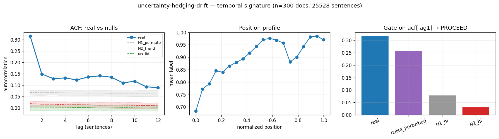

# Calibration record — `uncertainty-hedging-drift`

**Verdict: PROCEED**

Calibration per the frozen [prereg card](../../prereg/uncertainty-hedging-drift.md); domain `reasoning-trace`, 300 documents / 25528 labeled sentences (doc coverage 1.000).

## 1. Labeler + noise floor

- **Bulk judge:** `claude-haiku-4-5-20251001` (frozen instruction in the card); **second judge:** `claude-sonnet-5` on 12 held-out docs (1033 sentences).
- **Inter-judge:** agreement 0.787, κ = 0.636 → noise floor ε̂ = 0.113 (adequacy floor κ ≥ 0.3: PASS).
- **Independent heuristic cross-check:** accuracy 0.73, κ 0.36 (class 1: F1 0.82, class 2: F1 0.26).

## 2. Temporal signature vs nulls

| statistic | real | N1 permute | N2 trend | N3 iid |
|---|---|---|---|---|
| ACF(1) | **0.316 [0.298, 0.338]** | 0.067 | 0.018 | -0.000 |
| MI(1) (binned, nats) | **0.096 [0.088, 0.104]** | 0.003 | 0.001 | 0.000 |

## 3. Gate (preregistered) + verdict

Primary statistic `acf[lag1]` (expected sign +): real **0.3163**, after ε̂-noise perturbation **0.2554**; N1 97.5% band hi 0.0777, N2 hi 0.0303.

- clears sampling noise (real > N1 hi AND N2 hi): **True**
- survives labeler noise floor (perturbed likewise): **True**
- labeler adequate (κ ≥ 0.3): **True**
- split-half stability: 0.3191 / 0.3132

**→ PROCEED**

## 4. Mirror (Appendix B) + held-out validation

Process `ar1`; fit on 210 train docs, validated on 90 held-out docs. Fitted params:

```json
{
 "process": "ar1",
 "mu": 0.7811579789952691,
 "beta_position": 0.2359188450348601,
 "rho": 0.2987441272652499,
 "sigma": 0.5562311482234295
}
```

| statistic | real (held-out) | synthetic |
|---|---|---|
| acf(1) | 0.339 | 0.301 |
| mi(1) | 0.110 | 0.047 |

Abs errors: acf_lag1_5 0.084, mi_lag1_5 0.021.

## 5. Adversarial skeptic pass (fixed kill-rubric, Opus)

| item | kill | evidence |
|---|---|---|
| a_noise_floor | clear | real acf[lag1]=0.316, noise_perturbed=0.255 still far above N1_hi=0.078 and eps=0.113; gap survives label-flip perturbation. |
| b_leakage | clear | labeler scores per-sentence confidence in isolation ('judge from this sentence'); it does not encode cross-sentence position or autocorrelation, so persistence is not built into the label definition. |
| c_composition | clear | N1 within-doc permutation (mean 0.067, hi 0.078) is the key comparison — real 0.316 vastly exceeds it, so the effect is within-document order/persistence, not per-doc marginal composition. |
| d_circularity | clear | mirror ar1 matches lag1 acf by construction, but real acf decays slowly (lag2-8 ~0.12-0.15) while synthetic collapses fast (lag2 0.085 down to ~0.01); real shows a persistent-plateau structure the fitted AR1 fails to reproduce, so the spec tests more than the inserted lag1. |
| e_segmentation | clear | pre-segmented traces (mean 85 sentences); persistence is positive autocorrelation of same-confidence runs, the opposite of splitter-induced alternation which would depress acf; no evidence of segmentation artifact. |

_Effect is robust: acf[lag1]=0.316 clears sampling, N1, N2, and the noise floor with high margin; stable across halves (0.319/0.313). Notably the mirror UNDER-fits the slow-decay tail (real acf stays ~0.12-0.15 through lag8 vs synthetic ~0.01), meaning the AR1 mirror is an honest imperfect model and the spec discriminates beyond the inserted lag1 — this is a genuine DC-slow-drift signal. No kill grounds._



## Reproduction

```bash
.venv/bin/python -m experiments.explorations.synthetic.expansion.calibrate uncertainty-hedging-drift
.venv/bin/python -m experiments.explorations.synthetic.expansion.render_records
```
Deterministic given the cached labels (`labels.json`); judge models pinned in the card; spend after this candidate: $9.55.
