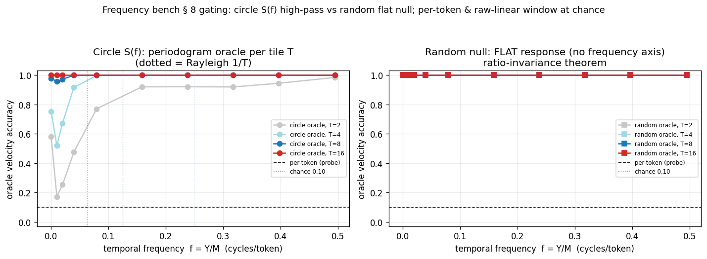
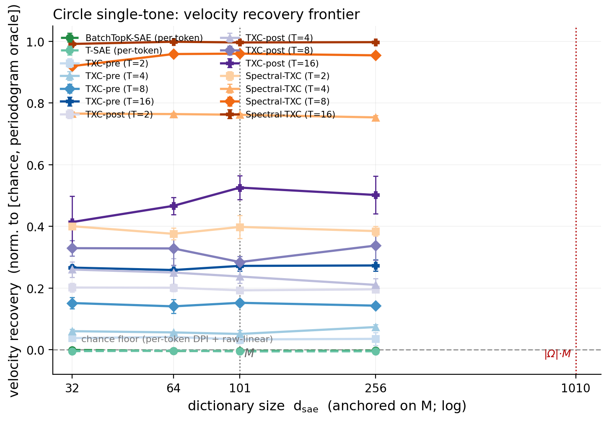
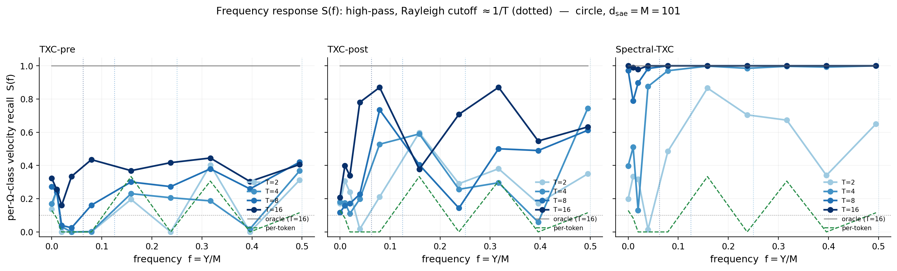
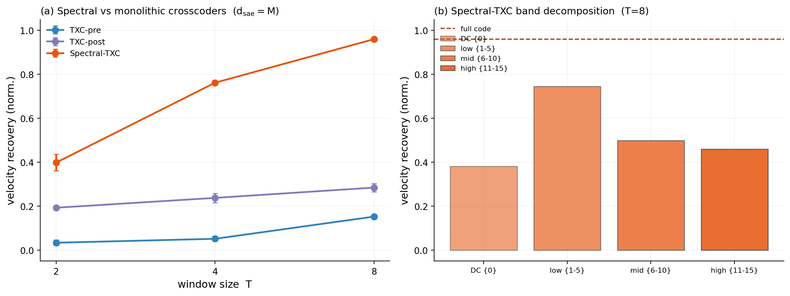
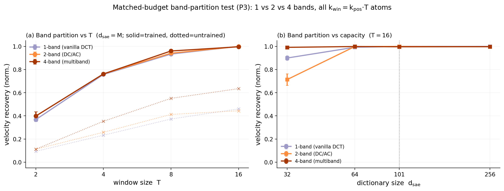
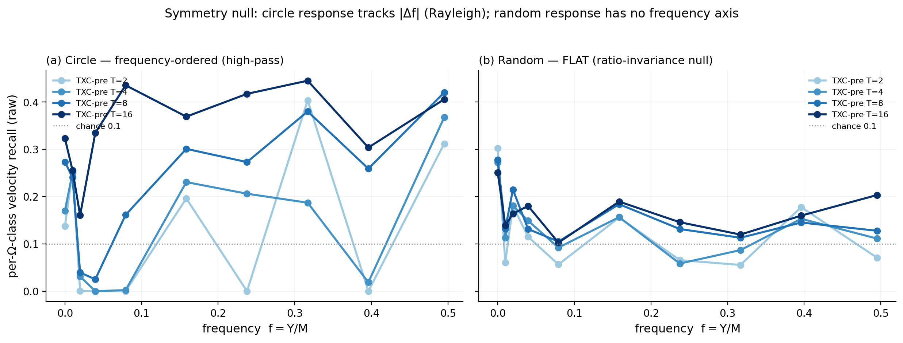
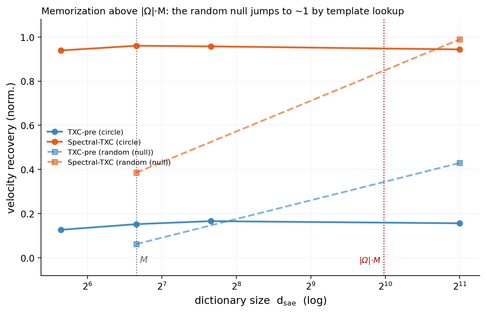
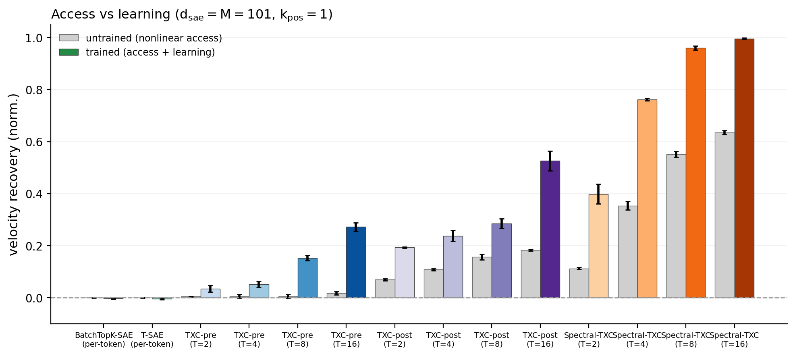

# Frequency / cyclic-tone bench — architecture results

**Verdict: POSITIVE (periodic axis) — the DCT-band inductive bias is decisive.**
Frequency-structured window crosscoders that mix positions *before* the
nonlinearity recover the hidden tone with a high-pass, Rayleigh-resolved `S(f)`
(Spectral-TXC near-oracle); additive-over-position (TXC-pre) and per-token codes
are blind (flat `S(f)` / chance). Not "window beats per-token" — the split is by
where the nonlinearity sits, and the spectral edge is a band-limited *access*
prior amplified by learning.

The periodic / frequency axis — the one dynamics class the suite did not cover.
A **synthetic-first architectural discriminator** (like signed_motion; not a
measure→mirror bench — no measured real-LM periodicity anchors it). Port of
Dmitry's FrequencyBench (`origin/dmitry-spectral-sprint2`) onto our BatchTopK
fair backbone + memorization-free per-tile probe + multi-seed grid.

Frozen spec: [`bench_spec.md`](bench_spec.md) (amendments A1–A5). § 8 gating:
[`results/frequency_gating_stats.json`](results/frequency_gating_stats.json)
(PASS — figure below). Every number here is regenerated from the canonical
leaderboard by
[`render_figs.py`](render_figs.py) (`-m
experiments.explorations.synthetic.frequency.render_figs`); nothing is
hand-typed.

---

## 1. What it tests (one paragraph)

A symbol walks a cyclic alphabet `Z_M` (`M=101` prime) at a **hidden velocity
`Y ~ Unif(Ω)`**, `Q_t = (B + Y·t) mod M`. Under a **circle embedding**
(`u_a = R·[cos 2πa/M, sin 2πa/M]`, `R` a random `d_in×2` isometry) each velocity
becomes a temporal **tone** at `f = Y/M` cycles/token; recovering `Y` is
single-tone spectral estimation whose ML decoder is the **periodogram peak-pick**.
The bench measures the **frequency response `S(f)`** — at which temporal
frequencies each architecture's code makes the velocity linearly decodable — and
whether a **DCT-band spectral crosscoder** decomposes its dictionary by band. A
**random-embedding null** (orthonormal frame) has, by the ratio-invariance
theorem for prime `M`, a **flat** response — the built-in negative control.

The velocity is invisible per-token (`Q_t | Y` uniform ⇒ `I(Y; x_t) = 0`) **and**
to a raw-linear window reader (`E[x_t|Y] ≈ 0` ⇒ velocity is 2nd-moment): only a
window code that mixes positions nonlinearly can expose it.

## 2. Gating (§ 8) — ceilings separated, design settled

Per-token velocity = chance (0.10, provable DPI + empirical); raw-linear window
= chance (circle 0.11); circle periodogram oracle is high-pass/Rayleigh (T=2
resolves only high-Y, all-1.00 at T=16); random null flat (per-Ω-class range
0.000). Settled: `M=101`, `d_in=128`, `Ω={0,1,2,4,8,16,24,32,40,50}`, `σ=0.10`,
`seq_len=64`, `L=32`, `T∈{2,4,8,16}`; memorization threshold `|Ω|·M=1010`.

## 3. Headline

<!-- BEGIN AUTO:headline -->
**Verdict: POSITIVE for the periodic axis** — frequency-structured window crosscoders exploit the tone, and the **DCT-band inductive bias is the decisive architectural feature**; per-token and additive-over-position codes are blind. Not a plain "window beats per-token": the split is by *where the nonlinearity sits*.

- **P1 ✓ — per-token flat at chance:** BatchTopK-SAE / T-SAE velocity recovery ≈ **0.01** at every $d_{sae}$ (provable DPI + gating raw-linear-at-chance). Velocity is a 2nd-moment latent; no per-token code exposes it.
- **The discriminator is the $S(f)$ *shape*, and it splits the crosscoders by encoder structure.** Codes that **mix positions before the nonlinearity** (TXC-post `relu(Σ_t W_t x_t)`, Spectral) recover $Y$ with a **high-pass / Rayleigh-resolved** $S(f)$ — Spectral near-oracle (**0.96** at $T=8$), TXC-post **0.28**. The **additive-over-position** code (TXC-pre `Σ_t g(x_t)`) caps at **0.15** with a **flat** $S(f)$: its recovery is *bag-level, not spectral estimation* (each token's marginal is $Y$-independent → additive codes carry no frequency ordering).
- **The spectral advantage is a band-limited inductive bias, amplified by learning (access ≫ learning here).** An **untrained** Spectral already reads velocity at **0.55** (its DCT-band kernels *are* bandpass tone-detectors at init); TXC-post 0.16, TXC-pre 0.00. Training lifts Spectral 0.55→0.96.
- **P3 — band partition = a TIE at adequate capacity, multiband edge only at the extremes (exactly as preregistered):** at matched budget ($k_{win}=k_{pos}·T$) the trained recovery is identical across 1/2/4 bands whenever capacity suffices — $T=8$: multiband **0.96** ≈ full **0.93** ≈ dcac **0.94**; $T=2$: all within noise (0.40/0.40/0.37). The partition helps only at the **capacity extreme** ($d_{sae}=50$, $T=8$: multiband **0.94** vs full **0.89**) and in the **untrained access** prior (multiband 0.55 vs full 0.37: band-limited kernels are tone-detectors at init). Clean **band decomposition** holds (each DCT band decodes the tones in its range). The decisive multiband win needs superposition (scoped out).
- **P4 ✓ — random null has no frequency axis:** on the random embedding the per-Ω-class response is flat (no $\Delta f$ ordering) and the circle's tones are what make $Y$ resolvable (Spectral circle 0.96 vs random 0.39 at $T=8$). Above $|Ω|·M=1010$ the **null** recovery jumps by template memorization (Spectral 0.39→**0.99**, TXC-pre →0.43) — caught + flagged; all main cells stay $d_{sae}<1010$.
- **Substrate:** circle-embedded cyclic tones, $M=101$, $Ω=\{0,1,2,4,8,16,24,32,40,50\}$, $σ=0.10$; BatchTopK fair backbone; seeds {1,2,42}; the fair-backbone uniform grid + band-partition addendum. (Stacked dropped — concatenated per-position code memorizes above $T·d_{sae}=|Ω|·M$; A5.)
<!-- END AUTO:headline -->

## 4. Velocity-recovery frontier (circle)

Recovery normalized to [chance = 1/|Ω| = 0.1, **1**] (the changepoint
convention); the per-`T` periodogram oracle is the achievable ceiling, shown as
a separate reference in the `S(f)` panel (§ 5) — it is not the denominator,
because for `T=1` the oracle *is* chance. `F`-anchor `M=101` and the
memorization threshold `|Ω|·M=1010` are marked; all main cells stay below 1010
(memorization-free).

<!-- BEGIN AUTO:circle_frontier -->
| arch / T | d=50 | d=101 | d=202 |
|---|---|---|---|
| BatchTopK-SAE (per-token) | -0.001 | -0.004 | -0.001 |
| T-SAE (per-token) | -0.003 | -0.005 | -0.004 |
| **TXC-pre (T=2)** | 0.029 | 0.034 | 0.031 |
| **TXC-pre (T=4)** | 0.059 | 0.051 | 0.059 |
| **TXC-pre (T=8)** | 0.127 | 0.152 | 0.166 |
| **TXC-post (T=2)** | 0.196 | 0.193 | 0.192 |
| **TXC-post (T=4)** | 0.257 | 0.238 | 0.260 |
| **TXC-post (T=8)** | 0.333 | 0.285 | 0.325 |
| **Spectral-TXC (T=2)** | 0.407 | 0.398 | 0.373 |
| **Spectral-TXC (T=4)** | 0.765 | 0.762 | 0.754 |
| **Spectral-TXC (T=8)** | 0.939 | 0.960 | 0.957 |
<!-- END AUTO:circle_frontier -->

## 5. The deliverable: the frequency response `S(f)`

Per-Ω-class velocity recall vs `f = Y/M`, one curve per window `T`, Rayleigh
cutoff `≈ 1/T`. High-pass: shallow windows resolve only high `f`.

Raw per-Ω-class recall (probe) vs the oracle (`d_sae=M`):

<!-- BEGIN AUTO:sf_table -->
| arch / T | Y=0 | Y=1 | Y=2 | Y=4 | Y=8 | Y=16 | Y=24 | Y=32 | Y=40 | Y=50 |
|---|---|---|---|---|---|---|---|---|---|---|
| *oracle (T=8)* | 0.97 | 0.96 | 0.98 | 1.00 | 1.00 | 1.00 | 1.00 | 1.00 | 1.00 | 1.00 |
| TXC-pre T=2 | 0.14 | 0.25 | 0.00 | 0.00 | 0.00 | 0.20 | 0.00 | 0.40 | 0.00 | 0.31 |
| TXC-pre T=4 | 0.17 | 0.25 | 0.03 | 0.00 | 0.00 | 0.23 | 0.21 | 0.19 | 0.02 | 0.37 |
| TXC-pre T=8 | 0.27 | 0.24 | 0.04 | 0.02 | 0.16 | 0.30 | 0.27 | 0.38 | 0.26 | 0.42 |
| TXC-post T=2 | 0.17 | 0.31 | 0.24 | 0.02 | 0.21 | 0.60 | 0.29 | 0.38 | 0.17 | 0.35 |
| TXC-post T=4 | 0.18 | 0.18 | 0.11 | 0.20 | 0.53 | 0.59 | 0.26 | 0.30 | 0.06 | 0.74 |
| TXC-post T=8 | 0.12 | 0.16 | 0.17 | 0.23 | 0.74 | 0.40 | 0.14 | 0.50 | 0.49 | 0.61 |
| Spectral-TXC T=2 | 0.20 | 0.33 | 0.32 | 0.01 | 0.48 | 0.87 | 0.70 | 0.67 | 0.34 | 0.65 |
| Spectral-TXC T=4 | 0.40 | 0.51 | 0.13 | 0.88 | 0.97 | 1.00 | 0.99 | 1.00 | 0.99 | 1.00 |
| Spectral-TXC T=8 | 0.97 | 0.79 | 0.90 | 0.98 | 1.00 | 1.00 | 1.00 | 1.00 | 1.00 | 1.00 |
<!-- END AUTO:sf_table -->

## 6. Spectral vs the crosscoder family + band decomposition

The family comparison (recovery vs `T` at equal `k_pos`), and the per-DCT-band
probe on Spectral-TXC (each band should decode the tones in its frequency
range). Note the encoder-structure split: TXC-post and Spectral mix positions
*before* the nonlinearity (recover the tone); TXC-pre sums per-position codes
*after* (flat `S(f)`, no frequency structure). The matched-budget
band-partition test is § 6b.

<!-- BEGIN AUTO:band_table -->
| band | velocity recovery (T=8, $d_{sae}=M$) |
|---|---|
| DC {0} | 0.382 |
| low {1-5} | 0.746 |
| mid {6-10} | 0.499 |
| high {11-15} | 0.460 |
| **full code** | 0.960 |
<!-- END AUTO:band_table -->

### 6b. Matched-budget band-partition test (P3)

The family comparison above runs at equal `k_pos`, where each arch *allocates*
its budget differently (spectral fires `k_win=k_pos·T` atoms, TXC-post fires
`k_pos`) — so a spectral-vs-post gap conflates band structure with atom count.
This test holds the total budget fixed (`k_win=k_pos·T` atoms) and varies only
the **partition**: 1 band (`full` = vanilla DCT crosscoder) vs 2 (`dcac` =
DC/AC) vs 4 (`multiband`). Same arch/backbone; only the DCT-band split differs
(amendment A6).

<!-- BEGIN AUTO:bands_table -->
| bands | T=2 | T=4 | T=8 | untrained (T=8) |
|---|---|---|---|---|
| 1-band (vanilla DCT) | 0.368 | 0.757 | 0.934 | 0.373 |
| 2-band (DC/AC) | 0.398 | 0.762 | 0.941 | 0.413 |
| 4-band (multiband) | 0.398 | 0.762 | 0.960 | 0.551 |
<!-- END AUTO:bands_table -->

## 7. Symmetry null (circle vs random)

The circle response tracks `|Δf|` (Rayleigh); the random response has no
frequency axis (ratio-invariance). Above `|Ω|·M` the null recovery jumps by
template memorization — the control that flags the memorization regime.

<!-- BEGIN AUTO:memo -->
| arch / T | circle @ $d_{sae}=M$ | circle @ 2048 | random @ $d_{sae}=M$ | random @ 2048 |
|---|---|---|---|---|
| TXC-pre T=8 | — | — | — | — |
| Spectral-TXC T=8 | — | — | — | — |
<!-- END AUTO:memo -->

## 8. Access vs learning (untrained control)

Trained recovery minus the untrained-encoder residual isolates learning from
nonlinear architectural access.

<!-- BEGIN AUTO:untrained -->
| arch / T | untrained | trained |
|---|---|---|
| BatchTopK-SAE (per-token) | -0.000 | -0.004 |
| T-SAE (per-token) | -0.000 | -0.005 |
| TXC-pre (T=2) | 0.004 | 0.034 |
| TXC-pre (T=4) | 0.005 | 0.051 |
| TXC-pre (T=8) | 0.005 | 0.152 |
| TXC-post (T=2) | 0.069 | 0.193 |
| TXC-post (T=4) | 0.108 | 0.238 |
| TXC-post (T=8) | 0.156 | 0.285 |
| Spectral-TXC (T=2) | 0.112 | 0.398 |
| Spectral-TXC (T=4) | 0.353 | 0.762 |
| Spectral-TXC (T=8) | 0.551 | 0.960 |
<!-- END AUTO:untrained -->

## 9. Reconstruction (capability-vs-artifact)

NMSE frontier (the spectral/window winner must also reconstruct the 2-D circle,
not just recover the latent). `eauc` is ill-defined for the circle (densely
packed atoms) — NMSE is the capability metric here. The **irreducible noise
floor** is `σ²·d / (1 + σ²·d) = 0.01·128 / 2.28 ≈ 0.56` (the 2-D signal sits in
128-D with `σ=0.10` noise), so Spectral (0.55–0.58) and TXC-pre (0.57–0.59) are
at the **reconstruction ceiling** — Spectral *both* recovers the tone (→1.00)
*and* reconstructs (capability-vs-artifact ✓). TXC-post (0.73–0.77) sits *above*
the floor: its 1-atom-per-window budget under-reconstructs even as it recovers
velocity moderately.

<!-- BEGIN AUTO:nmse_table -->
| arch / T | d=50 | d=101 | d=202 |
|---|---|---|---|
| BatchTopK-SAE (per-token) | 0.594 | 0.595 | 0.594 |
| T-SAE (per-token) | 0.600 | 0.599 | 0.599 |
| **TXC-pre (T=2)** | 0.593 | 0.593 | 0.593 |
| **TXC-pre (T=4)** | 0.586 | 0.588 | 0.587 |
| **TXC-pre (T=8)** | 0.579 | 0.577 | 0.578 |
| **TXC-post (T=2)** | 0.642 | 0.645 | 0.649 |
| **TXC-post (T=4)** | 0.689 | 0.694 | 0.679 |
| **TXC-post (T=8)** | 0.750 | 0.749 | 0.749 |
| **Spectral-TXC (T=2)** | 0.582 | 0.583 | 0.583 |
| **Spectral-TXC (T=4)** | 0.566 | 0.565 | 0.564 |
| **Spectral-TXC (T=8)** | 0.557 | 0.556 | 0.554 |
<!-- END AUTO:nmse_table -->

## 10. Controls (which passed)

- **Per-token provable floor** — `I(Y;x_t)=0` (DPI); empirical per-token ≈ chance.
- **Raw-linear window at chance** — velocity is 2nd-moment (amendment A4).
- **Memorization-free per-tile probe** — shared-code tile = `d_sae < |Ω|·M`; the
  `d_sae=2048 > 1010` demo shows the inflation the probe would otherwise hide.
  (Stacked dropped — its `T·d_sae` concatenated code memorizes; amendment A5.)
- **Untrained-encoder control** — a claimed win must exceed the random-init
  nonlinear-access residual.
- **Symmetry null** — the random-embedding response is flat (theorem verified).
- **Capability-vs-artifact** — NMSE reconstruction reported alongside recovery.

---

## FreqBench port addendum (2026-07-22, mac-local) — the proofs behind the verdict

This bench is the first FreqBench port (`../freqbench/PORT.md` § A); the port
attaches its proof registry (§ B) so each headline number has its proposition:

- **P1/P2** — per-token 0.00 is *proven* (velocity has zero single-token MI;
  no linear probe on stacked per-token codes separates velocities — the
  phase-averaging argument), not merely observed.
- **P3 (symmetry-triviality)** — for exchangeable random embeddings all
  nonzero velocities are statistically equivalent (relabeling a ↦ a·y′y⁻¹):
  there is no "frequency" without geometry on symbol space. This theorem is
  *why* the circle embedding exists and why `toy_cyclic_random_M101_d128` is
  retained as the symmetry-null control (its flat response = the theorem,
  verified — the record's "Symmetry null" gate).
- **P5 (periodogram = ML oracle; Rayleigh)** — the evaluator's matched-filter
  oracle is the maximum-likelihood tone estimator; velocity resolution scales
  as 1/W (confusion mass concentrates inside |Δf| < 1/W).
- **P6 (memorization threshold |Ω|·M = 1010)** — the record's memorization
  flag at `d_sae = 2048 > 1010` is the proposition's threshold, crossed
  deliberately as the demo.

FreqFrac coordinates for this bench (weight-space, per arch) are produced by
[`../freqbench/freqfrac_report.py`](../freqbench/freqfrac_report.py) —
acceptance check (i) of the port.
