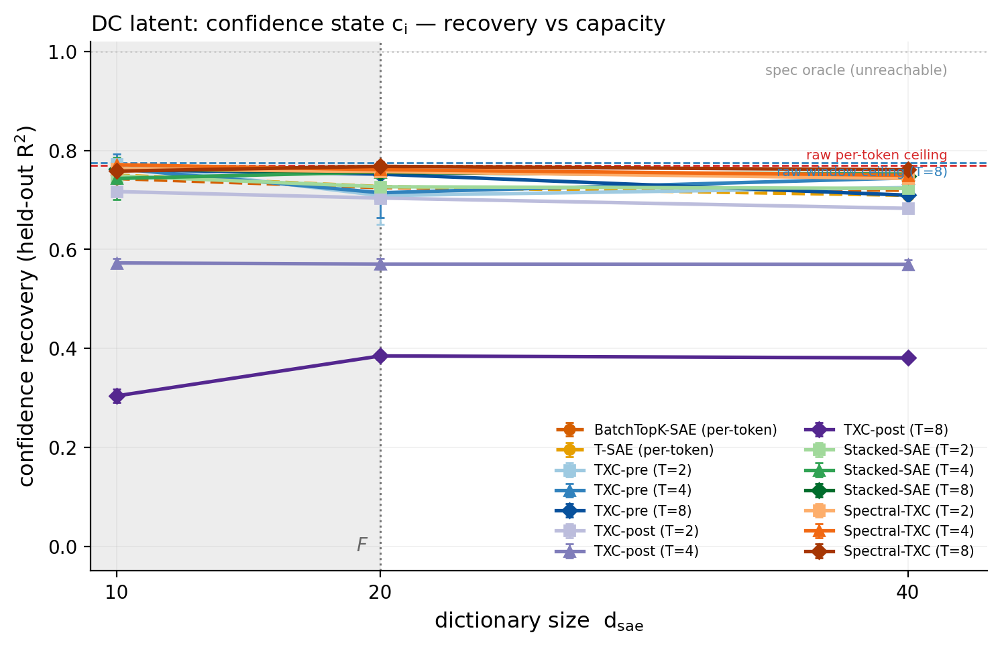
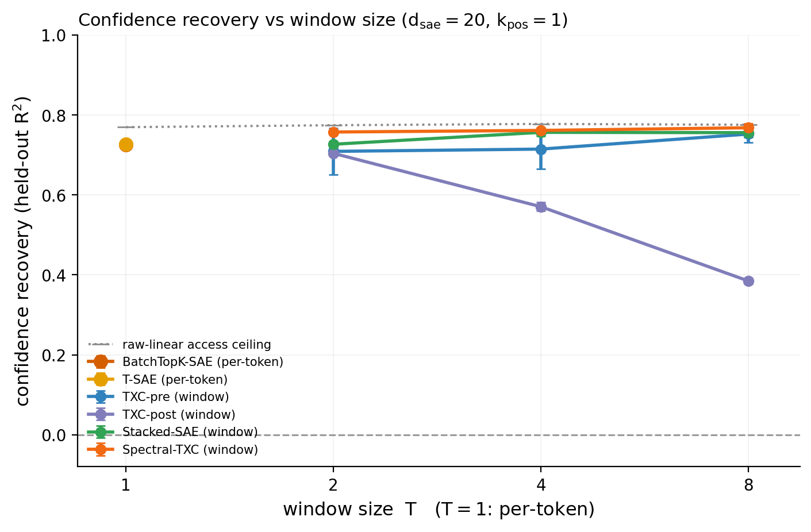
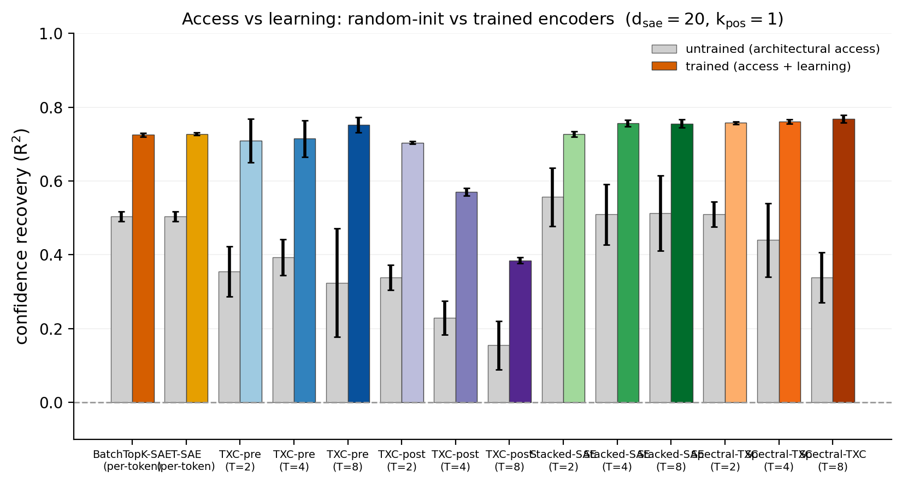
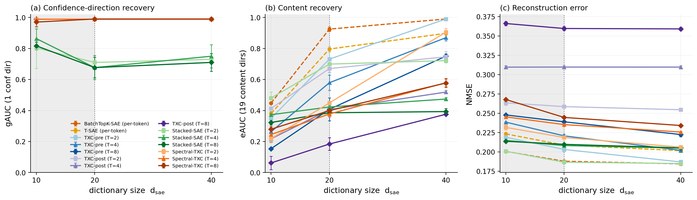

# Research record — hedging-drift synthetic benchmark (architecture test)

**Benchmark:** hierarchical-AR(1) confidence stream (`toy_hedging_drift_d64`),
the DC / slow-drift dynamics class — the grounded-expansion loop's first
**DC-axis** benchmark to face the architectures.
**Spec:** [`bench_spec.md`](bench_spec.md) (frozen expansion C1; `hier_ar1`
amendment 2026-07-19; canonical mirror
[`mirror_params_hier.json`](mirror_params_hier.json)). **Gating:**
[`gating.py`](gating.py) →
[`results/hedging_gating_stats.json`](results/hedging_gating_stats.json)
(PASS). **Grid:** [`run_grid.py`](run_grid.py), the uniform fair-backbone
design through the canonical runner. **This record + figures are
auto-generated** from the canonical leaderboard by
[`render_figs.py`](render_figs.py) — re-run it to rebuild every number, table,
and figure; nothing is hand-typed.

**The design in one line:** the mirror of a *measured* property of real
R1-Distill reasoning traces (expressed confidence persists and drifts
hedged→committed; ACF(1) 0.316 ≫ nulls with a long-memory *plateau* only the
hierarchical-AR(1) mirror reproduces) — a continuous confidence state `c_i`
carried by one feature's *magnitude*, with per-token folded-normal
multiplicative noise; the probe asks how much of `c_i` each code makes
linearly available at the tile's leading edge.

## Headline

<!-- BEGIN AUTO:headline -->
- **Per-token holds the DC latent:** confidence recovery R² = **0.73** at d_sae=20, k_pos=1, against a raw per-token access ceiling of 0.77 (the c·m multiplicative-noise bound; the spec oracle R²=1 is unreachable, gating).
- **Windows vs the frozen § 5 prediction (T=8 best / short windows lose the drift):** best window cell = Spectral-TXC T=8 at **0.77**; T=8 by family: TXC-pre 0.75, TXC-post 0.38, Stacked-SAE 0.76, Spectral-TXC 0.77. The raw temporal-denoising headroom is only +0.006 R² at T=8 (gating) — the substrate's persistence (ACF(1) 0.33, plateau 0.11 at lag 4) shares little extra linear information across sentences.
- **Access vs learning:** untrained per-token already reads R² = 0.50 (the dominant continuous loading passes through a random encoder); training closes the rest.
- **Substrate:** the C3 hierarchical-AR(1) mirror (per-trace level + trend + AR(1); gate-8 PASS on the ACF plateau), F=20 dirs, fair-backbone uniform grid, seeds {1,2,42}.
<!-- END AUTO:headline -->

## 1. Setup

- **Substrate** (spec § 2 + the hier_ar1 amendment): Layer 1 = the canonical
  C3 hierarchical AR(1) — `c_i = μ + β·(i/L) + l_j + r_i`, `r` AR(1) with
  ρ = 0.248, the 210 *empirical* per-trace levels `l_j` (heavy tails
  preserved); gate-8 PASS on ACF(2)+ACF(4) — the generated stream holds the
  plateau (pooled ACF lags 1–8: 0.333, 0.168, 0.123, 0.113, 0.110, 0.108,
  0.108, 0.108). Layer 2 = continuous-loading emission: `u_conf`'s magnitude
  carries `c_i` (per-token folded-normal `m` ⇒ irreducible multiplicative
  noise), + 19 content dirs (`F = 20`). `d_in = 64`, `seq_len = 64`,
  `n_seqs = 4096`, `σ = 0`.
- **Latent + ceilings** (gating, committed): `c_i` continuous; chance = 0
  (pooled mean), spec oracle = 1 (**not reachable** — the multiplicative
  noise bounds any linear reader). Measured raw-linear access ceilings:
  per-token **R² 0.770** (= the `u_conf`-projection ceiling 0.769); raw
  windows **0.774 / 0.778 / 0.776** at T = 2/4/8 — the temporal-denoising
  headroom in raw space is only ≈ +0.005.
- **The structural fact recorded BEFORE the grid** (gating): unlike
  changepoint's AC latent, `c_i` is *linearly present* in the raw window —
  a window gain here can be plain linear access; the untrained-encoder
  control is the access-vs-learning arbiter.
- **Archs:** the BatchTopK fair-backbone family — `batchtopk_sae`, `tsae`
  (per-token), `stacked_batchtopk`, `txc_batchtopk_pre`, `txc_batchtopk_post`,
  `spectral_txc` (windows, `T ∈ {2,4,8}`); equal tokens/step
  (`batch = 1024/T`), equal `B·T = 1024` BatchTopK pool, eval window `L = 32`,
  seeds {1, 2, 42}.
- **Grid:** the locked uniform design — `d_sae ∈ {10, 20, 40}` anchored on
  `F = 20`, `k_pos ∈ {1,2,4,8,16}` (dict-feasible), untrained control per
  `(arch, T)`; 495 cells through the canonical runner.
- **Metric** (per-tile leading-edge ridge probe, memorization-free,
  sequence-split): `conf_recovery` (held-out R², normalized by construction
  to [chance 0, oracle 1]), `conf_corr` companion, + `gauc` (conf dir),
  `eauc` (content dirs), `nmse`.

## 2. Confidence recovery vs capacity

<!-- BEGIN AUTO:conf_frontier -->
| arch / T | d=10 | d=20 | d=40 |
|---|---|---|---|
| BatchTopK-SAE (per-token) | 0.743 | 0.725 | 0.720 |
| T-SAE (per-token) | 0.750 | 0.727 | 0.709 |
| **TXC-pre (T=2)** | 0.773 | 0.709 | 0.725 |
| **TXC-pre (T=4)** | 0.763 | 0.715 | 0.745 |
| **TXC-pre (T=8)** | 0.762 | 0.752 | 0.710 |
| **TXC-post (T=2)** | 0.717 | 0.704 | 0.683 |
| **TXC-post (T=4)** | 0.573 | 0.571 | 0.570 |
| **TXC-post (T=8)** | 0.304 | 0.385 | 0.381 |
| **Stacked-SAE (T=2)** | 0.749 | 0.727 | 0.723 |
| **Stacked-SAE (T=4)** | 0.744 | 0.757 | 0.752 |
| **Stacked-SAE (T=8)** | 0.763 | 0.756 | 0.748 |
| **Spectral-TXC (T=2)** | 0.763 | 0.757 | 0.744 |
| **Spectral-TXC (T=4)** | 0.771 | 0.761 | 0.750 |
| **Spectral-TXC (T=8)** | 0.758 | 0.768 | 0.761 |
<!-- END AUTO:conf_frontier -->

## 3. Untrained-encoder control (access vs learning)

<!-- BEGIN AUTO:untrained -->
| arch / T | $c_i$ untrained | $c_i$ trained | corr untrained | corr trained |
|---|---|---|---|---|
| BatchTopK-SAE (per-token) | 0.504 ±0.013 | 0.725 ±0.005 | 0.710 ±0.009 | 0.852 ±0.003 |
| T-SAE (per-token) | 0.504 ±0.013 | 0.727 ±0.004 | 0.710 ±0.009 | 0.853 ±0.002 |
| TXC-pre (T=2) | 0.355 ±0.068 | 0.709 ±0.059 | 0.594 ±0.057 | 0.841 ±0.035 |
| TXC-pre (T=4) | 0.393 ±0.048 | 0.715 ±0.050 | 0.626 ±0.039 | 0.845 ±0.029 |
| TXC-pre (T=8) | 0.324 ±0.147 | 0.752 ±0.020 | 0.553 ±0.141 | 0.867 ±0.012 |
| TXC-post (T=2) | 0.339 ±0.034 | 0.704 ±0.004 | 0.582 ±0.029 | 0.839 ±0.002 |
| TXC-post (T=4) | 0.229 ±0.046 | 0.571 ±0.011 | 0.477 ±0.046 | 0.756 ±0.007 |
| TXC-post (T=8) | 0.154 ±0.066 | 0.385 ±0.008 | 0.384 ±0.095 | 0.621 ±0.006 |
| Stacked-SAE (T=2) | 0.557 ±0.080 | 0.727 ±0.007 | 0.744 ±0.054 | 0.853 ±0.004 |
| Stacked-SAE (T=4) | 0.509 ±0.082 | 0.757 ±0.009 | 0.712 ±0.059 | 0.870 ±0.005 |
| Stacked-SAE (T=8) | 0.512 ±0.102 | 0.756 ±0.012 | 0.713 ±0.074 | 0.869 ±0.007 |
| Spectral-TXC (T=2) | 0.510 ±0.034 | 0.757 ±0.004 | 0.714 ±0.024 | 0.870 ±0.002 |
| Spectral-TXC (T=4) | 0.440 ±0.100 | 0.761 ±0.006 | 0.659 ±0.077 | 0.873 ±0.004 |
| Spectral-TXC (T=8) | 0.338 ±0.068 | 0.768 ±0.010 | 0.579 ±0.061 | 0.876 ±0.006 |
<!-- END AUTO:untrained -->

## 4. Sparsity robustness (k_pos)

<!-- BEGIN AUTO:kpos -->
| arch / T | $c_i$ @ $k_{pos}{=}1$ | $c_i$ @ $k_{pos}{=}2$ | $c_i$ @ $k_{pos}{=}4$ |
|---|---|---|---|
| BatchTopK-SAE (per-token) | 0.725 | 0.755 | 0.790 |
| T-SAE (per-token) | 0.727 | 0.755 | 0.772 |
| TXC-pre (T=2) | 0.709 | 0.793 | 0.774 |
| TXC-pre (T=4) | 0.715 | 0.772 | 0.771 |
| TXC-pre (T=8) | 0.752 | 0.765 | — |
| TXC-post (T=2) | 0.704 | 0.748 | 0.792 |
| TXC-post (T=4) | 0.571 | 0.673 | 0.751 |
| TXC-post (T=8) | 0.385 | 0.567 | 0.614 |
| Stacked-SAE (T=2) | 0.727 | 0.759 | 0.788 |
| Stacked-SAE (T=4) | 0.757 | 0.775 | 0.783 |
| Stacked-SAE (T=8) | 0.756 | 0.770 | — |
| Spectral-TXC (T=2) | 0.757 | 0.774 | 0.775 |
| Spectral-TXC (T=4) | 0.761 | 0.774 | 0.769 |
| Spectral-TXC (T=8) | 0.768 | 0.770 | — |
<!-- END AUTO:kpos -->

## 5. Capability gate — feature recovery + reconstruction

<!-- BEGIN AUTO:feature_recovery -->
| arch / T | gAUC (conf dir) | eAUC (content dirs) | NMSE |
|---|---|---|---|
| BatchTopK-SAE (per-token) | 0.990 | 0.925 | 0.188 |
| T-SAE (per-token) | 0.990 | 0.796 | 0.209 |
| TXC-pre (T=2) | 0.990 | 0.731 | 0.203 |
| TXC-pre (T=4) | 0.990 | 0.579 | 0.221 |
| TXC-pre (T=8) | 0.990 | 0.408 | 0.239 |
| TXC-post (T=2) | 0.990 | 0.670 | 0.259 |
| TXC-post (T=4) | 0.990 | 0.406 | 0.310 |
| TXC-post (T=8) | 0.990 | 0.184 | 0.360 |
| Stacked-SAE (T=2) | 0.710 | 0.699 | 0.187 |
| Stacked-SAE (T=4) | 0.677 | 0.423 | 0.208 |
| Stacked-SAE (T=8) | 0.677 | 0.385 | 0.210 |
| Spectral-TXC (T=2) | 0.990 | 0.449 | 0.219 |
| Spectral-TXC (T=4) | 0.990 | 0.378 | 0.235 |
| Spectral-TXC (T=8) | 0.990 | 0.399 | 0.245 |
<!-- END AUTO:feature_recovery -->

## 6. Frozen predictions vs actual (the blind check)

*(hand-written after the blind grid — nothing here was tuned for)*

| frozen prediction (spec § 5, before any run) | actual | verdict |
|---|---|---|
| per-token SAE captures hedge/commit lexicon per token | conf-dir gAUC 0.99, content eAUC 0.93 (BatchTopK) / 0.80 (T-SAE) | **CONFIRMED** |
| per-token SAE misses the slow drift (no cross-sentence state) | per-token R² 0.73 of a 0.77 raw access ceiling — 94% of the linearly-available signal; untrained control 0.50 | **FAILED** |
| medium windows (T = 8+) best capture the persistence | T=8 is the best window cell (Spectral 0.768, d=20) and Spectral/Stacked trend up with T (0.757→0.768, 0.727→0.756) — but the margin over per-token is ≤ +0.04 R², against a raw temporal-denoising headroom of only +0.006 | **SPLIT** (direction right, magnitude negligible) |
| very short windows lose the drift | T=2 families reach 0.70–0.76; the only family that loses the drift is TXC-post, and it degrades with *longer* T (0.70 → 0.57 → 0.38) | **FAILED** (inverted) |

**Verdict: SPLIT, leaning NEGATIVE — per-token does not miss the drift,
because the DC state is ambient.** The § 5 card reasoned as if reading a slow
latent requires integrating across sentences. But the emission carries `c_i`
in the *current* token's `u_conf` magnitude, and gating recorded the ceiling
before any run: per-token raw access R² 0.770 with only +0.006 window
headroom. The grid confirmed the trained version: per-token codes reach 0.73,
window families 0.70–0.77, and the small real window edge (Spectral/Stacked
T=8, ≈ +0.03–0.04 over trained per-token at k=1) is *learning* quality —
the untrained windows read *less* (0.32–0.51) than untrained per-token
(0.50), so it is not free linear access. The predicted T-trend exists in
sign but not in consequence; TXC-post's inverted collapse is its known
post-squash pathology, not a drift effect. **Citable consequence:** a
persistent DC latent that is linearly present per token cannot separate
per-token from window architectures — persistence alone is not an
architecture test; a DC benchmark that *requires* integration (e.g. state
observable only through noise accumulated across sentences) would be. Nothing
was retuned post-hoc; the § 8 gating facts and this grid are the entire
evidence base.
