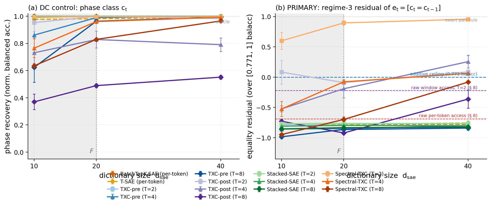
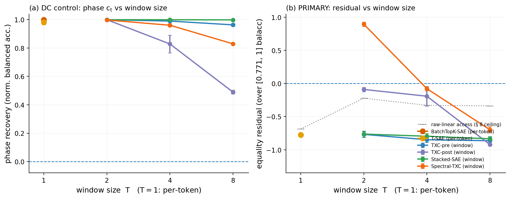
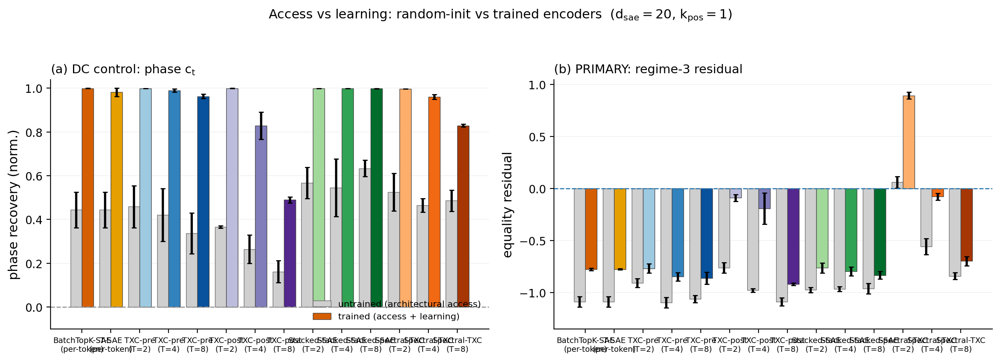
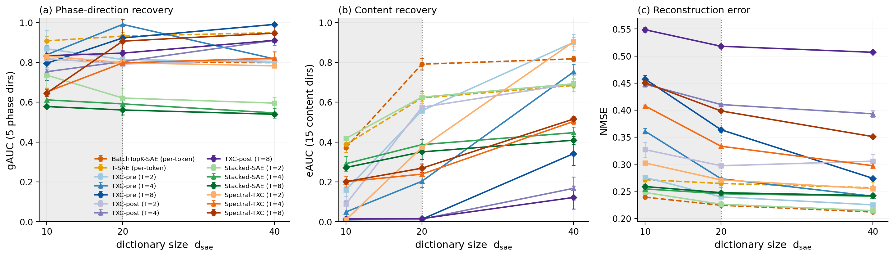

# Bench record — recipe_instruction_phase_runs (stage 6, 2026-07-22/23)

**Status: evaluated — verdict POSITIVE on the re-scoped regime-3 residual
axis** (stage-6 #3b, 2026-07-23 — see the head-to-head section at the
bottom). History in reading order: the original § 8 STOP (below, kept
verbatim), the mac-local review adopting re-scope option 1, the A1–A3
freeze (`cf4ae797`/`241845d2`/`d65349c0`), then the blind 495-cell grid.

---

**Original status (2026-07-22): § 8 STOP — no grid was run.** The
equality-variant discriminability gate (the C4-review addition,
preregistered in [`gating.py`](gating.py) before any architecture run)
**failed condition (i)**: raw-LINEAR access to the primary latent
`e_t = [c_t = c_{t-1}]` is far above chance, so the substrate does not test
the regime-3 claim as frozen. Per the gate's rule the grid was **not**
launched; the frozen § 5 predictions remained untested and blind.

Full numbers: [`results/recipe_gating_stats.json`](results/recipe_gating_stats.json)
· figure: [`figs/recipe_gating.png`](figs/recipe_gating.png)
· build: generator `recipe_instruction_phase_runs` + datasource
`toy_recipe_instruction_d64` + evaluator add-on `recipe_recovery` are
registered and tested (the bench is runnable the moment a re-scoped gate
passes).

## What the gate measured (noiseless substrate; balanced-accuracy access
ceilings, threshold-optimized held-out)

| access route | e_t balacc | reading |
|---|---|---|
| chance | 0.500 | — |
| **per-token raw-linear** (x_t) | **0.614** | = the analytic from-`c_t` line (0.609): the **DC leak** |
| **window raw-linear** T=2 / 4 / 8 | **0.720** / 0.696 / 0.694 | genuine *additive* cross-position access |
| pair-additive ceiling (one-hot ⊕ one-hot, analytic) | 0.771 | ceiling for ANY additive readout |
| nonlinear (MLP on raw T=2 tile) | 1.000 | latent present — gate (ii) PASS |
| exact pair rule (in-tile, T ≥ 2) | 1.000 | oracle |

Noisy check (σ = 0.5): same ordering, mildly attenuated (per-token 0.605,
T=2 0.655). DC control `c_t`: per-token balacc 1.000 (oracle reachable —
expected). Mirror sanity PASS (marginal max dev 0.053 < 0.08; match rate
0.625 in [0.58, 0.68]).

## Why the regime-3 claim failed — the class-conditional continuation leak

Changepoint's boundary latent survived this exact gate because its Π was
**rebalanced uniform by design**, making `P(c_t | m_t)` constant — the § 8 (i)
premise held *exactly*. This grounded mirror cannot rebalance without
un-grounding: the per-symbol dwell heterogeneity IS the measured phenomenon,
and it makes the continuation rate class-dependent —
`P(e_t=1 | c_t) = {0: 0.63, 1: 0.74, 2: 0.56, 3: 0.41, 4: 0.33}`. Since `c_t`
is per-token linearly readable *by design* (the DC control), every code that
exposes the control also hands a linear `e_t` readout ≈ 0.61. Windows add
genuinely additive access on top (0.72 → additive ceiling 0.77): with skewed
marginals the additive one-hot-pair fit approximates the diagonal indicator
well above chance — the XOR-blindness argument in the frozen § 4 assumed
class-exchangeable dynamics it doesn't have.

**The frozen prediction structure was mis-scoped at freeze**: § 5 predicted
"per-token blind to `e_t` beyond its chance floor" — already false at the
raw-access level with no training involved. The C4 design-time
discriminability argument reasoned from the changepoint precedent's symmetry;
the empirical gate exists precisely because design-time arguments can miss
this, and it did its job. An ABORT-grade STOP is a success of the process
(prime directive), not a failure of the phenomenon — the signal is real and
the mirror is sound; the *architectural question* was mis-posed.

## What survives, for the review's re-scope decision (NOT acted on here)

The nonlinear-only residual is large: additive ceiling 0.771 vs exact 1.000 —
0.23 of balanced accuracy is accessible only through position-*mixing*
(coincidence / post-squash) routes. Two re-scope options the review could
take, in order of how much they preserve:

1. **Re-normalize the primary axis**: score `equality_recovery` against
   [pair-additive ceiling, 1] instead of [0.5, 1] — the bench then tests
   exactly the regime-3 residual, keeping the grounded substrate intact. The
   § 5 predictions would need re-freezing against the new floor (a new dated
   amendment, review-gated).
2. **Demote the claim**: file the bench as regime 2/3-mixed
   (interaction/equality with a documented additive floor), run the grid, and
   interpret window–token separation only above the measured raw-access lines
   (0.614 per-token / 0.72 window). Weakest but cheapest.

Rebalancing the mirror's dwell to kill the leak (the changepoint move) is
**not** available — it would discard the measured heterogeneity the C4 gate-8
validated (the ACF(4) plateau rides on it).

*Recorded by `runpod`, stage-6 session 2026-07-22 (briefing
`stage6-recipe-then-c5.md` Phase 1). Gate thresholds were preregistered in
`gating.py` before the first run; nothing was tuned after seeing a metric.*

## Self-audit vs the README checklist + validity gates (Phase 3, same session)

Audited against README § "Validity gates" / § "Required output artifact"
without re-running anything:

- **Equality-variant discriminability gate — followed as adopted** (C4
  review wording): (i) both raw-LINEAR readouts checked → NOT at chance →
  regime-2 leak → recorded + STOPPED before any grid, no engineering around
  it; (ii) presence verified (MLP → 1.0). Ground-truth hygiene clean
  (F = 20, 5 + 15, never conflated); real-side controls inherited from the
  C4 calibration record (pinned corpus, N1/N2/N3, ε̂, held-out gate-8).
  Memorization-budget / untrained-encoder / realistic-regime /
  capability-vs-artifact gates are grid-stage gates — N/A, no grid ran.
  Required-artifact fields present except the architecture frontier
  (deliberately absent — withheld by the STOP).
- **Gap (honest):** the gate thresholds in `gating.py` were written before
  the first run *within the session*, but the script and its results were
  committed TOGETHER (`b463c4a0`) — unlike the C5 card amendment (frozen in
  `f8c1deb6` strictly before the calibration commit), there is no
  commit-order evidence of threshold preregistration. Future § 8 gating
  scripts should be committed before their first execution.
- **Gap (minor):** the nonlinear presence check ran only at T=2 (noiseless
  + noisy); T ≥ 4 presence is argued (pair in-tile ⇒ exact), not measured.
  The noisy substrate was a single σ = 0.5 point, not a sweep.
- **Note for any re-scoped run:** the § 5 falsifier's "raw-access line" must
  reference the threshold-optimized CEILING (0.614 per-token / 0.720
  window), not the plain-probe numbers (0.595/0.619) — a plain probe can sit
  at balacc 0.5 under class imbalance while real access exists.

## Gating addendum (2026-07-23, runpod — stage-6 #3b, re-scoped axis)

No new computation; all numbers cite the committed § 8 record
(`results/recipe_gating_stats.json`, commit `b463c4a0`). Under the re-scoped
primary axis the discriminability condition reads: **nonlinear access 1.000 ≫
additive ceiling 0.771** — a 0.229 balanced-accuracy separation that only
position-mixing can close; that separation, not distance from chance, is what
the bench now tests. Condition (ii) of the original gate (latent present via
the nonlinear route — MLP 1.000 on the raw T=2 tile) is exactly the PASS side
the re-scoped axis rides on; condition (i)'s measured raw-linear lines (0.614
per-token / 0.720 window, threshold-optimized) become named floors reported
alongside the residual. The § 8 gate for the re-scoped bench is therefore
**satisfied by the existing record** — no re-run, no new thresholds.

## Review (2026-07-23, mac-local) — APPROVED; re-scope decision

Verified: no grid rows (leaderboard clean), STOP direction analytically
forced (the from-`c_t` line 0.609 ≈ measured 0.614 — thresholds could not
have manufactured it), frozen § 5 untouched, build + 8 tests sound, records
honest. The two self-audit gaps are accepted and the first is now a program
rule (README: gating scripts committed before first execution;
threshold-optimized ceilings as the raw-access lines).

**Decision — re-scope option 1 (re-normalize), queued:** the bench's primary
axis becomes the **regime-3 residual** — `equality_recovery` scored against
`[pair-additive ceiling 0.771, exact 1.0]` — with the DC leak and additive
access reported as named floors, not noise. This preserves the grounded
substrate (rebalancing the dwell would discard the C4-validated phenomenon)
and poses the honest architectural question: which code *linearizes* the
0.23 that only position-mixing can reach. Requires a dated § 5 re-freeze
(new per-arch predictions + the corrected falsifier referencing the
threshold-optimized lines) committed BEFORE any grid — a future briefing;
not executed in this review.

---

# Stage-6 #3b — architecture head-to-head on the re-scoped residual axis (2026-07-23)

Grid: the locked uniform fair-backbone design (6 archs × d_sae {10,20,40} ×
T {1,2,4,8} × k_pos {1,2,4,8,16} × seeds {1,2,42} + untrained controls, 30k
steps, canonical runner, protocol 1.3.0). Primary metric:
`equality_residual_recovery` (balacc over [additive ceiling 0.771, exact
1.0], unclipped). Evaluated **blind against the § 5-r predictions frozen in
`bench_spec.md` (amendment 2026-07-23, commit `241845d2`, strictly
pre-grid)**; every number below is auto-rendered from the canonical
leaderboard by `render_figs.py`.

## Headline

<!-- BEGIN AUTO:headline -->
- **Additive families** (per-token, Stacked, TXC-pre): best residual anywhere on the frontier **-0.75** (T-SAE T=1, d=40, k=8); per-token mean at d=20,k=1 **-0.78** vs the § 8 raw per-token access line -0.69.
- **Position-mixing families** (TXC-post, Spectral): best residual **+0.98 ± 0.00** (Spectral-TXC T=2, d=40, k=4); its untrained control at d=20,k=1 sits at +0.06.
- **DC control:** per-token phase recovery 0.99 (≈ oracle, as frozen — the control behaves).
- **Reference (§ 8, residual units):** additive ceiling = 0 by construction; raw window access T=2 -0.22; from-$c_t$ leak -0.71; exact rule +1.
<!-- END AUTO:headline -->

## Verdict vs the frozen § 5-r predictions — **POSITIVE**

**The re-scoped bench separates architectures decisively on the regime-3
residual — the program's first grounded regime-3 POSITIVE.** Only
Spectral-TXC exposes the residual strongly (T=2: **+0.60 / +0.90 / +0.96**
at d = 10/20/40, k=1; peak **+0.973** at k=2, d=20 — equality balacc 0.994,
essentially the exact pair rule, read LINEARLY from the trained code);
TXC-post hovers at the additive ceiling (at best **+0.26**, T=4 d=40);
every additive family is pinned at the DC-leak line (−0.76…−0.86, i.e.
equality balacc ≈ 0.59 — *below* even the § 8 additive-access ceiling).
Grid 495/495, 0 failures, 0 duplicate eval_keys.

| frozen prediction (§ 5-r, `241845d2`) | outcome | actual |
|---|---|---|
| DC control `c_t`: every arch at/near oracle | **✓** | trained phase 0.96–1.00 everywhere except TXC-post T=8 (0.49 — its known large-T squash price; its residual is dead there too, so no verdict rides on it) |
| additive families ≈ 0 **or negative** | **✓ (sharpened form)** | −0.76…−0.86 across the entire frontier — below the additive ceiling, exactly as the sharpening reason argued (the code's own compression loses even the additive route); falsifier **NOT triggered**: no additive cell > 0 anywhere (max −0.75) |
| TXC-post positive, strongest at T=2, k-fragile | **partial ✗/✓** | k-fragility exact (k=1 −0.09 → k=2 −0.42 → k≥4 ≈ leak line); but "positive" only in scattered cells (T=2: +0.08 at d=10/40; best +0.26 at T=4 d=40) — it reaches the ceiling, it does not clear it. The changepoint boundary precedent (τ 0.66) overstated post-squash here |
| Spectral-TXC positive, k-robust | **✓** | strongly positive and monotone in d at T=2 (+0.60→+0.96); k-robust *relative to post* exactly as the precedent meant (holds k=1–4: 0.90/0.97/0.70, vs post dead by k=2); sharpening findings: collapses at k=8, and is T=2-concentrated (T=4: −0.08 at d=20, +0.06 at d=40; T=8 negative) |
| untrained control: positive residual vanishes at random init | **✓** | Spectral T=2 untrained +0.06 ± 0.06 (≈ the architectural-access floor) vs trained +0.90 — the win is learning, not access; TXC-post untrained −0.76 |

**Validity notes (grid-stage gates).** Realistic-regime: the Spectral win
holds at d_sae ≤ F (+0.60 at d=F/2, +0.90 at d=F) — not an over-complete
artifact, though capacity helps every mixing arch (post T=4: −0.52 → +0.26
across d). Capability-vs-artifact: the winner also represents — Spectral
T=2 gAUC 0.798 (= per-token's 0.799) at NMSE 0.271 (vs 0.224), paying the
usual content price (eAUC 0.372 vs 0.790). Memorization budget: probes are
per-tile linear on one code, examples ≫ features throughout.

**Reading.** The § 8 access ladder predicted the *structure* of this result
(additive routes bounded at 0.771; only position-mixing can reach 1.0) and
the grid filled in the *architectural* content: DCT-band mixing before the
sparsity competition linearizes the equality latent almost completely at
the window size matching the latent's span (T=2 ⊇ the adjacent pair), while
coincidence-via-squash (post) only just touches the additive ceiling, and
additive codes lose part of the access their raw substrate carries. On the
3-axis map this is the first grounded confirmation of the regime-3 row:
order-2 / position-mixing structure separates window *mechanisms*, not
window *presence* (Stacked/TXC-pre sit with per-token, exactly as frozen).

## Residual frontier (primary axis; mean ± sd over seeds, k_pos = 1)

<!-- BEGIN AUTO:residual_frontier -->
| arch / T | d=10 | d=20 | d=40 |
|---|---|---|---|
| BatchTopK-SAE (per-token) | -0.781 | -0.776 | -0.777 |
| T-SAE (per-token) | -0.779 | -0.776 | -0.757 |
| TXC-pre (T=2) | -0.786 | -0.768 | -0.765 |
| TXC-pre (T=4) | -0.856 | -0.849 | -0.802 |
| TXC-pre (T=8) | -0.985 | -0.864 | -0.841 |
| **TXC-post (T=2)** | 0.082 | -0.090 | 0.086 |
| **TXC-post (T=4)** | -0.524 | -0.192 | 0.255 |
| **TXC-post (T=8)** | -0.729 | -0.922 | -0.363 |
| Stacked-SAE (T=2) | -0.768 | -0.763 | -0.765 |
| Stacked-SAE (T=4) | -0.810 | -0.797 | -0.801 |
| Stacked-SAE (T=8) | -0.856 | -0.835 | -0.824 |
| **Spectral-TXC (T=2)** | 0.599 | 0.895 | 0.956 |
| **Spectral-TXC (T=4)** | -0.525 | -0.078 | 0.062 |
| **Spectral-TXC (T=8)** | -0.948 | -0.699 | -0.083 |
<!-- END AUTO:residual_frontier -->

## DC-control frontier (phase class)

<!-- BEGIN AUTO:phase_frontier -->
| arch / T | d=10 | d=20 | d=40 |
|---|---|---|---|
| BatchTopK-SAE (per-token) | 1.000 | 1.000 | 0.999 |
| T-SAE (per-token) | 0.977 | 0.982 | 0.994 |
| TXC-pre (T=2) | 1.000 | 0.999 | 0.999 |
| TXC-pre (T=4) | 0.861 | 0.990 | 0.999 |
| TXC-pre (T=8) | 0.624 | 0.963 | 0.994 |
| **TXC-post (T=2)** | 0.953 | 0.999 | 0.982 |
| **TXC-post (T=4)** | 0.731 | 0.829 | 0.791 |
| **TXC-post (T=8)** | 0.370 | 0.489 | 0.552 |
| Stacked-SAE (T=2) | 0.999 | 0.999 | 1.000 |
| Stacked-SAE (T=4) | 0.994 | 0.999 | 0.999 |
| Stacked-SAE (T=8) | 0.999 | 0.998 | 0.998 |
| **Spectral-TXC (T=2)** | 0.997 | 0.997 | 0.997 |
| **Spectral-TXC (T=4)** | 0.765 | 0.960 | 0.992 |
| **Spectral-TXC (T=8)** | 0.635 | 0.830 | 0.965 |
<!-- END AUTO:phase_frontier -->

## Untrained-encoder control (d_sae = 20, k_pos = 1)

<!-- BEGIN AUTO:untrained -->
| arch / T | phase untrained | phase trained | residual untrained | residual trained |
|---|---|---|---|---|
| BatchTopK-SAE (per-token) | 0.444 ±0.081 | 1.000 ±0.000 | -1.088 ±0.050 | -0.776 ±0.011 |
| T-SAE (per-token) | 0.444 ±0.081 | 0.982 ±0.019 | -1.088 ±0.050 | -0.776 ±0.005 |
| TXC-pre (T=2) | 0.459 ±0.096 | 0.999 ±0.000 | -0.908 ±0.043 | -0.768 ±0.045 |
| TXC-pre (T=4) | 0.421 ±0.120 | 0.990 ±0.007 | -1.097 ±0.050 | -0.849 ±0.041 |
| TXC-pre (T=8) | 0.336 ±0.093 | 0.963 ±0.010 | -1.062 ±0.033 | -0.864 ±0.057 |
| TXC-post (T=2) | 0.365 ±0.006 | 0.999 ±0.000 | -0.762 ±0.051 | -0.090 ±0.034 |
| TXC-post (T=4) | 0.264 ±0.064 | 0.829 ±0.062 | -0.980 ±0.018 | -0.192 ±0.149 |
| TXC-post (T=8) | 0.162 ±0.051 | 0.489 ±0.014 | -1.090 ±0.039 | -0.922 ±0.011 |
| Stacked-SAE (T=2) | 0.567 ±0.071 | 0.999 ±0.000 | -0.975 ±0.025 | -0.763 ±0.047 |
| Stacked-SAE (T=4) | 0.545 ±0.132 | 0.999 ±0.001 | -0.968 ±0.024 | -0.797 ±0.042 |
| Stacked-SAE (T=8) | 0.633 ±0.037 | 0.998 ±0.001 | -0.963 ±0.050 | -0.835 ±0.036 |
| Spectral-TXC (T=2) | 0.525 ±0.086 | 0.997 ±0.000 | 0.061 ±0.056 | 0.895 ±0.033 |
| Spectral-TXC (T=4) | 0.464 ±0.031 | 0.960 ±0.010 | -0.557 ±0.077 | -0.078 ±0.032 |
| Spectral-TXC (T=8) | 0.486 ±0.049 | 0.830 ±0.006 | -0.842 ±0.032 | -0.699 ±0.044 |
<!-- END AUTO:untrained -->

## Sparsity sweep on the residual (d_sae = 20)

<!-- BEGIN AUTO:kpos -->
| arch / T | resid @ $k_{pos}{=}1$ | @ 2 | @ 4 | @ 8 | @ 16 |
|---|---|---|---|---|---|
| BatchTopK-SAE (per-token) | -0.776 | -0.786 | -0.788 | -0.787 | -0.788 |
| T-SAE (per-token) | -0.776 | -0.778 | -0.770 | -0.776 | -0.780 |
| TXC-pre (T=2) | -0.768 | -0.778 | -0.783 | -0.783 | — |
| TXC-pre (T=4) | -0.849 | -0.798 | -0.801 | — | — |
| TXC-pre (T=8) | -0.864 | -0.861 | — | — | — |
| TXC-post (T=2) | -0.090 | -0.422 | -0.783 | -0.783 | -0.779 |
| TXC-post (T=4) | -0.192 | -0.335 | -0.779 | -0.817 | -0.812 |
| TXC-post (T=8) | -0.922 | -0.371 | -0.687 | -0.850 | -0.845 |
| Stacked-SAE (T=2) | -0.763 | -0.781 | -0.777 | -0.778 | — |
| Stacked-SAE (T=4) | -0.797 | -0.802 | -0.806 | — | — |
| Stacked-SAE (T=8) | -0.835 | -0.832 | — | — | — |
| Spectral-TXC (T=2) | 0.895 | 0.973 | 0.696 | -0.787 | — |
| Spectral-TXC (T=4) | -0.078 | -0.228 | -0.791 | — | — |
| Spectral-TXC (T=8) | -0.699 | -0.876 | — | — | — |
<!-- END AUTO:kpos -->

## Feature recovery / reconstruction companions (k_pos = 1)

<!-- BEGIN AUTO:feature_recovery -->
| arch / T | gAUC (phase dirs) | eAUC (content dirs) | NMSE |
|---|---|---|---|
| BatchTopK-SAE (per-token) | 0.799 | 0.790 | 0.224 |
| T-SAE (per-token) | 0.931 | 0.621 | 0.265 |
| TXC-pre (T=2) | 0.814 | 0.557 | 0.240 |
| TXC-pre (T=4) | 0.990 | 0.203 | 0.273 |
| TXC-pre (T=8) | 0.922 | 0.013 | 0.364 |
| TXC-post (T=2) | 0.791 | 0.574 | 0.297 |
| TXC-post (T=4) | 0.803 | 0.013 | 0.410 |
| TXC-post (T=8) | 0.846 | 0.016 | 0.518 |
| Stacked-SAE (T=2) | 0.621 | 0.625 | 0.226 |
| Stacked-SAE (T=4) | 0.591 | 0.387 | 0.246 |
| Stacked-SAE (T=8) | 0.561 | 0.350 | 0.248 |
| Spectral-TXC (T=2) | 0.798 | 0.372 | 0.271 |
| Spectral-TXC (T=4) | 0.797 | 0.239 | 0.333 |
| Spectral-TXC (T=8) | 0.906 | 0.269 | 0.399 |
<!-- END AUTO:feature_recovery -->

