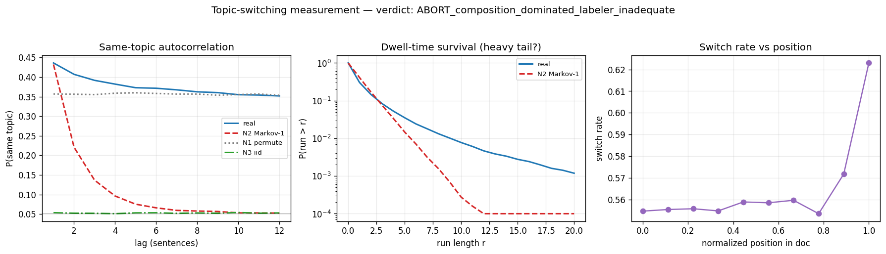

# Research record — topic-switching measurement (autoresearch #2)

**Verdict: ABORT — composition-dominated + labeler-inadequate.** As operationalized
(MiniLM sentence-embedding clusters, K=20, on fineweb-edu), topic-switching does
**not** clear the temporal-ness gate: the apparent autocorrelation is dominated
by per-*document* topic composition (it survives order-destroying permutation),
the genuine order effect is small and short-ranged, the dwell is ~geometric (not
heavy-tailed), and the labeler is too noisy (silhouette ≈ 0) for the small
residual effect to be trusted. Per the prime directive
([`README.md`](../README.md) § 0), **a sound negative is a
complete success** — and § 5 lists "the labeler noise floor swamps the effect" as
an explicit abort condition.

Preregistration (frozen): [`topic_switching_prereg.md`](prereg.md).
This is stage 2–3 (measure) only; no mirror or bench is built (stages 4–6 are
gated on a passing verdict, which did not occur).

> **Headline.** real ACF(1) = 0.436 but the order-destroying within-document
> permutation null N1 = 0.357 — so **82% of the lag-1 autocorrelation is per-doc
> composition, not temporal order**, and at long lags real (0.35) ≈ N1 (0.35)
> *exactly*. The genuine order signal (real − N1) is **+0.08 at lag 1, decaying
> to ≈ 0 by lag 5**; the dwell matches a first-order Markov chain
> (mean run 1.73 ≈ N2 1.72). With clustering silhouette 0.017 and re-seed
> ARI 0.35, that small residual is at/below the labeler noise floor. → ABORT.

## 1. Labeler (realized) + noise floor

- **Data:** `HuggingFaceFW/fineweb-edu` (sample-10BT), first 2000 streamed docs
  with ≥ 8 sentences → **58,906 sentences**. Sentence split by regex (spaCy
  unavailable in this env — a deviation from the prereg's pinned splitter,
  noted; immaterial given the verdict).
- **Topic labeler:** `sentence-transformers/all-MiniLM-L6-v2` embeddings (via
  `transformers`, mean-pool + L2-norm — identical to the sentence-transformers
  wrapper), MiniBatchKMeans **K = 20**.
- **Noise floor (the decisive caveat):** silhouette **0.017** (clusters barely
  separated), re-seed **ARI 0.35**, K-sensitivity ARI 0.31 (K=12) / 0.25 (K=32).
  The labels are ~65–75% unstable under defensible re-clustering. And
  **mean run = 1.73 sentences** — implausibly short for topical edu prose:
  K=20 fragments a coherent topic into many sub-clusters, so adjacent on-topic
  sentences land in different clusters (switch rate 0.56). The labeler, not the
  text, likely sets the low dwell.

## 2. Measured signature vs nulls (the composition confound)

Nulls: **N1** within-doc permutation (preserves each doc's topic *composition*,
destroys order); **N2** first-order Markov at the empirical transition matrix
(geometric dwell, global stationary dist); **N3** iid marginal.

| lag k | real | N1 (perm) | N2 (Markov-1) | N3 (iid) | **real − N1** |
|---|---|---|---|---|---|
| 1 | 0.436 | 0.357 | 0.432 | 0.053 | **+0.079** |
| 2 | 0.407 | 0.356 | 0.221 | 0.052 | +0.051 |
| 3 | 0.392 | 0.355 | 0.137 | 0.052 | +0.036 |
| 5 | 0.373 | 0.360 | 0.075 | 0.053 | +0.013 |
| 8 | 0.362 | 0.357 | 0.058 | 0.053 | +0.006 |
| 12 | 0.352 | 0.353 | 0.052 | 0.053 | −0.002 |

- **real ≈ N1 at every lag**, with a small lag-1 bump — the autocorrelation is
  almost entirely per-doc composition (two sentences in a topic-concentrated doc
  share a topic regardless of distance). Genuine order = real − N1 = +0.08 at
  lag 1, gone by lag 5.
- **Dwell ≈ geometric:** mean run 1.73 (real) ≈ 1.72 (N2); run-tail excess vs N2
  over r∈[3,8] = +0.016 (negligible). Not heavy-tailed.
- Position trend: switch rate flat ≈ 0.56, rising only in the final bin.



*Figure: real ≈ N1 (order-destroyed) at all lags — the autocorrelation is
composition, not order; dwell survival ≈ geometric; switch rate vs position.*

## 3. Methodological lesson — the right null matters (cf. signed-motion)

The measurement script's *first-pass* auto-verdict was **"TEMPORAL — semi-Markov
heavy tail,"** because it compared the long-lag ACF to **N2** (first-order
Markov). That is **confounded**: N2 draws from the global stationary
distribution, so it does **not** preserve per-document composition, and its
long-lag same-topic probability decays to global chance (0.05). A real corpus of
topic-*concentrated* documents therefore exceeds N2 at long lag — but that
excess is composition, not temporal order. The correct order gate is **N1**
(within-doc permutation: preserves composition, destroys order), against which
the effect nearly vanishes. The verdict logic was corrected to score order as
**real − N1**. This is the same trap as the signed-motion bench (a memorizing
probe gave a false `s_temp = 1.0`): **a positive against the wrong control is a
false positive** — exactly what the validity gates exist to catch.

## 4. Verdict + consequence

- **ABORT.** The dominant structure (per-doc composition) is non-temporal; the
  genuine order is a weak, short-range stickiness at/below the labeler noise
  floor; the dwell is memoryless-Markov. The temporal-ness gate
  ([`README.md`](../README.md) § 2.3) is **not** passed.
- **No mirror, no benchmark.** The change-point / sticky-dwell bench
  ([`changepoint_bench_spec.md`](../changepoint/bench_spec.md)) was to be anchored
  on the topic dwell distribution; with topic aborted there is **no validated
  real anchor**, so it remains a frozen spec, gated. The other change-point
  candidate (emergent misalignment) needs a paid per-span judge labeler (out of
  scope here).

## 5. Honest scope — what this is and isn't

- This is **not** a claim that topic-switching is non-temporal in language. It is
  that *this operationalization* — embedding-cluster ids at K=20 on fineweb-edu —
  fails the gates, primarily because (a) the autocorrelation is composition and
  (b) the labeler is too noisy/fine.
- A stronger labeler — an LLM topic-segment tagger, or a validated topic model
  with held-out coherence — might expose genuine sticky dwells (and would let the
  change-point bench proceed). It is **not** pursued here: re-choosing K or the
  labeler after seeing this result would be post-hoc shopping on a frozen
  preregistration ([`README.md`](../README.md) § 6). It is
  logged as the explicit next step instead.

## 6. Reproduction

```bash
# (run from the repo root)
.venv/bin/python -m experiments.explorations.synthetic.topic_switching.measure   # embed + cluster + nulls + verdict
```
Outputs: `synthetic/topic_switching/results/topic_switching_stats.json`,
`synthetic/topic_switching/figs/topic_switching_signature.*`. Streams fineweb-edu text (network) + MiniLM
on GPU; deterministic (`SEED=0`) given the stream order. No `core/` edits.
