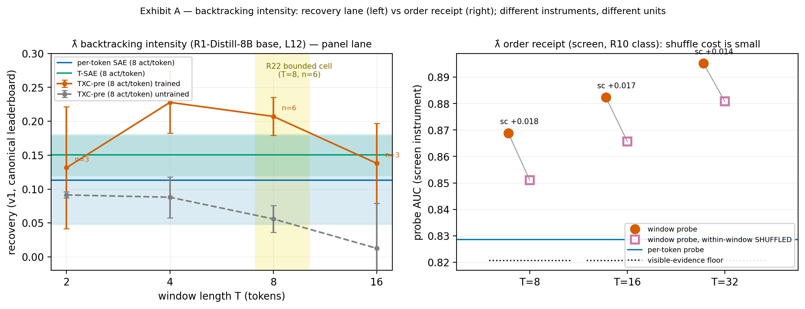
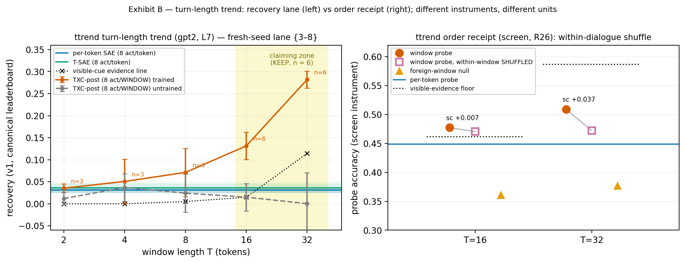

# REBUTTAL PACK — hunt headline tasks in the cross-task ablation format

**Status: PENDING TEAM REVIEW.** mac-b, 2026-07-27 ~01:30 London, per
`briefings/actmix-overnight.md` § 2. Staged for Han's 11:30 one-pager and the
17:00 meeting. **Zero GPU, zero new numbers**: every value below is read off
the canonical leaderboard or a committed receipt JSON; receipt IDs beside each
number. Figures: `figs/rebuttal_lambda_exhibit.{png,pdf}`,
`figs/rebuttal_ttrend_exhibit.{png,pdf}` (regenerate:
`.venv/bin/python -m experiments.explorations.task_hunt.rebuttal_pack_figs`).

**Format note (read first).** The cross-task table format is
TXC | TXC-shuffled | per-token SAE | T-SAE. On the hunt, recovery numbers and
shuffle numbers come from **two different instruments**: recovery is the
panel lane (trained dictionaries, canonical leaderboard, `lambda_recovery`),
while the shuffle receipts are screen-instrument probe readings (R10/R26
class — probes on raw activations; acc/AUC units). **No trained-dictionary
shuffle eval exists on the hunt panels** (the composition-harmonized
shuffle+T-sweep grids being run tonight by runpod-1/2 carry that for the
PAPER tasks). The table therefore reports the shuffle column in its own units
with its receipt, never as a differenceable column — and the figures keep the
two instruments in separate panels.

---

## 1. Task 1 — backtracking intensity λ̂ (R1-Distill-8B base, layer 12)

Target: exponentially-weighted count of recent backtracking events on
reasoning traces (a trailing state; nothing printed at the current token).
Substrate `ward_real_lambda_base_l12`; all arms at 8 active latents/token.

| arm | value | receipt |
|---|---|---|
| **TXC (pre), T=8** | **r = 0.207 [0.179, 0.235]**, n = 6 | R22 lane; leaderboard. Curve top is T=4: 0.228 [0.182, 0.274] (profile, not the bounded cell) |
| TXC-shuffled | screen instrument: within-window shuffle costs **+0.018 / +0.017 / +0.014 AUC** at T = 8/16/32 (0.869→0.851, 0.882→0.866, 0.895→0.881); g_order at T32 = −0.0005 | `lambda_intensity/results/lambda_screen.json`; R10 class |
| TXC-shuffled (RETRAINED overlay, **post arm**) | anchor gate ALL PASS (6/6 cells, worst Δ 1e-4 vs quoted); shuffle gaps **+0.004/+0.007/+0.014/+0.011** at T2/4/8/16, per-seed signs MIXED — window state order-free at every T | `figs_writeup/fig_lambda_shuffle_tsweep`; LOG c32c65539 (ratified 20:44). NB: overlay = post arm; headline row above = pre arm — do not conflate |
| per-token SAE | r = 0.113, n = 3 | leaderboard (realized l0 4.53/8 — see l0 note) |
| **T-SAE (licensed comparator)** | r = 0.150, n = 6 | leaderboard; R22. Width-matched by design — NOT the paper's backtracking tsae, which ran at HALF width (16384 vs 32768; Andrii's Q5 audit 11cf2b5b0) |
| untrained TXC-pre | 0.091 → 0.013 declining over T2→T16 | leaderboard |

**The licensed margin (R22, quote only with its disclosures):** pre/T8 −
T-SAE = **+0.0569, one-sided 95% LB +0.0200**, all 6 seed-diffs positive
(sign-flip p = 1/64); Welch 6v6 LB +0.0272, p = 0.0030; caveat-free
NEW-SEEDS-ONLY fallback Welch LB +0.0357. **Mandatory disclosures beside it:**
(a) cross-cache pooling (pending team ratification); (b) two top-up T-SAE
seeds ran under the l0 band (s3 = 3.59, s4 = 3.12 vs round-1 6.52–7.20) and
the POST-HOC under-band exclusion cuts against the headline — in-band Welch
LB +0.0083 (thin), paired n = 4 LB −0.0088 NOT bounded. Direction on record:
"an under-spent tsae comparator plausibly INFLATES the pre−tsae margin."

**Order reading (what the shuffle column means here):** the λ̂ window
advantage is **order-free aggregation** (R10: "every window advantage found
is order-free aggregation … NEVER quote with 'anywhere'") — the shuffle cost
is small (≤ +0.018 AUC) and g_order ≈ 0. The rebuttal sentence is about
*temporal integration capacity at matched budget*, not order sensitivity, on
this task.

*Exhibit A. Left: fig1-family panel lane (Okabe-Ito; paired-t 95% CI
whiskers; n annotated; R22 bounded cell shaded; 6 seeds at the T=4/T=8
TXC-pre cells and at T-SAE, 3 elsewhere). Right: screen-instrument order
receipt (probe AUC): filled circle = window probe, open square = its
within-window-shuffled twin (stems join pairs; "sc" = shuffle cost), blue
line = per-token probe, dotted = visible-evidence floor. Both window arms sit
above the per-token probe and the floor — and shuffling barely moves them:
the gain is aggregation, not order.*

## 2. Task 2 — turn-length trend (GPT-2, layer 7, dialogue)

Target: the slope of turn lengths over recent dialogue (trailing trend).
Substrate `dial_real_ttrend_gpt2_l7`. **Licensed lane = the fresh-seed
re-pre-registration** (round 2; seeds {3,4,5} salvage + {6,7,8} top-up;
freezes 50af78f12 ∪ 85c87fd76): TXC-post claiming at **8 active features per
WINDOW** vs per-token baselines at 8 per token — a 16–32× smaller budget at
the claiming Ts, so a win cannot be capacity.

| arm | value | receipt |
|---|---|---|
| **TXC (post), T=32** | **r = 0.282** (n = 6 combined; new-seeds-alone 0.286) | R29 (KEEP at T={16,32}); `diafaces/results/topup_score.json` |
| TXC (post), T=16 | r = 0.131 (n = 6; new-seeds-alone 0.146) | R29 |
| TXC-shuffled | screen instrument (R26): win 0.509 vs shuffled 0.472 at T32 — **within-dialogue shuffle cost +0.037 acc** (ratified band [+0.034, +0.049], 9/9 face×model); T16 +0.007; foreign-window null 0.361/0.377 | `diafaces/results/screen_gpt2.json`; R26 |
| per-token SAE | r = 0.031, n = 6 | leaderboard, fresh-seed lane |
| T-SAE | r = 0.036, n = 6 | leaderboard, fresh-seed lane |
| untrained TXC-post | 0.015 at T16, **0.000 at T32** (ratios 0.09× / 0.007×) | R29 S2 |
| visible-cue evidence line | 0.015 at T16, **0.114 at T32**; trained post beats it 2.5× | `panel_evidence_line_tt.json`; R29 S4 |

**The licensed margins.** Headline lane = **L1, new seeds alone, no
sequential caveat** (R29): post − SAE at T16 **+0.117 [+0.110, +0.123]**, at
T32 **+0.256 [+0.200, +0.313]**; post − T-SAE at T16 **+0.104 [+0.094,
+0.114]**, at T32 **+0.244 [+0.187, +0.301]** — all four legs pass. L2
combined n = 6 numbers (e.g. sae@T32 +0.251, LB +0.233) are quotable only
with the verbatim caveat: "SEQUENTIAL-DECISION CAVEAT (mandatory beside every
L2 number): the n=6 extension was decided AFTER observing seeds {3,4,5} fail
one t-CI leg — L2 is a conditional test." T16→32 growth exact p = 0.0156
(floor 1/64); grouped-v2 lead +0.250.

**Two floors, two instruments — state this precisely:** the panel's
pre-registered visible-cue evidence line (label-side |r|, degenerate at
T ≤ 8, 0.114 at T32) is the licensed bar, beaten 0.282 vs 0.114. The SCREEN's
visible floor is a different quantity (a probe trained on visible-turn
features, acc units): on the screen the window probe clears it only at
T ≤ 16 (R26: "tt bounded to T ≤ 16 as a clean over-floor claim") — at T32 the
screen floor (0.587) sits above the screen window probe (0.509). Do not mix
the two in one sentence.

**Round-1 honesty line (keep beside any ttrend quote):** round 1's pooled
arms failed the untrained control (untrained stacked = 0.81× trained;
training NEGATIVE for pre) — the claiming lane above is a NEW
pre-registration on seeds the observation never touched, and its untrained
twin is flat at zero.

*Exhibit B. Left: fig4-family fresh-seed lane (claiming zone shaded, KEEP at
n = 6; untrained twin flat at zero; per-token bands nearly coincide at
≈ 0.03; dotted = panel evidence line). Right: screen-instrument order receipt
(probe acc): the within-dialogue shuffle costs +0.037 at T32 (+0.007 at T16)
against a foreign-window null far below — this task's window signal is
order-carried at T32 on the screen instrument, unlike λ̂'s.*

## 3. Composition-robustness certificate (fresh, load-bearing)

Every number above is **composition-robust BY IDENTITY** (R30, ratified):
at hunt widths (d_sae 2048, k = 8) the btk-only variants reproduce the
relu-mix arms to |Δrecovery| ≤ 2.2e-8 with realized-l0 delta exactly 0.0 —
the ReLU→BatchTopK composition is a no-op wherever positive pools are rich,
and the realized-l0 shortfall is eval-time threshold pruning shared by both
compositions (`ACTMIX_FORENSICS.md` § 9 corrigendum). Standing l0 disclosure
(WRITEUP § 9, quote verbatim with any SAE margin): "that baseline landed
4.1–4.7 active features per token against a nominal 8 (an architecture
property at this width; a sensitivity check passes). The temporal-SAE
comparison is the clean one, and Task 2 passes both."

**07-27 22:40 UPDATE (supersedes the 20:30 text — the onset map was
corrected, LOG 21:12 runpod-1 + mac-local 22:34 independent diff).**
The certificate is a BOUNDARY document, not a global invariance: at
paper-probing width (d_sae 18432, k_win = 20·T) the compositions are
metric-exact at T = 1 (and for per-token SAE + untrained — all twin
pairs machine-precision); **divergence onset is T = 2**, growing with
window depth (selection fraction k_win/d_sae grows linearly with T):
per-task l0 shifts ~0.8 tokens at T2–T6, realized-l0 shifts to 2.5 at
T16, ~40% disjoint survivor sets at T16, with headline-AUC
consequence ≈0.002 at this width. Same aggregate dead fraction both
arms (~57% at T16). This is the thin-pool regime R30 anticipated.
The hunt-width identity above is unaffected. CAVEAT (open): one
provenance anomaly (T8 twins exact while T6 diverges) blocks the
formal certificate until per-cell receipts post (LOG 22:34);
quote the onset map as PRELIMINARY until then. **Both-arms answer
for the reviewer question (draft licence, PTR):** "The paper's
ReLU+TopK composition and the clean BatchTopK coincide exactly at
T = 1 and for the per-token baselines; with growing window length
the trainings drift apart progressively (measurable from T = 2 in
per-task sparsity, ≈0.002 in probing AUC by T = 16 at
d_sae = 18432) — the dead-latent mechanism engages with selection
depth. Preliminary (receipts + 3-seed replication overnight);
both-arms comparison figure follows." Do NOT quote the ≈0.002 as
"composition doesn't matter" — width-contingent; the finding is the
disjoint survivor sets (dead-latent mechanism, measured).

## 4. One-pager candidates (Han, 11:30) — three sentences that survive every
licence above

1. "On reasoning traces, a temporal dictionary at the same 8-per-token budget
   recovers backtracking intensity at r = 0.21 (T = 8, n = 6) vs 0.11/0.15
   for per-token SAE / T-SAE; the T-SAE margin is CI-bounded (+0.057, LB
   +0.020) with its pooling and l0 disclosures; the advantage is temporal
   aggregation (shuffle-insensitive, R10)."
2. "On dialogue, an 8-active-features-per-WINDOW TXC-post recovers the
   turn-length trend at r = 0.28 at T = 32 (n = 6 fresh seeds) — 32× less
   budget than the per-token baselines it beats by +0.24–0.26 (CI-bounded),
   2.5× the visible-cue bar, with an untrained twin at 0.000 — and this
   task's window signal IS order-carried (within-dialogue shuffle cost
   +0.037, R26)."
3. "All hunt numbers are composition-robust by identity (R30): the
   ReLU/BatchTopK composition audit moved nothing at hunt widths."

## 5. Sources

Leaderboard: `results/leaderboard.jsonl` (canonical; λ̂ = ward_real_lambda_
base_l12 primary k=8 arms; ttrend = fresh-seed lane, freeze-stamp-filtered).
Receipts: R10, R22, R26, R28, R29, R30 (`RECEIPTS.md`, all PASS in
`receipts_check.py`). Scorers: `diafaces/results/{salvage,topup}_score.json`,
`lambda_intensity/results/topup_bounds_tsae.json`. Screens:
`lambda_intensity/results/lambda_screen.json`,
`diafaces/results/screen_gpt2.json`, `diafaces/results/panel_evidence_line_
tt.json`. Figure script: `rebuttal_pack_figs.py` (this directory).

*Everything PENDING TEAM REVIEW; quote licences travel with every number.*
