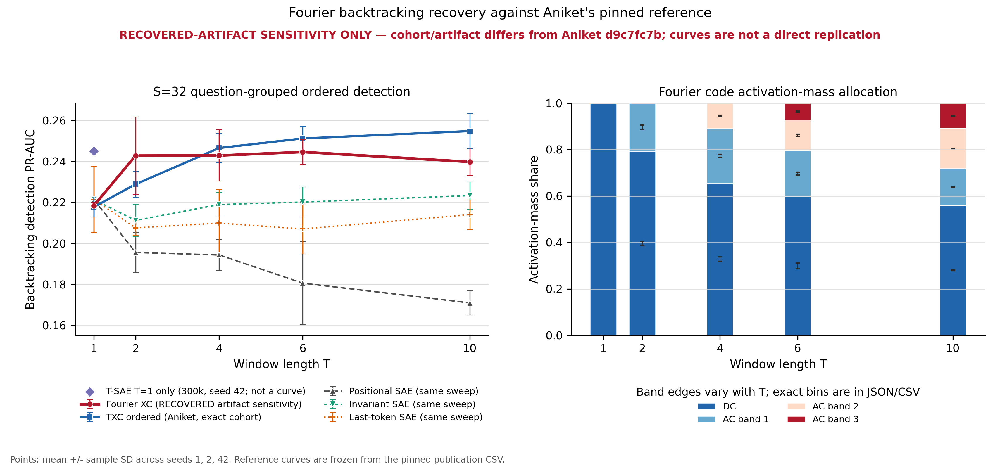

## Fourier XC backtracking experiment

This folder is the entry point for the completed 20,000-step,
parameter-matched Fourier crosscoder backtracking experiment. It collects the
question, experimental decisions, results, interpretation, provenance
boundary, compute record, and links to every canonical artifact without
duplicating the underlying cell outputs.

Status: **complete**  
Date: 2026-07-30  
Branch: `codex/spectral-screen-overnight-20260729`  
Results commit: `8e469cd30a4f3cbd95fb56f7a50469544d2de986`

Quick artifacts:

- [comparison figure](../results/backtracking_fourier_matched/reviewer-five-point-v1/publication/backtracking_fourier_summary.png);
- [print-ready PDF](../results/backtracking_fourier_matched/reviewer-five-point-v1/publication/backtracking_fourier_summary.pdf);
- [exact aggregate JSON](../results/backtracking_fourier_matched/reviewer-five-point-v1/publication/backtracking_fourier_summary.json);
- [detailed scientific write-up](../analysis/backtracking_fourier_results.md).

## Question

Can a fixed real-Fourier temporal parameterisation improve on Aniket's TXC
backtracking curve when both models:

- train for 20,000 steps;
- use the same data, losses, sparsity rule, and optimizer recipe;
- have effectively identical trainable parameter counts;
- are evaluated with the same grouped sparse-probe protocol?

A secondary question is whether the frequency decomposition provides
mechanistic information for free: do the learned backtracking features use
only DC, or does AC feature usage grow with temporal context?

## Answer

The plain Fourier XC does not improve on TXC at long windows. Numerically, it
is tied at \(T=1\), has a seed-variable recovered-cohort lead at \(T=2\),
trails slightly at \(T=4\) and \(T=6\), and trails by 0.0150 PR-AUC at
\(T=10\). The Fourier curve rises sharply from \(T=1\) to \(T=2\), then
plateaus and declines, whereas the pinned TXC curve keeps improving.

The frequency readout is informative. DC activation-mass share decreases
monotonically from 100% at \(T=1\) to 56% at \(T=10\). Combined AC mass grows
to 44%, with very little variation across representation-training seeds.
Long-window backtracking features are therefore not merely DC features.

This does not show that the AC features are causally helpful: the largest AC
share occurs at the same window where Fourier trails TXC most. The clean next
test is a matched DC-only/AC-only clamp or retraining ablation.



## Primary result

The metric is mean ordered PR-AUC for Aniket's fixed 32-feature logistic
probe. Error bars are sample standard deviations over representation seeds
1, 2, and 42.

| T | Fourier XC sensitivity | TXC pinned reference | Difference |
|---:|---:|---:|---:|
| 1 | 0.2184 ± 0.0016 | 0.2178 ± 0.0049 | +0.0006 |
| 2 | 0.2428 ± 0.0189 | 0.2289 ± 0.0064 | +0.0139 |
| 4 | 0.2429 ± 0.0125 | 0.2466 ± 0.0072 | -0.0037 |
| 6 | 0.2446 ± 0.0059 | 0.2512 ± 0.0058 | -0.0066 |
| 10 | 0.2398 ± 0.0067 | 0.2548 ± 0.0085 | -0.0150 |

The exact values and seed-level results are in `summary.csv` and the
canonical publication JSON linked below.

## Frequency use

Activation-mass share measures how much selected-code magnitude lies in each
frequency block. It is not a count of available atoms. The blocks compete in
one global TopK selection.

| T | DC share | Combined AC share | Ordered-minus-shuffled PR-AUC |
|---:|---:|---:|---:|
| 1 | 1.0000 ± 0.0000 | 0.0000 | 0.0000 |
| 2 | 0.7932 ± 0.0086 | 0.2068 | 0.0005 |
| 4 | 0.6566 ± 0.0092 | 0.3434 | 0.0083 |
| 6 | 0.5982 ± 0.0127 | 0.4018 | 0.0123 |
| 10 | 0.5592 ± 0.0018 | 0.4408 | 0.0048 |

At \(T=10\), activation mass is split 55.92% DC, 15.84% first AC
band, 17.44% middle AC band, and 10.81% high AC band. The three seed-level
allocations differ by less than 0.2 percentage points in the DC block.

The ordering control shows that the code contains temporally ordered
information, particularly at \(T=4\) and \(T=6\). It does not explain the
whole performance curve, because the gap falls again at \(T=10\).

## Model and parameter match

The experiment uses a plain real orthonormal Fourier crosscoder:

- each feature belongs to DC or an AC frequency band;
- sine/cosine quadratures stay in the same band;
- selection is global per-example TopK\((20T)\), followed by ReLU;
- reconstruction loss, AuxK, dead-feature tracking, and decoder projection
  match `TXCBase`;
- there is no Matryoshka objective, learned frequency weighting, adaptive
  routing, or band-specific probe in the primary result.

| T | Fourier atoms | TXC parameters | Fourier parameters | Difference |
|---:|---:|---:|---:|---:|
| 1 | 32,768 | 268,472,320 | 268,472,320 | 0 |
| 2 | 65,532 | 536,911,872 | 536,911,868 | -4 |
| 4 | 98,298 | 1,073,790,976 | 1,073,790,970 | -6 |
| 6 | 131,064 | 1,610,670,080 | 1,610,670,072 | -8 |
| 10 | 131,067 | 2,684,428,288 | 2,684,420,091 | -8,197 |

The \(T=10\) mismatch is approximately three parts per million.

## Frozen training and evaluation recipe

- Reference code: `origin/neurips-aniket` at
  `d9c7fc7b22352394b6d1b91897cdb82d0b128f0e`.
- Reference protocol: `2026-07-26.t16.1`.
- Windows: 1, 2, 4, 6, and 10.
- Representation seeds: 1, 2, and 42.
- Steps: 20,000 per cell.
- Batch size: 1,024.
- Learning rate: `3e-4`.
- Warmup: 1,000 steps.
- Schedule seed: `907000 + 100 * representation_seed`.
- Evaluation: five question-grouped folds.
- Probe supports: 8, 16, and 32; support 32 is primary.
- Evaluation rows: 20,335, including 2,498 positives.
- Effective code support: exactly \(20T\) in every primary cell.

All 15 window-by-seed cells completed.

## Provenance boundary

This is a **recovered-artifact sensitivity analysis**, not a bit-exact
replication or a clean head-to-head estimate against the pinned TXC and SAE
curves.

Aniket's exact T16 activation artifact was not available in Git, the attached
RunPod volumes, or the experiment handoff. The frozen extractor was replayed,
but current CUDA numerics changed the eligible cohort. The recovered artifact
preserves the published row count and class balance. Its first ten temporal
offsets are replayed activations and its last six offsets are copied
bit-for-bit from the official shorter artifact.

- Recovered artifact SHA-256:
  `1681b7e6ef68ccc207a5d9af2c4ba3d4646056ccdca0bc3d5c09bc3b43c2125f`.
- Recovery manifest SHA-256:
  `14c4710360a01bdcd97db5c178d30b52cc108eb65414e6800da124ce79178654`.
- Recovered cohort SHA-256:
  `9137bda110780afc1965f453669d434100e1e495bd8f4dfaf8713c4bb6516c0d`.
- Pinned reference cohort SHA-256:
  `f397f4caf6212825bd98b1b82be932ae634f01a716fd7e3642fd3d7640b27c0b`.
- Official shorter artifact SHA-256:
  `1656f6be2cd85fb85c8b246b9b27933f73ef40cfaac84078169dfd3bbbe27810`.

The comparison plot carries this warning in its header. In particular, the
\(T=2\) numerical lead should not be described as a replicated Fourier win.

## Compute record

Training and evaluation ran on RunPod:

| Work | RunPod ID | GPU | Final state |
|---|---|---|---|
| Seed 42 endpoints | `2avn69d4ffd2u5` | H100 SXM | `EXITED` |
| Seed 1 endpoints | `k0tc7emul0drpz` | H100 SXM | `EXITED` |
| Seed 2 endpoints | `sh30z89jhcj6kz` | H100 SXM | `EXITED` |
| Seed 2 middle windows | `j167od7mxxyw9t` | RTX 5090 | `EXITED` |
| Seed 42 middle windows | `7v6zptrgzmq1bs` | RTX 5090 | `EXITED` |
| Seed 1 middle windows | `5gv8q6y3xty26n` | RTX 5090 | `EXITED` |

A short B200 allocation was used for artifact recovery. Wall time multiplied
by the listed RunPod rates gives a conservative total of approximately $37,
below the $50 cap. All six training/evaluation pods were stopped and verified
as `EXITED`.

## Verification

- 15/15 result cells report `status=complete`.
- 15/15 training summaries report 20,000 completed steps.
- Every cell contains the primary 32-feature probe.
- Effective TopK support is exactly \(20T\).
- The publication PNG, PDF, JSON, and CSV were rendered and SHA-256 hashed.
- 21 focused pytest tests pass.
- Ruff passes on the Fourier model, recovery, plotting, and test code.
- `git diff --check` passes.

## Artifact map

Paths below are relative to `experiments/power_spectrum/`.

| Purpose | Canonical path |
|---|---|
| Detailed scientific write-up | `analysis/backtracking_fourier_results.md` |
| Architecture and run protocol | `BACKTRACKING_FOURIER.md` |
| Model implementation | `code/backtracking_fourier_xc.py` |
| Experiment driver | `code/run_backtracking_fourier.py` |
| RunPod wrapper | `code/run_backtracking_fourier_runpod.sh` |
| Recovery builder | `code/build_backtracking_recovery_artifact.py` |
| Plot and aggregate builder | `code/plot_backtracking_fourier.py` |
| All 15 canonical cells | `results/backtracking_fourier_matched/reviewer-five-point-v1/cells/` |
| All 15 training summaries | `results/backtracking_fourier_matched/reviewer-five-point-v1/training/` |
| Publication PNG/PDF/JSON/CSV | `results/backtracking_fourier_matched/reviewer-five-point-v1/publication/` |
| Recovery manifest | `results/backtracking_fourier_matched/recovery/sentence_acts_L10_T16.recovered.manifest.json` |
| Seed 1 RunPod audit bundle | `results/backtracking_fourier_matched/seed1_rtx5090/` |
| Seed 2 RunPod audit bundle | `results/backtracking_fourier_seed2_5090/` |
| Focused tests | `tests/test_backtracking_fourier_xc.py`, `tests/test_plot_backtracking_fourier.py`, and recovery tests |

## Reproduction

On a checkout containing Aniket's pinned protocol, stage the experiment-local
modules under `purified/experiments/power_spectrum/code/`. Inspect the exact
plan and run the full-width memory smoke before allocating the sweep:

```bash
BACKTRACKING_FOURIER_PHASE=plan \
  bash purified/experiments/power_spectrum/code/run_backtracking_fourier_runpod.sh

BACKTRACKING_FOURIER_PHASE=memory-smoke \
  BACKTRACKING_FOURIER_ALLOW_RECOVERED_ARTIFACT=1 \
  bash purified/experiments/power_spectrum/code/run_backtracking_fourier_runpod.sh
```

Run selected seeds/windows, or omit the selectors for the complete grid:

```bash
BACKTRACKING_FOURIER_PHASE=all \
  BACKTRACKING_FOURIER_ALLOW_RECOVERED_ARTIFACT=1 \
  BACKTRACKING_FOURIER_WINDOWS="1,2,4,6,10" \
  BACKTRACKING_FOURIER_SEEDS="1,2,42" \
  bash purified/experiments/power_spectrum/code/run_backtracking_fourier_runpod.sh
```

Rebuild the publication bundle locally:

```bash
PYTHONPATH=src .venv/bin/python \
  -m experiments.power_spectrum.code.plot_backtracking_fourier \
  experiments/power_spectrum/results/backtracking_fourier_matched/reviewer-five-point-v1
```

Run the focused validation:

```bash
PYTHONPATH=src .venv/bin/python -m pytest -q \
  experiments/power_spectrum/tests/test_backtracking_fourier_xc.py \
  experiments/power_spectrum/tests/test_backtracking_recovery_inventory.py \
  experiments/power_spectrum/tests/test_build_backtracking_recovery_artifact.py \
  experiments/power_spectrum/tests/test_extract_backtracking_candidates.py \
  experiments/power_spectrum/tests/test_plot_backtracking_fourier.py
```

## Interpretation and next experiment

The result weakens the simple hypothesis that Fourier structure should
automatically dominate a TXC on any order-sensitive temporal task. Fixed
frequency support provides a clean mechanistic readout, but TXC appears better
able to integrate the long and irregular context needed by backtracking.

The most diagnostic follow-up is not another unconstrained sweep. It is a
within-checkpoint intervention:

- evaluate DC-only, each AC band alone, and cumulative DC-plus-AC bands;
- hold the sparse-probe support and train/test folds fixed;
- compare ordered, reversed, circularly shifted, and shuffled codes;
- report task PR-AUC alongside reconstruction loss and retained activation
  mass.

That would distinguish AC features that carry backtracking signal from AC
features that merely improve reconstruction.
