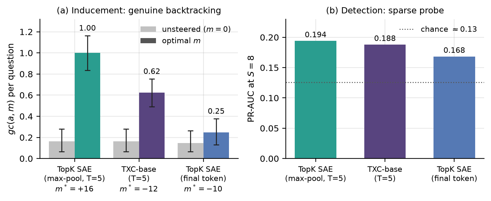

## A max-pooled SAE matches TXC-base on backtracking

**Claim.** The ordinary TopK SAE lost to TXC on backtracking because its
feature miner saw only the final token, while the TXC saw a 5-token window.
If the same SAE's codes are max-pooled over that same 5-token window, it
matches TXC-base on detection and inducement. Pooling is used only to *select*
the feature. The steering vector is still a single native SAE decoder
direction, with the same hook and norm calibration as every other arm.

*(a) Mean genuine-backtracking count per question (Sonnet-4.6 judge, 61
MATH-500 questions, cut25), unsteered vs. each arm's peak magnitude m\*;
bootstrap 95% CIs over questions. (b) Sparse-probe PR-AUC at S=8, 5-fold
GroupKFold by question; chance is the 12.6% positive rate. All three arms use
training seed 42 and 20k training steps.*

- **Detection is parity.** Max-pooled SAE 0.194, TXC-base 0.188, final-token
  SAE 0.168. The +0.006 margin over TXC-base is not meaningful. The matched
  20k TXC-pro (0.209, not shown) still beats every SAE pool.
- **Inducement is parity at moderate doses and an SAE win at the peak.** On
  each arm's productive sign over |m| ∈ {5–12}, Δgc is 0.205 for max-pooled SAE
  vs 0.197 for TXC-base. The paired difference is +0.008, with 95% CI
  [−0.063, 0.079]. The peak Δgc of 0.84 at m=+16 is at the edge of the grid,
  where some continuations are confused or repetitive. Treat the moderate-dose
  lobe as the headline, not the peak.
- **Window order does not matter.** Max pooling is permutation-invariant, so
  the gain comes from detecting whether the feature fired anywhere in the
  window, not from temporal order.

### SAE configuration vs. the paper

| | This run (all arms) | Paper TopK SAE (§C7) |
| --- | --- | --- |
| Subject / hookpoint | Llama-3.1-8B, L10 resid | same |
| Steered model | R1-Distill-Llama-8B, L10 | same |
| d_SAE / k_pos | 32,768 / 20 | 32,768 / 20 |
| Batch / optimiser | 1024 / Adam 3e-4, 1k warmup, bf16 | same |
| Anti-dead stack | AuxK 1/32, 10M-token dead threshold | same |
| **Training steps** | **20,000** | **300,000** |
| Seed | 42 | 42 |
| Detection window | last 5 of 6 cached positions | SAE: final token only (T_arch=1) |
| Judge / cohort / grid | Sonnet-4.6, 61 Q, 25-pt grid | same |

### Results vs. the paper

| Arm | Peak Δgc (m\*), this run | Peak Δgc (m\*), paper 300k | PR-AUC@8, this run | PR-AUC@8, paper 300k |
| --- | ---: | ---: | ---: | ---: |
| TopK SAE, final token | 0.10 (−10) | ≈0.40 (−16) | 0.168 | 0.175 |
| **TopK SAE, max-pool T=5** | **0.84 (+16)** | — | **0.194** | — |
| TXC-base, T=5 | 0.46 (−12) | 0.54 (−12) | 0.188 | 0.201 |

### Caveats

- **Training-budget mismatch.** Every arm here trained for 20k steps; the
  paper trained for 300k. The 300k TXC weights could not be recovered, so the
  pooled SAE has not been tested against the paper's headline TXC.
- **Run-to-run noise in the final-token SAE peak.** The same 20k SAE
  checkpoint peaked at 0.23 (m=−16) in the May run and at 0.10 here.
  Single-seed peaks on 61 questions are noisy.
- **Read Δgc, not absolute gc.** The unsteered floor here is about 0.16 per
  question, while the paper's paired bar figure shows about 0.64. Peak Δgc
  agrees with the paper's curves, but that bar figure's absolute floor is not
  reproduced. The discrepancy has not been traced.
- **Paper SAE baseline was window-starved.** The appendix states that
  activations are max-pooled over positions. For the TopK SAE, however,
  T_arch=1, so its window is the final token alone. The pooled arm closes
  exactly that gap.

Sources: `steering_baselines/RESULTS.md`, `RESULTS.md`; figures and numbers
regenerate with `onepager_figures.py` → `onepager/`.
