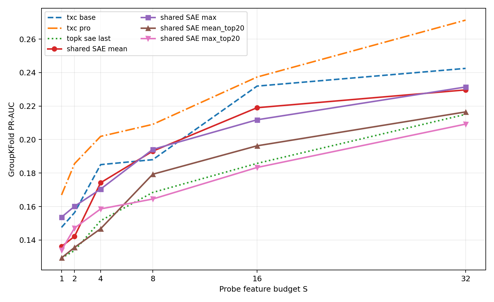

## Verdict

**Pooling a shared SAE repairs much of the weak baseline, and narrowly beats
TXC-base at the paper's `S=8` detection operating point, but it does not beat
TXC-pro or win consistently across feature budgets.** This is evidence that
the old TopK SAE comparison was unfair, not a decisive replacement for the
best TXC.

- Max-pooled SAE: PR-AUC@8 **0.1941**.
- Mean-pooled SAE: **0.1931**.
- Matched-20k TXC-base: **0.1880**.
- Matched-20k TXC-pro: **0.2091**.
- Old last-token SAE: **0.1684**.

The pre-registered steering gate required matching or beating TXC-pro at
`S=8`; it failed. We therefore did **not** spend money on new generation or
Sonnet judging.

## Full detection curves

All values use the existing C7 five-fold GroupKFold-by-question protocol.
Feature selection occurs within each training fold, followed by an L1
logistic probe. Higher is better.

| Model or pool | S=1 | S=2 | S=4 | S=8 | S=16 | S=32 |
| --- | ---: | ---: | ---: | ---: | ---: | ---: |
| **TXC-pro, 20k reference** | **0.1669** | **0.1856** | **0.2019** | **0.2091** | **0.2373** | **0.2713** |
| TXC-base, 20k reference | 0.1475 | 0.1564 | **0.1850** | 0.1880 | 0.2319 | 0.2425 |
| Shared SAE, max pool | **0.1536**† | **0.1601**† | 0.1704 | **0.1941**† | 0.2118 | 0.2314 |
| Shared SAE, mean pool | 0.1361 | 0.1422 | 0.1742 | **0.1931**† | 0.2190 | 0.2296 |
| Shared SAE, recency pool | 0.1345 | 0.1401 | 0.1569 | 0.1876 | 0.2126 | 0.2236 |
| Shared SAE, mean then top-20 | 0.1293 | 0.1356 | 0.1467 | 0.1793 | 0.1963 | 0.2165 |
| Shared SAE, max then top-20 | 0.1339 | 0.1471 | 0.1586 | 0.1645 | 0.1833 | 0.2092 |
| Old SAE, final token only | 0.1292 | 0.1337 | 0.1515 | 0.1684 | 0.1858 | 0.2150 |

† Beats TXC-base at that particular `S`; none of the SAE pools beats TXC-pro.
Max pooling beats TXC-base at `S={1,2,8}` but loses at `S={4,16,32}`. The
`S=8` margin is only **+0.0061**, so it should be described as a narrow
point-estimate win, not a robust architecture-level victory.

## Validation and controls

The final-token arm reproduced every stored SAE PR-AUC exactly: maximum
absolute error **0.0** across all six `S` values. This validates the checkpoint,
activation window, numerical encoder, fold split, feature selector, and probe.

Mean and max pooling improved over the final-token SAE in every one of the five
folds at `S=8`:

| Fold | Final token | Mean pool | Max pool |
| --- | ---: | ---: | ---: |
| 1 | 0.1608 | 0.1843 | 0.1975 |
| 2 | 0.1906 | 0.2186 | 0.2214 |
| 3 | 0.1518 | 0.1751 | 0.1773 |
| 4 | 0.1851 | 0.2193 | 0.2048 |
| 5 | 0.1537 | 0.1680 | 0.1697 |

The ordinary SAE activates exactly 20 features per token. Across five tokens,
the aligned union has mean support **69.94**, median 70, maximum 94. This is
below TXC-base's nominal window budget of 100, so the primary pooled arms do
not exceed the TXC's support budget. Truncating the pooled result back to 20
features removes most or all of the benefit.

The five individual positions score between **0.1585 and 0.1684** at `S=8`;
no single earlier token explains the pooled gain. The gain comes from combining
evidence distributed across positions. Recency weighting scores 0.1876 versus
0.1819 for reverse recency, a small positional asymmetry that is weaker than
order-invariant mean/max pooling.

## Interpretation

This result changes how C7 should be described:

1. **The original SAE baseline understated what an SAE can do.** It saw only
   the final token while the TXCs saw a five-token window. Coherently pooling
   shared feature identities raises PR-AUC@8 by +0.0257 to +0.0247.
2. **The recovered benefit is set aggregation, not temporal order.** Mean and
   max are exactly invariant to reversal or shuffle. This cannot support a
   claim that backtracking detection needs ordered temporal machinery.
3. **TXC-pro still compresses the window signal better.** It wins at every
   probe budget, especially `S=32` (0.2713 versus pooled max 0.2314). TXC-base
   also regains the lead at larger `S`.
4. **Pooling changes the causal candidate.** The most positive-selectivity
   feature is ID 10668 for the final token, 31559 for mean pooling, and 24530
   for max pooling. The top-32 feature sets still overlap substantially
   (20--22 features), but a pooled steering experiment would require new
   generations rather than reusing the old SAE curve.

The skeptical conclusion is therefore: **yes, shared-SAE pooling can beat the
weaker TXC-base at one important detection operating point; no, it does not
currently beat the strongest TXC or establish a steering win.** The clean next
step, if we continue, is a label-blind learned pooling adapter over frozen SAE
codes. It should be compared against both fixed mean/max and TXC-pro before any
new judged steering sweep.

## Reproducibility and spend

- Frozen source commit: `064441bfd`.
- TopK SAE: train key `f437e623fabc37ec`, seed 42, 20,000 steps,
  `d_sae=32768`, `k=20`.
- Cohort: 25,204 sentences, 3,169 positives, 300 question groups.
- GPU: one RunPod H100 80 GB; experiment runtime 426 seconds.
- Pod wall time: 919 seconds at $2.99/hour; estimated cost **$0.76**.
- API/judge cost: **$0**. Pod stopped immediately after artifact recovery.
- Exact numbers: `results/raw_results.json`; hashes and remote paths:
  `results/provenance.json`; spend receipt: `results/spend.json`.

