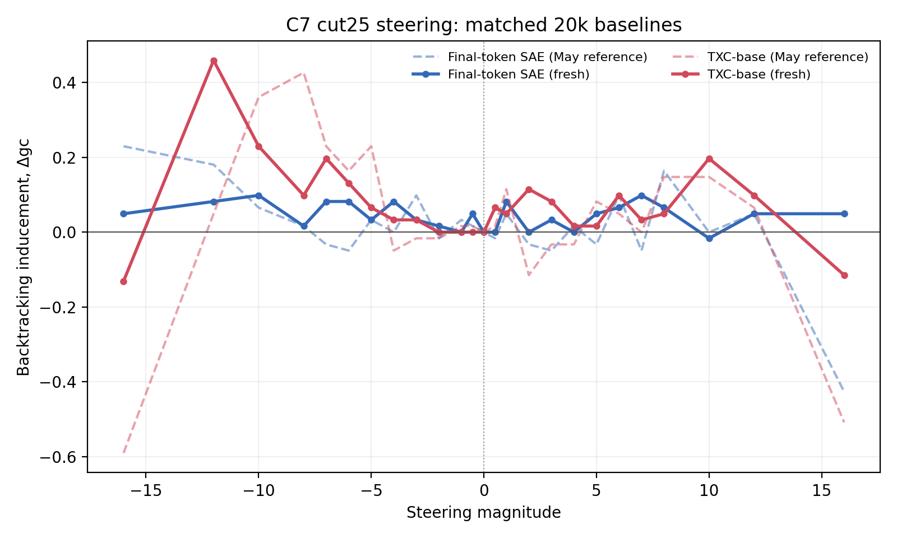

## Verdict

**The apparent TXC causal advantage over an ordinary SAE disappears when the
SAE is allowed to pool the same temporal window during feature selection.** A
fixed max pool over the last five SAE codes finds SAE feature 24530. Steering
with that feature reaches peak backtracking inducement **0.8361** at magnitude
`+16`, compared with **0.4590** at `-12` for TXC-base and **0.0984** at `-10`
for the final-token SAE control.

The moderate-dose result is less dramatic and more trustworthy. On each
feature's productive sign, max-pooled SAE averages **0.2049** over
`{+5, +6, +7, +8, +10, +12}`, while TXC-base averages **0.1967** over the
mirrored negative lobe. Their paired difference is only **+0.0082**, with a
question-bootstrap 95% interval of **[-0.0628, 0.0792]**. The defensible claim
is therefore *parity*, not that pooled SAE decisively beats TXC.

This control distinguishes the two hypotheses cleanly. Pooling changes only
which feature is selected; the eventual intervention is one native decoder
direction and uses the identical canonical hook and norm calibration for every
arm. The ordinary SAE dictionary already contains a strong causal direction.
TXC may still be a useful learned window compressor, but this run provides no
evidence that it learned a uniquely better steering latent.

## Fresh results

| Feature-selection arm | Feature | Selectivity | Peak delta-gc | Peak magnitude | Negative lobe | Positive lobe |
| --- | ---: | ---: | ---: | ---: | ---: | ---: |
| Final-token SAE | 10668 | 0.0553 | 0.0984 | -10 | 0.0656 | 0.0519 |
| Mean-pooled SAE | 31559 | 0.0424 | 0.6721 | -16 | 0.0984 | 0.0082 |
| **Max-pooled SAE** | **24530** | **0.0966** | **0.8361** | **+16** | -0.0027 | **0.2049** |
| TXC-base | 25630 | 0.1328 | 0.4590 | -12 | **0.1967** | 0.0820 |

The negative lobe is `{-12, -10, -8, -7, -6, -5}` and the positive lobe is
its mirror. Both were reported because the max-pooled decoder's productive
sign is opposite to TXC's. The negative lobe was chosen around the earlier TXC
result; the sign-aligned comparison is explicitly exploratory.

The raw decoder norms in the result files are *not* intervention norms. The
canonical evaluator L2-normalizes every selected direction to the same
`dom-base-union` reference norm before applying the signed magnitude. The
earlier version of this write-up incorrectly claimed otherwise.

All four arms completed **1,525/1,525** judge keys, for 6,100 successful rows
and no invalid labels. They use the same frozen Phase-1 continuations and an
exact no-op at magnitude zero. The zero continuation was judged independently
for each arm; one of 61 final-token SAE baseline labels differed from the
other arms, and each curve subtracts its own zero-magnitude judgment.

## Paired uncertainty

| Contrast | Mean difference | Question-bootstrap 95% interval |
| --- | ---: | ---: |
| Max-pooled positive lobe minus final-token SAE positive lobe | +0.1530 | [0.0847, 0.2268] |
| Max-pooled positive lobe minus TXC positive lobe | +0.1230 | [0.0628, 0.1858] |
| Max-pooled positive lobe minus TXC negative lobe | +0.0082 | [-0.0628, 0.0792] |
| Mean-pooled negative lobe minus final-token SAE negative lobe | +0.0328 | [-0.0410, 0.1120] |
| TXC negative lobe minus mean-pooled negative lobe | +0.0984 | [-0.0109, 0.2049] |

The first two contrasts compare the same signed magnitudes and show that max
pooling changes the SAE result materially. The third compares each arm's
productive sign and is the fairest effect-size summary, but it was specified
after observing that the max-pooled sign was positive.

## What the control isolates

- All SAE arms use the same 20k TopK checkpoint and its same 32,768 decoder
  directions. No pooling parameters are learned.
- The final-token arm selects a feature from the last activation only. The
  pooled arms take a fixed mean or max over the last five aligned SAE codes,
  matching the `T=5` evidence window supplied to TXC-base.
- Every arm scans the same-sized candidate dictionary with the same global
  positive-minus-negative activation statistic and ultimately steers with
  exactly one selected feature.
- Once selected, pooled SAE feature 24530 is just one ordinary SAE decoder
  direction. Pooling is not used in the hook and does not create a new
  intervention procedure.

Consequently, the result favors an **access and feature-selection** account of
the old gap. TXC-base exposed temporal evidence to its feature miner, whereas
the old SAE control exposed only the final position. It does not favor the
claim that TXC happened to receive a more powerful steering operation.

There is still something TXC-like in the successful recipe: one must aggregate
evidence across positions to discover the feature. The narrower remaining
question is whether a learned TXC is a more efficient or robust aggregator
than fixed pooling, not whether only TXC contains a causally useful direction.

## Positional audit of feature 24530

The stored detection artifacts allow a direct check of whether max pooling
merely exposed one especially useful earlier position. They do not support
that explanation.

| Position | Feature 24530 selectivity | Positive-selectivity rank | Position's top feature | PR-AUC at S=1 | PR-AUC at S=8 |
| --- | ---: | ---: | ---: | ---: | ---: |
| 0, oldest | 0.0242 | 10 | 31559 | 0.1301 | 0.1589 |
| 1 | 0.0225 | 11 | 2083 | 0.1273 | 0.1585 |
| 2 | 0.0250 | 4 | 9822 | 0.1281 | 0.1634 |
| 3 | 0.0226 | 14 | 31559 | 0.1312 | 0.1591 |
| 4, newest | 0.0368 | 5 | 10668 | 0.1292 | 0.1684 |
| **Max over positions** | **0.0966** | **1** | **24530** | **0.1536** | **0.1941** |

Feature 24530 is positively associated with backtracking at every position,
but no single-position miner chooses it. Its best fixed position is the newest
one, where selectivity is 0.0368; max pooling increases this to 0.0966, a
**2.63x** increase. Thus, the effect is not access to one fixed earlier
"better token."

The general detection result agrees. At `S=1` and the paper's `S=8` operating
point, max pooling beats *every* individual position in all five held-out
question folds. It also beats the best aggregate single-position score at
every tested feature budget, although foldwise dominance falls to 4/5 at
`S=16` and 3/5 at `S=32`.

The best current description is therefore **window-level presence detection**:
feature 24530 becomes useful when the miner can ask whether it fired anywhere
in the recent window. This may reflect temporal jitter, where the relevant
event lands at different relative positions in different examples, or repeated
weak evidence within each example. The stored summaries do not contain the
per-example feature activations needed to distinguish those two mechanisms.
That argmax-position histogram is the one remaining positional check.

## High-dose caveat

The two largest pooled peaks occur at the edge of the 25-point search grid.
At max-pool `+16`, only 12/61 continuations receive zero backtracking events;
38 receive one, 10 receive two, and one receives three. At mean-pool `-16`,
32 receive zero, 11 one, 14 two, and four three. Judge notes include some
confused or repetitive continuations at these doses, so neither extreme peak
should be read as clean behavioral control.

The max-pooled result is not solely an edge spike: its delta-gc rises from
0.1148 at `+5` to 0.1311 at `+8`, 0.3279 at `+10`, and 0.5410 at `+12`, and
the full positive-lobe interval excludes zero. Mean pooling is less convincing:
its moderate negative-lobe interval includes zero and most of its apparent win
comes from `-16`.

## Comparison with the May reference

| Architecture | Fresh peak | May peak | Fresh lobe mean | May lobe mean |
| --- | ---: | ---: | ---: | ---: |
| Final-token SAE | 0.0984 at -10 | 0.2295 at -16 | 0.0656 | 0.0355 |
| TXC-base | 0.4590 at -12 | 0.4262 at -8 | 0.1967 | 0.2432 |

The isolated SAE peak at magnitude -16 does not reproduce, so comparing only
the two maximized values overstates historical stability. The more meaningful
pattern is the negative lobe from -12 through -5: TXC beats the SAE at all six
grid points in the fresh run, and its lobe mean is directionally consistent
with May. The exact TXC optimum moves from -8 to -12, which is unsurprising for
a 61-question judged cohort but means the peak magnitude is not stable.

The pooled arms are new and have no May reference. Their purpose is to test
the previously missing capacity-matched temporal SAE control.

## The published 300k TXC reference

This experiment deliberately uses matched 20k checkpoints. It must not be
described as a direct rerun of the stronger paper-scale cell. The exact
durable Hugging Face reference for that result is the
[seed-42 published evaluation](https://huggingface.co/datasets/dmanningcoe/temp-xc-reviewer-results/blob/main/reviewer_seed_audit_2026-07-27/c7_headline/seed42_published_eval.json):

- architecture `txc_base`, T=5, seed 42, 300,000 steps;
- train key `8787f8fe527218ad` and eval key `3979ceaa4ecfefe4`;
- peak \(\Delta gc=0.540984\) at magnitude -12;
- PR-AUC 0.249917 at S=32.

That HF object preserves metrics and provenance, not model weights. A public
inventory of `han1823123123/temp-bench-models` contains no 300k checkpoint,
and the direct train-key path returns HTTP 404. The two other C7 300k TXC keys
in `origin/300k-tfa` are likewise absent from the public checkpoint store:
`6ae8db21b1bba495` for the earlier TXC-base cell and `4bf2edb494878ac1`
for TXC-pro. Recent training does not repair this gap: train key
`26e69fdc60452c27` is a 300k **Stacked SAE**, and the recent
`reviewer-btk-tsae-300k` RunPod lane is a **T-SAE**, not a TXC.

There is one unresolved recovery lead. The stopped RunPod
`reviewer-headline-multiseed` (`2rj9rjw1i2m3tc`) was restarted after the
public HF snapshot and exited on 2026-07-31 with a persistent 300 GB
`/workspace` volume. Its name and timing are consistent with the seed-1/2
300k TXC top-up. No corresponding public HF file, train key, completed-result
receipt, or git record was found, so it must not yet be cited as a completed
checkpoint. The volume should be inspected before deciding to retrain.

Consequently, the present negative supports the statement that the 20k TXC
causal advantage is recoverable by a fixed pooled SAE. Testing whether that
remains true against the 300k headline TXC requires recovering or retraining
the 300k weights; substituting the public 20--30k checkpoints would not answer
that question.

## Protocol and checks

- Frozen canonical C7 implementation at commit `1c213513f`.
- Seed 42 checkpoints trained for exactly 20,000 steps: TopK SAE train key
  `f437e623fabc37ec`; TXC-base train key `08fe3af07682fab4`.
- Same 61-question Phase-1 cohort for all four arms: 31 truly wrong and 30
  originally correct examples.
- Cut-and-continue at 25% of the original reasoning trace, with at most 1,024
  new tokens and the full canonical 25-magnitude grid.
- Feature selection uses the canonical positive-minus-negative activation
  statistic. Pooled arms add only a fixed five-position reduction around the
  frozen SAE encoder. Generation, judging, direction normalization, and
  delta-gc computation delegate directly to the frozen reference implementation.
- The exact zero-hook no-op, checkpoint metadata, cohort composition, and live
  judge call were all gated before generation.
- No failed judge labels or API errors were observed. Raw judge outputs, result
  files, preflights, paired audit, plot, and run log are stored locally.

## Interpretation and next decision

This experiment overturns the strongest version of the backtracking sign of
life. TXC-base still has a robust causal effect, but fixed max pooling over an
ordinary SAE finds an equally robust causal feature and a larger high-dose
effect. Backtracking therefore does not currently establish a uniquely useful
TXC representation.

The next experiment should not be another large architecture sweep. A useful
adversarial check would freeze the pooling rules and signed moderate-dose
lobes, repeat feature mining on fresh checkpoint seeds, and score
backtracking-specificity, correctness, repetition, and entropy together. It
should include TXC-pro, which still beat every pooled SAE in the detection
benchmark and was not steered here. Until that replication, this is one
checkpoint seed, one judged cohort, and a post-hoc sign-aligned comparison.

## Compute and artifacts

- Original final-token SAE/TXC steering: estimated **$3.83**.
- Detection pooling screen: estimated **$0.76**.
- New pooled-SAE generation and judging: 4,402 H100 seconds at $2.99/hour,
  estimated **$3.66**.
- Artifact-recovery restart: 14,114 idle H100 seconds, estimated **$11.72**.
  The science run had auto-stopped, but the restarted pod remained billable
  while a file-transfer permission was pending. No training or judging ran
  during this interval.
- Total backtracking pooling and steering compute: estimated **$19.97**.
- Adding the prior Fourier run's conservative **$37.00** ledger gives
  **$56.97**, approximately **$6.97 over the original $50 cumulative cap**.
  This overrun is an operational failure and is recorded explicitly.
- API judge cost is not available from the runner and is excluded.
- Compact machine-readable results: `results/fresh_25mag_seed42/summary.json`.
- Paired bootstrap audit: `results/fresh_25mag_seed42/paired_audit.json`.
- Feature-24530 positional audit:
  `results/fresh_25mag_seed42/positional_feature_24530.json`.
- Compressed raw judgments:
  `results/fresh_25mag_seed42/judge_outputs.jsonl.gz`.
- Checkpoint and runner provenance: `results/fresh_25mag_seed42/provenance.json`.
- Spend record: `results/fresh_25mag_seed42/spend.json`.
