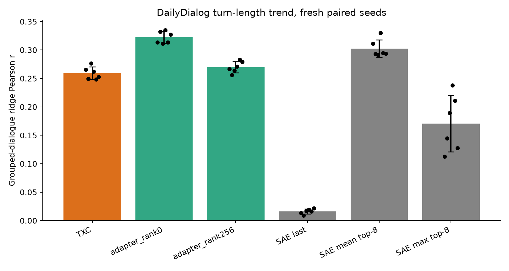

## Decision

**Stop treating the TXC as a general-purpose/default temporal dictionary.**

The strongest natural-language survivor, DailyDialog turn-length trend, was
real and reproducible: the fresh six-seed TXC mean was (r=0.2592), close to
the earlier (r\approx0.25). But the result was not TXC-specific. A fixed
top-8 mean of ordinary SAE codes scored (r=0.3023), and beat TXC on all six
fresh seeds. The frozen rank-256 SAE-trajectory control scored (r=0.2699).
The paired TXC-minus-control mean was (-0.0107), with bootstrap 95% interval
([-0.0233, 0.0014]), satisfying the preregistered non-inferiority stop rule
by a wide margin.

This supports conclusion (a) from the sprint card. It does **not** prove that
TXCs are universally useless. A compact online-summary niche and explicitly
non-ambient tasks remain open. It does mean that positive task recovery from
a contextual token window is no longer enough: any future TXC claim must
first beat aggregation of an ordinary SAE trajectory.

## Frozen experiment

- Task: DailyDialog turn-length trend, `dial_real_ttrend_gpt2_l7`.
- Substrate: GPT-2 hidden state 7; 4,111 sequences of 128 tokens.
- Window: 32 tokens; dictionary width 2,048; maximum output support 8.
- Fresh paired seeds: 9 through 14.
- Canonical models: 8k-step BatchTopK SAE and 8k-step post-window BatchTopK
  TXC.
- Primary control fixed before dispatch: rank-256 cross-feature temporal
  adapter over the ordinary SAE trajectory, with a flexible low-rank
  position-specific decoder, trained for 8k steps after the SAE.
- Other controls: per-feature rank-0 adapter, last-token SAE, top-8 mean and
  max pools, untrained uniform-pooling initialization, untrained TXC, and
  anchor-fixed history reversal.
- Headline metric: trace-grouped ridge Pearson (r), with 8,192 requested
  windows per half and the same frozen ridge grid as the earlier result.

The source was frozen at commit
`5ba43728a15b4e4c166798f9587cac97c979e998` before the remote result existed.
See `CARD.md` for the decision rule and `results/results_receipt.json` for the
artifact hashes.

## Results

| Seed | TXC | SAE last | SAE mean top-8 | SAE max top-8 | Rank-0 | Rank-256 primary |
| ---: | ---: | ---: | ---: | ---: | ---: | ---: |
| 9 | 0.2654 | 0.0134 | 0.3115 | 0.1127 | 0.3136 | 0.2665 |
| 10 | 0.2496 | 0.0088 | 0.2930 | 0.1449 | 0.3319 | 0.2559 |
| 11 | 0.2767 | 0.0173 | 0.2912 | 0.1896 | 0.3114 | 0.2640 |
| 12 | 0.2624 | 0.0197 | 0.3298 | 0.2377 | 0.3351 | 0.2710 |
| 13 | 0.2484 | 0.0161 | 0.2946 | 0.2106 | 0.3133 | 0.2829 |
| 14 | 0.2527 | 0.0217 | 0.2934 | 0.1278 | 0.3273 | 0.2792 |
| **Mean** | **0.2592** | **0.0162** | **0.3023** | **0.1706** | **0.3221** | **0.2699** |

The formal comparison was TXC versus the rank-256 primary control, not a
post-hoc choice of the best arm:

- Mean paired (r_{TXC}-r_{rank256}=-0.0107).
- Paired bootstrap 95% interval: ([-0.0233, 0.0014]).
- Frozen non-inferiority margin: upper endpoint at most (+0.03).
- Realized support: TXC (L_0=7.915), adapter (L_0=8.000); gap 0.085.
- Verdict emitted by the frozen analysis: `STOP_GENERAL_TXC`.

The simpler controls make the mechanism clearer:

- Fixed SAE mean pooling beats TXC by 0.0430 mean (r), and wins on every
  seed. It has no second learned temporal stage.
- The adapter's “untrained” initialization is uniform per-feature temporal
  pooling, not a random representation. It already scores (r=0.3015).
- The rank-0 model learns only per-feature temporal weights and reaches
  (r=0.3221), the best arm.
- The more flexible rank-256 stage decreases recovery relative to its
  uniform-pooling initialization, despite healthy reconstruction. The task
  does not need cross-feature temporal machinery.
- Last-token SAE recovery remains near zero. The missing ingredient in the
  old SAE comparison was access to the SAE *trajectory*, not a TXC-specific
  representation.

## Health checks

- The TXC result replicated on all seeds and strongly beat its untrained
  control: mean (r=0.2592) versus (0.0076). This is not a collapsed assay.
- TXC normalized MSE was 0.299–0.307, with mean realized (L_0=7.915).
- Base SAE normalized MSE was 0.121–0.124, with per-token (L_0\approx4.25)
  to 4.44.
- Every recorded adapter checkpoint had exactly eight active outputs and zero
  dead features. Rank-256 reconstruction loss settled around 32–33 by 4–6k
  steps. Rank-0 had reproducible hard-minibatch loss spikes but always
  recovered and remained finite.
- The canonical and adapter loss traces are preserved in `logs/run.log`;
  final seed receipts are under `results/seeds/`.
- The RunPod supervisor exited with code 0 and automatically stopped the pod.
  Including a short artifact-export restart and the earlier mistaken C7
  dispatch, estimated compute spend was **$12.13**, below the $50 cap.

## What this says about the theory

The DailyDialog “temporal” signal is recoverable by aggregating features that
already exist in contextualized token states. Transformer attention has put
history into each residual-stream vector; an SAE can expose those local
features, and a cheap consumer can integrate them over the window. The TXC's
apparent advantage over a last-token SAE therefore measured *window access*,
not evidence for uniquely temporal atoms.

This fits the broader graveyard:

- **Current-state sufficiency:** language-model activations are already
  contextual, so many history-dependent labels become ambient at individual
  tokens.
- **Easy aggregation:** when the target is a slow statistic, pooling ordinary
  sparse codes is enough. Joint window reconstruction is unnecessary.
- **Rate-distortion mismatch:** a TXC must reconstruct (T\times d) values
  through one sparse code. It spends capacity on token detail while competing
  with a per-token SAE that preserves much more intermediate information.
- **Sample complexity:** this TXC has roughly 100.7M temporal parameters. The
  rank-256 control has roughly 24.3M temporal parameters after a roughly 3.15M
  SAE stage, and the winning fixed mean pool adds no parameters at all.

The positive result was thus a real temporal-pooling result, but not a
learned-temporal-dictionary result.

## Limitations and surviving niches

- This is one corpus, surface-statistic target, model, layer, and (T=32),
  not a theorem over all temporal processes.
- The learned adapter saw all 4,111 sequences directly, while the canonical
  fixed buffers draw 4,096 sequences with replacement and never refill. This
  can favor learned adapters. It does not explain the fixed-mean result,
  which uses the same canonical base SAE and no additional training.
- Seeds vary initialization and the RMS-estimation subset, not corpora or
  tasks. Six-seed bootstrap uncertainty is conditional on this benchmark.
- The learned adapters receive 8k SAE steps plus 8k adapter steps, whereas
  TXC receives one 8k stage. This is a practical architecture comparison, not
  equal optimizer budget. Again, the fixed mean control avoids this objection.
- TXC reversal lowers recovery by 0.035 mean (r), but reversal also changes
  realized support from about 7.9 to 12.7–70.2 across seeds. That diagnostic
  is support-confounded and should not be interpreted as clean causal order
  sensitivity.
- A pooled SAE retains 32 intermediate code vectors. TXC may still be useful
  where a single sparse online state, fixed memory, or streaming latency is a
  hard requirement.
- Genuinely non-ambient tasks whose target depends on joint information not
  present in any contextual token may remain viable, especially if they also
  defeat fixed and learned SAE-trajectory pooling.

## Recommendation

Do not spend more compute searching broadly for tasks on which a vanilla TXC
beats a last-token SAE. Deprioritize the general TXC programme.

If the architecture is revisited, require all of the following before calling
anything a sign of life:

- a pooled and learned ordinary-SAE trajectory baseline;
- matched realized support and an explicit online/intermediate-memory budget;
- fresh paired seeds and grouped data splits;
- a task demonstrating information absent from individual contextual states;
- a material held-out advantage, not merely nonzero recovery.

The complete numerical artifacts are in `results/`, provenance and excluded
tensor hashes are in `provenance/`, and the frozen implementation remains in
this dedicated `decision_sprint/` folder.
