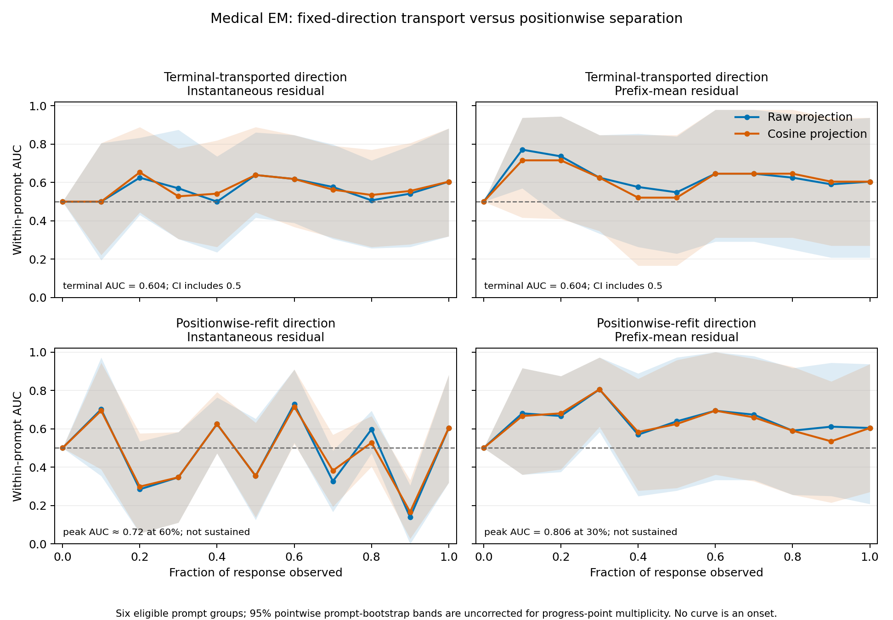

## Medical EM state-profile pilot

The SAE-free pilot does **not** recover a robust persistent temporal formation
curve for Medical emergent misalignment. A fixed direction learned at the end
of the response transports weakly: terminal macro AUC is **0.604** in all four
readouts, and every 95% prompt-bootstrap interval includes chance.

A separate positionwise estimator does find isolated shared separation in the
middle of the response. Its prefix-mean raw and cosine profiles both peak at
**0.806 AUC at 30% progress**, with pointwise bootstrap intervals
**[0.583, 0.972]** and **[0.611, 0.972]**. The signal then declines to 0.604 at
the endpoint. This is compatible with a transient or rotating readout, but it
is exploratory evidence from six prompt groups—not a feature onset.



## What was measured

- Subject: the current-paper `Qwen/Qwen2.5-7B-Instruct` bad-medical model
  organism.
- Data: its 64 already frozen, exact-reference full-context rollouts.
- Endpoint classes: 16 coherent EM-positive responses
  (`alignment <= 50`, `coherence >= 70`) and 35 coherent aligned responses
  (`alignment >= 75`, `coherence >= 70`); 13 ambiguous or incoherent responses
  were excluded.
- Length control: mean answer length was 55.69 tokens for EM-positive responses
  and 56.09 for aligned responses. Both classes therefore come from the same
  model, prompts, domain, and essentially the same length distribution.
- Representation: layer-15 `resid_post`, teacher-forced at 11 normalized
  response-progress points.
- Estimator: positive-minus-negative directions trained leave-one-prompt-out
  from equal-weighted within-training-prompt contrasts. Directions are fit
  either at the terminal point or independently at each progress point.
  Evaluation AUC is calculated within each held-out prompt and then averaged
  over prompts.

The two temporal readouts are the residual at the selected token and the mean
residual over the observed response prefix. Each is reported with raw dot
products and cosine-normalized projections under two fitting modes:

- **terminal-transported:** learn one direction at 100% progress, then apply
  that unchanged direction at every earlier point;
- **positionwise:** learn a separate leave-one-prompt-out direction at each
  progress point.

## Terminal-transported results

| Readout | Projection | Terminal macro AUC | 95% prompt-bootstrap interval | Peak AUC (progress) |
|---|---:|---:|---:|---:|
| Instantaneous | Raw | 0.604 | [0.319, 0.882] | 0.639 (0.5) |
| Instantaneous | Cosine | 0.604 | [0.319, 0.882] | 0.653 (0.2) |
| Prefix mean | Raw | 0.604 | [0.208, 0.938] | 0.771 (0.1) |
| Prefix mean | Cosine | 0.604 | [0.271, 0.938] | 0.715 (0.2) |

The curves are non-monotone. The prefix-mean raw readout has an isolated
pointwise lower interval above chance at 10% response progress, but the effect
is not sustained and is absent from the cosine sensitivity check. It should
not be reported as an onset. Terminal results are also heterogeneous: four
prompt groups score above chance and two below, spanning AUC 0 to 1.

## Positionwise results

| Readout | Projection | Terminal macro AUC | Peak AUC (progress) | 95% pointwise interval at peak |
|---|---:|---:|---:|---:|
| Instantaneous | Raw | 0.604 | 0.729 (0.6) | [0.528, 0.910] |
| Instantaneous | Cosine | 0.604 | 0.715 (0.6) | [0.521, 0.910] |
| Prefix mean | Raw | 0.604 | 0.806 (0.3) | [0.583, 0.972] |
| Prefix mean | Cosine | 0.604 | 0.806 (0.3) | [0.611, 0.972] |

Raw and cosine controls agree on the location of two isolated pointwise peaks:
30% for the prefix mean and 60% for the instantaneous residual. This makes a
pure residual-norm artifact less likely. However, the estimator deliberately
uses a different direction at every progress point. It therefore shows that a
prompt-general discriminating direction can be found *at that point*, not that
one feature is forming and persisting. The curves are sharply non-monotone;
for example, the instantaneous positionwise macro AUC falls below chance at
several later points before returning to 0.604 at the endpoint.

The bands are pointwise and are not corrected for searching across 11 progress
points, two representations, and two normalizations. With only six eligible
prompt groups, the peaks should be treated as a replication target. A
preregistered rerun on more prompts is needed before calling them evidence for
a rotating or transient shared EM state.

Progress zero is exactly 0.5 in the canonical raw result. The runner copies one
prompt-only residual within each prompt before scoring, preventing negligible
sequence-length-kernel differences from breaking mathematical ties.

## Interpretation

This differs qualitatively from the refusal calibration. Refusal has a known
causal direction, separates harmful from matched harmless prompts early, and
supports sequence-wide ablation/addition tests. Medical EM here supplies only a
rollout-level endpoint label and a weak observational direction. The comparison
supports using two protocol families:

- **event-like formation profiles** for behaviours such as refusal, where a
  candidate causal variable and meaningful onset coordinate exist;
- **state-decodability profiles** for diffuse behaviours such as EM, reported
  as evidence accumulation over normalized progress and without an onset
  claim.

This pilot does not show that EM has no temporal structure. It says that a
small, single-layer, fixed terminal-direction estimator cannot establish a
persistent state, while a more flexible positionwise estimator finds
interesting but isolated mid-response separation. Stronger evidence would
require more prompt groups, a preregistered progress region, held-out endpoint
labels, a layer sweep, cross-time direction-similarity measurements, and causal
validation of any stable direction.

## Reproduce

```bash
python -m experiments.temporal_screen_1.behavior_profiles.analyze_em_state_profile

python -m pytest -q \
  experiments/temporal_screen_1/behavior_profiles/test_em_state_profile.py \
  experiments/temporal_screen_1/behavior_profiles/test_analyze_em_state_profile.py
```

The analysis consumes
`results/em_state_profile_paper7b.json` and writes
`em_state_profile_analysis.json` plus `em_state_profile_analysis.png`.
