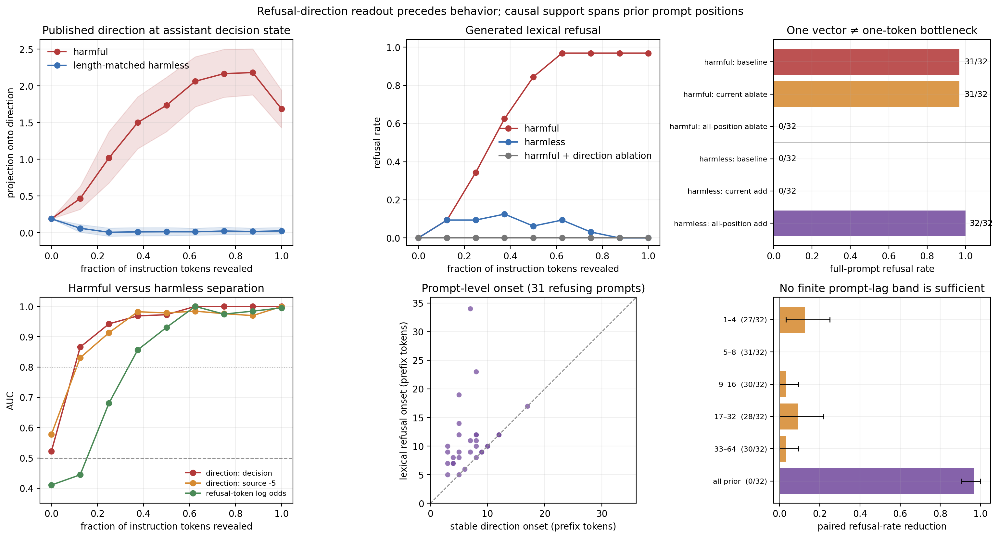

## Refusal prefix profile: result

The clean result is that the published refusal direction becomes decodable
*before or at* the point at which refusal becomes visible in generated text.
But the new spatial control adds an important qualification: this direction
is a sequence-wide causal effector, not a one-token causal bottleneck. Refusal
is therefore a useful positive control for separating *feature formation* from
*where the formed feature is causally used*.

The experiment used 32 held-out harmful instructions and 32 one-to-one
length-matched harmless instructions with Llama-3-8B-Instruct. It revealed
nine literal token prefixes from 0% to 100%, measured the published Arditi
direction at layer 12 before generation, and greedily generated up to 48
tokens. The exact Arditi directional ablation and direction addition were the
causal controls. A second control applied the same interventions only to the
current autoregressive token. A final all-layer ablation localized prompt-side
support into rendered-token lag bands.



## What turns on, and when?

The decision-position direction is already a strong harmful-versus-harmless
classifier after only 12.5% of the instruction is revealed: AUC is 0.866,
compared with 0.444 for the published response-start refusal-token log odds.
At this point both cohorts have the same observed lexical refusal rate,
3/32. The direction AUC rises to 0.942 at 25%; refusal-token-log-odds AUC does
not exceed 0.8 until 37.5%.

The mean harmful decision-position projection rises from 0.190 at the empty
prefix to 0.466 at 12.5%, 1.019 at 25%, and 1.501 at 37.5%. The matched
harmless means are 0.189, 0.061, 0.006, and 0.011. Harmful lexical refusal
rises from 0/32 at the empty prefix to 3/32, 11/32, 20/32, 27/32, and 31/32
at 12.5%, 25%, 37.5%, 50%, and 62.5%, then remains at 31/32.

For a prompt-level estimate, define direction formation as the first non-empty
prefix from which the decision-position projection remains above the
same-fraction 95th percentile of the harmless cohort. This threshold is
deliberately neutral-calibrated and requires persistence, rather than treating
a single noisy crossing as onset.

- All 32 harmful prompts have a stable direction onset.
- 31/32 eventually produce a lexical refusal; no prompt switches back after
  its first refusal.
- Among those 31, direction formation is at or before lexical refusal for
  31/31, and strictly before it for 20/31.
- The median refusal-minus-direction lag is 0.125 of the prompt, or 3 prompt
  tokens; the means are 0.141 and 4.10 tokens.
- Median stable direction onset is 7 revealed prompt tokens. Median lexical
  refusal onset is 10 revealed prompt tokens.

This supports a narrow temporal claim: under this reveal intervention, a
readout along the known refusal direction appears before lexical refusal. It
does **not** say that refusal has a universal seven-token horizon; the onset
varies with where harmful information occurs in each instruction. Nor does
decodability at the assistant decision token imply that this token is the
causal site.

## Spatial causal check

The all-position and current-token controls give opposite answers.

- Full harmful prompts refuse in 31/32 baseline generations and 0/32 after
  all-position, all-layer ablation of the published direction.
- The same harmful prompts still refuse in 31/32 generations when the
  direction is ablated only at the current autoregressive token. The
  intervention drives the measured decision-token projection to approximately
  zero, but leaves the refusal-token log odds at 9.00 and behavior unchanged.
- Full harmless prompts refuse in 0/32 baseline generations and 32/32 after
  adding the single published direction at every sequence position at its
  selected layer.
- The same harmless prompts refuse in 0/32 generations when the direction is
  added only at the current token. The intervention makes the measured
  decision-token projection large (mean 3.64), but refusal-token log odds
  remain -9.42 and behavior is unchanged.
- Ablated harmful prompts produce 0/32 lexical refusals at every reveal
  fraction under the all-position intervention.

This resolves the apparent ambiguity in “single direction.” One vector
specifies a one-dimensional *feature axis*; it does not specify a single
sequence position. The directional subspace is necessary and sufficient under
the published sequence-wide interventions, but its value at the current token
is neither necessary nor sufficient under the matched spatial controls. A
strong current-token projection can be a readout of a computation whose causal
support remains at earlier positions.

The cache matters to this interpretation. On the initial prompt pass, the
current-token control touches only the final prompt/assistant-decision token.
On each subsequent cached generation step it touches the one current input
token, but previously computed prompt keys and values remain intact. Attention
can therefore retrieve refusal-relevant state from earlier prompt positions
and reconstruct or use it even while the current residual direction is
repeatedly removed. The all-position ablation, in contrast, also changes the
prompt states from which those cached keys and values are formed.

This rejects an *exclusive current-token bottleneck*. The prompt-lag control
below tests whether causal support instead localizes to one contiguous region.

## Prompt-lag localization

The final control ablates the direction at prior prompt positions in absolute
lag bands, at every layer and in attention/MLP outputs. Lag zero is the final
rendered assistant-decision token and is never touched. Crucially, the hook
returns without intervention on the one-token cached generation forwards:
generated-token states are untouched. The control therefore asks which
directional support already written into prompt states, and hence prompt
keys/values, is needed later.

Effects are paired to each prompt's baseline generation. Positive values mean
the band ablation reduced refusal.

| Rendered prompt lag | Refusal | Paired reduction (95% bootstrap CI) | Mean log-odds reduction (95% CI) |
|---|---:|---:|---:|
| 1–4 | 27/32 | 0.125 [0.031, 0.250] | 4.02 [2.92, 5.19] |
| 5–8 | 31/32 | 0.000 [0.000, 0.000] | 0.45 [0.17, 0.80] |
| 9–16 | 30/32 | 0.031 [0.000, 0.094] | 1.74 [0.80, 2.95] |
| 17–32 | 28/32 | 0.094 [0.000, 0.219] | 1.88 [0.69, 3.38] |
| 33–64 | 30/32 | 0.031 [0.000, 0.094] | 0.39 [0.03, 0.96] |
| All prior positions | 0/32 | 0.969 [0.906, 1.000] | 17.32 [15.74, 18.92] |

No finite band is sufficient to eliminate refusal. The largest binary effect
is only 4/32 baseline refusals for lags 1–4, while ablating *all* prior prompt
positions removes all 31 baseline refusals. Even the sum of the five marginal
rate reductions is 0.281, far below the 0.969 all-prior effect. The smoother
log-odds score moves in every band, including lags 5–8 where no generation
crosses the lexical decision boundary.

This is strong evidence against a uniquely localized contiguous lag band.
The natural remaining explanations are redundant support across positions,
or non-additive/conjunctive interactions in which other positions compensate
for any one finite ablation but fail when all prior support is removed. The
experiment does not distinguish those explanations, and the band effects
should not be added as if they were independent.

The lag coordinate is easy to misread. It is relative to the final token of
the *rendered chat prompt*, not the end of the raw instruction. The bands
therefore include assistant-header and other chat-template tokens as well as
instruction tokens; lags 1–4 in particular cannot be called “the final four
instruction tokens.” For short prompts, high-lag bands can also extend into
left padding. This is causal spatial localization in the rendered sequence,
not yet semantic localization in the task text.

## Important limitations

- A token prefix is an intervention on *semantics*, not a pure clock. It can
  cut a word or proposition before the token that makes the request harmful.
  The curve therefore measures information revealed under literal
  left-prefix truncation. The result file intentionally stores hashes rather
  than prompt text, so semantic-boundary alignment cannot be recovered from
  this artifact alone.
- The 0% condition still contains the fixed Llama-3 user/assistant chat
  template. Its nonzero projection (about 0.19 at the decision position) is a
  template offset, not task evidence. Harmful and harmless inputs are
  semantically identical there; the nominal 0%-bin AUC values should be
  treated as 0.5 calibration, with departures caused by batching,
  left-padding, and finite-precision tie-breaking. Two distinct empty-prefix
  response hashes are present despite identical rendered inputs, so this is a
  real implementation artifact.
- Partial harmless prompts sometimes trigger the lexical classifier (up to
  4/32), even though full harmless prompts never do. This is direct evidence
  that truncation can create unnatural or ambiguous inputs, and is why the
  harmless curve is essential.
- Length matching is good for 28/32 pairs (within five tokens) but has four
  outliers, including absolute gaps of 30 and 35 tokens. Excluding those four
  leaves the early result essentially unchanged: decision-direction AUC is
  0.857 at 12.5% and 0.932 at 25%.
- The prompt-level neutral threshold is estimated from only 32 harmless
  examples. It is a transparent descriptive onset rule, not a pre-registered
  population cutoff.
- This is one model, one published direction, deterministic greedy decoding,
  and a high-precision but incomplete lexical refusal classifier. It locates
  prompt-side formation, not a rollout-internal onset after generation begins.
- The current-token control changes the last prefill position and each
  one-token cached decoding step, not previously cached prompt states. Its
  failure localizes causal support away from an exclusive current-token
  bottleneck; it is not a complete spatial localization experiment.
- Prompt-lag confidence intervals are paired percentile-bootstrap summaries
  of only 32 prompts. They are descriptive, uncorrected for testing several
  bands, and do not account for the fact that band effects can interact.

## Reproduction

Run:

```bash
python experiments/temporal_screen_1/behavior_profiles/analyze_refusal_profile.py
```

This regenerates `refusal_analysis.json` and `refusal_analysis.png` from
`results/refusal_prefix_profile.json`.
