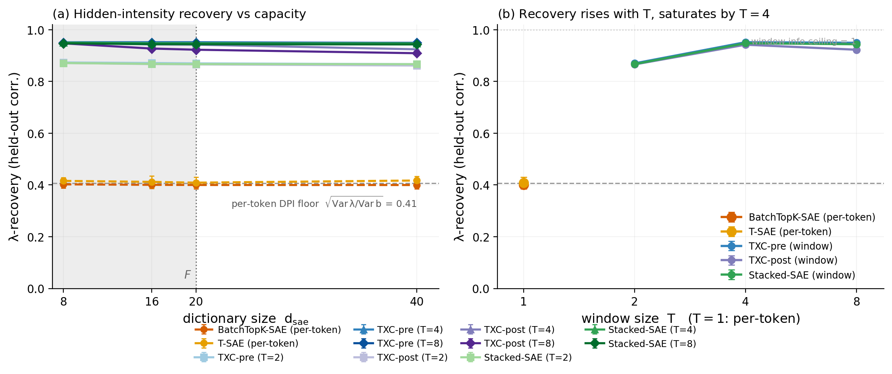
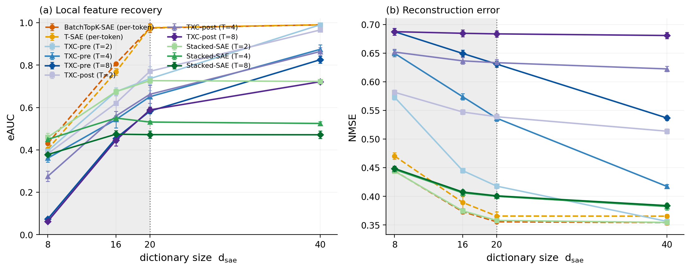
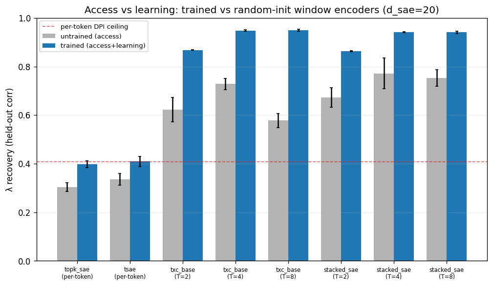

# Research record — backtracking synthetic benchmark (architecture test)

**Verdict: POSITIVE.** On the self-exciting (Hawkes-style) backtracking mirror,
**window/temporal architectures recover the hidden order-sensitive intensity
`λ` far better than per-token SAEs — robustly across the scarce capacity regime
— while per-token archs sit exactly at their provable information floor.** This
is stage 6 of autoresearch investigation #1; it closes the loop
*measured real property → validated synthetic mirror → architecture test*.

Preregistration / spec (frozen before running):
[`backtracking_bench_spec.md`](bench_spec.md). Gating:
[`backtracking_gating_stats.json`](results/backtracking_gating_stats.json). Built to
[`synthetic_benchmark_guidance.md`](../synthetic_benchmark_guidance.md) and the
loop's [`autoresearch_spec.md`](../autoresearch_spec.md).

> **Headline.** A per-token SAE *provably* cannot read the self-exciting
> intensity beyond `corr = √(Var λ/Var b) ≈ 0.41` (data-processing inequality);
> trained per-token archs land at **0.40**, flat across every dictionary size.
> A window crosscoder, which sees the event *history* that sets `λ`, recovers it
> at **0.87 (T=2) → 0.95 (T≥4)** — and this holds even at `d_sae = 8 < F = 20`,
> so it is not an over-completeness artifact. The same window archs *trade away*
> local-feature recovery (eAUC) and tight reconstruction to do it: a clean
> global(temporal)-vs-local(per-token) architectural specialization.

> **This record is auto-generated from the canonical leaderboard.** Every table
> and figure below is (re)built by `-m autoresearch.backtracking.render_figs`,
> which reads `results/leaderboard.jsonl` — the single source of truth — so the
> numbers cannot drift from the runs. The prose is the human narrative.

**Key numbers** (auto-filled from the leaderboard):

<!-- BEGIN AUTO:headline -->
- **Per-token DPI floor** (provable, computed from the generator): $\sqrt{Var\,\lambda/Var\,b}$ = **0.41**. Trained per-token SAEs land at **0.40** at d_sae=20, flat across all capacities.
- **Window recovery**: $\lambda$ = **0.87** (T=2) → **0.94** (T≥4) at d_sae=20; **0.95** even at d_sae=8 < F=20 (scarce regime).
- **Gap** (window T4 − per-token): **0.54**. Untrained window already reaches 0.73 (architectural access); training lifts it to 0.94.
<!-- END AUTO:headline -->

## 1. Setup

- **Data:** `toy_backtracking_selfexcite_d64` — the validated self-exciting
  mirror (`synthetic.py:self_exciting`). `λ_i = σ(a + Σ_{l=1..K} w_l·b_{i-l})`,
  `b_i ~ Bernoulli(λ_i)`; `K = 2` (held-out model-selected), `w = α·κ`,
  `κ = exp(-l/τ)`, `τ = 2`, `α = 3.06`, intercept tuned to base rate 0.12,
  trend = 0. Emission over `F = 20` orthonormal directions
  (`u_bt` dominant + 19 content, `n_c = 3`, `σ = 0`). `seq_len = 64`,
  `n_seqs = 4096`. The intrinsic ceilings of the *generated* data match the
  gating exactly (per-token 0.408, window full-history 0.985).
- **Grid (120 cells, 0 failures):** archs `{topk_sae, tsae}` (per-token, `T=1`)
  vs `{txc_base, stacked_sae}` (window, `T ∈ {2,4,8}`); `d_sae ∈ {8,16,20,40}`
  anchored on `F = 20` (scarce `{8,16,20}` + over-complete `{40}`); `k_pos = 1`;
  common tiled eval window `L = 32`; seeds `{1,2,42}`; 30k steps. Plus an
  **untrained-encoder control** (`n_steps = 0`) at `d_sae = 20`, all archs/`T`,
  3 seeds (24 cells). Everything through the canonical runner, code-version
  stamped, flock-safe parallel append.
- **Metrics:** `lambda_recovery` (headline) — held-out Pearson `corr` of a
  **linear** regression probe on per-tile codes predicting `λ` at each tile's
  leading edge (memorization-free: features = one tile's `d_sae` code, never
  concatenated); `eauc` (local feature-direction cosine recovery); `nmse`
  (tiled windowed reconstruction); `lambda_chance` (shuffle-label floor).

## 2. Headline result — `λ` recovery vs capacity

Trained `lambda_recovery` (mean over 3 seeds), by `d_sae` (`k_pos=1`):

<!-- BEGIN AUTO:lambda_frontier -->
| arch / T | d=8 | d=16 | d=20 | d=40 |
|---|---|---|---|---|
| TopK-SAE (per-token) | 0.401 | 0.399 | 0.398 | 0.397 |
| T-SAE (per-token) | 0.416 | 0.412 | 0.409 | 0.417 |
| **TXC (T=2)** | 0.870 | 0.830 | 0.868 | 0.858 |
| **TXC (T=4)** | 0.951 | 0.949 | 0.948 | 0.940 |
| **TXC (T=8)** | 0.950 | 0.949 | 0.949 | 0.947 |
| **Stacked-SAE (T=2)** | 0.869 | 0.865 | 0.863 | 0.862 |
| **Stacked-SAE (T=4)** | 0.947 | 0.943 | 0.942 | 0.941 |
| **Stacked-SAE (T=8)** | 0.947 | 0.941 | 0.941 | 0.938 |
<!-- END AUTO:lambda_frontier -->

- **Per-token is pinned at the DPI floor** (~0.40 ≈ 0.408) and **flat across all
  `d_sae`** — exactly the prediction: no dictionary size lets a per-token
  encoder see the history, so capacity is irrelevant.
- **Window recovers `λ` at 0.86–0.95**, ~2.3× the per-token floor, and the win
  **holds in the scarce regime** (`d_sae = 8`: txc T4 = 0.951). The realistic-
  regime gate passes — the advantage is architectural, not over-completeness.
- `lambda_chance` ≈ 0 for every cell (worst −0.13, sampling noise), so the
  recovery is real, not an inflated floor.



*Figure 1. **(a)** Hidden-intensity (λ) recovery vs dictionary size: per-token SAEs
(dashed) are pinned at the per-token DPI floor (≈0.41) and flat across capacity,
while window crosscoders (solid) recover λ at 0.86–0.95 — robustly into the
scarce regime `d_sae < F = 20` (shaded). **(b)** Recovery rises with window size
`T` and saturates by `T = 4` (per-token shown at `T = 1`). Error bars = ±1 s.d.
over 3 seeds.*

## 3. `λ` recovery rises with `T`, saturates by `T = 4`

At `d_sae = 20`: per-token (T=1) 0.40 → T=2 0.86 → T=4 0.94 → T=8 0.94. The
curve tracks the gating linear ceilings (0.41 / 0.91 / 0.99 / 0.99) and
**saturates by `T = 4`** — because `K = 2`, a tile of `T = 4` already contains
both relevant lags. `T = 8` confirms the plateau (no further gain), as the spec
anticipated (panel **(b)** of Figure 1 above).

## 4. The global-vs-local trade-off (eAUC, NMSE)

Window archs buy `λ` recovery by **spending capacity on temporal structure** at
the cost of local-feature recovery and reconstruction. The two recovery axes —
**local** (eAUC) vs **order-sensitive / temporal** (`λ`) — make the
specialization visible at a glance:


*Figure 2. The local-vs-temporal plane (one point per (arch, T) at the `d_sae = 20`
anchor; faint trail = `d_sae ∈ {8,16,20,40}`). Per-token SAEs (✕) sit low on the
`λ` axis — **local-feature specialists** (T-SAE reaches eAUC ≈ 1 yet `λ` ≈ 0.41);
window crosscoders (●/■) sit in the temporal-rich band — **temporal specialists**
(`λ` ≈ 0.95). Growing capacity (the trail) moves archs mostly rightward (more
eAUC), not up — the `λ` separation is architectural, not a capacity effect.*

eAUC (trained, `k_pos=1`), by `d_sae`:

<!-- BEGIN AUTO:eauc -->
| arch / T | d=8 | d=16 | d=20 | d=40 |
|---|---|---|---|---|
| TopK-SAE (per-token) | 0.426 | 0.523 | 0.471 | 0.444 |
| T-SAE (per-token) | 0.404 | 0.768 | 0.976 | 0.990 |
| TXC (T=2) | 0.375 | 0.660 | 0.778 | 0.763 |
| TXC (T=4) | 0.334 | 0.513 | 0.590 | 0.925 |
| TXC (T=8) | 0.080 | 0.462 | 0.582 | 0.870 |
| Stacked-SAE (T=2) | 0.439 | 0.409 | 0.416 | 0.422 |
| Stacked-SAE (T=4) | 0.383 | 0.383 | 0.402 | 0.406 |
| Stacked-SAE (T=8) | 0.363 | 0.354 | 0.374 | 0.393 |
<!-- END AUTO:eauc -->

- **tsae recovers the local feature directions almost perfectly** (eAUC 0.98 at
  `d_sae = F`) while being `λ`-blind — the per-token "local" specialist.
- The **window crosscoder trails on local recovery in the scarce regime** (txc
  T8 at `d_sae = 8`: eAUC 0.08) yet still gets `λ = 0.95` — a striking
  dissociation: the *code* linearly carries the event history even when no
  single *decoder atom* aligns to `u_bt`. eAUC recovers as `d_sae` grows (0.93
  at `d_sae = 40`), i.e. once it can afford both.
- **NMSE:** per-token reconstructs tighter (≈0.39 at `d_sae = 20`) than window
  (txc T8 ≈ 0.63) — the reconstruction cost of temporal coding. All archs *do*
  reconstruct (NMSE 0.38–0.69), so the capability-vs-artifact gate passes: the
  window recovers `λ` while still representing the data, not instead of it.



*Figure 3. The global-vs-local trade-off, resolved by capacity. **(a)** Local feature recovery (eAUC):
per-token T-SAE → 0.99 at `d_sae = F`, while window archs trail in the scarce
regime (yet still recover λ). **(b)** Reconstruction NMSE: window archs pay a
higher reconstruction cost (temporal coding) but still represent the data.*

## 5. Untrained-encoder control — access vs learning

At `d_sae = 20`, trained vs random-init (`n_steps = 0`) `lambda_recovery`:

<!-- BEGIN AUTO:untrained -->
| arch / T | untrained (access) | trained (access+learning) |
|---|---|---|
| TopK-SAE (per-token) | 0.304 ±0.019 | 0.398 ±0.015 |
| T-SAE (per-token) | 0.336 ±0.025 | 0.409 ±0.021 |
| TXC (T=2) | 0.622 ±0.051 | 0.868 ±0.001 |
| TXC (T=4) | 0.728 ±0.023 | 0.948 ±0.002 |
| TXC (T=8) | 0.578 ±0.029 | 0.949 ±0.004 |
| Stacked-SAE (T=2) | 0.673 ±0.040 | 0.863 ±0.002 |
| Stacked-SAE (T=4) | 0.772 ±0.063 | 0.942 ±0.001 |
| Stacked-SAE (T=8) | 0.753 ±0.034 | 0.941 ±0.005 |
<!-- END AUTO:untrained -->

The window advantage **does not vanish at random init** — a random window
projection already exposes the history linearly (access ≈ 0.62–0.77, well above
the per-token floor), because the architecture genuinely *has* the history. The
honest decomposition: the per-token→window gap is **architectural access**
(provable: per-token can't see history, window can), and **training sharpens the
linear exposure** by a further ~0.2 (0.73 → 0.95 at T=4). Per-token, by
contrast, barely moves with training (0.30 → 0.40) because it is capped at the
DPI floor regardless.



*Figure 4. Access vs learning (`d_sae = 20`, `k_pos = 1`). Random-init window
encoders (grey) already exceed the per-token DPI floor — architectural access to
the history — and training (colored) lifts them further; per-token archs gain
almost nothing from training (capped by the floor).*

## 6. Preregistered predictions (spec § 7)

- **P1 — per-token ≈ information ceiling:** ✅ 0.40 vs ceiling 0.408, flat in
  `d_sae`.
- **P2 — window rises with `T`, ~oracle by `T ≈ K`:** ✅ 0.86→0.95, saturates by
  `T = 4` (the code does linearly expose the history, as the logit-linear latent
  predicted).
- **P3 (headline) — window > per-token by the history margin:** ✅ gap ≈ 0.5,
  robust across `d_sae` and both window families.
- **P4 — per-token recovers `F` well, window trails locally:** ✅ tsae eAUC 0.98;
  window eAUC collapses in the scarce/large-`T` corner.
- **Possible negative (window fails to *linearly* expose history):** did not
  occur — but note the *eAUC dissociation* (§4): the window exposes `λ` in its
  code without atom-level `u_bt` alignment, a refinement of "represents the
  events."

## 7. Validity controls passed (spec § 3 / § 6)

- **Provable floor (not pattern-count budget):** per-token DPI ceiling 0.41,
  hit exactly — independent of `d_sae`/probe. The discriminating baseline is
  floored by information, not memorization (`K = 2` ⇒ only 4 history patterns,
  so the old `2^K` budget is moot; the DPI floor is the correct, stronger gate).
- **Memorization-free probe:** per-tile-as-example, features = one tile's
  `d_sae` code; `lambda_chance ≈ 0`.
- **Realistic regime:** the win holds at `d_sae ≤ F` (incl. `d_sae = 8`).
- **Untrained-encoder control:** run and reported (§5) — the advantage is part
  access (genuine, by architecture) + part learning; per-token gains nothing
  from training beyond its floor.
- **Capability-vs-artifact:** window archs reconstruct (NMSE finite) and recover
  features at adequate `d_sae` — they recover `λ` *and* represent the data.
- **Apples-to-apples:** identical `L = 32` tiling, equal `d_sae`/`k_pos` across
  archs, leak-free per-sequence split.
- **Sparsity robustness (`k_pos`, beyond the frozen grid):** a labeled extension
  re-ran the `d_sae = 20` anchor at `k_pos = 2` (24 cells). The per-token→window
  gap does **not** depend on the sparsity budget — the DPI floor is
  `k_pos`-independent (as it must be) — and only local `eAUC` shifts with
  `k_pos`. `λ`-recovery and eAUC at `k_pos ∈ {1, 2}` (`d_sae = 20`):

<!-- BEGIN AUTO:kpos -->
| arch / T | $\lambda$ @ $k_{pos}{=}1$ | $\lambda$ @ $k_{pos}{=}2$ | eAUC @1 | eAUC @2 |
|---|---|---|---|---|
| TopK-SAE (per-token) | 0.398 | 0.403 | 0.471 | 0.749 |
| T-SAE (per-token) | 0.409 | 0.413 | 0.976 | 0.950 |
| TXC (T=2) | 0.868 | 0.872 | 0.778 | 0.723 |
| TXC (T=4) | 0.948 | 0.951 | 0.590 | 0.660 |
| TXC (T=8) | 0.949 | 0.949 | 0.582 | 0.460 |
| Stacked-SAE (T=2) | 0.863 | 0.872 | 0.416 | 0.596 |
| Stacked-SAE (T=4) | 0.942 | 0.951 | 0.402 | 0.508 |
| Stacked-SAE (T=8) | 0.941 | 0.948 | 0.374 | 0.507 |
<!-- END AUTO:kpos -->

## 8. Caveats (honest scope)

- **Synthetic mirror, weak-validated.** The bench tests architectures on a
  generator fit to the *measured* self-excitation signature
  ([`backtracking_record.md`](measurement.md)), not on real CoT
  activations. Fidelity is the matched-statistic level (spec § 2.5 weak), not a
  trained-on-real-vs-synthetic equivalence.
- **Access ≠ pure learning.** The window's edge is substantially architectural
  access (untrained window already > per-token). This is the *point* (a window
  can see history, a per-token provably can't), but it means the headline is
  "architecture that can see history wins," not "the SAE learned something a
  per-token couldn't be handed."
- **`u_bt` made dominant by design** so both arch families recover the event at
  `k_pos = 1`; the gap is therefore purely about history access, not feature
  saliency. A weaker `u_bt` would confound recovery with detection.
- **Small discrete latent.** `K = 2` ⇒ `λ` takes 4 values; recovery is a coarse
  (but provable-floor-anchored) corr. A longer kernel was rejected by held-out
  NLL (it overfit), so this is the faithful regime, not a convenience.

## 9. What this buys + next

This is the **first positive architecture result** in the autoresearch loop (the
signed-motion AC bench was a documented negative): a real-language property
(self-exciting backtracking), mirrored synthetically with a provable per-token
floor, on which window/temporal dictionaries demonstrably recover the
order-sensitive latent and per-token dictionaries provably cannot. It is the
order-sensitive (AC) companion to the existing aggregation (DC) benches, and the
clean substrate for the global-vs-local specialization narrative. Next: the
change-point/sticky-dwell class via topic-switching
([`changepoint_bench_spec.md`](../changepoint/bench_spec.md)).

## 10. Reproduction

```bash
cd purified/
# gating (per-token vs window ceilings) + kernel-length selection
.venv/bin/python -m autoresearch.backtracking.gating
.venv/bin/python -m autoresearch.backtracking.kernel_order
# the 120-cell grid (parallel) + figures
.venv/bin/python -m autoresearch.backtracking.run_grid 6
.venv/bin/python -m autoresearch.backtracking.render_figs
```
Generator `temp_bench.data.synthetic:self_exciting`; evaluator add-on
`temp_bench.evals.lambda_recovery` (dispatched from `SyntheticRecovery` when
`extra['lambda_labels']` is present; protocol unchanged at 1.2.0).

**This record is the single paper-ready source, regenerated from the canonical
leaderboard.** `render_figs` reads `results/leaderboard.jsonl` (the one
code-version-stamped source of truth), aggregates over seeds, writes the
paper-quality figures (`figs/backtracking_{main,untrained_control,local_tradeoff}.{pdf,png}`)
+ `results/backtracking_bench_stats.json`, and fills the `<!-- AUTO:* -->` blocks
(headline + every table) above — no hand-typed numbers, nothing can drift.
The per-token DPI floor is computed directly from the generator. Deterministic
per cell (training seed re-materializes the ground truth). No `core/` edits.
