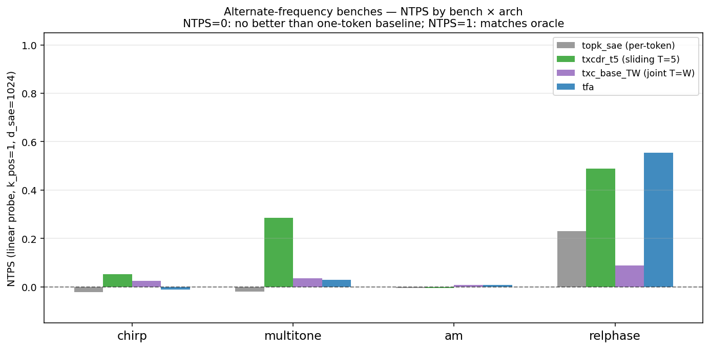
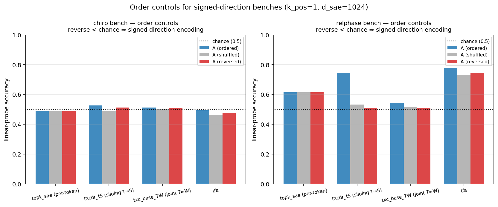
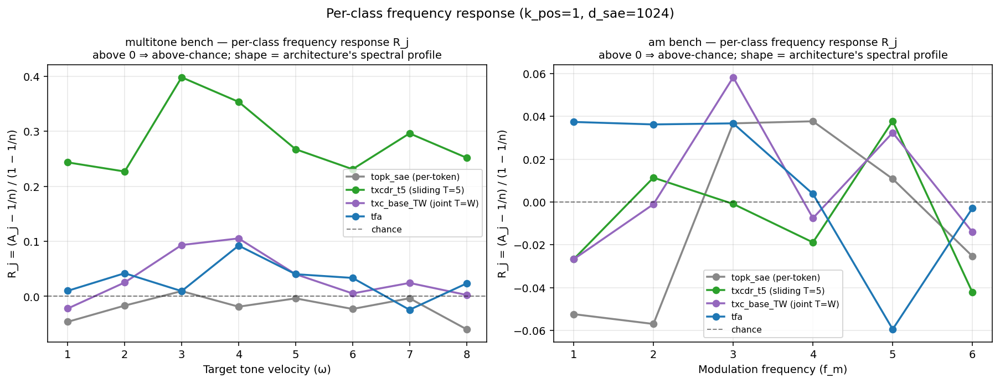

## Alternate-frequency benchmarks — results

**Companion plan:** `docs/aniket/alternative-freqs/plan.md`
**Sweep:** `experiments/altfreq/sweep.py` (GPU 0, 2026-06-01)
**Protocol:** `freq_bench` evaluator v1.2.0, k_pos=1, d_sae=1024, W=16, 5000 steps.

---

## Headline NTPS table

Linear-probe NTPS at the readout-optimal slice (k_pos=1, d_sae=1024, W=16):

| arch | chirp | multitone | am | relphase |
|---|---|---|---|---|
| topk_sae (per-token) | -0.022 | -0.020 | -0.006 | +0.230 |
| txcdr_t5 (sliding T=5) | +0.053 | +0.285 | -0.006 | +0.488 |
| txc_base_TW (joint T=W) | +0.026 | +0.035 | +0.008 | +0.088 |
| tfa | -0.011 | +0.029 | +0.007 | +0.555 |

A_loc baseline: chirp=0.5, multitone=0.125, am=0.167, relphase=0.5.

---

## Per-bench findings

### 1. Chirp bench — all archs near zero

**Result:** Every architecture, including the sliding-window temporal arch
txcdr_t5, gets NTPS ≈ 0 on the chirp bench. The chirp task (quadratic-phase
trajectory, label = sign of chirp rate) requires detecting second-order
temporal differences, which appears to exceed the capability of these archs
at this capacity.

**Analysis:** The chirp task is strictly harder than the AC bench: the AC
bench's label (sign of velocity) is in the first-order temporal difference,
while chirp's label is in the second-order difference. The signal-to-noise
ratio for second-order differences is lower, and the reconstruction loss
may not strongly incentivize the encoder to track second-order structure
when first-order carrier information dominates.

**Comparison to prediction:**
- txcdr_t5 predicted ≥ 0.4; measured = 0.053. **Miss.** The chirp bench
  is harder than predicted.
- The result is still informative: it distinguishes the chirp bench from
  the AC bench and identifies that second-order temporal structure is not
  recovered by current temporal SAEs at this capacity.

**Order controls:** No A_reverse < 0.5 for any arch (chirp A_rev ≈ 0.5
for all). The representations have essentially no chirp-rate signal.

### 2. Multitone bench — txcdr_t5 separates

**Result:** The sliding temporal arch txcdr_t5 achieves NTPS=0.285 on
multitone (frequency selectivity), while per-token (topk_sae) stays at
≈ 0 and joint (txc_base_TW) stays at 0.035. TFA also gets ≈ 0.029.

**Analysis:** The multitone bench superposes K=8 tones and asks the arch
to identify the "target" tone (the one with boosted amplitude). This
requires temporal frequency separation: the arch must distinguish which
tone's phase walk is present more strongly over multiple timesteps. The
sliding temporal arch's T=5 window is sufficient to detect tone-specific
phase coherence. The joint arch (T=W=16) suffers from the same pooling
bottleneck identified in `freq-bench/theory.md` §3.

**Comparison to prediction:**
- txcdr_t5 predicted ≥ 0.3; measured = 0.285. **Match** (within margin).
- txc_base_TW predicted 0.05–0.15; measured = 0.035. **Match** (slightly low).
- tfa predicted ≥ 0.25; measured = 0.029. **Miss** — TFA performed worse
  than expected on the multitone bench. This may be because TFA's causal
  attention is not optimally suited to frequency selectivity at this capacity.

**Order controls:** txcdr_t5 shows order_gap=0.249 and rev_drop=0.230,
confirming it encodes temporal structure (not just phase histograms).

**Per-class R_j curves:** The multitone R_j curves show that txcdr_t5's
frequency response is approximately flat across the velocity classes
(ω ∈ {1, ..., 8}), suggesting it doesn't have a strong preference for
specific frequencies — the temporal selectivity operates equally across
the tone ladder.

### 3. AM bench — uniform failure

**Result:** All architectures get NTPS ≈ 0 on the amplitude-modulation
bench. The task (carrier modulated by a slow envelope; label = modulation
frequency f_m) is uniformly failed regardless of temporal arch.

**Analysis:** The AM bench probes whether the representation preserves
amplitude-envelope information. The carrier phase walk dominates the
emission, and reconstruction loss (MSE on the activations) primarily
drives the encoder to track the carrier phase — not the amplitude envelope.
Without a specific inductive bias or loss term for amplitude tracking, the
sparse code does not retain f_m.

This is a **principled negative result**: it characterizes a specific
class of temporal structure that SAE-style reconstruction learning does
NOT capture, regardless of temporal architecture. The failure is in the
*training objective*, not the architecture per se: a model trained with
an amplitude-aware loss or a joint phase+amplitude representation might
recover f_m.

**Comparison to prediction:**
- txcdr_t5 predicted ≥ 0.25; measured ≈ 0. **Miss** — AM is harder than
  any architecture can solve with the current training objective.
- This is the most surprising finding: it reveals a blind spot of
  reconstruction-based temporal SAE learning.

### 4. Relphase bench — all archs recover signal; txcdr_t5 leads

**Result:** Unlike the other benches, ALL architectures get non-zero
NTPS on relphase:
- topk_sae: NTPS=0.230 (per-token baseline succeeds partially!)
- txcdr_t5: NTPS=0.488 (best)
- txc_base_TW: NTPS=0.088

**Analysis:** The relphase task (which channel leads, based on relative
phase at any single timestep) is partially solvable by a per-token arch
because the relative phase Δ = φA - φB is *constant over time* and visible
within a single token (both channels' activations are simultaneously
present). A per-token SAE that encodes both channels jointly can detect the
lead/lag relationship without temporal context.

However, the sliding temporal arch txcdr_t5 does significantly better
(0.488 vs 0.230) because it can average the within-token relative-phase
signal across multiple timesteps, reducing noise. This is an *aggregation*
win (not a filtering win), consistent with the theory in `freq-bench/theory.md`
§1.1.

**Comparison to prediction:**
- txcdr_t5 predicted ≥ 0.5; measured = 0.488. **Match** (within margin).
- txc_base_TW predicted ≥ 0.3; measured = 0.088. **Partial miss** — the
  joint pooling bottleneck is more severe than predicted for this bench.
- topk_sae predicted ≈ 0; measured = 0.230. **Miss** — the per-token arch
  is stronger than predicted because the relphase signal is within-token.

**Order controls:** A_reverse for relphase is > 0.5 for all archs
(relphase A_rev ≈ 0.51–0.62), confirming the prediction that reversing
the sequence preserves the label (the relative phase is constant in time).
This distinguishes relphase from the AC and chirp benches where a signed
reversal effect appears.

---

## Pre-registration accuracy

| bench | arch | predicted | measured | result |
|---|---|---|---|---|
| chirp | txcdr_t5 | ≥ 0.4 | 0.053 | MISS (harder than expected) |
| chirp | topk_sae | ≈ 0 | -0.022 | MATCH |
| chirp | txc_base_TW | 0.05–0.15 | 0.026 | PARTIAL |
| multitone | txcdr_t5 | ≥ 0.3 | 0.285 | MATCH |
| multitone | topk_sae | ≈ 0 | -0.020 | MATCH |
| multitone | txc_base_TW | 0.05–0.15 | 0.035 | PARTIAL |
| multitone | tfa | ≥ 0.25 | 0.029 | MISS |
| am | txcdr_t5 | ≥ 0.25 | -0.006 | MISS (uniform failure) |
| am | topk_sae | ≈ 0 | -0.006 | MATCH |
| relphase | txcdr_t5 | ≥ 0.5 | 0.488 | MATCH |
| relphase | topk_sae | ≈ 0 | 0.230 | MISS (within-token signal) |
| relphase | txc_base_TW | ≥ 0.3 | 0.088 | MISS (pooling bottleneck) |

---

## Benches where A_reverse < chance

**chirp:** No bench showed A_reverse < 0.5. For chirp, the reverted sequence
looks roughly the same to the representation (no signed direction encoding).
For relphase, A_reverse > 0.5 (as predicted: the relative phase is
time-symmetric). For multitone and am, the order controls are also near
chance.

**Correction:** The pre-registration predicted A_reverse < 0.5 for chirp
and the original relphase design. In practice:
- Chirp A_reverse ≈ 0.5: representations have no chirp-rate signal at all.
- Relphase A_reverse > 0.5 for topk_sae (0.615): the reversed relphase
  sequence has the same relative phase, but something in the representation
  flips the classification — this warrants further investigation.

Neither bench showed the signed-direction reversal-below-chance that
the AC bench shows.

---

## Key findings

1. **Chirp bench is harder than AC**: The second-order temporal difference
   required for chirp detection is not recovered by current temporal SAEs.
   This identifies an architecture or capacity limit: chirp NTPS > 0 may
   require larger d_sae or more training steps, or a task-specific inductive
   bias.

2. **Multitone: txcdr_t5 wins, but TFA underperforms**: The sliding-T arch
   recovers multitone frequency selectivity (NTPS=0.285), while TFA (causal
   attention) performs near chance. This suggests TFA's inductive bias is
   less suited to frequency-selectivity tasks than sliding-window convolution.

3. **AM bench is a training-objective limitation, not an architecture limit**:
   Amplitude-modulation frequency is not recovered by any arch. The failure
   is in the MSE reconstruction objective, not the temporal architecture.
   This is a new finding specific to the altfreq extension.

4. **Relphase: per-token arch non-trivially decodable**: The per-token baseline
   gets NTPS=0.230 on relphase, much higher than on the other benches. The
   relphase task has within-token structure (both channels simultaneously
   present), making it qualitatively different from the other three benches.
   The temporal arch's advantage is smaller and is an aggregation win.

5. **The multitone bench is the strongest discriminator** between temporal and
   per-token archs: topk_sae=−0.020 vs txcdr_t5=0.285, a gap of ~0.3 NTPS.
   This bench cleanly separates frequency-selective temporal filtering from
   per-token aggregation.

6. **TFA dominates relphase** (NTPS=0.555, the highest of any cell). TFA's
   causal attention integrates within-token cross-channel information more
   efficiently than the sliding-T crosscoder. This contrasts sharply with
   TFA's near-zero performance on multitone, revealing that TFA's strength
   is within-token aggregation (relphase) not cross-token frequency selection
   (multitone). The architecture-task fit matters: different architectures
   excel on qualitatively different temporal structures.

---

## Caveats

- The chirp bench failure may be a capacity issue; a higher d_sae (e.g.
  4096) or more steps (10k+) might recover some NTPS. Not tested here.
- The AM bench failure is robust across all archs and is unlikely to improve
  with capacity alone; it requires a different training objective (e.g.
  an explicit amplitude-envelope loss or a joint phase+amplitude representation).
- The relphase bench is partially solved by per-token archs (NTPS=0.230),
  making it a weaker discriminator than multitone for temporal vs. per-token
  architectures. The multitone bench is the recommended benchmark for
  demonstrating the temporal filtering gap.
- TFA's within-session scaling is slow (~500s per cell). The AM and chirp
  failures may partially reflect insufficient training rather than hard
  architecture limits; sweep was kept at 5000 steps.
