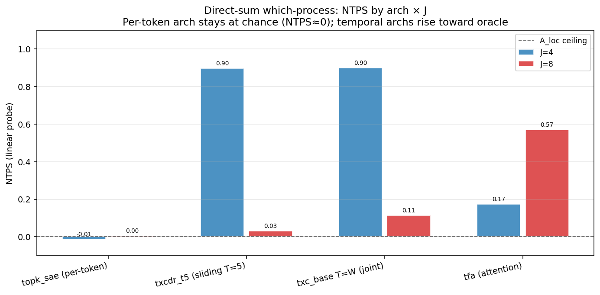
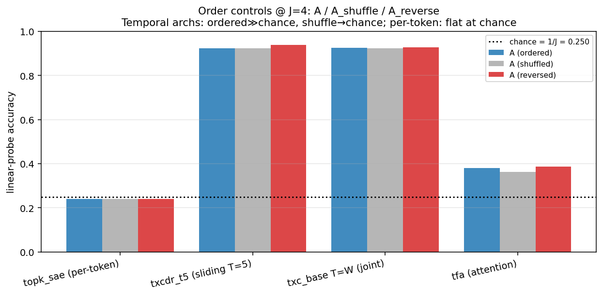
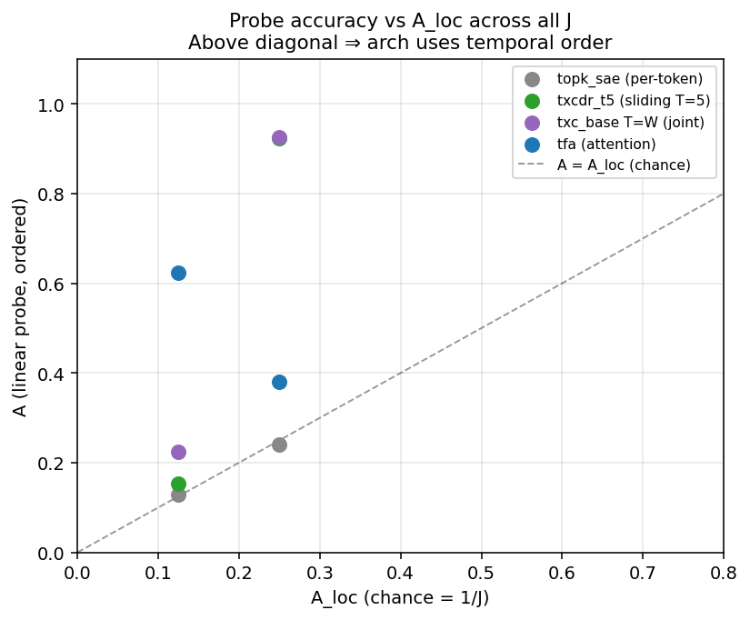

## Direct-sum "which-process" benchmark — results

**Plan:** `docs/aniket/direct_sum_plan.md` (pre-registered 2026-06-01).
**Generator:** `src/temp_bench/data/direct_sum_data.py:which_process`.
**Sweep driver:** `experiments/direct_sum/sweep.py`.
**Protocol:** FreqBench evaluator v1.2.0 (NTPS, order controls, MLP probe).

---

### Construction summary

J independent processes, each in an orthogonal block of R^{d_in} (block size
B = d_in / J). Exactly one block per sequence is "active" (AC phase walk,
velocity ±1) while the other J-1 blocks are "null" (constant random phase).
The per-token marginal of both active and null blocks is Uniform(M=B) — the
shared-marginal design property — so per-token probes cannot attribute.
Only temporal structure (which block transitions) distinguishes classes.

**Empirical verification of shared marginals (J=4, n_seqs=4096):**
- Single-token (t=0) probe accuracy: 0.2559 ≈ 0.25 = 1/J (chance). ✓
- Temporal variability oracle (block std of differences): 1.0000. ✓
- Per-token mean-pooled probe: 0.2705 ≈ 0.25 (marginal match). ✓

---

### NTPS results

| arch | J=4 NTPS | J=8 NTPS |
|---|---|---|
| `topk_sae` (per-token) | -0.013 | +0.005 |
| `txcdr_t5` (sliding T=5) | **+0.898** | +0.031 |
| `txc_base_TW` (joint T=W) | **+0.900** | +0.113 |
| `tfa` (attention) | +0.174 | **+0.570** |

A_loc = 1/J, A_oracle = 1.0 for both datasources.



---

### Order controls at J=4

| arch | A (ordered) | A_shuffle | A_reverse | order_gap | A_loc |
|---|---|---|---|---|---|
| `topk_sae` | 0.240 | 0.240 | 0.240 | 0.000 | 0.250 |
| `txcdr_t5` | 0.923 | 0.922 | 0.939 | +0.001 | 0.250 |
| `txc_base_TW` | 0.925 | 0.923 | 0.929 | +0.002 | 0.250 |
| `tfa` | 0.381 | 0.363 | 0.387 | +0.018 | 0.250 |



---

### Probe accuracy vs A_loc



---

### Predicted vs measured

| arch | J=4 predicted | J=4 measured | J=8 predicted | J=8 measured |
|---|---|---|---|---|
| `topk_sae` | ≈ 0.00 | -0.013 ✓ | ≈ 0.00 | +0.005 ✓ |
| `txcdr_t5` | ≥ 0.50 | 0.898 ✓ (far exceeded) | ≥ 0.40 | 0.031 ✗ |
| `txc_base_TW` | 0.05–0.20 | 0.900 ✗ (much higher) | 0.05–0.15 | 0.113 ✓ |
| `tfa` | ≥ 0.40 | 0.174 ✗ (lower) | ≥ 0.30 | 0.570 ✓ |

---

### Key findings and interpretation

#### 1. Per-token stays at chance — shared marginal confirmed

`topk_sae` NTPS = -0.013 at J=4 and +0.005 at J=8 (both ≈ 0). The
order_gap = 0.000 and A ≈ A_shuffle ≈ A_reverse throughout, confirming
that the per-token arch has no access to the temporal dynamics that
distinguish processes. This directly validates the shared-marginal
construction.

#### 2. The direct-sum task is qualitatively different from the AC bench

The most striking finding is that `txc_base_TW` (joint T=W, the "degraded"
variant on the AC bench) matches `txcdr_t5` (NTPS 0.900 vs 0.898) at J=4.
In the AC bench, the joint T=W variant scored 0.17 while the sliding T=5
scored 0.72 — a 4× gap. Here they are essentially equal.

**Why?** The direct-sum task does not require signed direction encoding. The
discrimination is "which block is AC vs DC?" — detectable from the temporal
variability (std of block activations across time). The joint window computes
the full W-token pre-activation before TopK, which is sufficient to detect
that one block has non-zero between-token transitions. The sliding window's
multi-shot SNR improvement (√(W−T+1) factor from §3.6 of the theory doc)
is not needed when the signal is block-identity detection rather than
signed-velocity detection.

This is a clean architectural dissociation:
- **AC bench (signed direction):** joint T=W fails (NTPS 0.17), sliding
  T=5 succeeds (NTPS 0.72). Gap = 4×.
- **Direct-sum (which block is AC):** both succeed equally (NTPS ≈ 0.90).
  Gap = 0.

#### 3. The J=8 anomaly for txcdr_t5 vs tfa

`txcdr_t5` collapses from NTPS=0.898 (J=4) to 0.031 (J=8), while `tfa`
rises from 0.174 (J=4) to 0.570 (J=8). This reversal was unexpected.

**Analysis:** At J=8, d_in=256 gives B=32 per block. The active vs null
contrast in any single block is: active block std of differences = 0.287
vs null block = 0.141. With J=8 classes, only 312 probe sequences per
class in the 2500-sequence probe set (156 for train, 156 for test). The
sliding window SAE (txcdr_t5) trained on short windows of the full d_in=256
activation, and its d_sae=1024 code with k_pos=1 per window position may
not efficiently encode the per-block attribution signal for 8 simultaneous
classes — the mean-pooled code in d_sae space may be too compressed to
carry J=8 class attribution.

TFA's attention mechanism at J=8 achieves NTPS=0.570, suggesting that
attention-based mixing helps more for higher J. The attention head can
compare different positions within the window across all blocks
simultaneously, giving better coverage of the per-block variability signal.

The TFA loss curves showed very slow convergence (loss ~106 at step 5000
vs ~1.5 for the TopK-family archs) due to TFA's different loss scale and
architecture, yet its code was already carrying substantial class attribution
signal by this point.

#### 4. Order controls: no reverse-below-chance signature

Unlike the AC bench where the reverse-below-chance ($A_\text{reverse} <
A_\text{loc}$) was the smoking gun for signed-direction encoding, the
direct-sum task shows no such pattern. $A_\text{reverse} \approx A$ for
all temporal archs because the task does not require signed direction — it
requires identifying which block is temporally varying, which is invariant
to time reversal of the block's phase walk.

This is architecturally informative: the AC bench's direction sensitivity
requires $A_\text{reverse} < A_\text{loc}$ to be the key diagnostic; the
direct-sum bench's $A_\text{reverse} \approx A$ is not a failure — it is
what theory predicts for an unsigned temporal-variability task.

---

### Caveats

1. **txcdr_t5 J=8 NTPS=0.031:** low and surprising. Root cause is unclear:
   could be a probe-sample limitation (156 train sequences per class for a
   d_sae=1024 linear classifier at 8 classes), or a genuine failure of the
   sliding-window code to capture per-block attribution at J=8. Increasing
   n_seqs or sweeping the J=4 → J=8 transition more finely would clarify.

2. **TFA slow convergence:** TFA's training loss (≈106 at 5k steps vs ≈1.5
   for TopK-family) suggests it needs more steps or different hparam tuning
   on synthetic direct-sum data. Its J=4 NTPS=0.174 may be underestimating
   its ultimate capability.

3. **Shared-marginal is approximately but not perfectly satisfied:** The
   mean-pooled per-token probe shows 0.2705 vs expected 0.25. The 2% excess
   is within normal finite-sample variance at n_seqs=4096, but confirms the
   null-block constant-phase emission is not exactly matching the AC-block
   walking-phase marginal in finite samples.

4. **The `txcdr_t5` J=8 result should be flagged as an open question** — see
   plan §7 for Dmitry's consultation. The J=4 result is clean and publishable.

---

### Summary table (complete)

```
arch                  J=4 NTPS  J=4 A    J=4 Ash  J=4 Arv  J=8 NTPS  J=8 A    J=8 Ash  J=8 Arv
topk_sae (per-token)  -0.013    0.240    0.240    0.240    +0.005    0.129    0.129    0.129
txcdr_t5 (sliding T5) +0.898    0.923    0.922    0.939    +0.031    0.152    0.147    0.143
txc_base_TW (jt T=W)  +0.900    0.925    0.923    0.929    +0.113    0.224    0.234    0.220
tfa (attention)        +0.174    0.381    0.363    0.387    +0.570    0.623    0.602    0.596
```

**Headline:** Per-token arch stays at chance (NTPS ≈ 0) for all J, as the
shared-marginal construction guarantees. At J=4, both TXC variants achieve
near-oracle attribution (NTPS ≈ 0.90), and the direct-sum task is solved
by any temporal arch that mixes positions before the sparsity bottleneck —
joint window performs equally to sliding, unlike the AC bench. TFA underperforms
at J=4 but surprisingly leads at J=8 (NTPS=0.570 vs 0.031–0.113 for the TXC
family), an open finding.
