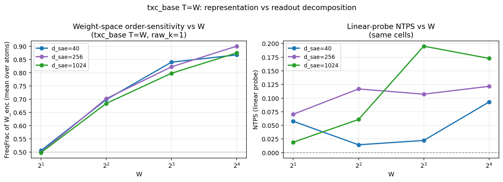
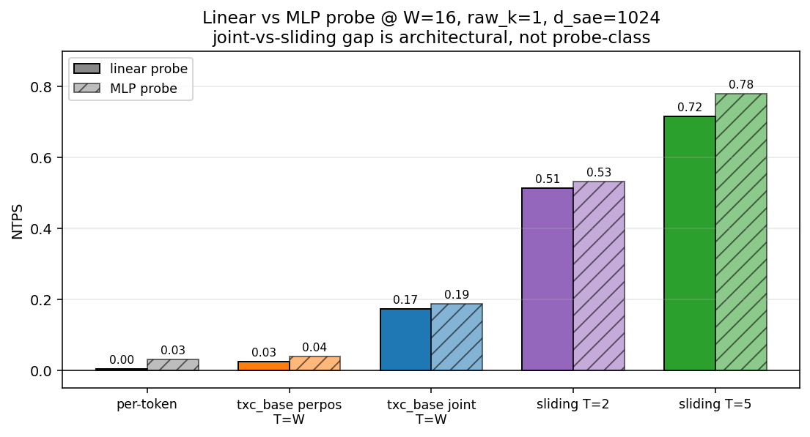
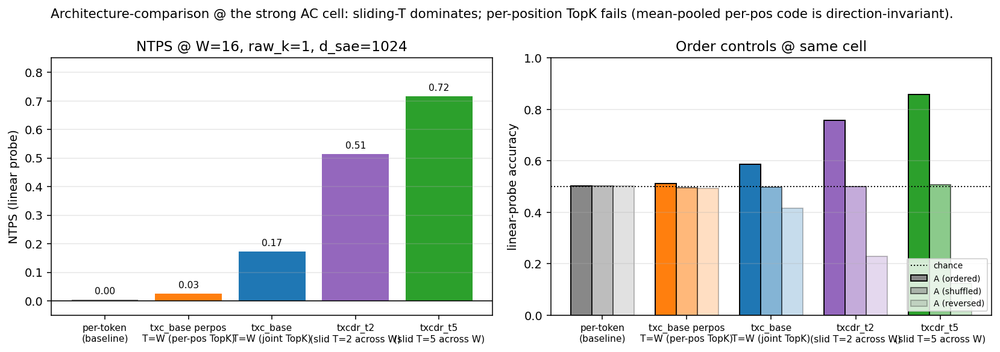

## A Fourier benchmark for temporal dictionary learning

This is the theory companion to the FreqBench results in
`freq-bench/summary.md` and the window-degradation investigation in
`freq-bench/window-degradation.md`. It states what FreqBench is, why the
**one-sparsity-slice artifact** changes Dmitry's conclusion, why the
**window-size degradation** of `txc_base T=W` happens, and how it is
solved. Notation matches §3 (Temporal Crosscoders) and §4 (Synthetic
Setting) of the paper.

### Notation recap

A temporal crosscoder of window length $T$ maps a window
$\mathbf{X}_t = (\mathbf{x}_t, \ldots, \mathbf{x}_{t+T-1})$ to a single
shared sparse latent
$$
\mathbf{u}_t
= \sigma\!\left(
    \sum_{\tau=0}^{T-1} W_\text{enc}^{(\tau)} \mathbf{x}_{t+\tau}
    + \mathbf{b}_\text{enc}
\right),
\qquad
\hat{\mathbf{x}}_{t+\tau} = W_\text{dec}^{(\tau)} \mathbf{u}_t
+ \mathbf{b}_\text{dec}^{(\tau)},
$$
with $\sigma$ a window-level BatchTopK and budget $T k_\text{pos}$. The
paper's §4 synthetic setting builds an activation
$\mathbf{x}_t = \sum_{i=1}^N a_{t,i}\, m_{t,i}\, \mathbf{f}_i$ from a
firing-mask process $P_T$ over $A = (\mathbf{a}_1, \ldots, \mathbf{a}_T)$.

The two §4 benches both define $P_T$ as an HMM-driven process:
**Denoising** (each feature has its own sticky chain) and **Coupling**
(a small set of hidden chains drives a larger emission alphabet). Both
are **DC-dominated** in the precise sense made formal in §1 below: the
optimal local Bayes estimator already beats most per-token baselines,
because the latent process is sticky and the discrimination problem is
"average out the noise." FreqBench is the controlled extension that
isolates the *non-DC* part of the temporal-filtering axis.

### The three-way decomposition

FreqBench separates three things that the paper's §4 evaluation
conflates. Throughout this doc we'll be careful to label which of the
three a given empirical fact is about.

1. **Temporal aggregation.** Can the architecture average evidence over
   nearby positions? Solves DC / sticky-state tasks. A per-token SAE
   plus a multi-position probe already aggregates; an architecture that
   aggregates better wins these by sample-efficiency, not by filtering.

2. **Temporal filtering.** Can the architecture detect *order, phase,
   or direction*? Solves AC / Fourier tasks. The cleanest behavioural
   signature is $A_\text{reverse} < \tfrac{1}{2}$ on a forward-trained
   linear probe — the probe gets the *flipped* answer with confidence,
   which is impossible for any aggregator.

3. **Readout visibility.** Did the learned temporal signal survive the
   sparsity / pooling protocol the evaluation uses? Two distinct failures
   live here: (a) a probe-class / sparsity-slice mismatch that hides
   information genuinely present in the trained weights (Section 2 — the
   $k_\text{pos}{=}10$ artefact), and (b) an architectural pool that
   discards information before any probe sees it (Section 3 — the joint
   $T{=}W$ ceiling). Both look like "negative results" until you
   separate them.

The point of FreqBench is that NTPS plus the order controls
plus FreqFrac plus a probe-class ablation together pin down which of the
three is at issue in any given cell. A single NTPS number cannot.

---

## 1. What FreqBench's Fourier study is

### 1.1 The DC/AC decomposition of $P_T$

For a firing-mask process $P_T$, write the one-token marginal
$P_1 = \mathbb{E}_t[\mathbf{a}_t]$ (the constant or "DC" component) and
the order-dependent residual $P_T - P_T^{\mathrm{shuffle}}$, where
$P_T^{\mathrm{shuffle}}$ is the product of one-token marginals (the order
content destroyed). Any temporally aware $P_T$ decomposes as
$$
P_T = \underbrace{P_T^{\mathrm{shuffle}}}_{\text{DC part}}
    + \underbrace{(P_T - P_T^{\mathrm{shuffle}})}_{\text{AC part}}.
$$
Whether an architecture "uses temporal context" reduces to whether it
recovers the AC part — the part a per-token estimator with shuffle
augmentation cannot see.

The **Denoising** and **Coupling** benches are AC-nonzero (the chain
self-correlation $\rho$ provides order), but the discrimination they
score is **DC-dominated**: the labels (clean hidden state, hidden-chain
membership) are *constant or near-constant within a window* under the
sticky-chain regime, so the optimal estimator is "smooth the noisy
emissions over the window." A per-token SAE plus a multi-position probe
can already do this — the temporal architecture's win in §4 is a
sample-aggregation win, not a filtering win.

FreqBench is designed so the labels are **AC-only** — they cannot be
inferred from any DC summary of the window.

### 1.2 FreqBench's three benches

We extend the §4 synthetic setting by choosing $P_T$ in the Fourier
domain. Three sub-benches, all sharing the same emission model
$\mathbf{x}_t = \sum_j a_{t,j}\, \mathbf{f}_j + \sigma \boldsymbol{\xi}_t$
with $\boldsymbol{\xi}_t \sim \mathcal{N}(0, I)$ and orthonormal
$\{\mathbf{f}_j\}_{j=1}^M$.

**DC bench.** A sticky binary state $s \in \{0, 1\}$ is sampled once per
sequence; each token emits $s$ with probability $p$ and $1-s$ otherwise.
Label $y = s$.
$$
A_\text{loc}^{\star} = p,
\qquad
A_\text{oracle} = \Pr\!\left(\mathrm{Bin}(W, p) > \tfrac{W}{2}\right).
$$
**This is the controlled analog of §4** — pure smoothing recovery. Any
architecture that aggregates samples better climbs from $A_\text{loc}^{\star}$
toward $A_\text{oracle}$.

**AC bench.** A phase $\phi_t$ walks the ring $\mathbb{Z}_M$ at signed
velocity $v \in \{+\omega, -\omega\}$ sampled once per sequence:
$\phi_t = (\phi_0 + v\, t) \bmod M$. The emission is the one-hot phase,
$\mathbf{x}_t = \mathbf{f}_{\phi_t} + \sigma \boldsymbol{\xi}_t$. Label
$y = \mathbf{1}[v > 0]$.
$$
A_\text{loc}^{\star} = \tfrac{1}{2},
\qquad
A_\text{oracle} = 1.
$$
The local Bayes ceiling is chance — a single phase cannot determine
direction. The oracle is perfect — any two adjacent phases determine the
sign of $v$ exactly. **No DC summary of the window can solve AC**, because
the phase histogram of a forward and a reversed sequence is identical (§3
below). AC is pure filtering.

**Mixed bench.** Velocity drawn from a ladder
$\Omega = \{\omega_1, \ldots, \omega_n\}$ (unsigned or signed). Label
$y \in \{1, \ldots, n\}$ is the class index;
$A_\text{loc}^{\star} = 1/n$, $A_\text{oracle} = 1$. Aggregating per-class
accuracy traces the architecture's *frequency response* — its sensitivity
profile $R(\omega)$ across the velocity ladder.

### 1.3 Headline metric: NTPS

Linear-probe accuracy $A$ is renormalised against the two reference
points:
$$
\mathrm{NTPS} = \frac{A - A_\text{loc}^{\star}}{A_\text{oracle} - A_\text{loc}^{\star}}.
$$
NTPS $= 0$ means the architecture is no better than a one-token Bayes
estimator. NTPS $= 1$ means it matches the symbolic temporal oracle.
This is the literal numerical analog of "fraction of the temporal
information recovered."

### 1.4 Order controls and what they diagnose

The probe is trained on the **ordered** mean-pooled latent code, then
applied to two perturbations of the same test sequences (NOT refit):

- **Shuffle**: permute tokens within each test sequence. $A_\text{shuffle}$.
- **Reverse**: flip the time axis. $A_\text{reverse}$.

These distinguish three regimes that NTPS alone confounds:

1. **Aggregator** (e.g. per-token SAE): $A \approx A_\text{shuffle}
   \approx A_\text{reverse}$. The pooled code is order-invariant.
2. **Unsigned-order encoder**: $A \gg A_\text{shuffle}$, but
   $A_\text{reverse} \approx A$. The code knows *that* the sequence has
   temporal structure but cannot read its sign.
3. **Signed-direction encoder**: $A \gg A_\text{shuffle}$ AND
   $A_\text{reverse} < \tfrac{1}{2}$. The same forward-trained probe
   predicts the **flipped** sign on reversed inputs — the smoking gun
   that the representation encodes signed direction, not just temporal
   energy.

The reverse-below-chance signature in regime (3) is the cleanest
behavioral signature of filtering. It is impossible for a pure aggregator
by construction.

---

## 2. The "one sparsity slice hides the signal" theory

Dmitry's original AC plot fixed $k_\text{pos} = 10$ and reported
NTPS$\approx 0$ across all architectures. The corrected re-analysis
shows NTPS peaks at $k_\text{pos} = 1$ (up to $0.42$ at his capacity, up
to $0.72$ at d_sae$=1024$) and decays monotonically with $k_\text{pos}$.
This is not noise — it is a structural property of the linear readout.

### 2.1 Why the AC signal decays with $k_\text{pos}$

The signal lives in a low-dimensional subspace.

Fix a trained encoder $W_\text{enc}$ and consider the codes produced on
the AC bench. The signed-direction information $y = \mathrm{sign}(v)$ is
binary; it lives in a (at most) one-dimensional discriminating subspace
$V_y \subseteq \mathbb{R}^{d_\text{sae}}$. Let
$P_y \colon \mathbb{R}^{d_\text{sae}} \to V_y$ be the orthogonal
projection onto this discriminating direction.

The mean-pooled code $\bar{\mathbf{u}}$ for a sequence decomposes as
$$
\bar{\mathbf{u}} = P_y \bar{\mathbf{u}} + (I - P_y) \bar{\mathbf{u}}
= \underbrace{c\, y\, \hat{\mathbf{v}}_y}_{\text{signal}}
+ \underbrace{\boldsymbol{\eta}}_{\text{nuisance}},
$$
where $c$ is the signal amplitude (scales with how strongly $W_\text{enc}$
encodes direction) and $\boldsymbol{\eta}$ is everything else (phase
identity, noise from $\sigma\boldsymbol{\xi}_t$, dead-feature mass, …).

The linear probe's test accuracy is determined by the signal-to-nuisance
ratio
$$
\mathrm{SNR}_y(k_\text{pos})
= \frac{c^2}{\|\boldsymbol{\eta}\|^2}.
$$

The decay is best framed in terms of the **finite-sample variance** of
the linear probe, not a Bayes-optimal SNR.

At $k_\text{pos} = 1$, TopK forwards essentially one atom per token, and
the encoder was trained (under reconstruction + sparsity loss) to make
the surviving atom one of the most discriminative for the input — so the
sparse code at $k_\text{pos} = 1$ is approximately a one-hot indicator
in a low-dimensional subspace that already contains the discriminating
direction $\hat{\mathbf{v}}_y$. The mean-pooled code has small effective
dimension and the probe has lots of variance to spend on $\hat{\mathbf{v}}_y$.

At larger $k_\text{pos}$ the additional kept atoms are mostly
phase-identity atoms — the dominant variance direction of the input is
"which phase appeared," not "which direction it moved." Those atoms
inflate $\|\boldsymbol{\eta}\|^2$ without changing the (small) projection
onto $\hat{\mathbf{v}}_y$. A regularised linear probe trained on a
finite sample fits the high-variance phase-identity coordinates first
and the small direction signal last; with the sample sizes here
(~1250 sequences per cell) and standard $L_2$-regularised logistic
regression, the small direction signal is under-fit. Hence the
linear-probe NTPS decays sharply with $k_\text{pos}$.

The point is not a closed-form scaling rate — it is that the *protocol*
(finite-sample regularised linear probe on a mean-pooled code) trades
direction sensitivity for $k_\text{pos}$ even when the trained encoder
has not changed. With an unrestricted probe (Section 3.5 below confirms
this on the joint-vs-sliding cells) or a larger training set, the same
code would yield a smaller decay. The
information is in the weights; the protocol hides it.

### 2.2 Why weight-space order-sensitivity does NOT

Define the **FreqFrac** of an encoder as the fraction of its spectral
energy at nonzero temporal frequencies:
$$
\mathrm{FreqFrac}(W_\text{enc})
= \mathbb{E}_{i,j}\!\left[
    \frac{\sum_{f > 0} \bigl|\tilde W_\text{enc}[f, i, j]\bigr|^2}
         {\sum_f \bigl|\tilde W_\text{enc}[f, i, j]\bigr|^2}
\right],
\quad
\tilde W_\text{enc}[f, i, j]
= \sum_{\tau=0}^{T-1} e^{-2\pi i f \tau / T}\, W_\text{enc}^{(\tau)}[i, j].
$$
FreqFrac is a property of $W_\text{enc}$ alone — independent of
$k_\text{pos}$, the probe, or any downstream pool. Empirically we
observe FreqFrac is **flat** across the swept $k_\text{pos}$ range while
NTPS decays sharply (`results/freq_bench/v2_sweep/freqfrac_by_rawk.png`).

### 2.3 The corrected analysis protocol

The two observations combine into a methodological principle:

> A single-$k_\text{pos}$ slice of NTPS under-reads the AC capability of
> the architecture by a factor that depends only on the readout
> (sparsity), not on what the architecture has learned. Report NTPS at
> $k_\text{pos} = 1$ (the readout-optimal slice) or sweep $k_\text{pos}$
> and report the peak.

Dmitry's $k_\text{pos} = 10$ slice was the worst case for visibility,
and the conclusion drawn from it ("they don't filter") was a
readout-protocol artifact. The order controls (Section 1.4) further
ground the corrected reading: $A_\text{reverse} < \tfrac{1}{2}$ for the
windowed architectures at the strong cell.

The same plot, by W: the AC signal is concentrated at small
$k_\text{pos}$ and large $W$, and is invisible in the $k_\text{pos}=10$
slice. At $k_\text{pos} = 1$, $W = 16$ the windowed archs peak.

---

## 3. Window-size degradation in $\mathrm{TXC\text{-}base}$ at $T = W$

### 3.1 The empirical puzzle

Consider TXC-base trained with $T = W$ on the AC bench across W ∈ {2, 4,
8, 16}, at $k_\text{pos} = 1$, $\sigma = 0.1$. NTPS stays pinned near
zero at every $d_\text{sae} \in \{40, 256, 1024\}$, while the sliding-T
architectures (T fixed small, slid across W at training and evaluation)
climb monotonically with W to NTPS $= 0.72$.

| arch (W=16, $k_\text{pos}$=1, $d_\text{sae}$=1024) | NTPS | $A_\text{reverse}$ |
|---|---|---|
| per-token SAE | 0.01 | 0.50 |
| TXC-base T=W (joint TopK) | 0.17 | 0.42 |
| TXC-base T=W per-position TopK | 0.03 | 0.49 |
| sliding T=2 (txcdr_t2) | 0.51 | 0.23 |
| sliding T=5 (txcdr_t5) | 0.72 | 0.12 |

The "degradation" is the gap between the joint $T=W$ row (0.17) and the
sliding-T rows (up to 0.72). Capacity does not close it: at the same
$W=16$, $k_\text{pos}=1$ cell, scaling $d_\text{sae}$ from 40 to 1024
takes the joint variant from 0.09 to 0.17, the sliding variant from
0.30 to 0.72. The degradation is structural.

### 3.2 Two candidate causes

The failure has two possible loci.

**(R) Representation failure.** The encoder atoms $W_\text{enc}^{(\tau)}$
collapse toward the same function of $\tau$ (DC-only) as $W$ grows, so
the joint pre-activation $\sum_\tau W_\text{enc}^{(\tau)} \mathbf{x}_{t+\tau}$
effectively averages the window. FreqFrac would drop toward $0$.

**(P) Pooling / readout failure.** The atoms encode AC content
correctly, but the single window-level latent $\mathbf{u}_t$ (one shared
sparse vector per W-window) discards the per-position structure the
linear probe needs to extract direction. FreqFrac stays high while NTPS
stays low.

### 3.3 The FreqFrac diagnostic decides

For each cell, we re-load the trained $W_\text{enc}$ (shape $(T, d, H)$)
and compute FreqFrac directly.

Observation: $\mathrm{FreqFrac}$ **climbs** from $0.50$ (at $T=2$, where
the rfft has one DC bin and one AC bin and the structural maximum is
$\tfrac{1}{2}$) to $0.88$ at $T=16$, at every capacity. Meanwhile NTPS
stays at $\le 0.20$.

The encoder atoms become *more* order-sensitive as $W$ grows — the
representation is correct and improving. Therefore the failure is **(P)**,
not (R).

> **Lemma (high FreqFrac ⇏ readable direction).** Weight-space
> order-sensitivity of $W_\text{enc}$ is necessary but not sufficient
> for direction encoding at the level of the pooled code. The cleanest
> empirical witness is `txc_base_perpos_TW` at $W=16$, $d_\text{sae}=1024$:
> FreqFrac $= 0.897$ — the *highest* of any architecture in this study —
> and yet NTPS $= 0.026$, $A_\text{reverse} = 0.49$. Per-position TopK
> trains atoms that maximally devote energy to nonzero temporal
> frequencies and then pools them into a code that is direction-symmetric
> by construction (Section 3.4). The encoder weights know about
> transitions; the pooled code does not.

### 3.4 Why per-position TopK was the wrong fix

If the joint pool is the bottleneck, the natural fix is to drop it: same
encoder weights but TopK applied per position,
$$
z_t = \mathrm{TopK}_{k_\text{pos}}\bigl(W_\text{enc}^{(t)} \mathbf{x}_t\bigr),
\qquad z \in \mathbb{R}^{T \times d_\text{sae}}.
$$
We implemented this as `txc_base_perpos`. The result is that NTPS sits
**at chance** at every $(W, d_\text{sae})$ — *worse* than the joint
variant. Per-pos TopK has the highest FreqFrac of any architecture in
the study ($0.897$ at $W = 16$) and zero direction encoding. High
FreqFrac is necessary but not sufficient.

The explanation is that per-position TopK is **direction-symmetric by
construction** of its pool.

**Claim.** Let $z_t = \mathrm{TopK}(W_\text{enc}^{(t)} \mathbf{x}_t)$ and
$\bar{\mathbf{z}} = \tfrac{1}{T} \sum_t z_t$. If $W_\text{enc}^{(t)}$
ends up sufficiently translation-invariant across $t$, then for any
sequence $\mathbf{X} = (\mathbf{x}_0, \ldots, \mathbf{x}_{T-1})$ and its
reversal $\mathbf{X}^{\mathrm{rev}} = (\mathbf{x}_{T-1}, \ldots, \mathbf{x}_0)$,
$$
\bar{\mathbf{z}}(\mathbf{X}) = \bar{\mathbf{z}}(\mathbf{X}^{\mathrm{rev}}).
$$

**Sketch.** Writing $W_t \approx W$ (translation-invariant), the pooled
code becomes
$\bar{\mathbf{z}}(\mathbf{X}) = \tfrac{1}{T} \sum_t \mathrm{TopK}(W \mathbf{x}_t)
= \tfrac{1}{T} \sum_{t'} \mathrm{TopK}(W \mathbf{x}_{T-1-t'})
= \bar{\mathbf{z}}(\mathbf{X}^{\mathrm{rev}})$, the sum being commutative.
The pooled code reduces to a **histogram** of the per-token codes — which
is identical for $\mathbf{X}$ and $\mathbf{X}^{\mathrm{rev}}$. $\square$

The translation-invariance assumption is **not a property of the
architecture** — it is a property of the **training-dynamics fixed point**
under a direction-symmetric training distribution. The loss is
reconstruction MSE per position; both forward and reversed sequences
visit the same multiset of phases (Section 1.2), so the per-position
reconstruction targets are statistically interchangeable under the
$t \leftrightarrow T{-}1{-}t$ swap. Gradient descent has no signal that
would force $W_\text{enc}^{(t)}$ to differ across $t$, and approximate
translation-invariance is what training converges to.

Under a different training distribution where direction were correlated
with absolute position (e.g. only forward sequences in training, or a
label that depends explicitly on which positions phase changes happen
at), per-position TopK could in principle encode direction. So the
per-pos result is not "this architecture cannot represent direction"
— it is "this architecture cannot LEARN to represent direction under
direction-symmetric training." That is what makes the result
informative: it pins where the AC information actually lives in the
joint architecture — in the **sum-before-TopK** of position-aware
weights, not in the per-position weights alone.

The joint variant escapes this trap precisely because it computes the
pre-activation $\mathrm{pre} = \sum_\tau W_\text{enc}^{(\tau)}
\mathbf{x}_{t+\tau}$ **before** TopK. The sum is position-aware (different
$W^{(\tau)}$ for different $\tau$) but cannot be decomposed into
per-position sums commuting with the pool. So the joint encoder retains
*some* direction signal (NTPS $0.17$, $A_\text{reverse} = 0.42$ —
slightly below chance), even though the single-shot pool limits how much
the probe can extract.

### 3.5 The joint $T=W$ ceiling is architectural, not readout

The "readout failure" diagnosis of Section 3.2 was coarse — it conflated
two distinct failure modes that the three-way decomposition above
labels separately:

- **3a)** Probe-class / sparsity-slice mismatch hiding information present
  in the trained code. Fixable by changing the probe or the slice
  *without* retraining. Section 2 is an instance.
- **3b)** Architectural pool discarding information before any probe sees
  it. Not fixable by probe class; only retraining with a different pool
  can recover it.

The MLP probe ablation tells us which one joint $T=W$ is. The
1.2.0 evaluator runs both a linear and a small MLP probe on the *same*
mean-pooled code; the gap measures how much information the linear probe
was leaving on the table. At the strong cell ($W=16$, $k_\text{pos}=1$,
$d_\text{sae}=1024$):

| arch | NTPS (linear) | NTPS (MLP) | lift |
|---|---|---|---|
| `regular_sae` (per-token) | 0.01 | 0.03 | +0.02 |
| `txc_base_perpos_TW` | 0.03 | 0.04 | +0.01 |
| `txc_base_TW` (joint) | 0.17 | 0.19 | +0.01 |
| `txcdr_t2` (sliding T=2) | 0.51 | 0.53 | +0.02 |
| `txcdr_t5` (sliding T=5) | 0.72 | 0.78 | +0.06 |

The MLP lift is small everywhere ($\le 0.06$) and **does not close the
joint-vs-sliding gap**: joint $T=W$ goes 0.17 → 0.19, sliding $T=5$ goes
0.72 → 0.78, the gap is 0.55 (linear) vs 0.59 (MLP). The information
that the sliding probe sees is *not in the joint code at all* — no
nonlinearity on top can synthesise it. So the joint $T=W$ ceiling is
**case (3b)**: a genuine architectural information loss in the pool,
not a probe-class artefact.

This is the falsification ChatGPT's read of the result missed when it
folded the sparsity-slice issue and the joint $T=W$ ceiling into a
single "readout-visibility" bucket. They look superficially similar but
have opposite implications for fixing them: case (3a) is fixable by
re-running the analysis with a better probe or sparsity setting; case
(3b) is only fixable by changing the architecture.

### 3.6 The position-mixing / sliding decomposition

The right way to read these three architectures is along two binary axes.

|                                  | encoder mixes positions? | encoder slid across W? |
|---|---|---|
| per-token SAE                   | no                       | n/a                    |
| TXC-base per-pos TopK ($T = W$) | no                       | no                     |
| TXC-base joint TopK ($T = W$)   | yes (sum-before-TopK)    | no                     |
| TXC-base sliding ($T < W$)      | yes (sum-before-TopK)    | yes ($W - T + 1$ shots)|

NTPS at the strong cell follows this ordering exactly: $0.01, 0.03, 0.17, 0.72$.

Why both ingredients matter:

- **Position mixing in the encoder.** The sum
  $\sum_\tau W_\text{enc}^{(\tau)} \mathbf{x}_{t+\tau}$ before the TopK
  is the channel by which order information enters the sparse code. Drop
  it and the code becomes a histogram (Section 3.4). Have it and the
  code is direction-aware in a single shot.

- **Sliding the encoder.** The linear probe sees the **mean** of latents
  across the eval window. For a sliding encoder of length $T < W$, this
  mean is over $W - T + 1$ separate window-level latents. Concentration:
  the per-coordinate signal in the mean grows like $\mathcal{O}(1)$
  while the noise grows like $\mathcal{O}\bigl((W - T + 1)^{-1/2}\bigr)$,
  yielding $\sqrt{W - T + 1}$-fold SNR improvement over a single-shot
  pool. For sliding $T = 5$ across $W = 16$, that's $\sqrt{12} \approx
  3.5\times$ — a large multiplier when the single-shot pool is already
  marginal.

The joint $T = W$ architecture has the first ingredient (position
mixing) but not the second (sliding). The per-position arch has neither.
The sliding-T architecture has both. The empirical NTPS gap is exactly
what this decomposition predicts.

---

## 4. Solution

The fix is not a new architecture; it is recognising that **the sliding
parameterisation of TXC is the correct one** for any AC-flavoured task.
Concretely:

- **Train TXC with $T$ small and fixed**, $T \ll$ the AC structure of
  interest. The natural inductive bias is to set $T$ at the scale of the
  shortest temporal motif the architecture needs to detect (in our
  benches, $T = 5$ is already enough).

- **At inference, slide the trained encoder across whatever evaluation
  window $W \ge T$ the downstream task uses**, and let the downstream
  probe / classifier consume the resulting $W - T + 1$ latents (mean-
  pool, attention, or whatever the task calls for).

In the framework v2 implementation, this is the default behaviour for
the `txc_base` family with $T < W$: the WindowBuffer feeds $T$-windows
sliced from any-length sequences during training, and the FreqBench
evaluator slides the trained encoder across the W-token probe sequence
at evaluation. Setting $T = W$ collapses this to the single-shot
parameterisation that fails on AC.

### 4.1 Implications for §4 of the paper

§4 presents TXC-base in the joint $T = W$ configuration on Denoising
and Coupling, both DC-dominated benches. The joint pool is not visibly
costly there — DC labels are recoverable from a single window-level
latent, because the labels themselves are constant or slowly varying
across the window. The architecture's strength on §4 is the
position-mixing of the encoder pre-activation, not the windowing per se.

When §4's narrative is extended to *temporal filtering* — which it is,
implicitly, in the phrasing "temporal architectures recover global
structure" — the appropriate TXC parameterisation is the sliding-T one.
A single sentence describing the sliding inference protocol, and a
matched figure with the sliding variant, would close the gap that
FreqBench's AC bench surfaces.

---

## 5. Open questions

1. **Mixed-bench frequency response.** The decomposition in Section 3.6
   predicts that the architecture's frequency response $R(\omega)$ on
   the Mixed bench will be sharper for the sliding variant than for the
   joint $T=W$ variant at every $\omega$. To test.

2. **Retro-fit at inference.** Take a trained joint $T=W=16$ encoder and
   at evaluation slide a $T'=5$ sub-window over it. If NTPS climbs from
   $0.17$ toward $0.7$, the joint encoder's weights already contain the
   right information — only the inference protocol was wrong. Cheap and
   diagnostic.

3. **Position-mixing without sliding.** Is there any pool of the joint
   $T=W$ encoder that recovers the multi-shot SNR without sliding? For
   instance, a probe over the per-position decoder activations
   $W_\text{dec}^{(\tau)} \mathbf{u}_t$ for each $\tau$ — this preserves
   per-position information by construction. Untested.

4. **TFA and attention.** Attention-based temporal SAEs (TFA,
   `tsae_attn`) score near-oracle on the DC bench at $W \ge 5$ but were
   not in the v2 capacity sweep. The position-mixing / sliding
   decomposition naturally extends to them: attention mixes positions
   explicitly, and an attention readhead at every output position is the
   continuous analogue of sliding. Predicted: the attention archs
   recover AC at the same capacity scaling as the sliding-T archs. To
   verify.

5. **Connection to §4 metrics.** $R^2_\text{global}$ (Denoising) and
   $g\mathrm{AUC}$ (Coupling) are not direct analogues of NTPS — they
   measure recovery of a DC-style hidden state and decoder-direction
   alignment, respectively. A formal mapping from FreqBench's NTPS to
   §4's metrics would unify the two benches; rough intuition is
   $R^2_\text{global}$ corresponds to the **DC-bench NTPS** and
   $g\mathrm{AUC}$ corresponds to a non-temporal feature-recovery axis
   FreqBench does not score. The Coupling bench thus sits orthogonal to
   FreqBench, not parallel to it.
