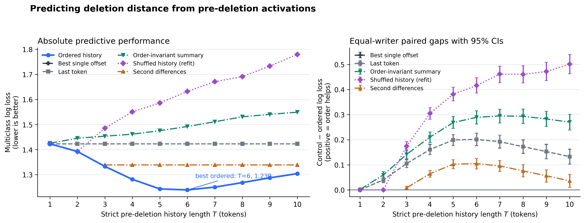

# Aniket's semi-synthetic task candidates

_Reviewer-stage mini-writeup, July 26. These are controlled tasks constructed
from real human language behavior. Deletion destination has passed its
exact-token and raw-activation gates; the other results remain task-side gates._

## Recommendation

Use **human deletion destination** as the primary candidate and **speech-repair
destination** as the closest backup. Both assign a label to an oriented
location inside a strict pre-event history, so a temporal representation has a
specific job that an endpoint or order-invariant bag cannot perform. They also
support the reviewer's requested window sweep and shuffle/reversal controls.

Neither current result is evidence that a TXC has already succeeded on the
task. Deletion destination establishes ordered signal in raw subject-model
activations, while the frozen TXC-versus-SAE comparison remains a separate
gate. Speech repair currently establishes only that its exact-token task
contains ordered information.

## 1. Human deletion destination

[Tian, Crossley, and Van Waes
(2025)](https://doi.org/10.17239/jowr-2025.17.01.02) release KLiCKe, 4,992
keystroke logs with exact insertions, removals, cursor positions, and
timestamps. Immediately before a consecutive trailing deletion burst, the
task observes the last \(T\) units of the current document and predicts how far
back the writer will delete. This is analogous to backtracking because the
target is a destination within the preceding path rather than a property of
the whole essay.

The conservative lexical reconstruction yields 21,943 globally deduplicated
events from 3,923 writers. In writer-held-out evaluation, ordered five-word
history reaches 1.154 log loss, versus 1.214 for the endpoint, 1.206 for an
order-invariant bag, and 1.226 when the ordered model is reversed at test.
Ordered loss improves monotonically from 1.214 at \(T=1\) to 1.154 at \(T=5\).

The reviewer-stage experiment replaces words with exact Llama-3.1-8B-base
tokens. It requires the post-deletion token sequence to be an exact prefix of
the pre-deletion sequence and globally deduplicates the final ten-token
history, leaving 6,224 events from 2,510 writers. Each prefix is teacher-forced
with unpadded singleton inference, and repeated shortest/longest-prefix
forwards agree bit-for-bit at layer 10.

In writer-grouped five-fold evaluation, ordered raw activations improve from
1.423 log loss at \(T=1\) to 1.239 at \(T=6\), then degrade to 1.304 at
\(T=10\). At \(T=6\), the endpoint is 1.423, an order-invariant mean/std/max
summary is 1.492, explicit second differences are 1.339, and a probe retrained
on shuffled histories is 1.632. Equal-writer endpoint-minus-ordered log loss is
.201 [.177, .226], invariant-minus-ordered is .289 [.263, .315], and
retrained-shuffle-minus-ordered is .416 [.386, .447]. Balanced accuracy is
.475 ordered versus .326 at the endpoint.

The original lexical 2/3/4/5+ target is weaker: it reaches 1.175 at \(T=4\)
but does not significantly beat the train-selected best single offset. The
capped token-distance label is therefore the primary benchmark. The next gate
is a frozen TXC-versus-identically-exposed-SAE comparison on this exact cohort.

**Why it is useful:** the event boundary and destination are mechanical,
independent of model-generated reasoning, and available at scale.

**Main risk:** the human deletion decision may depend on unobserved cognitive
state, and a frozen TXC may fail to preserve the ordered signal visible to a
dense raw probe. Any such null should stop the task from being presented as a
TXC result.

## 2. Speech-repair destination

[Hough and Schlangen
(2017)](https://aclanthology.org/E17-1031/) represent an incremental speech
repair as a path through reparandum, optional interregnum, and repair states.
Using their public Switchboard annotations, the task stops strictly before the
first repair word and predicts which of the preceding subject-model tokens
began the reparandum. It is a literal local backtracking destination with no
future repair word in the input.

The exact-token cohort contains 7,071 deduplicated repairs from 597
conversations. At \(T=5\), ordered token history reaches 1.000 log loss versus
1.076 for the endpoint, 1.119 for an invariant bag, and 1.240 under held-out
reversal. Ordered loss improves monotonically from 1.076 at \(T=1\) to 1.000
at \(T=5\).

**Why it is useful:** exact model-token alignment is already complete, the
label is a directed offset, and the task is the closest natural-language
analogue of the paper's backtracking case study.

**Main risk:** repeated words and explicit edit terms may solve the task
lexically. The activation experiment must retain those baselines and group all
examples from a conversation together.

## Backup: reading-regression destination

The [Provo Corpus](https://doi.org/10.3758/s13428-017-0908-4) records where
human readers launch and land regressive saccades. A controlled version uses
the final five candidate words before a regression source and predicts which
candidate is the destination. On 20,091 events, the ordered lexical model
reaches 0.840 log loss versus 0.889 for an invariant view and 0.852 for an
explicit first-difference control, with reader-, passage-, and source-grouped
checks preserving the advantage.

This is a strong third candidate, but it requires word-to-subtoken alignment
and participant nuisance controls. Given the rebuttal deadline, deletion and
speech repair have clearer execution paths.
