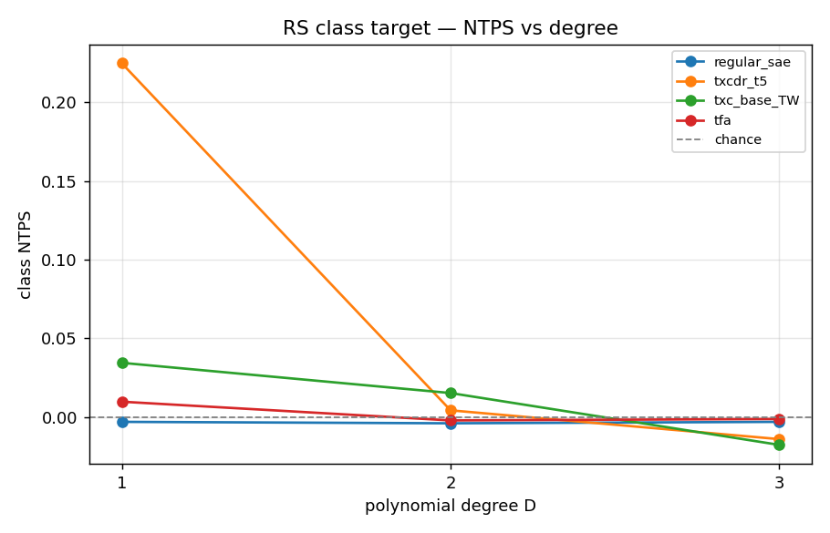
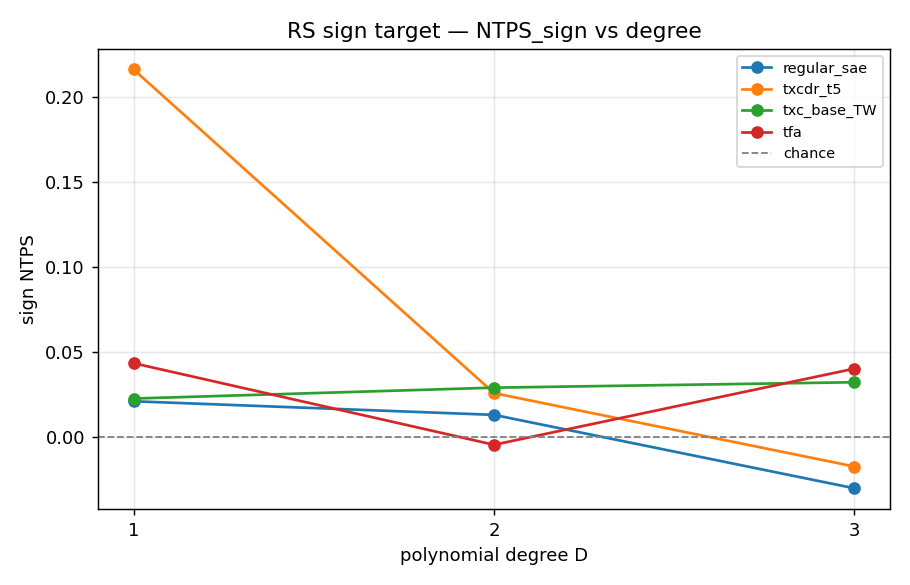
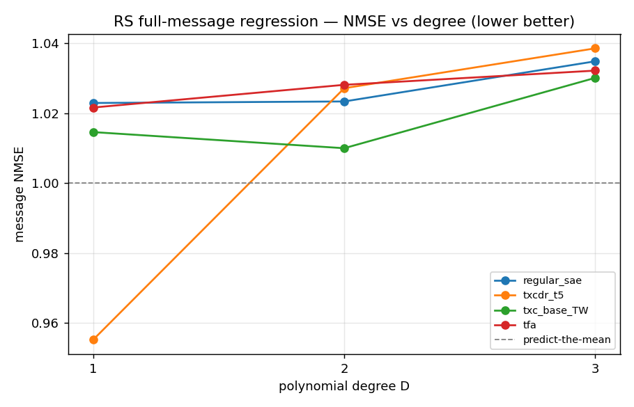
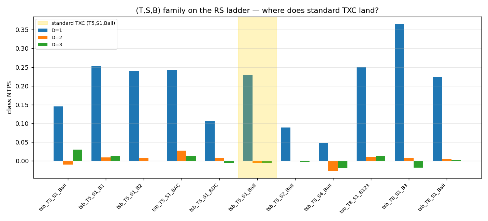
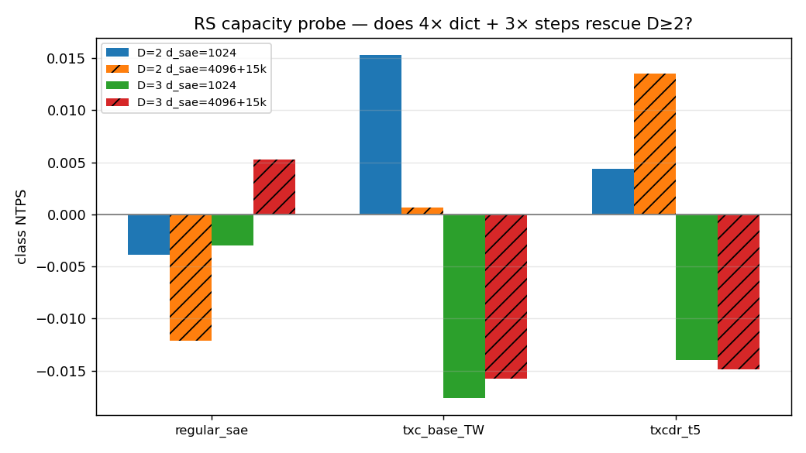

## Reed–Solomon temporal encoding — results

Companion to `reed_solomon_plan.md`. The plan's construction, resolved with
Dmitry (degree-$D$ polynomial phase, all three readout targets, unbiased
$(T,S,B)$ sweep) is run here. Driver
`experiments/reed_solomon/sweep.py`; analysis
`experiments/reed_solomon/analyze.py`; plots in
`results/reed_solomon/`. 51 cells, 2× A40, all through the canonical
`run_experiment` pathway (experiment `freq_bench`, protocol 1.3.0).

### Bottom line

The Reed–Solomon degree ladder is a **capability cliff at 1st → 2nd order**.
Degree 1 (which *is* the AC bench) is solvable — and only by the sliding-$T$
temporal crosscoder. **Degree 2 and 3 collapse to chance for every
architecture**, including TXC, TFA, and the per-token SAE — and a capacity
probe (4× dictionary, 3× steps) does **not** rescue them, so the collapse is
structural, not an under-training artefact. The unbiased $(T,S,B)$ sweep
places the *standard* TXC configuration **mid-pack** at degree 1: band-
restricted variants beat it.

This is the honest version of Dmitry's "TXC wins by construction" intuition:
TXC does win the degree-1 ladder over the baselines, but (a) the win is
narrow and band-tunable, and (b) the construction stops being solvable by
*anything* we have at degree ≥ 2 — which is itself the most informative
result.

### 1. The degree ladder — class target (NTPS)

| arch | D=1 | D=2 | D=3 |
|---|---|---|---|
| per-token `regular_sae` | −0.00 | −0.00 | −0.00 |
| sliding `txcdr_t5` | **+0.22** | +0.00 | −0.01 |
| joint `txc_base_TW` | +0.03 | +0.02 | −0.02 |
| `tfa` | +0.01 | −0.00 | −0.00 |

At $D{=}1$ the sliding-$T{=}5$ crosscoder is the only arch above chance
(+0.22 on the 8-way leading-coefficient class; the AC sign analog is the
sign target below). $D{=}1$ reproduces the AC bench, as designed — the
generator's degree-1 case is literally $\phi(t)=m_0+m_1 t$. At $D \ge 2$
every architecture sits at chance.

### 2. Sign and full-message targets agree

All three readouts (Q2: "do all three") were computed on the *same* trained
code. They tell one story.

- **Sign of the leading coefficient** (binary): sliding-$T5$ +0.22 at $D{=}1$,
  chance at $D \ge 2$ — same shape as the class target.
- **Full-message regression NMSE** (RidgeCV, so bounded ≈ 1 = predict-the-
  mean): the *only* cell that dips below 1 is $D{=}1$ sliding-$T5$
  (`nmse_msg`=0.96, `nmse_lead`=0.91 — partial recovery of the message).
  Every $D \ge 2$ cell and every per-token cell sits at ≈ 1.02–1.06 (no
  recovery). The regression target independently confirms: information about
  the polynomial is linearly readable only at $D{=}1$, only from the sliding
  encoder.

### 3. Unbiased $(T,S,B)$ sweep — where does standard TXC land?

Run without assuming TXC's standard config is optimal (Q3). At $D{=}1$:

| $(T,S,B)$ cell | NTPS | note |
|---|---|---|
| `T8_S1_B3` (band {3} only) | **0.37** | best — single high band |
| `T5_S1_B1` | 0.25 | |
| `T8_S1_B123` | 0.25 | |
| `T5_S1_BAC` ({1,2}) | 0.24 | |
| `T5_S1_B2` | 0.24 | |
| **`T5_S1_Ball` (standard TXC)** | **0.23** | ← mid-pack |
| `T8_S1_Ball` | 0.22 | |
| `T3_S1_Ball` | 0.15 | window too short |
| `T5_S1_BDC` (band {0} only) | 0.11 | DC-only, FreqFrac 0 |
| `T5_S2_Ball` (stride 2) | 0.09 | sliding → joint |
| `T5_S4_Ball` (stride 4) | 0.05 | |

Two clean axes, consistent with `spectral_family.md`:
- **Band restriction *helps*.** Single non-DC bands (`B3`, `B1`) and AC-only
  subsets outperform full-band TXC — the encoder isn't spending capacity on
  bands the linear probe can't read. The standard $B{=}$all config is *not*
  the best point in the family.
- **Stride degrades monotonically** ($S$ 1 → 2 → 4: 0.23 → 0.09 → 0.05),
  the $\sqrt{(W-T)/S+1}$ SNR loss as sliding collapses toward joint.

At $D{=}2$ and $D{=}3$ **every** $(T,S,B)$ cell is at chance — band/stride
tuning cannot recover a degree the architecture can't represent.

### 4. Capacity probe — the D≥2 collapse is structural

The obvious objection to the $D \ge 2$ collapse is under-training. We probed
$D{=}2,3$ at **4× dictionary ($d_\text{sae}{=}4096$) and 3× steps (15k)** for
the per-token control and both window archs:

| arch (D=2) | NTPS @1024/5k | NTPS @4096/15k |
|---|---|---|
| `regular_sae` | −0.00 | −0.01 |
| `txcdr_t5` | +0.00 | +0.01 |
| `txc_base_TW` | +0.02 | +0.00 |

No movement (D=3 identical). `nmse_msg` stays ≈ 1.03–1.06. **The collapse is
not a capacity or training-budget artefact** — degree-≥2 polynomial phase is
not recovered by any of these SAE architectures at this problem scale.

### 5. Predicted vs measured (pre-registration)

The plan pre-registered "TXC wins the ladder; higher D worse for the
baselines." Outcome: half right, with a sharper twist —
- ✅ $D{=}1$: sliding TXC wins over per-token / joint / TFA (true by
  construction, as Dmitry noted).
- ❌/➕ Higher $D$ is worse for **everything**, not just the baselines —
  including TXC. The degree ladder is a wall for the whole architecture
  family at this scale, which is a stronger and more useful statement than
  "TXC beats the baselines."
- ➕ Band restriction beats full-band TXC at $D{=}1$ (unpredicted; matches
  the `spectral_family.md` finding on AC).

### 6. Implications + open questions

1. **For the paper.** RS gives a clean, honest figure: a degree axis along
   which the temporal-vs-per-token gap exists at $D{=}1$ and *closes (at
   chance) for all archs* at $D \ge 2$. Pair it with the non-by-construction
   benches (alternate-frequency multitone, direct-sum which-process) where
   the temporal win is real and not by construction (Dmitry's Q4).
2. **Why does $D{=}2$ collapse?** A quadratic phase has temporal structure
   the encoder's FreqFrac *registers* (band cells show FreqFrac → 1.0) yet
   the pooled code carries no readable leading-coefficient signal — the same
   representation-present / readout-absent split as the joint $T{=}W$ AC
   ceiling (`freq_bench_theory.md` §3). Worth a targeted probe: does a
   *symbolic* (finite-difference) readout recover $D{=}2$ from the code,
   i.e. is the info present but nonlinearly encoded?
3. **TXC as a special case (Q3 follow-through).** The $(T,S,B)$ sweep
   confirms standard TXC is one mid-pack point; the band-restricted
   sliding-$T$ point is the better one for this task family. The paper's
   "TXC as a special case of $(T,S,B)$" framing is supported and the
   recommended config is band-restricted, not $B{=}$all.

### Files

- `src/temp_bench/data/reed_solomon_data.py` — generator (+ symbolic oracle).
- `src/temp_bench/evals/freq_bench.py` — RS readouts (protocol 1.3.0).
- `configs/data.yaml` — `rs_D{1,2,3}_W16_s10` + `rs_smoke`.
- `experiments/reed_solomon/{sweep,analyze}.py`.
- `results/reed_solomon/{ntps_by_degree,ntps_sign_by_degree,nmse_by_degree,tsb_where_txc_lands,capacity_probe}.png`, `summary.json`.
