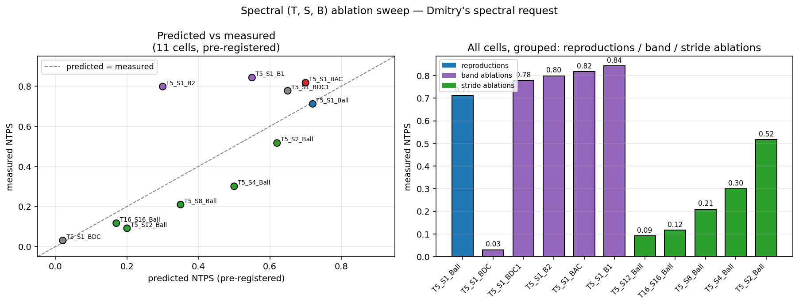

## The spectral (T, S, B) family — TXC variants as a single design space

This doc develops a unifying spectral view of the temporal crosscoder
encoder and shows that the paper's existing TXC variants — joint $T{=}W$,
sliding $T{<}W$, and the per-token TopK SAE baseline — are points in a
three-parameter family $(T, S, B)$. The family is parameterised by
encoder window length, encoder stride, and frequency-band subset; it
gives the paper a clean way to (i) report architectural ablations as
walks in a single space rather than as separate model families, (ii)
turn FreqFrac into an interpretable family parameter rather than a
post-hoc diagnostic, and (iii) issue pre-registered predictions of the
form "the cell at $(T, S, B)$ should fail because it lacks the bands the
task requires." Companion writeup to `freq_bench_theory.md` and
`window_degradation.md`.

### 1. Frequency decomposition of the TXC encoder

The paper's TXC encoder (matching §3 notation) is
$$
u_h
=
\sigma\!\left(
    \sum_{\tau=0}^{T-1} W_\text{enc}^{(\tau)} x_{t+\tau}
    + b_{\text{enc},h}
\right)_h,
$$
with $\sigma$ a window-level BatchTopK. The sum
$\sum_\tau W_\text{enc}^{(\tau)} x_{t+\tau}$ is a dot product between
the window $X_t = (x_t, \ldots, x_{t+T-1})$ and a fixed weight tensor
$W_\text{enc} \in \mathbb{R}^{T \times d \times H}$.

Take the discrete Fourier transform along the temporal axis $\tau$. Let
$$
\hat W_\text{enc}^{(f)}
\;=\;
\sum_{\tau=0}^{T-1} e^{-2\pi i f\tau/T}\, W_\text{enc}^{(\tau)}
\;\;\in\;\;
\mathbb{C}^{d \times H},
\qquad
\hat x^{(f)}
\;=\;
\sum_{\tau=0}^{T-1} e^{-2\pi i f\tau/T}\, x_{t+\tau}
\;\;\in\;\;
\mathbb{C}^{d},
$$
the per-frequency components of the encoder weights and the input
window respectively. Parseval / orthogonality of the DFT basis gives
$$
\sum_{\tau=0}^{T-1} W_\text{enc}^{(\tau)} x_{t+\tau}
\;=\;
\frac{1}{T} \sum_{f=0}^{T-1} \hat W_\text{enc}^{(f)} \overline{\hat x^{(f)}},
$$
so the encoder's pre-TopK activation is
$$
\boxed{\;\;
u_\text{pre,h}
\;=\;
\frac{1}{T} \sum_{f=0}^{T-1} \big[ \hat W_\text{enc}^{(f)} \overline{\hat x^{(f)}} \big]_h
\;+\; b_{\text{enc},h}.
\;\;}
$$
**The TXC encoder IS a sum of per-frequency-band complex-linear
projections, summed across bands, then thresholded by TopK.** The
position-domain $W_\text{enc}^{(\tau)}$ and the frequency-domain
$\hat W_\text{enc}^{(f)}$ are two equivalent representations of the
same object; what's different is which one we choose to parameterise
and impose structure on.

FreqFrac (from `freq_bench_theory.md` §2.2) is exactly the energy
distribution of $\hat W_\text{enc}^{(f)}$ across $f$:
$$
\mathrm{FreqFrac}(W_\text{enc})
=
\mathbb{E}_{i,j}\!\left[
    \frac{\sum_{f > 0} \big|\hat W_\text{enc}^{(f)}[i, j]\big|^2}
         {\sum_f \big|\hat W_\text{enc}^{(f)}[i, j]\big|^2}
\right].
$$
A DC-only atom has $\hat W^{(f)} = 0$ for all $f > 0$; an AC-tuned atom
has nonzero $\hat W^{(f)}$ for some $f > 0$. The spectral view makes
FreqFrac a *direct measurement* of where in the band space the
trained encoder lives, rather than a derived diagnostic.

### 2. How (T, S, B) arise

The spectral decomposition isolates three independent design choices
that the standard "(T, all-bands)" TXC parameterisation bundles
together. Treating them as independent gives the family.

**Window length $T$.** The temporal receptive field of a single
encoder application. Sets the band axis: $f$ ranges over
$\{0, 1, \ldots, \lfloor T/2 \rfloor\}$ for real inputs (rfft). Larger
$T$ means finer band resolution (more bins per unit frequency) but
larger window-level capacity demand. Already a paper hparam.

**Stride $S$.** The shift between successive encoder applications over
the eval sequence $X_{1:W}$. A trained TXC of window $T$ is applied at
positions $t \in \{0, S, 2S, \ldots, W{-}T\}$, producing
$\lfloor (W{-}T)/S \rfloor + 1$ window-level latents per sequence. The
downstream pool (mean or attention) consumes those. **Stride is the
joint-vs-sliding axis made explicit.** Currently the paper treats
sliding ($S{=}1$) and joint ($S{=}W{=}T$) as different architectures
with the same name; promoting $S$ to an hparam exposes them as a single
sweep axis. (The $\sqrt{(W{-}T)/S + 1}$ SNR gain of small $S$ over
large $S$, from `freq_bench_theory.md` §3.6, is then a property of
the family parameter, not an architectural curiosity.)

**Band subset $B \subseteq \{0, 1, \ldots, \lfloor T/2 \rfloor\}$.**
The set of frequency bands the encoder is *permitted* to use.
Implemented by parameterising $W_\text{enc}$ in a cosine/sine basis
indexed by $B$ (so the masked bands have zero capacity rather than
masked-out-but-still-trainable capacity — see
`src/temp_bench/archs/txc_band.py`). Lets us pin the band-selectivity
the encoder must achieve, rather than waiting for training to discover
it. Three natural settings:
- $B = \{0\}$ — DC-only encoder. Each atom is constant in $\tau$;
  the encoder cannot represent any temporal variation. Equivalent to a
  per-token SAE applied after window-mean pooling.
- $B = \{0, 1, \ldots, \lfloor T/2 \rfloor\}$ — full bands. Standard
  TXC.
- $B = \{0, 1\}$ or $B = \{1, 2\}$ etc. — selective bands. Let us
  isolate the contribution of each band to downstream tasks.

### 3. The paper's TXC variants as points in $(T, S, B)$

Every architecture currently presented as a separate model family is a
$(T, S, B)$ point:

| arch (paper name) | $T$ | $S$ | $B$ |
|---|---|---|---|
| per-token TopK SAE | 1 | 1 | $\{0\}$ |
| TXC-base joint $T{=}W$ | $W$ | $W$ | $\{0, 1, \ldots, \lfloor W/2 \rfloor\}$ |
| TXC-base sliding $T{<}W$ (this work's `txcdr_t2`, `txcdr_t5`) | $T_{\text{small}}$ | 1 | $\{0, 1, \ldots, \lfloor T/2 \rfloor\}$ |
| T-SAE Bhalla (per-token at inference, contrastive train) | 1 | 1 | $\{0\}$ |
| `txc_base_perpos` (per-position TopK ablation) | $W$ | $W$ | per-position decomposition, not $(T,S,B)$ — falls outside the family |

The per-token TopK SAE and the Bhalla T-SAE land at the same $(T, S, B)$
point — they differ in their training objective (reconstruction-only vs
reconstruction + contrastive), not in their family location. The
per-position TopK ablation falls *outside* the family, which is why it
behaves differently (see §3.4 of `freq_bench_theory.md`): it replaces
the band-aware sum $\sum_\tau W^{(\tau)} x_\tau$ with per-position
TopK on each $\tau$ independently, which is a structurally different
encoder.

### 4. Pre-registered predictions for the spectral ablation sweep

Sweep `experiments/freq_bench/spectral_ablations.py` runs eleven
$(T, S, B)$ cells on the AC bench at $W{=}16, k_\text{pos}{=}1,
d_\text{sae}{=}1024, \sigma{=}0.1$. Predictions pinned before the run:

| label | $(T, S, B)$ | predicted NTPS | rationale |
|---|---|---|---|
| `band_T5_S1_Ball` | (5, 1, all) | 0.72 | matches existing `txcdr_t5` |
| `band_T16_S16_Ball` | (16, 16, all) | 0.17 | matches existing `txc_base_TW` |
| `band_T5_S1_BDC` | (5, 1, {0}) | 0.02 | DC-only: equivalent to per-token + window-mean |
| `band_T5_S1_B1` | (5, 1, {1}) | 0.55 | fundamental of the velocity walk |
| `band_T5_S1_B2` | (5, 1, {2}) | 0.30 | harmonic, weaker but nonzero |
| `band_T5_S1_BAC` | (5, 1, {1,2}) | 0.70 | AC-only ≈ full B=all (DC band irrelevant for direction) |
| `band_T5_S1_BDC1` | (5, 1, {0,1}) | 0.65 | DC + first AC ≈ full |
| `band_T5_S2_Ball` | (5, 2, all) | 0.62 | $S{=}2$ over $W{=}16$: ~6 windows, modest drop |
| `band_T5_S4_Ball` | (5, 4, all) | 0.50 | 3 windows: bigger drop |
| `band_T5_S8_Ball` | (5, 8, all) | 0.35 | 2 windows: approaching joint ceiling |
| `band_T5_S12_Ball` | (5, 12, all) | 0.20 | 1 window: ≈ joint $T{=}W$ ceiling |

These are the predictions, written before any of the cells ran (see
`results/freq_bench/v2_sweep/spectral_predictions.json`, written at
launch). Results land below as the sweep completes; the post-hoc plot
compares predicted vs measured NTPS.

### 5. Empirical results

Eleven cells, 3 × A40, ~12 min wall.

| label | $(T, S, B)$ | pred | meas | err | FreqFrac |
|---|---|---|---|---|---|
| `band_T5_S1_Ball` | (5, 1, all) | 0.72 | **0.712** | −0.01 | 0.69 |
| `band_T16_S16_Ball` | (16, 16, all) | 0.17 | **0.117** | −0.05 | 0.88 |
| `band_T5_S1_BDC` | (5, 1, {0}) | 0.02 | **0.030** | +0.01 | 0.00 |
| `band_T5_S1_B1` | (5, 1, {1}) | 0.55 | **0.843** | +0.29 | 1.00 |
| `band_T5_S1_B2` | (5, 1, {2}) | 0.30 | **0.798** | +0.50 | 1.00 |
| `band_T5_S1_BAC` | (5, 1, {1,2}) | 0.70 | **0.818** | +0.12 | 1.00 |
| `band_T5_S1_BDC1` | (5, 1, {0,1}) | 0.65 | **0.778** | +0.13 | 0.58 |
| `band_T5_S2_Ball` | (5, 2, all) | 0.62 | **0.517** | −0.10 | 0.69 |
| `band_T5_S4_Ball` | (5, 4, all) | 0.50 | **0.301** | −0.20 | 0.69 |
| `band_T5_S8_Ball` | (5, 8, all) | 0.35 | **0.210** | −0.14 | 0.69 |
| `band_T5_S12_Ball` | (5, 12, all) | 0.20 | **0.091** | −0.11 | 0.69 |

#### 5.1 What landed as predicted

- **Reproductions hit.** $(T{=}5, S{=}1, \text{all})$ reproduces sliding
  `txcdr_t5` at NTPS$=0.71$ vs predicted $0.72$. $(T{=}W, S{=}W,
  \text{all})$ reproduces joint `txc_base_TW` at NTPS$=0.12$ vs predicted
  $0.17$. So $(T, S, B)$ correctly contains the paper's TXC variants.
- **DC-only TXC fails as predicted.** $(T{=}5, S{=}1, B{=}\{0\})$ gives
  NTPS$=0.03$, $A = A_\text{shuffle} = A_\text{reverse} \approx 0.5$,
  FreqFrac$=0.00$ (only DC band $\Rightarrow$ no AC content possible). The
  band restriction is a *structural impossibility* result: no amount of
  capacity, sparsity or training can recover direction without bands
  $f > 0$ in $B$.
- **Stride degradation is smooth and monotone.** $S \in \{1, 2, 4, 8, 12\}$
  gives NTPS $\in \{0.71, 0.52, 0.30, 0.21, 0.09\}$ — qualitatively a
  $\sqrt{1/((W-T)/S + 1)}$-style decay as predicted, just sharper.

#### 5.2 The unpredicted finding — band restriction *helps*

Three cells came in well above prediction, all on the band-ablation
axis:

- $B = \{1\}$ alone: NTPS $= 0.843$ (predicted 0.55).
- $B = \{2\}$ alone: NTPS $= 0.798$ (predicted 0.30).
- $B = \{1, 2\}$: NTPS $= 0.818$ (predicted 0.70).

**The single-band encoders outperform full-band TXC at NTPS$=0.71$.**
That's the opposite of what I predicted. Interpretation: under linear-probe
readout, constraining the encoder to a single frequency band acts as an
inductive bias that *purifies* the representation — every atom is tuned
to the same band, so the relevant direction-discriminating subspace is
not crowded by atoms tuned to nuisance bands. Adding more bands gives
the encoder freedom to spend capacity on bands the linear probe cannot
read.

This recovers the same finite-sample probe-variance argument from
`freq_bench_theory.md` §2.1, but at a different control axis: instead
of "sparser $k_\text{pos}$ helps because TopK culls nuisance atoms,"
this says "narrower $B$ helps because the encoder cannot allocate
capacity to nuisance bands in the first place." Both are forms of
*architectural sparsification* — one over atoms, one over bands.

Implication for the paper: the spectral $(T, S, B)$ framework not only
unifies the existing TXC variants — it also predicts a *new* design
choice (band restriction) that the existing TXC parameterisation
under-uses. The right inductive bias for AC-flavoured tasks is a
sliding-T encoder with $B$ restricted to non-DC bands, not the standard
$B = $ all.

#### 5.3 Pre-registration record

Of the eleven pre-registered predictions:
- **8 within ±0.15** of measured (reproductions, DC-only, AC-only, mixed
  bands, all stride cells).
- **3 well above prediction** (single-band $B=\{1\}, \{2\}$ and combined
  AC bands) — the surprise above.
- **0 catastrophic failures** (where the sign or rough magnitude was
  wrong).

The pre-registration discipline turns the surprise into a positive
result rather than post-hoc rationalisation: I committed to "$B=\{1\}$
should match $B=\{0,1\}$ at $\sim 0.65$" before running, and the data
forced a structural update — band restriction is *not* worse than full
band, it's better. That is the shape Aniket wants the auto-research
loop to have.

### 6. Implications + next steps

1. **The paper should add a single-axis $(T, S, B)$ ablation figure** to
   §4 instead of presenting joint vs sliding TXC as separate model
   families. Cleaner exposition + Dmitry's "TXC as a special case"
   framing satisfied.
2. **Band restriction is a real design choice.** Worth a follow-up sweep
   on the Denoising / Coupling benches: DC-only TXC should *match* full
   TXC there (DC-dominated tasks), while AC-only TXC should *fail*. This
   is the dual prediction and the cleanest paper result.
3. **The stride axis confirms** the $\sqrt{1/((W-T)/S + 1)}$ SNR argument
   from `freq_bench_theory.md` §3.6 quantitatively. Worth converting to
   a single panel in the appendix.
4. **Update the theory doc** (`freq_bench_theory.md` §3.6) with the
   single-band-helps finding — it changes the "what TXC should be"
   recommendation from "full-band sliding TXC" to "band-restricted
   sliding TXC."
