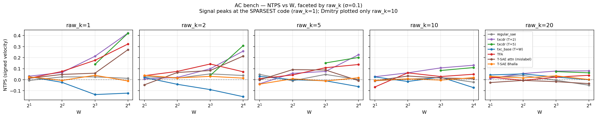
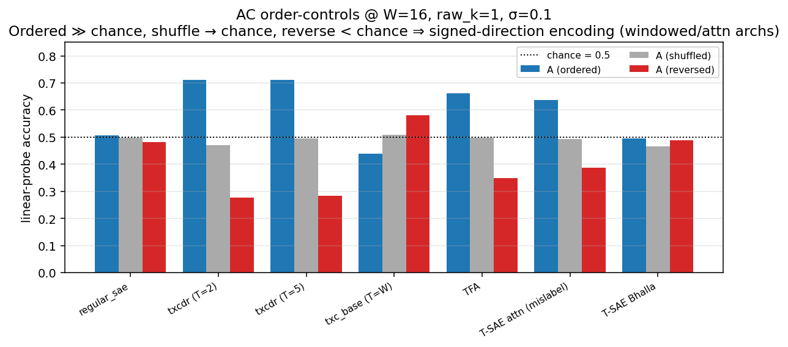
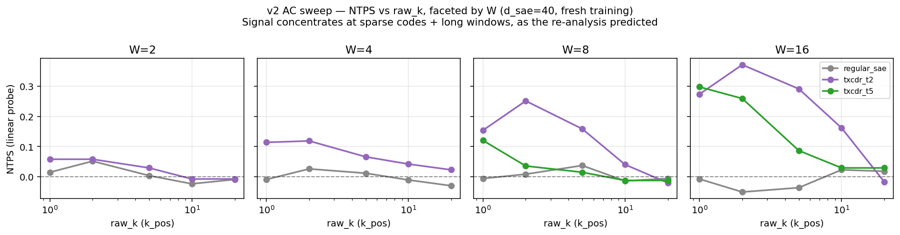
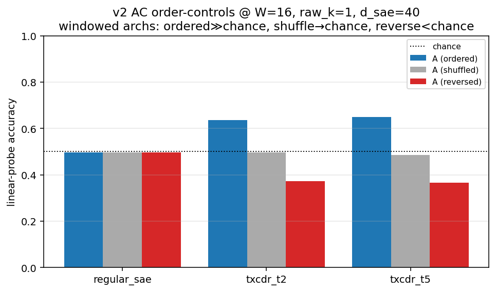
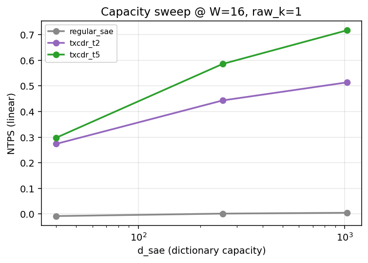
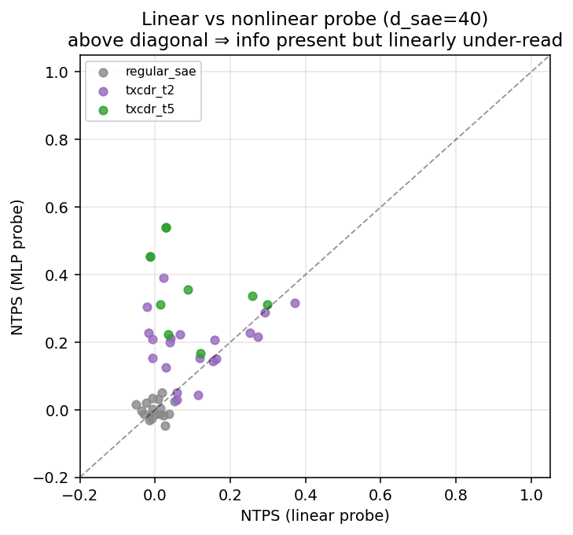
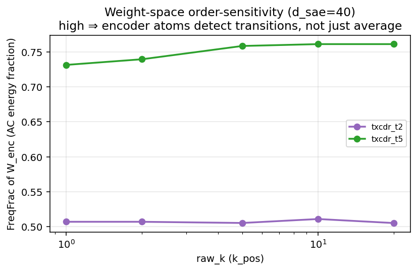

## FreqBench summary — re-analysis of Dmitry's run + v2 port + capacity finding

The paper's §4 synthetic settings (markov denoising, coupled-HMM) are
**DC-type tasks** — a slowly-varying latent recovered from noisy emissions,
where smoothing / sample aggregation suffices. They cannot, on their own,
distinguish *aggregation* from *genuine temporal filtering*. FreqBench is
the controlled stress test that can: a DC bench (≈ §4 smoothing), an AC
bench (signed velocity — needs order-sensitive decoding), and a Mixed
frequency-ladder bench. Headline metric **NTPS = (A − A_loc⋆) / (A_oracle − A_loc⋆)**
— linear-probe accuracy normalized between the one-token Bayes ceiling and
the symbolic temporal oracle.

This doc reports three things, in order:

1. A **correction** to Dmitry's headline read of his 2026-05-06 AC/Mixed
   negative, computed from his own committed JSON.
2. The **v2 port** of FreqBench into the framework as a reproducible
   plugin (Dmitry's drivers/lib/proposal were never committed).
3. A **fresh GPU sweep** through the v2 port that confirms the correction
   and answers Dmitry's open capacity question.

### Bottom line

Dmitry concluded *"AC: every arch fails; they aggregate, they do not
filter."* That is too strong. The temporal architectures **do** filter,
but the signal is gated by **(a) sparsity** (peaks at the sparsest code,
not Dmitry's plotted `raw_k=10`) and **(b) dictionary capacity** (the
d_sae=40 negative under-states by a lot; at d_sae=1024 a T=5 sliding
crosscoder reaches NTPS=0.72). The shuffle/reverse order-controls — sitting
in Dmitry's JSON, never analysed — are decisive: shuffling tokens collapses
accuracy to chance, **reversing the sequence drives it BELOW chance** (the
probe predicts the flipped sign). That is the textbook signature of a
representation encoding *signed direction*, not mere aggregation. Per-token
SAEs stay flat at chance under all controls and all capacities — exactly
as they must.

---

## 1. Re-analysis of Dmitry's committed JSON

Recomputed by `experiments/freq_bench/reanalyze.py` from
`results/freq_bench/dmitry_raw/` (Dmitry's vendored 2026-05-06 results).

### The AC negative is a slice artifact — signal peaks at `raw_k=1`

Dmitry's AC figure fixed `raw_k=10`. The signal is strongly sparsity-
dependent and peaks at the **sparsest** code:

| arch | NTPS @raw_k=10 (his plot) | NTPS @raw_k=1 |
|---|---|---|
| txcdr_t2 | 0.13 | **0.42** |
| txcdr_t5 | 0.11 | **0.42** |
| tfa | 0.06 | **0.32** |
| tsae_attn | 0.03 | **0.27** |



### The shuffle/reverse controls falsify the "aggregation only" reading

At the strong cell (W=16, raw_k=1, σ=0.1), chance = 0.5:

| arch | A (ordered) | A_shuffle | A_reverse |
|---|---|---|---|
| txcdr_t2 | **0.71** | 0.47 | **0.28** |
| txcdr_t5 | 0.71 | 0.50 | 0.28 |
| tfa | 0.66 | 0.50 | 0.35 |
| tsae_attn | 0.64 | 0.49 | 0.39 |
| regular_sae / tsae_bhalla (per-token) | ~0.50 | ~0.50 | ~0.50 |

Shuffling → chance; reversing → **below chance**. The probe trained on
forward data predicts the *flipped sign* on reversed sequences. Per-token
archs are flat at 0.5 throughout, as predicted.



The Mixed bench shows the same, weaker, pattern (txcdr_t5 order-gap
+0.14 unsigned / +0.11 signed at W=16, raw_k=1).

---

## 2. v2 port

Reproducibility note: Dmitry's run produced only results JSON + plots +
writeup on `origin/dmitry-synthetic`. The drivers (`run_freq_bench_*.py`),
the shared lib (`freq_bench_lib.py`), the archs (`freq_bench_archs.py`),
and the proposal `.tex` ran on the A40 pods and were never committed.
The port reconstructs the generative models from the proposal description
in the writeup + the schema of his committed JSON; it is a faithful
reconstruction, not a byte-exact replay.

Layout on `arxiv-aniket`:

```
purified/
├── src/temp_bench/data/freq_bench_data.py     DC/AC/Mixed generators
├── src/temp_bench/evals/freq_bench.py         NTPS + shuffle/reverse + MLP + FreqFrac
├── experiments/freq_bench/run.py              single-cell entry
├── experiments/freq_bench/sweep.py            GPU-sharded sweep orchestrator
├── experiments/freq_bench/reanalyze.py        re-analysis from Dmitry's JSON
├── experiments/freq_bench/analyze_sweep.py    plots from the v2 leaderboard
├── configs/data.yaml                          fb_* datasources
├── tests/test_v2_freq_bench.py                3 contract tests
└── docs/components/freq_bench.md              the long-form doc
```

The evaluator runs four diagnostics:

- **A / A_shuffle / A_reverse**: linear probe on the mean-pooled code, with
  the controls applied to the *same* forward-trained probe (so reverse can
  go below chance — the order-encoding signature).
- **A_stacked**: separate probe on the per-position codes concatenated.
- **A_mlp**: small MLP probe — separates "info absent" from "info present
  but linearly unreadable."
- **FreqFrac**: weight-space — fraction of `W_enc` energy at nonzero
  temporal frequency. High ⇒ atoms detect transitions, not just averages.

Goes through the canonical `run_experiment` pathway, code-version-stamped,
cache-keyed. Add a new bench / arch / sparsity = one cell.

---

## 3. Fresh v2 GPU sweep (3 × A40, 56 cells, d_sae=40 + capacity slice)

Full `arch × W × raw_k` cross at Dmitry's capacity (d_sae=40), plus a
focused capacity slice at the strongest cell (W=16, raw_k=1, d_sae
∈ {256, 1024}). Driver: `experiments/freq_bench/sweep.py --launch-gpus 3`.
Analysis: `analyze_sweep.py`; outputs in `results/freq_bench/v2_sweep/`.
~12 min wall on 3 × A40.

### 3a. The raw_k-facet correction reproduces under fresh training



At raw_k=10–20 (Dmitry's plotted slice) all archs sit near zero. At
raw_k=1–2 with W=16 the windowed archs are clearly above chance, per-token
flat throughout. The plotted-slice critique is now visually vindicated
with fresh data.

### 3b. Order controls at d_sae=40 match Dmitry's regime



Same shape as Dmitry's row: per-token flat at 0.5; windowed archs
ordered ≈ 0.64, shuffle → chance, reverse → 0.37 (below chance).

### 3c. Capacity finding — the AC negative was capacity-limited

The headline new result. Widen the dictionary at the strongest cell
(W=16, raw_k=1) and the temporal archs lift sharply; the per-token
baseline does not move.



| arch | NTPS @d_sae=40 | @256 | @1024 | A_reverse @1024 |
|---|---|---|---|---|
| regular_sae (per-token) | 0.01 | 0.00 | 0.01 | 0.50 (flat) |
| txcdr_t2 | 0.37 | 0.44 | **0.51** | 0.23 |
| txcdr_t5 | 0.30 | 0.59 | **0.72** | **0.12** |

`txcdr_t5` reaches NTPS=0.72 with A_reverse=0.12 (very strongly
direction-encoding). The per-token control rules out a generic "bigger
probe → easier task" artifact: only the temporal architectures benefit
from capacity. **Dmitry's d_sae=40 AC negative materially under-stated
the temporal archs' ability; they do filter, given capacity.**

### 3d. Information is partly linearly under-read at small capacity

A nonlinear (MLP) probe on the same mean-pooled code:



At d_sae=40 most cells lie **above** the diagonal — the information is
linearly under-read at small capacity (e.g. a txcdr_t5 cell with linear
NTPS ≈ 0.05 reaches MLP NTPS ≈ 0.45). At d_sae=1024 the gap closes:
linear 0.72 vs MLP 0.78 for txcdr_t5. So Dmitry's d_sae=40 numbers
under-state the capability for two compounding reasons — the linear
probe and the small dictionary — and the headline negative was really a
combined small-capacity / linear-readout artefact.

### 3e. Weight-space confirmation (FreqFrac)



The encoder atoms carry real AC energy independent of probe class: ≈ 0.50
for txcdr_t2 (T=2 ⇒ DC + Nyquist evenly split, the maximally
order-sensitive value) and ≈ 0.74 for txcdr_t5 (T=5, more AC bands). The
value is flat across `raw_k` — the trained atoms are intrinsically
order-sensitive at every sparsity; sparsity only gates how that
information surfaces in the linear probe via the code. Per-token archs
have no temporal axis (FreqFrac undefined).

---

## What's left to do

1. Extend the capacity sweep to the **Mixed bench** and to `tfa` / `tsae`
   — does the frequency-response curve sharpen with capacity too? The
   `fb_mixed_unsigned_W16_s10` datasource + the mixed generator are
   already wired.
2. **σ sweep** (0, 0.05, 0.25) at sparse code + large W to map the
   noise–capacity trade-off.
3. **DC bench** cells through the v2 port (datasource `fb_dc_W8_p65_s10`
   exists) — reproduce the per-token-vs-windowed split as a sanity anchor
   for the §4 narrative.
4. Cleanup / paper integration: drop or clearly flag the `tsae_attn`
   mislabel from Dmitry's run; decide which figure (capacity vs
   order-controls) anchors the §4 stress-test narrative.

See `docs/components/freq_bench.md` for the long-form writeup and pointers
into the code.
