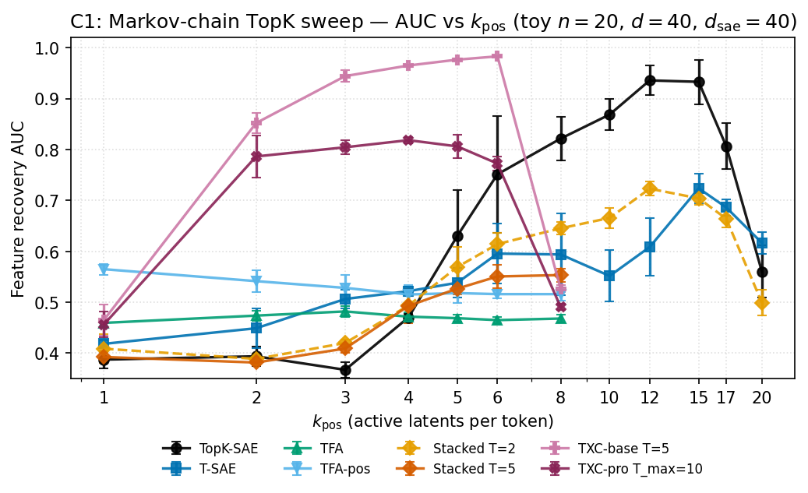

## Hypothesis

At low per-token sparsity (k < expected L0), TXC-style architectures recover
true feature directions more cleanly than per-token SAEs because their
shared latent forces position-consistent feature assignments.

## Setup

- **Data**: Two-state Markov-chain support (Phase 2 Scheme C). $n=20$
  features, $d=40$, $\pi=0.5$, $\rho \in \{0.0, 0.3, 0.5, 0.7, 0.9\}$
  (4 features per level), $T=64$. Input scaled so $\mathbb{E}[\|x\|]=\sqrt{d}$.
- **Models**: TopK-SAE, T-SAE (paper config), TFA, TFA-pos, Stacked-SAE
  (T=2, T=5), TXC-base (T=5), TXC-pro (T_max=10, t_sample=5).
- **Hardware**: 5090 (~10 min/seed/k), Agent PAPER local.
- **k sweep**: {1, 2, 3, 4, 5, 6, 8, 10, 12, 15, 17, 20}.
- **Seeds**: {1, 2, 42}.
- **Training**: 30k steps, plateau early-stop.

## Results

<!-- BEGIN AUTO-RESULTS -->

**Headline: feature recovery AUC vs k_pos**

| arch | T | k=1 | k=2 | k=3 | k=4 | k=5 | k=6 | k=8 | k=10 | k=12 | k=15 | k=17 | k=20 |
|---|---|---:|---:|---:|---:|---:|---:|---:|---:|---:|---:|---:|---:|
| `topk_sae` | default | 0.387±0.017 | 0.394±0.019 | 0.367±0.015 | 0.470±0.007 | 0.631±0.089 | 0.751±0.115 | 0.821±0.043 | 0.869±0.031 | 0.936±0.029 | 0.933±0.044 | 0.807±0.045 | 0.561±0.051 |
| `tsae_paper` | default | 0.418±0.007 | 0.449±0.039 | 0.506±0.018 | 0.522±0.009 | 0.538±0.030 | 0.596±0.059 | 0.594±0.081 | 0.552±0.051 | 0.609±0.057 | 0.724±0.029 | 0.686±0.016 | 0.617±0.021 |
| `tfa` | default | 0.460±0.006 | 0.474±0.010 | 0.482±0.011 | 0.472±0.009 | 0.469±0.007 | 0.465±0.006 | 0.468±0.008 | — | — | — | — | — |
| `tfa_pos` | default | 0.565±0.011 | 0.541±0.021 | 0.528±0.025 | 0.515±0.018 | 0.518±0.019 | 0.516±0.009 | 0.516±0.013 | — | — | — | — | — |
| `stacked_sae` | T=2 | 0.409±0.028 | 0.389±0.011 | 0.420±0.007 | 0.494±0.020 | 0.569±0.039 | 0.614±0.022 | 0.645±0.012 | 0.666±0.019 | 0.723±0.014 | 0.704±0.012 | 0.664±0.017 | 0.499±0.025 |
| `stacked_sae` | default | 0.393±0.010 | 0.382±0.005 | 0.409±0.008 | 0.493±0.034 | 0.527±0.012 | 0.551±0.023 | 0.553±0.013 | — | — | — | — | — |
| `txc_base` | default | 0.465±0.031 | 0.852±0.020 | 0.944±0.011 | 0.965±0.002 | 0.977±0.002 | 0.983±0.001 | 0.527±0.007 | — | — | — | — | — |
| `txc_pro` | default | 0.456±0.025 | 0.786±0.041 | 0.804±0.014 | 0.818±0.006 | 0.806±0.023 | 0.772±0.013 | 0.491±0.006 | — | — | — | — | — |

_Cells aggregated over seeds; n shown per cell. Filter: `component='c1'`, `smoke=False`. Skipped cells (k_train > arch budget at toy d_sae=40) appear as `—`._



<!-- END AUTO-RESULTS -->

## Caveats

- Feature-recovery AUC averages decoder columns across positions for window
  archs. Phase 2 found this can hide per-position alignment for Stacked-SAE.
- TFA's predictable component is dense (~20 nonzero codes); we report
  *novel L0* and *total L0* separately in plots.

## Reproduction

```bash
cd purified && TQDM_DISABLE=1 .venv/bin/python -m experiments.c1_synthetic_topk.run \
    --seeds 1 2 42 --output results/runs/
```

## Provenance

Reference logs (read-only, do not import):
- `docs/han/research_logs/phase2_toy_experiments/2026-03-30-experiment1-topk-sweep.md`
- `docs/han/research_logs/phase2_toy_experiments/2026-03-30-synthesis.md`
