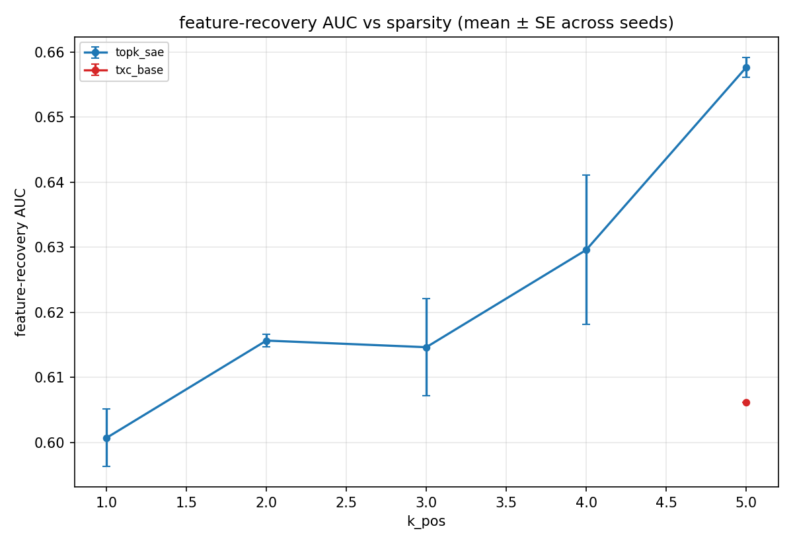

# C1 Synthetic TopK — paper-ready results (auto-generated)

_Last refreshed: 2026-05-07T01:07:05+00:00_

## Setup

- Datasource: `toy_markov_n20_d40_full` (Markov-chain support, `n_features=20`, `d_in=40`, `seq_len=8`, `n_seqs=4096`, `pi=0.10`).
- Sweep: 8 archs × 12 `k_pos` values (1–20) × 3 seeds.
- Metric: feature-recovery AUC against the 20 ground-truth orthogonal directions (per-feature max cosine ≥ τ, integrated over τ ∈ [0, 1]).
- Driver: `experiments/c1_synthetic_topk_full/run.py` (routes through `temp_bench.data.toy_full.api`, isolated from agent_filler's `toy_markov_n20_d40` cache via distinct `act_cache_key`).

Currently 21 cells across 2 (arch, T) configurations; seeds-per-cell range = [1, 2].

## Headline (peak AUC over k_pos)

| arch | T | k\* | AUC (mean ± SE) | n seeds |
|------|---|----|---------------------------|---------|
| `topk_sae` | — | 5 | 0.658 ± 0.002 | 2 |
| `txc_base` | — | 5 | 0.606 ± 0.000 | 1 |

## AUC vs k_pos

## Per-cell mean (averaged across seeds)

| arch (T) | k=1 | k=2 | k=3 | k=4 | k=5 |
|---|---|---|---|---|---|
| `topk_sae` | 0.601 | 0.616 | 0.615 | 0.630 | 0.658 |
| `txc_base` | — | — | — | — | 0.606 |
