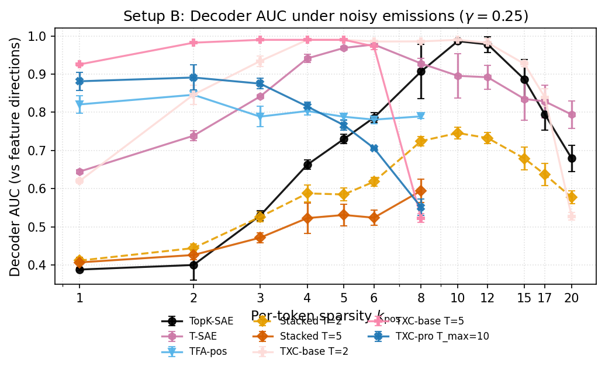
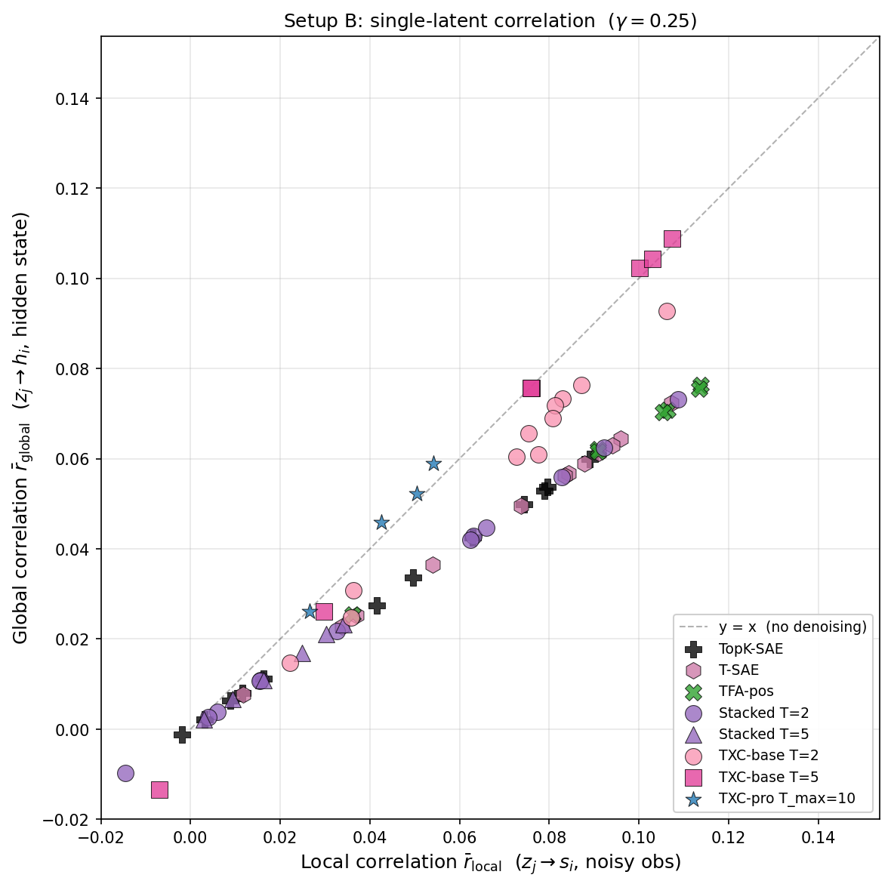
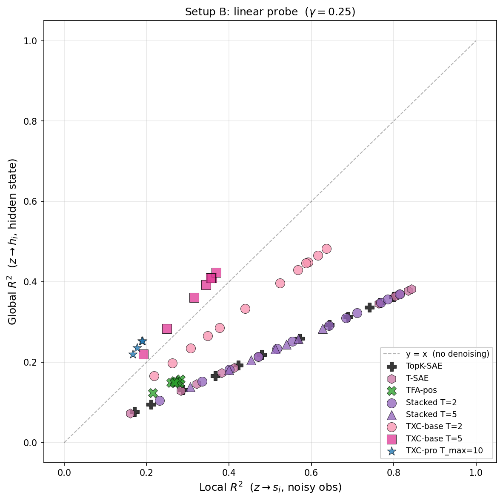
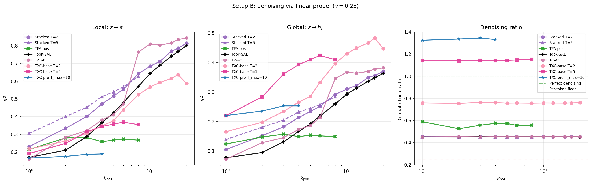
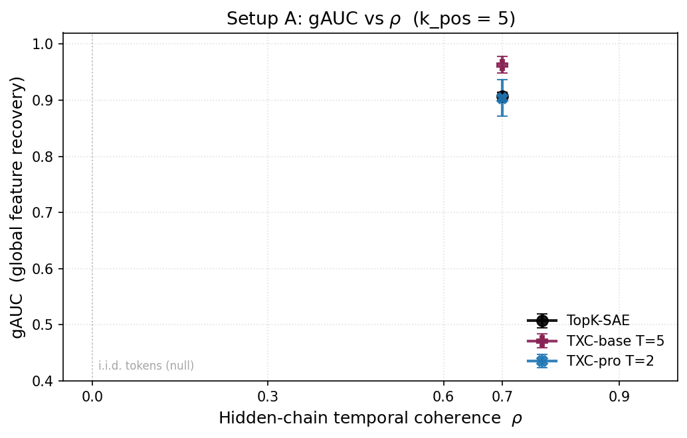
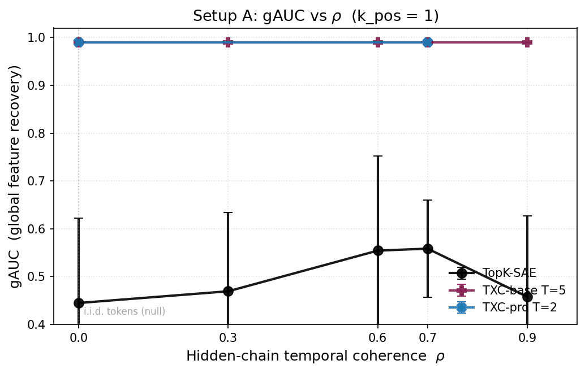

## Hypothesis

Per-token SAEs recover the features they *see* on each token. When
the data-generating process has hidden structure beyond what a single
token reveals, SAEs miss it. Temporal architectures that aggregate
across positions can recover that hidden structure.

C2 tests this in two synthetic regimes:

- **Setup A — coupled features**: emissions are deterministic OR-gates
  of K hidden Markov chains. Hidden = the K hidden chain directions;
  per-token SAEs recover the M emission directions and miss the
  hidden K.
- **Setup B — noisy emissions**: emissions are stochastic Bernoulli
  observations of independent Markov chains. Hidden = the noise-free
  underlying state; per-token SAEs track the noisy observation, while
  temporal models can *denoise* by aggregating multiple observations
  of the same hidden state.

Both setups share the metric framework (decoder AUC, single-latent
correlation, linear probe R²) but apply it to different ground-truth
targets.

## Setup A — Coupled features

K=10 hidden Markov chains drive M=20 emissions through a fixed binary
coupling matrix C ∈ {0,1}^{20×10} with $n_{\text{parents}} = 2$.
Emission $j$ fires when ANY parent is active (OR gate).

| Knob | Value |
|---|---|
| K, M (hidden, emissions) | 10, 20 |
| ρ, π                      | 0.7, 0.05 |
| d (residual), d_sae       | 256, 40 |
| Magnitudes                | folded $\mathcal{N}(1, 0.15)$ |
| seq_len T                 | 64 |
| Models                    | TopK, Stacked T={2,5}, TXC-base T=5, TXC-pro T_max ∈ {2, 5, 12} |
| k sweep                   | {1, 2, 3, 4, 5, 6, 8, 10, 12, 15, 17, 20} |
| Seeds                     | {1, 2, 42} |

**Datasource**: `toy_coupled_K10_M20_d256`.
**Two ground truths**: 20 emission directions (local), 10 hidden
chain directions (global = normalized mean of children).
**Headline metric**: gAUC — alignment of decoder columns with the 10
hidden chain directions.

### Results — Setup A

<!-- BEGIN AUTO-RESULTS -->

**Headline: gAUC (global feature recovery) vs k_pos**

| arch | T | k=1 | k=2 | k=3 | k=4 | k=5 | k=6 | k=8 | k=10 | k=12 | k=15 | k=17 | k=20 |
|---|---|---:|---:|---:|---:|---:|---:|---:|---:|---:|---:|---:|---:|
| `topk_sae` | default | 0.559±0.101 | 0.990±0.000 | 0.990±0.000 | 0.963±0.008 | 0.907±0.007 | 0.840±0.022 | 0.754±0.029 | 0.697±0.011 | 0.690±0.022 | 0.673±0.006 | 0.652±0.007 | 0.606±0.036 |
| `tsae_paper` | default | 0.898±0.011 | 0.860±0.034 | 0.866±0.027 | 0.902±0.018 | 0.833±0.011 | 0.846±0.003 | 0.835±0.022 | 0.844±0.028 | 0.861±0.028 | 0.871±0.042 | 0.872±0.005 | 0.869±0.004 |
| `stacked_sae` | T=2 | 0.475±0.061 | 0.764±0.051 | 0.741±0.010 | 0.746±0.023 | 0.697±0.019 | 0.661±0.020 | 0.631±0.026 | 0.625±0.028 | 0.567±0.043 | 0.556±0.014 | 0.531±0.005 | 0.551±0.022 |
| `stacked_sae` | default | 0.403±0.008 | 0.616±0.034 | 0.629±0.006 | 0.631±0.027 | 0.607±0.011 | 0.578±0.025 | 0.554±0.038 | — | — | — | — | — |
| `txc_base` | default | 0.990±0.000 | 0.990±0.000 | 0.989±0.001 | 0.963±0.006 | 0.963±0.014 | 0.908±0.022 | 0.748±0.039 | — | — | — | — | — |
| `txc_pro` | T=2 | 0.990±0.000 | 0.990±0.000 | 0.989±0.001 | 0.931±0.021 | 0.904±0.032 | 0.886±0.041 | 0.807±0.055 | 0.679±0.066 | 0.631±0.104 | 0.490±0.022 | 0.476±0.034 | 0.352±0.024 |
| `txc_pro` | T=5 | 0.956±0.020 | 0.914±0.009 | 0.825±0.076 | 0.700±0.126 | 0.684±0.015 | 0.597±0.015 | 0.674±0.048 | 0.604±0.017 | 0.573±0.050 | 0.569±0.018 | 0.548±0.017 | 0.487±0.064 |
| `txc_pro` | T=12 | 0.858±0.041 | 0.842±0.020 | 0.714±0.042 | 0.664±0.062 | 0.678±0.025 | 0.607±0.028 | 0.567±0.014 | 0.591±0.020 | 0.561±0.000 | — | — | — |

**eAUC (emission feature recovery) vs k_pos**

| arch | T | k=1 | k=2 | k=3 | k=4 | k=5 | k=6 | k=8 | k=10 | k=12 | k=15 | k=17 | k=20 |
|---|---|---:|---:|---:|---:|---:|---:|---:|---:|---:|---:|---:|---:|
| `topk_sae` | default | 0.326±0.060 | 0.764±0.014 | 0.783±0.006 | 0.802±0.030 | 0.777±0.027 | 0.817±0.012 | 0.787±0.026 | 0.795±0.020 | 0.800±0.018 | 0.800±0.024 | 0.788±0.069 | 0.752±0.020 |
| `tsae_paper` | default | 0.653±0.035 | 0.711±0.007 | 0.780±0.023 | 0.721±0.008 | 0.670±0.033 | 0.616±0.034 | 0.592±0.029 | 0.564±0.015 | 0.562±0.026 | 0.548±0.011 | 0.556±0.011 | 0.554±0.004 |
| `stacked_sae` | T=2 | 0.313±0.032 | 0.584±0.019 | 0.607±0.017 | 0.614±0.014 | 0.625±0.027 | 0.623±0.025 | 0.621±0.013 | 0.654±0.024 | 0.646±0.027 | 0.634±0.008 | 0.601±0.016 | 0.613±0.008 |
| `stacked_sae` | default | 0.285±0.006 | 0.530±0.030 | 0.545±0.021 | 0.552±0.011 | 0.562±0.020 | 0.578±0.012 | 0.554±0.008 | — | — | — | — | — |
| `txc_base` | default | 0.587±0.004 | 0.591±0.001 | 0.596±0.007 | 0.604±0.011 | 0.614±0.011 | 0.602±0.009 | 0.512±0.011 | — | — | — | — | — |
| `txc_pro` | T=2 | 0.712±0.020 | 0.719±0.022 | 0.750±0.026 | 0.782±0.007 | 0.759±0.029 | 0.763±0.016 | 0.765±0.009 | 0.801±0.052 | 0.777±0.020 | 0.706±0.033 | 0.658±0.005 | 0.526±0.012 |
| `txc_pro` | T=5 | 0.593±0.033 | 0.651±0.015 | 0.673±0.031 | 0.689±0.037 | 0.648±0.016 | 0.693±0.011 | 0.715±0.027 | 0.728±0.017 | 0.727±0.026 | 0.670±0.005 | 0.641±0.031 | 0.573±0.021 |
| `txc_pro` | T=12 | 0.511±0.025 | 0.606±0.009 | 0.565±0.016 | 0.590±0.020 | 0.603±0.040 | 0.619±0.024 | 0.635±0.013 | 0.628±0.019 | 0.612±0.000 | — | — | — |

_Cells aggregated over seeds; n shown per cell. Filter: `component='c2'`, `smoke=False`._

<!-- END AUTO-RESULTS -->

**Headline finding (Setup A)**: TXC variants reach gAUC ≥ 0.95 at
k ≤ 5; per-token archs (TopK, Stacked) saturate at gAUC ≈ 0.7-0.8 in
the same regime. The TXC dictionary recovers hidden chain directions
that per-token SAEs miss.

## Setup B — Noisy independent emissions

20 independent Markov chains $h_i(t)$ with stochastic Bernoulli
emissions: when $h_i = 1$ the observation $s_i$ fires with
probability $p_B = 0.625$ ($\gamma = 0.25$), and never fires when
$h_i = 0$. **No coupling** — each feature has its own chain. Tests
whether temporal models recover the underlying hidden state $h_i$
from the noisy observation $s_i$.

| Knob | Value |
|---|---|
| n_features                | 20 |
| ρ, π                      | 0.7, 0.5 |
| p_A, p_B (γ)              | 0, 0.625 (0.25) |
| d (residual), d_sae       | 40, 40 |
| seq_len T                 | 64 |
| Models                    | TFA-pos, Stacked T={2,5}, TXC-base T={2, 4, 5, 6, 8, 10, 12}, TXC-pro T_max=10 |
| k sweep                   | {1, 2, 3, 4, 5, 6, 8, 10, 12, 15, 17, 20} (auto-skipped where $k_{\rm pos} \cdot T > d_{\rm sae}$) |
| Seeds                     | {1, 2, 42} |

**Datasource**: `toy_markov_n20_d40_noisy`.
**Internal component name**: `c1_noisy` (preserved for leaderboard
provenance; logically part of C2).
**Single ground truth**: 20 feature directions in $\mathbb{R}^{40}$.
**Headline metrics**: AUC (decoder alignment), single-latent
correlation ratio $\bar{r}_{\rm global}/\bar{r}_{\rm local}$ and
linear probe ratio $R^2_{\rm global}/R^2_{\rm local}$ (denoising).

### Results — Setup B

<!-- BEGIN AUTO-RESULTS-c1-noisy -->

**Decoder AUC vs k_pos** (mean ± std over seeds)

| arch | T | k=1 | k=2 | k=3 | k=4 | k=5 | k=6 | k=8 | k=10 | k=12 | k=15 | k=17 | k=20 |
|---|---|---:|---:|---:|---:|---:|---:|---:|---:|---:|---:|---:|---:|
| `topk_sae` | default | 0.388±0.003 | 0.400±0.039 | 0.530±0.013 | 0.663±0.012 | 0.730±0.012 | 0.786±0.014 | 0.907±0.072 | 0.986±0.006 | 0.978±0.021 | 0.886±0.051 | 0.794±0.041 | 0.680±0.034 |
| `tsae_paper` | default | 0.645±0.005 | 0.739±0.013 | 0.841±0.003 | 0.941±0.010 | 0.969±0.003 | 0.978±0.003 | 0.928±0.014 | 0.896±0.059 | 0.892±0.032 | 0.835±0.056 | 0.829±0.043 | 0.794±0.036 |
| `tfa_pos` | default | 0.821±0.023 | 0.846±0.004 | 0.789±0.027 | 0.803±0.010 | 0.788±0.008 | 0.781±0.011 | 0.789±0.006 | — | — | — | — | — |
| `stacked_sae` | T=2 | 0.412±0.009 | 0.445±0.010 | 0.526±0.013 | 0.588±0.022 | 0.585±0.016 | 0.618±0.012 | 0.725±0.012 | 0.746±0.015 | 0.733±0.014 | 0.679±0.030 | 0.637±0.029 | 0.577±0.017 |
| `stacked_sae` | default | 0.407±0.012 | 0.427±0.012 | 0.472±0.013 | 0.523±0.040 | 0.531±0.029 | 0.524±0.019 | 0.595±0.031 | — | — | — | — | — |
| `txc_base` | T=2 | 0.620±0.006 | 0.846±0.025 | 0.934±0.014 | 0.990±0.000 | 0.990±0.000 | 0.985±0.001 | 0.986±0.002 | 0.990±0.000 | 0.982±0.011 | 0.927±0.007 | 0.839±0.023 | 0.528±0.010 |
| `txc_base` | T=4 | — | — | — | — | — | — | — | — | — | — | — | — |
| `txc_base` | default | 0.926±0.004 | 0.982±0.001 | 0.990±0.000 | 0.990±0.000 | 0.990±0.000 | 0.973±0.009 | 0.523±0.011 | — | — | — | — | — |
| `txc_base` | T=6 | — | — | — | — | — | — | — | — | — | — | — | — |
| `txc_base` | T=8 | — | — | — | — | — | — | — | — | — | — | — | — |
| `txc_base` | T=10 | — | — | — | — | — | — | — | — | — | — | — | — |
| `txc_base` | T=12 | — | — | — | — | — | — | — | — | — | — | — | — |
| `txc_pro` | default | 0.881±0.024 | 0.891±0.033 | 0.875±0.014 | 0.815±0.012 | 0.766±0.013 | 0.706±0.002 | 0.551±0.021 | — | — | — | — | — |

_Cells aggregated over seeds. Filter: `component='c1_noisy'`, `smoke=False`. Skipped cells (k_train > arch budget at toy d_sae=40) appear as `—`._



<!-- END AUTO-RESULTS-c1-noisy -->

### Denoising scatter — global vs local recovery

Two scatter plots; each point is one (arch, k_pos) cell averaged over
seeds. **Local on x-axis, global on y-axis.** Points above $y = x$
denoise (latent activations track hidden state better than noisy
observation). The same plot pair appears in the wasteland source
log as `exp1c_probe_scatter.png`.







**Headline finding (Setup B)**: TFA-pos and Stacked SAEs sit at the
per-token floor — their latents track noisy observations, not hidden
states. TXC-base reaches the diagonal at T=2 (partial denoising) and
crosses above at T ≥ 4 (full denoising). The denoising effect
strengthens monotonically with T, isolating temporal aggregation as
the mechanism.

## Setup C — ρ-sweep (Effect 1 vs Effect 2)

In response to a question raised by Dmitry: does TXC's gAUC win on
Setup A reflect *temporal pattern detection* (Effect 2 — requires
ρ > 0) or merely *sample aggregation* (Effect 1 — pooling T tokens
reduces TopK selection variance, works at any ρ including 0)? We
sweep ρ ∈ {0.0, 0.3, 0.6, 0.7, 0.9} on the headline trio, holding
all other knobs fixed at Setup A values.

| Knob | Value |
|---|---|
| Datasources | `toy_coupled_K10_M20_d256_rho{00,03,06,09}` (+ legacy ρ=0.7) |
| Archs       | TopK-SAE, TXC-base T=5, TXC-pro T=2 (headline trio) |
| k_pos       | {1, 5} |
| Seeds       | {1, 2, 42} |

**Decision rule**:
- gAUC roughly **flat** across ρ → Effect 1 (sample aggregation;
  weak temporal claim — paper must reframe).
- gAUC **grows** with ρ → Effect 2 (temporal pattern detection;
  strong claim defensible).

### Results — Setup C





**Status (2026-05-06T21:15Z)**: ρ ∈ {0.0, 0.3, 0.6, 0.9} cells
in flight on GPUs 1-4 (~30 cells per shard, n_steps=30,000 per cell).
Currently only ρ=0.7 has full data for the headline trio (legacy
sweep, n=3 per cell). Partial ρ ∈ {0.0, 0.3, 0.6, 0.9} data is
plotted as it lands; the plot will sharpen as cells complete.

The decision call (Effect 1 vs Effect 2) is left to agent_paper
once the sweep finishes. Driver:
`experiments/c2_synthetic_coupled/run.py --rho-values ...`. Analysis:
`experiments/c2_synthetic_coupled/rho_sweep_analysis.py`.

## Caveats

- **Setup A**: gAUC measures dictionary direction alignment. The
  linear probe $R^2$ ratio is ≈ 1 for almost all archs — global
  *information* is present in any sufficient dictionary. The paper
  claim is specifically about dictionary alignment, not information
  sufficiency.
- **Setup B**: a parameter mismatch with the wasteland source shifts
  the per-token "no denoising" floor up; absolute denoising ratios
  are shifted but the qualitative tier separation (TXC > floor,
  others = floor) reproduces. Detailed parameter accounting and
  cross-checks against wasteland numbers in `c2_wasteland_audit.md`.
- **Setup C**: agent_paper's prior T-modulation analysis already
  hints at Effect 1 (gAUC at k=5 drops as T grows: T=2→0.904,
  T=5→0.684, T=12→0.678 — temporal context HURTS, opposite of
  Effect-2 prediction). The ρ-sweep is confirmation evidence on the
  orthogonal axis.

## Reproduction

```bash
cd purified
source scripts/set_agent_env.sh agent_paper

# Setup A — coupled features
TQDM_DISABLE=1 .venv/bin/python -m experiments.c2_synthetic_coupled.run \
    --seeds 1 2 42

# Setup B — noisy emissions
TQDM_DISABLE=1 .venv/bin/python -m experiments.c1_noisy_filler.run \
    --seeds 1 2 42

# Setup B — denoising probes (after training cells land)
TQDM_DISABLE=1 .venv/bin/python -m experiments.c1_noisy_filler.denoising_probes
```

Each cell appends one row to `results/leaderboard.jsonl` via
`runner.run_cell` — re-running is safe and idempotent (cached cells
skip).

## Provenance

- **Setup A**: `docs/han/research_logs/phase3_coupled_features/2026-04-07-experiment1c3-coupled-features.md`
  on `han-phase7-unification`.
- **Setup B**: `docs/han/research_logs/2026-03-30-experiment1c-noisy-emissions.md`
  at commit `118fde8`.
- **Wasteland audit** (parameter-by-parameter cross-check, π
  derivation, side-by-side tables): `c2_wasteland_audit.md`.
