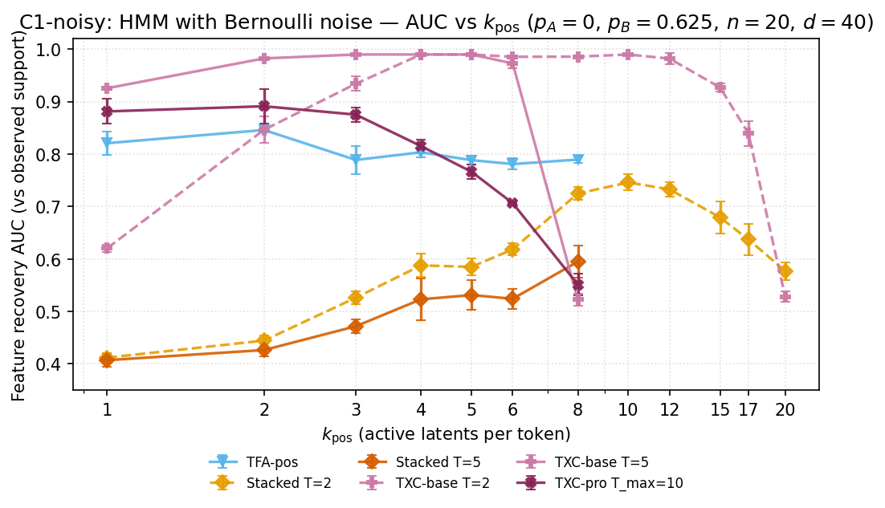

## Hypothesis

When latent emissions are coupled by a hidden Markov chain (each emission
fires when ANY of its parent hidden states is active), TXC-style
architectures recover the *hidden* (global) features as decoder directions
even when per-token SAEs converge to the *emission* (local) features.
The window length T modulates the global/local tradeoff.

## Setup

- **Data**: Aniket's coupled-feature pipeline. $K=10$ hidden Markov chains
  with $\pi=0.05, \rho=0.7$; $M=20$ emissions with $n_{\text{parents}}=2$
  per emission via binary coupling matrix $C$. OR-gate emission rule.
  $d=256, d_{\text{sae}}=40, T=64$. Magnitudes $\sim$ folded
  $\mathcal{N}(1.0, 0.15^2)$.
- **Two truths**: 20 emission directions (local); 10 hidden directions
  (global, normalised mean of children).
- **Metrics**: emission AUC (eAUC), global AUC (gAUC), single-latent
  Pearson correlation, ridge-probe R² (all vs both targets).
- **Models**: TopK-SAE, Stacked-SAE (T=2, T=5), TXC-base (T=5),
  TXC-pro (T∈{2,5,12} to show T-modulation).
- **k sweep**: {1, 2, 3, 4, 5, 6, 8, 10, 12, 15, 17, 20}.
- **Seeds**: {1, 2, 42}.
- **Hardware**: 5090, ~70 min/seed full sweep.

## Results

<!-- BEGIN AUTO-RESULTS -->

**Headline: gAUC (global feature recovery) vs k_pos**

| arch | T | k=1 | k=2 | k=3 | k=4 | k=5 | k=6 | k=8 | k=10 | k=12 | k=15 | k=17 | k=20 |
|---|---|---:|---:|---:|---:|---:|---:|---:|---:|---:|---:|---:|---:|
| `topk_sae` | default | 0.559±0.101 | 0.990±0.000 | 0.990±0.000 | 0.963±0.008 | 0.907±0.007 | 0.840±0.022 | 0.754±0.029 | 0.697±0.011 | 0.690±0.022 | 0.673±0.006 | 0.652±0.007 | 0.606±0.036 |
| `stacked_sae` | T=2 | 0.475±0.061 | 0.764±0.051 | 0.741±0.010 | 0.746±0.023 | 0.697±0.019 | 0.661±0.020 | 0.631±0.026 | 0.625±0.028 | 0.567±0.043 | 0.556±0.014 | 0.531±0.005 | 0.551±0.022 |
| `stacked_sae` | default | 0.403±0.008 | 0.616±0.034 | 0.629±0.006 | 0.631±0.027 | 0.607±0.011 | 0.578±0.025 | 0.554±0.038 | — | — | — | — | — |
| `txc_base` | default | 0.990±0.000 | 0.990±0.000 | 0.989±0.001 | 0.963±0.006 | 0.963±0.014 | 0.908±0.022 | 0.748±0.039 | — | — | — | — | — |
| `txc_pro` | T=2 | 0.990±0.000 | 0.990±0.000 | 0.989±0.001 | 0.931±0.021 | 0.904±0.032 | 0.886±0.041 | 0.807±0.055 | 0.679±0.066 | 0.631±0.104 | 0.490±0.022 | 0.476±0.034 | 0.352±0.024 |
| `txc_pro` | T=5 | 0.956±0.020 | 0.914±0.009 | 0.825±0.076 | 0.700±0.126 | 0.684±0.015 | 0.597±0.015 | 0.674±0.048 | 0.604±0.017 | 0.573±0.050 | 0.569±0.018 | 0.548±0.017 | 0.487±0.064 |
| `txc_pro` | T=12 | 0.858±0.041 | 0.842±0.020 | 0.714±0.042 | 0.664±0.062 | 0.678±0.025 | 0.607±0.028 | 0.567±0.014 | 0.591±0.020 | 0.550±0.016 | — | — | — |

**eAUC (emission feature recovery) vs k_pos**

| arch | T | k=1 | k=2 | k=3 | k=4 | k=5 | k=6 | k=8 | k=10 | k=12 | k=15 | k=17 | k=20 |
|---|---|---:|---:|---:|---:|---:|---:|---:|---:|---:|---:|---:|---:|
| `topk_sae` | default | 0.326±0.060 | 0.764±0.014 | 0.783±0.006 | 0.802±0.030 | 0.777±0.027 | 0.817±0.012 | 0.787±0.026 | 0.795±0.020 | 0.800±0.018 | 0.800±0.024 | 0.788±0.069 | 0.752±0.020 |
| `stacked_sae` | T=2 | 0.313±0.032 | 0.584±0.019 | 0.607±0.017 | 0.614±0.014 | 0.625±0.027 | 0.623±0.025 | 0.621±0.013 | 0.654±0.024 | 0.646±0.027 | 0.634±0.008 | 0.601±0.016 | 0.613±0.008 |
| `stacked_sae` | default | 0.285±0.006 | 0.530±0.030 | 0.545±0.021 | 0.552±0.011 | 0.562±0.020 | 0.578±0.012 | 0.554±0.008 | — | — | — | — | — |
| `txc_base` | default | 0.587±0.004 | 0.591±0.001 | 0.596±0.007 | 0.604±0.011 | 0.614±0.011 | 0.602±0.009 | 0.512±0.011 | — | — | — | — | — |
| `txc_pro` | T=2 | 0.712±0.020 | 0.719±0.022 | 0.750±0.026 | 0.782±0.007 | 0.759±0.029 | 0.763±0.016 | 0.765±0.009 | 0.801±0.052 | 0.777±0.020 | 0.706±0.033 | 0.658±0.005 | 0.526±0.012 |
| `txc_pro` | T=5 | 0.593±0.033 | 0.651±0.015 | 0.673±0.031 | 0.689±0.037 | 0.648±0.016 | 0.693±0.011 | 0.715±0.027 | 0.728±0.017 | 0.727±0.026 | 0.670±0.005 | 0.641±0.031 | 0.573±0.021 |
| `txc_pro` | T=12 | 0.511±0.025 | 0.606±0.009 | 0.565±0.016 | 0.590±0.020 | 0.603±0.040 | 0.619±0.024 | 0.635±0.013 | 0.628±0.019 | 0.607±0.007 | — | — | — |

_Cells aggregated over seeds; n shown per cell. Filter: `component='c2'`, `smoke=False`._

<!-- END AUTO-RESULTS -->

## c1_noisy reproduction (wasteland Phase 2 Experiment 1c-noisy)

Han 2026-05-06 mapping: paper-component-wise UNDER C2 — tests temporal
denoising on a Bernoulli-noisy HMM emission setup ($p_A{=}0,\,p_B{=}0.625$).
Wasteland source: `docs/han/research_logs/2026-03-30-experiment1c-noisy-emissions.md`.

<!-- BEGIN AUTO-RESULTS-c1-noisy -->

**c1_noisy (under C2): wasteland 1c-noisy reproduction**

Bernoulli emission noise on Markov-chain HMM ($p_A{=}0,\,p_B{=}0.625$). Datasource: `toy_markov_n20_d40_noisy`. Wasteland claim: TXCDRv2 T=2 hits AUC $\geq 0.98$ across $k\in[3,12]$.

| arch | T | k=1 | k=2 | k=3 | k=4 | k=5 | k=6 | k=8 | k=10 | k=12 | k=15 | k=17 | k=20 |
|---|---|---:|---:|---:|---:|---:|---:|---:|---:|---:|---:|---:|---:|
| `tfa_pos` | default | 0.821±0.023 | 0.846±0.004 | 0.789±0.027 | 0.803±0.010 | 0.788±0.008 | 0.781±0.011 | 0.789±0.006 | — | — | — | — | — |
| `stacked_sae` | T=2 | 0.412±0.009 | 0.445±0.010 | 0.526±0.013 | 0.588±0.022 | 0.585±0.016 | 0.618±0.012 | 0.725±0.012 | 0.746±0.015 | 0.733±0.014 | 0.679±0.030 | 0.637±0.029 | 0.577±0.017 |
| `stacked_sae` | default | 0.407±0.012 | 0.427±0.012 | 0.472±0.013 | 0.523±0.040 | 0.531±0.029 | 0.524±0.019 | 0.595±0.031 | — | — | — | — | — |
| `txc_base` | T=2 | 0.620±0.006 | 0.846±0.025 | 0.934±0.014 | 0.990±0.000 | 0.990±0.000 | 0.985±0.001 | 0.986±0.002 | 0.990±0.000 | 0.982±0.011 | 0.927±0.007 | 0.839±0.023 | 0.528±0.010 |
| `txc_base` | default | 0.926±0.004 | 0.982±0.001 | 0.990±0.000 | 0.990±0.000 | 0.990±0.000 | 0.973±0.009 | 0.523±0.011 | — | — | — | — | — |
| `txc_pro` | default | 0.881±0.024 | 0.891±0.033 | 0.875±0.014 | 0.815±0.012 | 0.766±0.013 | 0.706±0.002 | 0.551±0.021 | — | — | — | — | — |

_Cells aggregated over seeds. Filter: `component='c1_noisy'`, `smoke=False`. Skipped cells (k_train > arch budget at toy d_sae=40) appear as `—`. Note: 63 rows tagged agent='unknown' (relaunch missed env propagation; data-valid). Bit-faithful gap: wasteland used batch=2048 + lr=3e-4 for Stacked/TXCDRv2 and batch=64 + lr=1e-3 for TFA-pos; this run uses uniform batch=1024 + lr=3e-4. Numbers are similar but not bit-identical._



<!-- END AUTO-RESULTS-c1-noisy -->

## Caveats

- Single-latent correlation is noisy at low k where both archs are forced
  into composite features that aggregate emissions.
- Probe ratio is ~1 for everyone — global *information* is present whether
  or not the dictionary recovers global *directions*. The paper claim must
  be specifically about dictionary alignment, not information sufficiency.
- c1_noisy is a SECOND part of C2 (denoising on noisy HMM). Wasteland
  used batch=2048 (Stacked/TXCDRv2) and batch=64 (TFA-pos); this
  reproduction uses uniform batch=1024 — numbers are similar but not
  bit-identical.

## Reproduction

```bash
cd purified
source scripts/set_agent_env.sh agent_paper
TQDM_DISABLE=1 .venv/bin/python -m experiments.c2_synthetic_coupled.run \
    --seeds 1 2 42 --T 2 5 12
```

Each cell appends one row to `results/leaderboard.jsonl` via
`runner.run_cell` — re-running is safe and idempotent (cached cells
skip).

## Provenance

- `docs/han/research_logs/phase3_coupled_features/2026-04-07-experiment1c3-coupled-features.md`
- `docs/han/research_logs/phase3_coupled_features/2026-04-10-experiment1c3-noisy-coupled.md`
