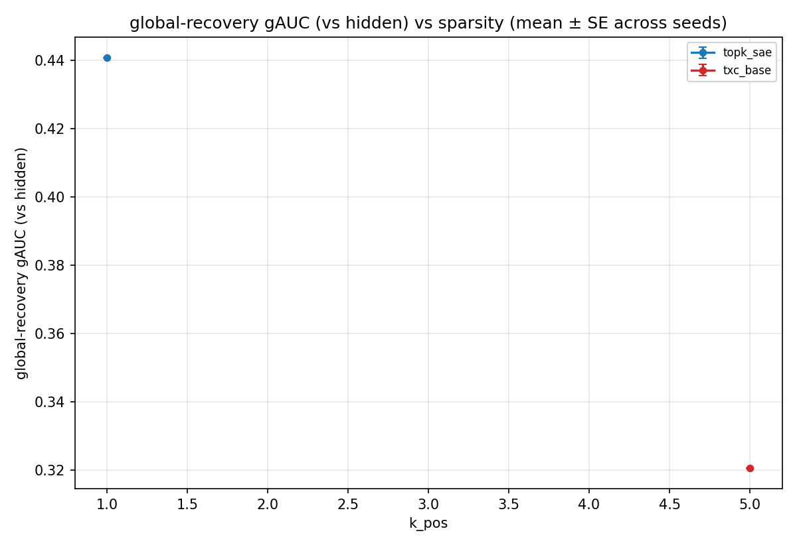
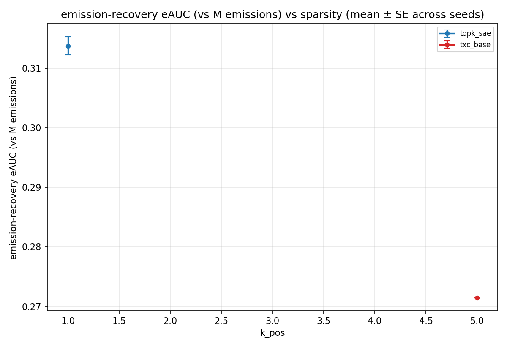

# C2 Synthetic Coupled — paper-ready results (auto-generated)

_Last refreshed: 2026-05-06T07:30:47+00:00_

## Setup

- Datasource: `toy_coupled_K10_M20_d256_full` (factorial-HMM hidden → OR-gate emissions; `K_hidden=10`, `M_emissions=20`, `d_in=256`).
- Sweep: 7 (arch, T) variants × 12 `k_pos` values × 3 seeds.
- Headline metric: gAUC — recovery of the K=10 hidden directions (the latents the SAE *should* find if it bypasses the OR-gate).
- Companion: eAUC — recovery of the M=20 emission directions.
- Driver: `experiments/c2_synthetic_coupled_full/run.py` (isolated `act_cache_key` via `temp_bench.data.toy_full.api:coupled_hmm`).

Currently 9 cells across 2 (arch, T) configurations; seeds-per-cell range = [1, 3].

## gAUC headline (peak gAUC over k_pos)

| arch | T | k\* | gAUC (mean ± SE) | n seeds |
|------|---|----|---------------------------|---------|
| `topk_sae` | — | 2 | 0.990 ± 0.000 | 3 |
| `txc_base` | — | 5 | 0.320 ± 0.000 | 1 |

## eAUC headline (peak eAUC over k_pos)

| arch | T | k\* | eAUC (mean ± SE) | n seeds |
|------|---|----|---------------------------|---------|
| `topk_sae` | — | 2 | 0.864 ± 0.019 | 3 |
| `txc_base` | — | 5 | 0.271 ± 0.000 | 1 |

## Per-cell mean — gAUC

| arch (T) | k=1 | k=2 | k=3 | k=5 |
|---|---|---|---|---|
| `topk_sae` | 0.446 | 0.990 | 0.990 | — |
| `txc_base` | — | — | — | 0.320 |

## Per-cell mean — eAUC

| arch (T) | k=1 | k=2 | k=3 | k=5 |
|---|---|---|---|---|
| `topk_sae` | 0.313 | 0.864 | 0.804 | — |
| `txc_base` | — | — | — | 0.271 |
