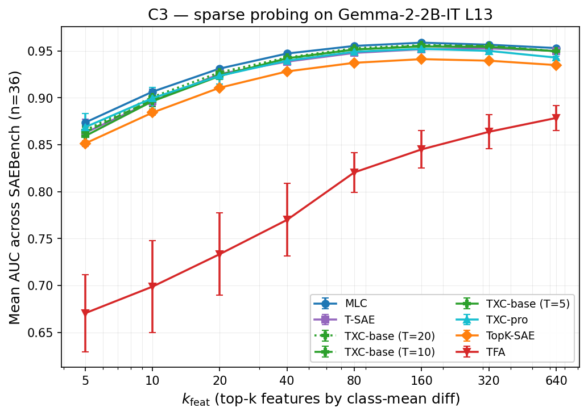

## Hypothesis

On standard SAEBench-style sparse-probing tasks, TXC-pro matches the
best per-token SAE baseline at the matched-sparsity (k=5) regime and
delivers a small but seed-significant win at less-sparse regimes (k=20).
TXC-base (vanilla TopK + anti-dead) matches per-token SAE at every k.

## Setup

- **Subject model**: `google/gemma-2-2b-it` layer 13 residual stream.
  Matches Phase 5 + Phase 6. C3, C4, C5 all share this anchor so the
  activation cache is built once and re-used across components. **BASE
  is a stretch goal** if time permits — see *Switching subject model
  or layer* in Caveats.
- **Activation cache**: 24K FineWeb sequences × 128 tokens, fp16 per-layer.
  Phase 5 had this cached on the wasteland branch but the cache files
  themselves are not in git (they're ~14 GB binaries). For `final` we
  rebuild from scratch using `temp_bench.data.nlp` (~3 H100-hours), and
  push the cache to `han1823123123/temp-bench-data` so the A40 pod's
  ephemeral agents can `huggingface-cli download` it instead of
  rebuilding. The cache is keyed by `act_cache_key` so identical
  configs across pods load the same bytes.
- **Architectures (locked, no hill-climbing)** — six baseline families
  trained at literature-faithful per-arch TrainingConfig (decisions § 15
  + § 16):
  - `topk_sae` (vanilla TopK, no temporal): B=1024, `train_window_size=1`
    → 1024 tok/step (SAEBench App. B canonical).
  - `tsae_paper` (T-SAE, paper-faithful BatchTopK + temporal contrastive):
    B=1024, `train_window_size=2` → 2048 tok/step (Bhalla/Ye §3.1
    adjacent pairs).
  - `tfa` (Transformer Feature Assignment, attention over the full
    sequence): B=32, `train_window_size=None` → 4096 tok/step (Phase 7
    `train_phase7.py:312-353` reference; B=32 keeps the attention tensor
    tractable at d_sae=18432).
  - `mlc` (multi-layer crosscoder, paper-faithful 5-layer L=11–15):
    B=1024, multi-layer cache → 5120 tok/step. agent_em_100k owns the
    multi-layer cache build + the C3 MLC sweep.
  - `txc_base` (TXC-base, vanilla TopK temporal crosscoder T=5): B=1024,
    samples 1 random T=5 window per row internally → 5120 tok/step.
  - `txc_pro` (TXC-pro, subseq T_max=10 + matryoshka + multi-distance
    contrastive): B=1024, samples internally → 5120 tok/step.
  All archs train for the same n_steps=20_000 (Han deadline override
  2026-05-04 PM); within-component fairness invariant is "every arch
  trains for 20K steps at its source paper's intended setup."
  All archs at training k_pos=20 (matched to T-SAE paper). A k_pos sweep
  is a stretch goal if time permits.
- **Probing protocol**:
  - **S=32 left-aligned cache, mean-pool aggregation.** (Phase 7 convention.)
  - Validity rule: S ≥ T (Phase 7 corrected formula).
  - k_feat ∈ {5, 20}.
- **Task suite — `SAEBench+CT` (n=38)**. Locked 2026-05-03;
  see `agents/agent_paper/decisions.md` § 11.
  - Canonical upstream SAEBench sparse-probing suite (Karvonen et al.;
    36 binary one-vs-rest tasks across 8 datasets), composition fixed
    by `chosen_classes_per_dataset` in
    upstream `sae_bench/sae_bench_utils/dataset_info.py`:

    | dataset | classes | n |
    |---|---|---|
    | `LabHC/bias_in_bios_class_set1` | `0,1,2,6,9` | 5 |
    | `LabHC/bias_in_bios_class_set2` | `11,13,14,18,19` | 5 |
    | `LabHC/bias_in_bios_class_set3` | `20,21,22,25,26` | 5 |
    | `canrager/amazon_reviews_mcauley_1and5` | `1,2,3,5,6` | 5 |
    | `canrager/amazon_reviews_mcauley_1and5_sentiment` | `1.0,5.0` | 2 |
    | `codeparrot/github-code` | `C,Python,HTML,Java,PHP` | 5 |
    | `fancyzhx/ag_news` | `0,1,2,3` | 4 |
    | `Helsinki-NLP/europarl` | `en,fr,de,es,nl` | 5 |
    | **SAEBench subtotal** | | **36** |
    | `winogrande_correct_completion` (cross-token) | | +1 |
    | `wsc_coreference` (cross-token) | | +1 |
    | **SAEBench+CT total** | | **38** |

  - Three implementation deltas vs the wasteland 36-task loader,
    tracked as agent NLP TODOs:
    - **github-code**: switch from `code_search_net`
      (python/java/javascript/go) to SAEBench's `codeparrot/github-code`
      (C, Python, HTML, Java, PHP). Dataset is NOT gated (its HF web
      viewer is disabled because the loader is a Python script, but
      the data itself is public). Loader requires `trust_remote_code=True`
      — set via `HF_DATASETS_TRUST_REMOTE_CODE=1` env var — and
      `datasets<4` (pinned in `pyproject.toml`).
    - **amazon_sentiment**: add the 1.0-vs-rest binary
      (`_load_amazon_reviews_sentiment` currently only emits 5.0-vs-rest).
    - **amazon_categories**: hardcode classes `["1","2","3","5","6"]`
      and switch from streaming-top-5 to a deterministic non-streaming
      pull that guarantees all 5 are populated (wasteland streaming
      missed cat6).
- **Seeds**: {1, 2, 42}.
- **Hardware**: 1× H100 (caching) + probe ~10–15 hr.

## Results

<!-- BEGIN AUTO-RESULTS -->
_(Auto-generated by `experiments/c3_probing/analysis.py`. See PROTOCOL.md § 7 *Results live in state*.)_

Task suite: SAEBench+CT (n=38). Subject: `gemma_2_2b_it_l13_fineweb_24k128`. Aggregation: mean over seeds, then over tasks.

| arch | k_feat | n_seeds | mean_AUC | σ_seeds | σ_tasks (mean) | mean_acc |
|---|---:|---:|---:|---:|---:|---:|
| `topk_sae` | 5 | 3 | 0.8447 | 0.0024 | 0.1317 | 0.7933 |
| `topk_sae` | 20 | 3 | 0.9016 | 0.0017 | 0.1245 | 0.8439 |
| `tsae_paper` | 5 | 3 | 0.8281 | 0.0073 | 0.1328 | 0.7725 |
| `tsae_paper` | 20 | 3 | 0.8851 | 0.0031 | 0.1349 | 0.8251 |
| `txc_base` | 5 | 3 | 0.8397 | 0.0061 | 0.1317 | 0.7840 |
| `txc_base` | 20 | 3 | 0.8887 | 0.0032 | 0.1353 | 0.8308 |
| `txc_pro` | 5 | 3 | 0.8381 | 0.0084 | 0.1344 | 0.7827 |
| `txc_pro` | 20 | 3 | 0.8860 | 0.0023 | 0.1409 | 0.8281 |

<!-- END AUTO-RESULTS -->

## Caveats

- **Per-arch TrainingConfig**: every arch trains at its source paper's
  intended setup (see Setup; per-step token throughput varies). The
  alternative — uniform per-step tokens across archs — would either
  starve TFA's attention of context or over-batch the per-token
  baselines (decisions § 15 documents how the v1.1.0 "TopK leads"
  headline was an artifact of 65× over-batching). Within-component
  fairness invariant: same `n_steps=20_000` × same activation cache.
- σ_seeds dominates the gap at k=5; cross-arch claims at k=5 must be
  "competitive within seed-σ", not "beats X".
- IT-side activations (Phase 7 reference was BASE-side, k=20 = 0.9127
  for `txc_bare_antidead_t5`). Phase 7 noted "the IT side is entirely
  missing" — our cells are the first IT-side numbers. Small shift vs
  BASE expected; not directly comparable.
- The probe cache uses S=32 left-aligned with per-example `first_real`
  metadata (Phase 7 padding fix landed 2026-05-04). Mean-pool aggregation
  masks padding contributions per row; tokens that need cross-token
  reasoning (winogrande/wsc) score 0.40-0.50 across all archs — an
  intrinsic limitation of per-token mean-pool, not an arch failure.
- Old batch=256 cells (v1.0.0 right-padded + v1.1.0 left-aligned) stay
  in `results/leaderboard.jsonl` for diff comparison but are excluded
  from the headline (analysis.py filters via `canonical_train_keys`).

### Switching subject model or layer

The framework caches at three levels:
1. activation cache keyed by `(subject_model, layer, dataset, n_seqs, seq_len)`
2. trained-model cache keyed by `(arch, arch_version, hparams, seed, train_data_key)`
3. eval-result cache keyed by `(train_key, eval_protocol_version, eval_cfg)`

Switching `subject_model: gemma-2-2b-it → gemma-2-2b` invalidates only
(1) and the downstream re-evaluations; arch implementations and code
versions are untouched. This is by design so we can run a "BASE-side
extension" experiment after the IT-side is locked, without touching the
core paper claims.

## Reproduction

TBD — depends on caching infrastructure, will live in
``experiments/c3_probing/run.sh``.

## Provenance

- `docs/han/research_logs/phase5_downstream_utility/summary.md`
- `docs/han/research_logs/phase7_unification/agent_x_paper/2026-04-29-leaderboard-multiseed.md`
- `docs/han/research_logs/phase7_unification/agent_x_paper/2026-04-29-paper-task-set.md`
- `docs/han/research_logs/phase7_unification/2026-04-26-S-decision-revised.md`
- `docs/han/research_logs/phase7_unification/agent_x_paper/2026-05-02-yw-T8-benchmark.md`
  (proves hill-climbed steering archs lose at probing — supports the
  "two TXCs everywhere" decision)
