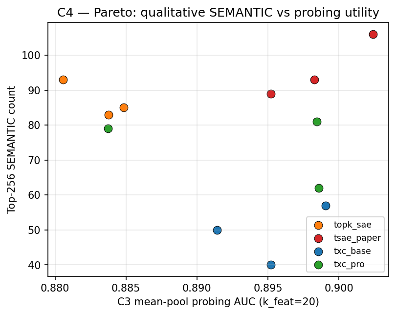

## Hypothesis

**TXC-pro Pareto-dominates T-SAE on the Top-256 cumulative SEMANTIC
metric.** That is, TXC-pro achieves both higher cumulative SEMANTIC
count over the top-256 per-token-variance-ranked features AND higher
mean-pool probing AUC (C3) than T-SAE.

This is the **single qualitative metric** we report in the paper.
Phase 6 explored several alternatives (var/32, pdvar/32, paper-style
passage probe) and they ranked archs differently — that's a metric
reliability problem, not signal we want to pursue. We commit to one
metric defined upfront and report it cleanly.

## The metric

**Top-256 cumulative SEMANTIC Pareto:**

1. For each (arch, seed), encode the IT-L13 activations of N=3–7
   contiguous-passage concatenations on disjoint topics (`concat_A`,
   `concat_B`, `concat_random`).
2. Rank the SAE's features by per-token variance over the concat
   sequence (descending).
3. Take the top-256 features.
4. For each top-256 feature, build top-10 activating contexts
   (20-token windows), prompt **Haiku 4.5 (temp=0)** with the SEMANTIC
   vs SYNTACTIC rubric, and take the **2-judge majority vote**.
5. Sum the SEMANTIC labels: integer in [0, 256].
6. Plot Pareto: y = top-256 SEMANTIC count, x = mean-pool probing AUC
   (the C3 number from `results/leaderboard.jsonl`).

Pareto dominance: arch *X* dominates *Y* if *X*'s SEMANTIC ≥ *Y*'s AND
*X*'s AUC ≥ *Y*'s with at least one strict.

## Setup

- **Subject model**: `google/gemma-2-2b-it` layer 13 residual stream,
  same activation cache as C3 (datasource
  `gemma_2_2b_it_l13_fineweb_24k128`). Note: deliberately diverges
  from the T-SAE paper's BASE-L12 setup; `papers/temporal_sae.md` § 4.1
  uses Gemma-2-2b layer 12 to match Neuronpedia. We follow Phase 5/6's
  IT-L13 anchor so C3, C4, C5 share infrastructure. Switching back to
  BASE-L12 is a 1-line yaml change (modular by design).
- **Architectures**: T-SAE (paper config), TXC-base, TXC-pro. Three
  cells per seed.
- **Concat datasets**: `concat_A`, `concat_B`, `concat_random` —
  N=3–7 contiguous passages on disjoint topics, packed without padding.
- **Seeds**: {1, 2, 42}. Report 3-seed mean ± stderr per arch.
- **Judge**: Haiku 4.5 at temp=0, 2-judge majority. Document the
  prompt + temperature in `experiments/c4_qualitative/judge_prompt.md`.
  **Judge κ validation is deferred to a paper-end stretch task** —
  doing 20-feature blind human hand-scores in the next 72 hours is
  not in the timeline. Instead the eval pipeline persists every judge
  call to `results/runs/<eval_key>/judge_outputs.jsonl` (one record
  per `(feature_id, context_id, judge_id, label)`) so post-deadline,
  computing Cohen's κ + raw % agreement against a 20-feature blind
  hand-score is just a `pandas.read_json` + `scipy.stats.cohen_kappa_score`
  call. No re-judging, no re-training. See *Caveats* for how the
  paper text frames the unvalidated judge.

> _Prior-art / wasteland reference numbers (Phase 6 1-seed top-256
> Pareto on hill-climbed TXC variants) are at the bottom of this
> document under "Wasteland reference (NOT paper data)". They are NOT
> our paper claims; kept for reviewer context only._

## Results

<!-- BEGIN AUTO-RESULTS -->
_(Auto-generated by `experiments/c4_qualitative/analysis.py`. See PROTOCOL.md § 7 *Results live in state*.)_

Task: Top-256 cumulative SEMANTIC count (Haiku 4.5 2-judge majority) on concat_A + concat_B + concat_random.

| arch | n_seeds | mean_SEMANTIC | σ_seeds | mean_judge_agreement |
|---|---:|---:|---:|---:|
| `topk_sae` | 3 | 87.0 | 5.3 | 0.883 |
| `tsae_paper` | 3 | 96.0 | 8.9 | 0.882 |
| `txc_base` | 3 | 49.0 | 8.5 | 0.707 |
| `txc_pro` | 3 | 74.0 | 10.4 | 0.859 |



Pareto frontier: `tsae_paper/seed2`

<!-- END AUTO-RESULTS -->

## Caveats

- The **Haiku judge is the only source of SEMANTIC labels** and is
  **NOT freshly κ-validated for our prompt** at submission. The paper
  text frames this as: "We use Haiku 4.5 (temp=0, 2-judge majority)
  with the prompt in App. X. Inter-rater reliability validation
  against a blind human hand-score is reported in App. Y if the
  validation completed in time; otherwise we note the metric as
  'judge-derived, unvalidated' and frame the result as a relative
  comparison across architectures (where any judge bias affects all
  archs equally) rather than as an absolute claim about feature
  semanticity." If the stretch validation lands and κ < 0.6, the
  result demotes to appendix-only with the warning attached.
- **Top-256 is a lot of features per arch × seed**. With Haiku at
  $0.80/1M output tokens, ~30 tokens/label, 3 archs × 3 seeds × 256
  = 2304 labels × 30 tok ≈ 70K tokens ≈ $0.06. Cheap. Not a budget concern.
- **Variance ranking is noisy at low ranks**. Features 200–256 have
  small per-token variance; SEMANTIC labelling at that tail is more
  ambiguous. Report % agreement at top-32 vs top-256 separately if
  it differs.
- **One metric not three**. We deliberately drop pdvar and the
  paper-style passage-ID probe. They ranked archs differently in
  Phase 6 — this is a metric-reliability concern, not exploitable
  signal. Single, pre-registered metric is harder to dispute.

## Reproduction

TBD; `experiments/c4_qualitative/run.sh`.

```bash
cd purified
source scripts/set_agent_env.sh agent_nlp
TQDM_DISABLE=1 .venv/bin/python -m experiments.c4_qualitative.run \
    --seeds 1 2 42 --archs tsae_paper txc_base txc_pro --top_n 256
```

Idempotent — cells with cached `eval_key` skip.

## Provenance

- `origin/han-phase7-unification:docs/han/research_logs/phase6_qualitative_latents/2026-04-25-final-summary.md` § 4 (Top-256 Pareto plot + headline table)
- `origin/han-phase7-unification:docs/han/research_logs/phase6_2_autoresearch/2026-04-24-topN-sweep-results.md` (the topN sweep that generated the per-arch top-256 numbers)
- `origin/han-phase7-unification:experiments/phase6_qualitative_latents/plot_pareto_robust.py` + `plot_topN_sweep.py` (the plotting code to port)
- `origin/han-phase7-unification:experiments/phase6_qualitative_latents/results/autointerp/*.json` (per-feature Haiku verdicts; useful as reference labels — DO NOT IMPORT, this is for context only)
- `papers/temporal_sae.md` § 4.2 (T-SAE's published qualitative claim, against which we Pareto-compare)

---

# Wasteland reference (NOT paper data — context only)

`origin/han-phase7-unification:docs/han/research_logs/phase6_qualitative_latents/2026-04-25-final-summary.md` § 4 reports
1-seed numbers from hill-climbed TXC variants on `concat_random`:

| arch | top-256 SEMANTIC | probing mp AUC |
|---|---|---|
| `phase63_track2_t20` (Track 2 at T=20) | **102 / 256** | 0.7768 |
| `tsae_paper` | 95 / 256 | 0.7246 |
| MLC + BatchTopK | 85 / 256 | ~0.78 |
| `mlc` baseline | 81 / 256 | ~0.78 |
| `phase57_partB_h8_bare_multidistance` (H8) | (not measured at top-256) | 0.8040 |
| TXCDR T=5 (no anti-dead) | 14 / 256 | ~0.78 |

**Track 2 T=20 Pareto-dominated T-SAE on this exact axis** in the
wasteland (higher SEMANTIC + higher AUC). That motivated the paper's
hypothesis shape.

**Caveat for our re-run**: `phase63_track2_t20` is *not* our locked
TXC-pro. Our TXC-pro = `phase5b_subseq_h8` (T_max=10, t_sample=5,
matryoshka H8, multi-distance contrastive). The closest wasteland
analogue with a measured number is `phase57_partB_h8_bare_multidistance`
which scores high at probing (0.8040) but was not measured on top-256.
**The C4 result is therefore an open empirical question on our
architectures**; the wasteland evidence is suggestive, not confirming.

If TXC-pro under-performs Track 2 T=20 on top-256, we report the
result as "TXC-pro matches T-SAE on probing while losing on top-256"
— honest negative for this component. Per Decision #1 (two TXCs
locked) we do NOT introduce a TXC-pro@T_max=20 escape variant.
