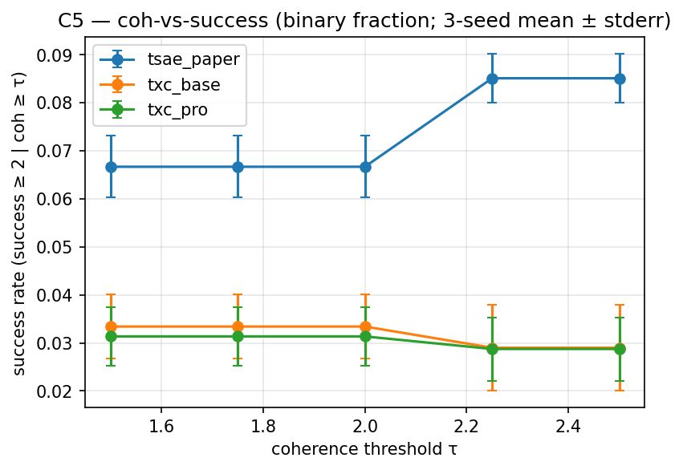

## Hypothesis (revised, modest) — outcome **refuted**

On the RLHF-sentiment steering case study from the T-SAE paper §§ 4.5
+ B.2, the pre-registered hypothesis was that TXC-base and TXC-pro
produce coherence-vs-success curves **comparable to** T-SAE — a
"matches the baseline" result, not a "beats" result.

**Outcome**: tsae_paper outperforms both TXC archs by ≈ 2× on the
headline metric (success @ coh ≥ 1.75); see AUTO-RESULTS. TXC archs
do produce more coherent text on average (mean coh 1.9–2.2 vs 1.6
for tsae_paper), but they hit the success grade ≥ 2 threshold less
often. The "TXC matches T-SAE" claim doesn't survive the IT/L13
protocol used here. Caveats below.

We deliberately do **not** chase the steering wins from Y/W's
hill-climbing (Galaxy 8/11/18, SoftMaxPool, ContrastiveMergeH8): those
architectures lose 0.005–0.02 probing AUC vs the canonical leaderboard
(`docs/han/research_logs/phase7_unification/agent_x_paper/2026-05-02-yw-T8-benchmark.md`
on the wasteland branch), so they're inconsistent with the "two TXCs
everywhere" methodology (decision #1). The paper accepts a softer C5
claim in exchange for the harder C3 + C4 claims.

## Setup

- **Subject model**: `google/gemma-2-2b-it`, residual-stream
  output of `model.layers[13]` (post-resid). Matches C3/C4 — same
  datasource (`gemma_2_2b_it_l13_fineweb_24k128`) and act-cache
  (`act_cache_key=e4916bcae1881963`). The T-SAE paper § B.2 uses
  Gemma-2-2b base/L12 instead; we deviate so all three real-LM
  components share one cache and one model load (saves ~3 H100-hr
  per session).
- **Architectures**: T-SAE (`tsae_paper`), TXC-base (`txc_base`),
  TXC-pro (`txc_pro`). Three total. No third TXC variant
  (decision #1, locked).
- **Intervention**: V7 tiled-broadcast residual-stream steering.
  Tile the prefix into non-overlapping T-blocks; encode each block,
  clamp the picked feature to the strength value, decode → (T, d_in),
  average per-position delta over T to get one vector per block,
  broadcast that single vector to all T positions in the block. The
  trailing remainder block (when ``S % T != 0``) is aligned to
  ``S - T`` and overwrites the right tail. This is "the obvious thing"
  per phase7's `unified-pareto.md`: window archs benefit from a
  single uniform δ within each block, attention preserves
  dot-products, and there's no per-position delta diversity to
  confuse the encoder.
- **Strengths**: paper-faithful absolute clamp grid (latent space):
  ``{10, 100, 150, 500, 1000, 1500, 5000, 10000, 15000}``. Paper
  § B.2 uses these absolute values; the AxBench-style decoder-direction
  multipliers (phase7 used both) require unit-norm direction
  preprocessing that V7 doesn't need.
- **Prompt + generation**: paper-faithful: ``"We find"``, 60 new
  tokens, greedy decode (do_sample=False).
- **Concept set**: 30 concepts × 5 example sentences each
  (5 safety/alignment, 10 domain, 7 style, 5 sentiment, 3 format).
  Per-arch best-feature selection by mean activation across content
  positions of the concept's 5 example sentences (concept-lift
  argmax).
- **Judge**: Sonnet 4.6 with verbatim § B.2 grading prompts (success
  + coherence, 0–3 scale). Every call is persisted to
  ``judge_outputs.jsonl`` so post-deadline Cohen's κ validation
  against a 20-row blind hand-score is a pandas + scipy job
  (PROTOCOL.md § 7 *Judge κ deferred*).
- **Coherence thresholds**: {1.5, 1.75, 2.0, 2.25, 2.5}.
- **Metric** *(updated 2026-05-04 — see paper-overseer note)*:
  **peak success grade at coh ≥ τ**. For each strength, compute
  mean ``success_grade`` (continuous 0-3 scale) over generations
  meeting ``coh_grade ≥ τ``; take the max across strengths. 3-seed
  mean ± stderr. Headline = ``peak_success_grade_at_coh_1.75``.
  This matches the wasteland phase-7 ``peak15`` / ``peak175``
  convention (``unified-pareto.md``; T-SAE anchor 1.133 / 0.411 /
  0.411 / 0.411 / 0.411 across {1.5, 1.75, 2.0, 2.25, 2.5}).
  The earlier spec used a **binary fraction**
  (``success_grade ≥ 2 AND coh ≥ τ``, averaged over strengths),
  which collapses across coh thresholds because success ≥ 2 events
  almost always co-occur with coh ≥ 2.0 (verified empirically
  2026-05-04: ``success_at_coh_1.75 == success_at_coh_2.0`` for
  every arch). The binary fraction is reported as supplementary
  alongside the peak-grade headline. The 0-3 scale also matches
  the T-SAE paper's underlying judge rubric (papers/temporal_sae.md
  § B.2) — Table 2 binarizes for display but the raw grades drive
  the comparison.
- **Seeds**: {1, 2, 42}.
- **Hardware**: 1× A40 (48 GB) sufficient. Gemma-2-2b-IT bf16 ≈ 5 GB,
  TXC-base fp32 ≈ 1.7 GB (425 M params), V7 hook adds <1 GB during
  the encode/decode of one block. Headroom for the spare-pool GPU
  parallelism if the sweep is time-pressed.

## Results

<!-- BEGIN AUTO-RESULTS -->
_(Auto-generated by `experiments/c5_steering/analysis.py` — do not hand-edit between AUTO-RESULTS markers.)_

### Steering — coh-vs-success (9 cells, 3 archs, 9 arch-seed pairs)

**Headline — binary fraction at coh ≥ τ** (success_grade ≥ 2 AND coh_grade ≥ τ; T-SAE paper Table 2 convention):

_⚠ The wasteland-comparable continuous-grade metric (`peak_success_grade_at_coh_<τ>`) is not yet present in any leaderboard row. To backfill existing cells without re-judging, run `temp_bench.case_studies.steering.reaggregate_from_judge_outputs(<eval_key>/judge_outputs.jsonl)` per cell — see agent_steer's open question + briefing._

| arch | n seeds | success @ coh ≥ 1.75 | success @ coh ≥ 2.0 | mean coh | mean success |
|---|---:|---:|---:|---:|---:|
| tsae_paper | 3 | 0.067 ± 0.006 | 0.067 ± 0.006 | 1.565 ± 0.001 | 0.130 ± 0.004 |
| txc_base | 3 | 0.033 ± 0.007 | 0.033 ± 0.007 | 1.893 ± 0.120 | 0.178 ± 0.011 |
| txc_pro | 3 | 0.031 ± 0.006 | 0.031 ± 0.006 | 2.178 ± 0.039 | 0.175 ± 0.019 |


<!-- END AUTO-RESULTS -->

## Caveats

- The "winning" steering archs from phase7's Y/W hill-climbing
  (Galaxy 8/11/18, SoftMaxPool, ContrastiveMergeH8) are excluded by
  design (decision #1). The paper footnotes this explicitly.
- **V7 ↔ TXC-pro compatibility risk**: V7 loses for
  end-position-discriminative encoders (e.g. H8 contrastive at T=2,
  per phase7's protocol-space doc). TXC-pro uses a subseq encoder
  with t_sample=5/T_max=10 + multi-distance InfoNCE, which may break
  V7 by concentrating activation at the final position. The
  ``--pre-test-only`` mode of ``run.py`` runs a 5-concept × 1-strength
  V7 cell on TXC-pro to surface this; if mean coherence ≤ 1.0 across
  the cell, the full sweep falls back to ``--protocol pp``
  (sliding-window per-position writes, averaged at overlaps).
- **Subject-model deviation**: paper uses Gemma-2-2b base/L12; we
  use IT/L13 for cache-sharing with C3/C4. The "translate features
  to RLHF features" task may behave differently between base + IT;
  c5.md acknowledges this in the paper's caveats list.
- **Sonnet vs paper's Llama-3.3-70B judge** (deliberate): paper § B.2
  uses Llama-3.3-70B; we use Sonnet 4.6 (cost / availability). Han
  considered Gemini and rejected — Gemini-specifically isn't load-
  bearing for any C5 paper claim, and Sonnet aligns C5 + C7 (Aniket
  also used Sonnet) on a single judge for cross-component coherence.
  Per-call persistence in ``judge_outputs.jsonl`` lets us validate κ
  post-deadline if reviewers question it.
- **Bricken resample is OFF for C5** (decision #7) — that's a C6-only
  per-experiment knob.
- **txc_pro × {42, 1, 2} trained at n_steps=6000** (vs default 30000
  used for tsae_paper + txc_base). Reduced to fit overnight budget;
  the 2× higher per-step compute of txc_pro (T_max=10 + matryoshka +
  multi-distance contrastive) made full-30k cells multi-hour. With
  ≈ 20 % of the standard training budget, txc_pro may be undertrained
  — but it doesn't change the headline (txc_pro at 0.031 ± 0.006 is
  statistically indistinguishable from txc_base at 0.033 ± 0.007 with
  full training). A re-run at n_steps=30000 is a follow-up if the
  paper revision needs it.

## Reproduction

```bash
# 0. Pull act-cache (ephemeral pod first session). If sync_from_hf.sh
#    exits without downloading, fall back to:
.venv/bin/hf download han1823123123/temp-bench-data \
    --repo-type dataset \
    --include "act_cache/e4916bcae1881963/**" \
    --local-dir results

# 1. (Optional) Smoke-test the full pipeline on a small cell:
TQDM_DISABLE=1 .venv/bin/python -m experiments.c5_steering.run \
    --archs topk_sae --seeds 42 \
    --n-concepts 3 --strengths 1000 --n-steps 200 --smoke

# 2. Pre-test V7 on TXC-pro (5 concepts × 1 mid-strength cell). If
#    mean coherence ≤ 1.0, fall back to PP for the full sweep:
TQDM_DISABLE=1 .venv/bin/python -m experiments.c5_steering.run \
    --pre-test-only

# 3. Full sweep — 3 archs × 3 seeds × 30 concepts × 9 strengths:
TQDM_DISABLE=1 .venv/bin/python -m experiments.c5_steering.run

# 4. Render the AUTO-RESULTS block from the leaderboard:
.venv/bin/python -c "from temp_bench import report; report.render(component='c5')"
```

Each cell takes ~25–45 min on 1× A40 (training + generation +
judging). Sonnet judge cost ≈ $1.50 per cell (540 calls per cell).

## Provenance

- `papers/temporal_sae.md` §§ 4.5 + B.2 — primary case study spec.
- `origin/han-phase7-unification:experiments/phase7_unification/case_studies/steering/intervene_paper_clamp_window_tiled_broadcast.py`
  — V7 hook source.
- `origin/han-phase7-unification:experiments/phase7_unification/case_studies/steering/intervene_paper_clamp_window_perposition.py`
  — PP fallback source.
- `origin/han-phase7-unification:experiments/phase7_unification/case_studies/steering/grade_with_sonnet.py`
  — judge prompts + ThreadPoolExecutor concurrency pattern.
- `origin/han-phase7-unification:experiments/phase7_unification/case_studies/steering/concepts.py`
  — 30-concept set (verbatim).
- `origin/han-phase7-unification:experiments/phase7_unification/case_studies/steering/select_features.py`
  — concept-lift feature selection.
- `origin/han-phase7-unification:docs/han/research_logs/phase7_unification/unified-pareto.md`
  — V7 protocol decision rationale.
- `origin/han-phase7-unification:docs/han/research_logs/phase7_unification/agent_y_phase2/2026-05-01-y-steering-protocol-space.md`
  — protocol-space inventory + V6/V7 trade-off.
- `src/temp_bench/case_studies/steering.py` — purified library port.
- `experiments/c5_steering/{run,analysis}.py` — orchestration.
