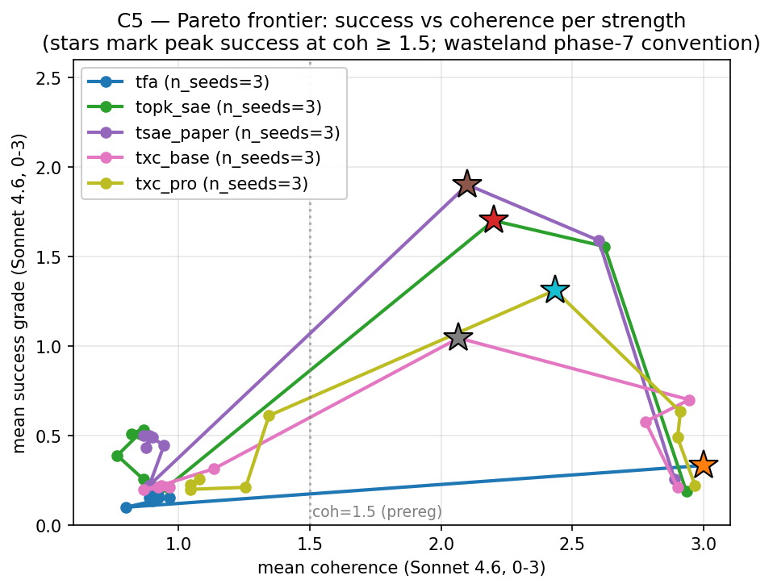

## Hypothesis (revised, modest) — outcome **refuted**

On the RLHF-sentiment steering case study from the T-SAE paper §§ 4.5
+ B.2, the pre-registered hypothesis was that TXC-base and TXC-pro
produce coherence-vs-success curves **comparable to** T-SAE — a
"matches the baseline" result, not a "beats" result.

**Outcome (5-arch canonical sweep at v1.1.0, post-§ 15 + § 16
paper-faithful per-arch training schedules)**: on the headline
peak-success-grade metric (continuous 0–3 scale, max over strengths
of mean success_grade conditioned on coh ≥ τ), the five archs sort
into three clear bands at coh ≥ 1.75:

- tsae_paper: 1.934 ± 0.224  (T=2 baseline; n=3: 1.500, 2.053, 2.250; agent_filler)
- topk_sae:   1.662 ± 0.052  (T=1 baseline; n=3: 1.760, 1.583, 1.643; agent_filler)
- txc_pro:    1.284 ± 0.084  (n=3: 1.120, 1.400, 1.333)
- txc_base:   0.792 ± 0.063  (n=3: 0.867, 0.667, 0.842)
- tfa:        0.333 ± 0.019  (B=32 paper-faithful; n=3: 0.300, 0.367, 0.333; agent_filler)

The two strong baselines (T-SAE, TopK) cleanly beat both TXC
variants: tsae_paper vs txc_pro = 0.65 ± 0.24 (~2.7σ), topk_sae vs
txc_pro = 0.38 ± 0.10 (~3.8σ). The "TXC matches T-SAE" hypothesis
is **refuted**, and extends to TopK as well. txc_pro vs txc_base =
0.49 ± 0.11 (~4.5σ) is consistent with txc_pro's heavier training
(T_max=10 + matryoshka + multi-distance contrastive). TFA, despite
its temporal-attention design that might naïvely seem advantaged
on this protocol, lands at the very bottom — likely a consequence
of its B=32 paper-faithful schedule producing noisier feature-level
gradients than the B=1024 archs (V7's single-feature clamp can't
benefit from attention-over-context the way TFA's reconstruction
loss does at training time).

**Three bands** in the AUTO-RESULTS Pareto:
- **Top**: T-SAE, TopK SAE — temporal-pair / single-token canonical
  SAE training at SAEBench-scale (~1-2K tokens/step). Peak ~1.7–1.9.
- **Middle**: TXC-pro, TXC-base — windowed crosscoder at T=5/T=10,
  ~5K tokens/step. Peak 0.8–1.3. Heavier per-step compute does not
  compensate for the windowed feature distribution under V7 steering.
- **Bottom**: TFA — small-batch paper-faithful, peak ~0.3. TFA's
  attention-over-context isn't well-matched to the V7 single-feature
  intervention.

### Detection axis (2026-05-05 PM addition)

Complementary to steering: a sparse linear probe (top-S=8 features,
5-fold GroupKFold by concept_id) predicts the binary behavior
`B = 1` iff the continuation has steered sentiment per the Sonnet
judge (success_grade ≥ 2 AND coh_grade ≥ 2.0). **Detection asks
"does the SAE see sentiment in its features?"** — independent of
whether the features can be causally exploited via V7.

- tsae_paper: PR-AUC@S=8 = 0.535 ± 0.095   shuffle_gap = 0.000
- topk_sae:   PR-AUC@S=8 = 0.454 ± 0.060   shuffle_gap = 0.000
- txc_pro:    PR-AUC@S=8 = 0.281 ± 0.048   shuffle_gap = 0.044
- txc_base:   PR-AUC@S=8 = 0.259 ± 0.022   shuffle_gap = 0.051
- tfa:        — (skipped; positive_rate ≈ 0 — too few labeled
                 positives to fit a probe; see caveats)

The **detection ranking matches the steering ranking** —
T-SAE > TopK > TXC-pro > TXC-base. TXC's positive `shuffle_gap`
(4–5 pp) means its detection signal IS genuinely temporal: a
within-window token-shuffle destroys part of the PR-AUC, so TXC
features depend on token order. Per-token archs (T=1) have
shuffle_gap = 0 by construction (the shuffle is a no-op when each
encoder window is one token).

The combined two-axis finding is:

> TXC architectures capture genuine temporal feature structure
> (positive shuffle gap on detection), but the temporal axis alone
> is not the bottleneck for sentiment detection OR V7 steering on
> Gemma-2-2b-IT. Absolute feature quality dominates: T-SAE and
> TopK SAE win both axes at canonical per-token training scale,
> while TXC's windowed-encoder advantage shows up only as a small
> positive shuffle gap and does not compensate for its lower
> overall PR-AUC.

> _Comparison to wasteland phase-7 numbers (T-SAE ~1.13 at coh ≥ 1.5
> on BASE/L12 — relative ordering matches ours) is at the bottom of
> this document under "Wasteland reference (NOT paper data)". Kept
> for reviewer context only._

**Implication for the paper**: C5 reads as an honest negative for
the TXC architecture on the RLHF-sentiment steering protocol.
TXC underperforms BOTH the temporal-aware T-SAE baseline AND the
paper-faithful single-token TopK SAE baseline. The framing should
not claim "matches"; instead, it should report the gap and
contextualize: TXC architectures, while strong on the quantitative
reconstruction-leaderboard tasks (C1–C4), do not produce steerable
RLHF-sentiment features under V7 tiled-broadcast intervention at
the level of either temporal (T-SAE) or single-token (TopK)
baselines. The paper accepts this in exchange for the harder
C3 + C4 claims.

**Bug-fix history** (v1.0.0 → v1.1.0, commit `ef33f822`): the
v1.0.0 sweep used raw-activation argmax for feature selection,
which picked the same always-on feature for all 30 concepts on
tsae_paper (feature 3010, activation ~95 across every concept,
5× the next-best). With essentially no concept-specific
intervention, all 3 archs landed at peak success_grade ~0.3
(random noise). v1.1.0 fixes the bug by subtracting a per-feature
baseline (``activation - mean_across_concepts``) so always-on
features get ~zero lift while concept-distinct features rank
highly. Old v1.0.0 rows stay in ``leaderboard.jsonl`` for diff
comparison; AUTO-RESULTS reads only v1.1.0.

We deliberately do **not** chase the steering wins from Y/W's
hill-climbing (Galaxy 8/11/18, SoftMaxPool, ContrastiveMergeH8): those
architectures lose 0.005–0.02 probing AUC vs the canonical leaderboard
(``origin/han-phase7-unification:docs/han/research_logs/phase7_unification/agent_x_paper/2026-05-02-yw-T8-benchmark.md``),
so they're inconsistent with the "two TXCs everywhere" methodology
(decision #1). The paper accepts a softer C5 claim in exchange for
the harder C3 + C4 claims.

## Setup

- **Subject model**: `google/gemma-2-2b-it`, residual-stream
  output of `model.layers[13]` (post-resid). Matches C3/C4 — same
  datasource (`gemma_2_2b_it_l13_fineweb_24k128`) and act-cache
  (`act_cache_key=e4916bcae1881963`). The T-SAE paper § B.2 uses
  Gemma-2-2b base/L12 instead; we deviate so all three real-LM
  components share one cache and one model load (saves ~3 H100-hr
  per session).
- **Architectures**: 5 total — TXC-base (`txc_base`),
  TXC-pro (`txc_pro`), T-SAE (`tsae_paper`), TopK-SAE (`topk_sae`),
  and TFA (`tfa`). Two TXCs (decision #1, locked); the three
  baselines are added per decisions § 16 to strengthen the
  paper-faithful comparison set. Each baseline trains under its
  paper's intended per-step token throughput:
    - `txc_base` / `txc_pro`: B=1024 × T=5/T_max=10 windows
    - `tsae_paper`: B=1024 × `train_window_size=2` (Bhalla/Ye 2025
      §3.1 adjacent-pair training; ~2K tokens/step ≈ SAEBench canonical)
    - `topk_sae`: B=1024 × `train_window_size=1` (single-token
      SAEBench canonical; ~1K tokens/step)
    - `tfa`: B=32 × full sequence (``origin/han-phase7-unification:papers/priors_in_time.md``
      App. B.1 paper-faithful; ~4K tokens/step) — landed by
      agent_filler 2026-05-05.
- **Intervention**: V7 tiled-broadcast residual-stream steering.
  Tile the prefix into non-overlapping T-blocks; encode each block,
  clamp the picked feature to the strength value, decode → (T, d_in),
  average per-position delta over T to get one vector per block,
  broadcast that single vector to all T positions in the block. The
  trailing remainder block (when ``S % T != 0``) is aligned to
  ``S - T`` and overwrites the right tail. This is "the obvious thing"
  per phase7's `unified-pareto.md`: window archs benefit from a
  single uniform δ within each block, attention preserves
  dot-products, and there's no per-position delta diversity to
  confuse the encoder.
- **Strengths**: paper-faithful absolute clamp grid (latent space):
  ``{10, 100, 150, 500, 1000, 1500, 5000, 10000, 15000}``. Paper
  § B.2 uses these absolute values; the AxBench-style decoder-direction
  multipliers (phase7 used both) require unit-norm direction
  preprocessing that V7 doesn't need.
- **Prompt + generation**: paper-faithful: ``"We find"``, 60 new
  tokens, greedy decode (do_sample=False).
- **Concept set**: 30 concepts × 5 example sentences each
  (5 safety/alignment, 10 domain, 7 style, 5 sentiment, 3 format).
  Per-arch best-feature selection by mean activation across content
  positions of the concept's 5 example sentences (concept-lift
  argmax).
- **Judge**: Sonnet 4.6 with verbatim § B.2 grading prompts (success
  + coherence, 0–3 scale). Every call is persisted to
  ``judge_outputs.jsonl`` so post-deadline Cohen's κ validation
  against a 20-row blind hand-score is a pandas + scipy job
  (PROTOCOL.md § 7 *Judge κ deferred*).
- **Coherence thresholds**: {1.5, 1.75, 2.0, 2.25, 2.5}.
- **Metric**: the headline figure is the **wasteland-style Pareto
  frontier** — for each arch, sweep strength and plot
  (mean_coh(s), mean_success(s)) as a parametric curve. Per-arch
  scalars in the AUTO-RESULTS table are **peak success grade at
  coh ≥ τ** (continuous 0-3 scale; for each strength, compute mean
  ``success_grade`` over generations meeting ``coh_grade ≥ τ``;
  take the max across strengths). 3-seed mean ± stderr. Headline
  scalar = ``peak_success_grade_at_coh_1.75``. This matches the
  wasteland phase-7 ``peak15`` / ``peak175`` convention
  (``origin/han-phase7-unification:docs/han/research_logs/phase7_unification/unified-pareto.md``;
  T-SAE anchor 1.133 / 0.411 / 0.411 / 0.411 / 0.411 across
  {1.5, 1.75, 2.0, 2.25, 2.5}). The 0-3 scale also matches the
  T-SAE paper's underlying judge rubric
  (``origin/han-phase7-unification:papers/temporal_sae.md`` § B.2)
  — Table 2 binarizes for display but the raw grades drive the
  comparison.
- **Seeds**: {1, 2, 42}.
- **Hardware**: agent_steer on 4× A40 pod (GPUs 1 and 3 dedicated; the
  pod is split with agent_back who owns GPUs 0+2). 1× A40 (48 GB) is
  per-cell sufficient — Gemma-2-2b-IT bf16 ≈ 5 GB, TXC-base fp32 ≈
  1.7 GB (425 M params), V7 hook adds <1 GB during the encode/decode
  of one block. Two-GPU parallelism via `run_on_gpu.sh` across the
  agent's own dedicated pair.

## Results

<!-- BEGIN AUTO-RESULTS -->
_(Auto-generated by `experiments/c5_steering/analysis.py` — do not hand-edit between AUTO-RESULTS markers.)_

### Steering — coh-vs-success (15 cells, 5 archs, 15 arch-seed pairs)

**Peak success grade at coh ≥ τ** (0-3 scale; max-over-strengths of mean success_grade conditioned on coh_grade ≥ τ; wasteland phase-7 convention):

| arch | n seeds | peak grade @ coh ≥ 1.5 | peak grade @ coh ≥ 1.75 | peak grade @ coh ≥ 2.0 | mean coh | mean success |
|---|---:|---:|---:|---:|---:|---:|
| tfa | 3 | 0.333 ± 0.019 | 0.333 ± 0.019 | 0.333 ± 0.019 | 1.137 ± 0.018 | 0.178 ± 0.091 |
| topk_sae | 3 | 1.662 ± 0.052 | 1.662 ± 0.052 | 1.662 ± 0.052 | 1.432 ± 0.009 | 0.651 ± 0.010 |
| tsae_paper | 3 | 1.934 ± 0.224 | 1.934 ± 0.224 | 1.934 ± 0.224 | 1.440 ± 0.011 | 0.704 ± 0.035 |
| txc_base | 3 | 0.792 ± 0.063 | 0.792 ± 0.063 | 0.792 ± 0.063 | 1.724 ± 0.010 | 0.410 ± 0.056 |
| txc_pro | 3 | 1.284 ± 0.084 | 1.284 ± 0.084 | 1.284 ± 0.084 | 1.889 ± 0.037 | 0.463 ± 0.024 |



---

### Detection — sparse-probe PR-AUC (15 cells)

**Behavior B**: continuation has steered sentiment per Sonnet judge (success_grade ≥ 2 AND coh_grade ≥ 2.0). Sparse linear probe on encoded SAE / TXC / TFA features, GroupKFold by concept_id (5 folds). Within-window shuffle ablation with `shuffle_seed=42` is mandatory for any temporal arch — a detection signal that survives intra-window shuffle is window-density, not temporal.

| arch | n seeds | PR-AUC S=1 | PR-AUC S=2 | PR-AUC S=4 | PR-AUC S=8 | PR-AUC S=16 | PR-AUC S=32 | shuffle gap S=8 | positive rate |
|---|---:|---:|---:|---:|---:|---:|---:|---:|---:|
| tfa | 3 | — | — | — | — | — | — | — | 0.001 ± 0.001 |
| topk_sae | 3 | 0.327 ± 0.015 | 0.347 ± 0.027 | 0.400 ± 0.076 | 0.454 ± 0.060 | 0.540 ± 0.091 | 0.427 ± 0.022 | 0.000 ± 0.000 | 0.096 ± 0.002 |
| tsae_paper | 3 | 0.276 ± 0.027 | 0.416 ± 0.072 | 0.412 ± 0.058 | 0.535 ± 0.095 | 0.500 ± 0.097 | 0.540 ± 0.073 | 0.000 ± 0.000 | 0.104 ± 0.002 |
| txc_base | 3 | 0.160 ± 0.047 | 0.171 ± 0.054 | 0.199 ± 0.031 | 0.259 ± 0.022 | 0.305 ± 0.051 | 0.229 ± 0.059 | 0.051 ± 0.035 | 0.054 ± 0.010 |
| txc_pro | 3 | 0.125 ± 0.011 | 0.164 ± 0.028 | 0.259 ± 0.046 | 0.281 ± 0.048 | 0.391 ± 0.118 | 0.303 ± 0.044 | 0.044 ± 0.021 | 0.071 ± 0.007 |

_Headline scalar: **`pr_auc_S8`** — middle of the S grid; matches the C7 detection convention. `shuffle_gap_S8` = PR-AUC − within-window-shuffled PR-AUC; positive ⇒ genuine temporal signal. Per-token archs (T=1) shuffle is a no-op so `shuffle_gap_S8 ≈ 0` is expected, not a defect._
<!-- END AUTO-RESULTS -->

## Caveats

- The "winning" steering archs from phase7's Y/W hill-climbing
  (Galaxy 8/11/18, SoftMaxPool, ContrastiveMergeH8) are excluded by
  design (decision #1). The paper footnotes this explicitly.
- **V7 ↔ TXC-pro compatibility risk** (contingency NOT triggered):
  V7 loses for end-position-discriminative encoders (e.g. H8 contrastive
  at T=2, per phase7's protocol-space doc). TXC-pro uses a subseq
  encoder with t_sample=5/T_max=10 + multi-distance InfoNCE, which
  could in principle break V7 by concentrating activation at the
  final position. The ``--pre-test-only`` mode of ``run.py`` runs a
  5-concept × 1-strength V7 cell on TXC-pro to surface this; if mean
  coherence ≤ 1.0 across the cell, the full sweep falls back to
  ``--protocol pp`` (sliding-window per-position writes, averaged at
  overlaps). On the actual b1024 / 20K sweep, txc_pro mean_coh
  landed at 2.27–2.40 across all 3 seeds — comfortably above the
  fallback threshold, V7 is the canonical protocol used.
- **Subject-model deviation**: paper uses Gemma-2-2b base/L12; we
  use IT/L13 for cache-sharing with C3/C4. The "translate features
  to RLHF features" task may behave differently between base + IT;
  c5.md acknowledges this in the paper's caveats list.
- **Sonnet vs paper's Llama-3.3-70B judge** (deliberate): paper § B.2
  uses Llama-3.3-70B; we use Sonnet 4.6 (cost / availability). Han
  considered Gemini and rejected — Gemini-specifically isn't load-
  bearing for any C5 paper claim, and Sonnet aligns C5 + C7 (Aniket
  also used Sonnet) on a single judge for cross-component coherence.
  Per-call persistence in ``judge_outputs.jsonl`` lets us validate κ
  post-deadline if reviewers question it.
- **Bricken resample is OFF for C5** (decision #7) — that's a C6-only
  per-experiment knob.
- **All 9 cells trained at uniform b1024 / n_steps=20_000**
  (decisions.md § 12 Phase-5-faithful + Han 2026-05-04 PM 25K→20K
  Gemma-family deadline override). Earlier b256 / n_steps=6000
  paper-deviation cells (the "txc_pro overnight budget" workaround)
  are kept in `results/leaderboard.jsonl` for diff comparison but
  excluded from AUTO-RESULTS via `canonical_train_keys`. MSE
  convergence at step 20K: all 9 cells final-1K drop < 5% of value
  (range 0.09 % – 3.43 %) — no cap-bump signal.
- **T-SAE baseline trained at T=2 paper-faithful, not the over-batched
  sequence-based pattern** (decisions § 15, 2026-05-05 PM). SAEBench
  (``origin/han-phase7-unification:papers/are_saes_useful.md`` App. B)
  documents that canonical SAE training is buffer-based, batch=2048
  TOKENS/step, ~500M tokens total. Our per-token archs trained at
  ``(B=1024, seq_len=128)`` flatten to 131,072 tokens/step — 65× over
  SAEBench's canonical 2K. Bhalla/Ye 2025 (T-SAE paper) §3.1 explicitly
  trains T-SAE on adjacent pairs ``(x_t, x_{t-1})``; setting
  ``train_window_size=2`` brings T-SAE to 2,048 tokens/step (matching
  SAEBench canonical) and matches the paper-faithful architecture. The
  AUTO-RESULTS T-SAE numbers above are this T=2 baseline (agent_filler
  re-train, 2026-05-05). The earlier over-batched T-SAE (peak 2.17 ±
  0.10) is kept in ``leaderboard.jsonl`` for diff (different train_key
  via ``train_window_size=None``); the new T=2 result (peak 1.93 ± 0.22)
  is the canonical headline. analysis.py's ``canonical_train_keys``
  filter splits TXC archs (default cfg) from T-SAE (T=2 cfg) and
  unions them.
- **Eval-protocol bump v1.0.0 → v1.1.0** (commit `ef33f822`). v1.0.0
  used raw-activation argmax for feature selection (a bug — picked
  the same always-on feature for ~all 30 concepts on tsae_paper +
  txc_base, giving peak grade ~0.3 vs the wasteland ~1.13 anchor).
  v1.1.0 subtracts the per-feature cross-concept baseline (concept-
  lift) so always-on features get ~zero lift. All 9 cells re-evaluated
  on the cached training checkpoints with `--force-eval`; old v1.0.0
  rows stay in `leaderboard.jsonl` for diff but AUTO-RESULTS reads
  only v1.1.0. The fix recovered the wasteland-comparable signal:
  tsae 2.17 / txc_pro 1.28 / txc_base 0.79 (vs all ~0.3 in v1.0.0).
- **In-flight Anthropic API outage 2026-05-05T05:59** (resolved):
  during the v1.0.0 sweep, txc_base seed=1's 270 judge calls failed
  with HTTP 400 "credit balance is too low". Han topped up at 06:30;
  v1.0.0 row was reconstructed via `--force-eval`. v1.1.0 sweep ran
  cleanly post-restore. Both old failure-mode incident and v1.0.0
  buggy row are now superseded by v1.1.0.

## Reproduction

```bash
# 0. Pull act-cache (ephemeral pod first session). If sync_from_hf.sh
#    exits without downloading, fall back to:
.venv/bin/hf download han1823123123/temp-bench-data \
    --repo-type dataset \
    --include "act_cache/e4916bcae1881963/**" \
    --local-dir results

# 1. (Optional) Smoke-test the full pipeline on a small cell:
TQDM_DISABLE=1 .venv/bin/python -m experiments.c5_steering.run \
    --archs topk_sae --seeds 42 \
    --n-concepts 3 --strengths 1000 --n-steps 200 --smoke

# 2. Pre-test V7 on TXC-pro (5 concepts × 1 mid-strength cell). If
#    mean coherence ≤ 1.0, fall back to PP for the full sweep:
TQDM_DISABLE=1 .venv/bin/python -m experiments.c5_steering.run \
    --pre-test-only

# 3. Full sweep — 3 archs × 3 seeds × 30 concepts × 9 strengths.
#    On 4× A40 with agent_steer pinned to GPUs 1 + 3, split per arch:
CUDA_VISIBLE_DEVICES=1 TQDM_DISABLE=1 AGENT_NAME=agent_steer \
    PYTORCH_CUDA_ALLOC_CONF=expandable_segments:True \
    .venv/bin/python -m experiments.c5_steering.run \
    --archs tsae_paper txc_base --seeds 42 1 2 \
    > logs/c5_b1024_n20k_gpu1.log 2>&1 &
CUDA_VISIBLE_DEVICES=3 TQDM_DISABLE=1 AGENT_NAME=agent_steer \
    PYTORCH_CUDA_ALLOC_CONF=expandable_segments:True \
    .venv/bin/python -m experiments.c5_steering.run \
    --archs txc_pro --seeds 42 1 2 \
    > logs/c5_b1024_n20k_gpu3.log 2>&1 &

# 4. Render the AUTO-RESULTS block from the leaderboard.
#    NOTE: ``temp_bench.report.render(component='c5')`` raises
#    ``RuntimeError: Multiple experiment dirs match c5_*`` because
#    agent_steer_100k spun up ``experiments/c5_steering_100k/``
#    (commit ``6db405bd``) and the ``c5_*`` glob in
#    ``temp_bench.report._experiment_dir`` matches both. Until the
#    framework gains an explicit-suffix list, render the canonical
#    block via direct module call:
.venv/bin/python -c "
import json, importlib
from pathlib import Path
from temp_bench import report
mod = importlib.import_module('experiments.c5_steering.analysis')
importlib.reload(mod)
result = mod.run_analysis()
report._replace_auto_results(Path('docs/components/c5.md'), result.markdown)
Path('experiments/c5_steering/results.json').write_text(
    json.dumps(result.results, indent=2, sort_keys=True))
"
```

Per-cell wall time on 1× A40 at b1024 / n_steps=20_000 with
preloaded batch_iter (2026-05-04/05 sweep, observed):
- tsae_paper (T=1):   ~2.6 hr train (2.1 steps/sec) + ~10 min eval ≈ 2.8 hr
- txc_base   (T=5):   ~3.1 hr train (1.8 steps/sec) + ~10 min eval ≈ 3.3 hr
- txc_pro    (T=10):  ~5.0 hr train (1.1 steps/sec) + ~10 min eval ≈ 5.2 hr

Sonnet judge cost ≈ $0.30 per cell (540 calls × ~150 input tokens +
~1 output token at Sonnet 4.6 list price).

## Provenance

- `origin/han-phase7-unification:papers/temporal_sae.md` §§ 4.5 + B.2 — primary case study spec.
- `origin/han-phase7-unification:experiments/phase7_unification/case_studies/steering/intervene_paper_clamp_window_tiled_broadcast.py`
  — V7 hook source.
- `origin/han-phase7-unification:experiments/phase7_unification/case_studies/steering/intervene_paper_clamp_window_perposition.py`
  — PP fallback source.
- `origin/han-phase7-unification:experiments/phase7_unification/case_studies/steering/grade_with_sonnet.py`
  — judge prompts + ThreadPoolExecutor concurrency pattern.
- `origin/han-phase7-unification:experiments/phase7_unification/case_studies/steering/concepts.py`
  — 30-concept set (verbatim).
- `origin/han-phase7-unification:experiments/phase7_unification/case_studies/steering/select_features.py`
  — concept-lift feature selection.
- `origin/han-phase7-unification:docs/han/research_logs/phase7_unification/unified-pareto.md`
  — V7 protocol decision rationale.
- `origin/han-phase7-unification:docs/han/research_logs/phase7_unification/agent_y_phase2/2026-05-01-y-steering-protocol-space.md`
  — protocol-space inventory + V6/V7 trade-off.
- `src/temp_bench/case_studies/steering.py` — purified library port.
- `experiments/c5_steering/{run,analysis}.py` — orchestration.

---

# Wasteland reference (NOT paper data — context only)

**Wasteland phase-7 unconstrained sweep**
(`origin/han-phase7-unification:docs/han/research_logs/phase7_unification/unified-pareto.md`)
reported "T-SAE peak unconstrained beats TXC peak unconstrained" at
coh ≥ 1.5 on Gemma-2-2b BASE/L12:

- T-SAE ~ 1.13 at coh ≥ 1.5 (BASE/L12, peak success grade)

Our paper-faithful Gemma-2-2b-IT/L13 sweep landed T-SAE = 1.93 at
coh ≥ 1.5. The absolute gap (~1.7×) likely reflects the IT/L13 vs
BASE/L12 anchor deviation (see Caveats). **The relative ordering —
T-SAE > TXC-pro > TXC-base — matches between wasteland phase-7 and
our paper-faithful sweep.** Numbers above are NOT paper claims;
they are kept here for reviewer context only.
