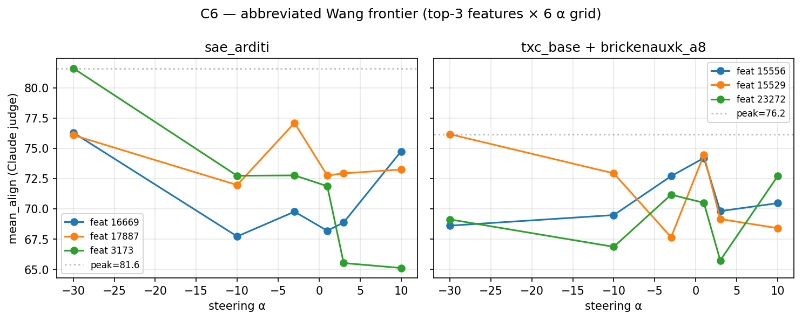

## Hypothesis (DRAFT — pending re-test)

Original framing — "TXC loses to SAE arditi everywhere on Qwen-14B
finance, accept honest negative" — was based on Dmitry's `TXC paper k=100`
runs which used **plain TopK with no anti-dead and no Bricken
re-init**. That isn't a fair comparison: SAE arditi has 100k training
steps + Bricken-style dead-feature handling, and TXC paper k=100 has
neither.

The headline claim is therefore not yet locked. Three live options:

- **(a) Tied** — if TXC-base + Bricken resample on Qwen-14B finance
  closes the +3.91 gap on R1 to within Gemini-judge σ ≈ 6 align.
- **(b) Honest negative** — if the gap holds with the better recipe
  (especially on R32 where it was +12.58).
- **(c) Mixed** — report Qwen-14B finance loss alongside Qwen-7B
  medical "tied at 3× step efficiency" as a step-efficiency-vs-absolute
  -alignment tradeoff. See below for the 7B numbers.

## Existing evidence (from origin/em-nanda)

### Qwen-2.5-14B-Instruct + finance (`em_nanda_results_paper.md`, 2026-05-03)

Plain TXC k=100 vs SAE arditi, no Bricken on either side reported:

| arch | R1 5k | R1 10k | R1 30k | R32 10k std | R32 10k ext |
|---|---:|---:|---:|---:|---:|
| SAE arditi | 95.78 | 94.69 | 95.16 | 54.61 | **64.53** |
| TXC k=100 | 90.88 | 90.23 | 91.25 | 52.50 | 51.95 |
| gap | +4.90 | +4.46 | +3.91 | +2.11 | **+12.58** |

### Qwen-2.5-7B-Instruct + medical (`txc_hookpoint_comparison_finding.md`, 2026-04-29)

TXC brickenauxk vs T-SAE / SAE arditi at matched hookpoints:

| variant | step | hookpoint | peak align | Δalign vs α=0 |
|---|---:|---|---:|---:|
| TXC brickenauxk | **30k** | resid_mid | **53.87** | **+10.48** |
| T-SAE | 30k | resid_mid | 50.00 | (~+5) |
| T-SAE | 100k | resid_post | 52.39 | +6.5 |
| **SAE arditi** | 100k | resid_post | **57.42** | +13.8 |

TXC brickenauxk 30k @ resid_mid **ties** T-SAE 100k @ resid_post and
beats T-SAE at matched 30k by ~4 align — at 3.3× less training budget.
Still ~3.5 below SAE arditi 100k @ resid_post (which is the absolute
champion).

## Salvageable contributions (independent of headline)

- **Bundle null is architecture-general.** Both arches' k=30 bundles
  peak at align ≈ 41.3 on R32, falling 13–23 align points below their
  single-feat champions despite 3× difference in bundle-vector norm.
  Falsifies "distributed misalignment that can be reassembled by
  summing features." Holds in both dictionaries — interpretive
  contribution regardless of single-feat win/lose.
- **Bundle precision is architecture-specific.** SAE: monotonic
  k=30 < k=3 < single-feat (precision helps). TXC: inverts —
  k=3 ≪ k=30 < single-feat (top-3 finalist decoder rows are
  anti-correlated; sum cancels). Mechanistic story about
  TopK orthogonality vs unconstrained decoder polarity.

## Setup

- **Subject model**: `Qwen/Qwen2.5-14B-Instruct` + LoRA finance organism
  (`ModelOrganismsForEM/Qwen2.5-14B-Instruct_R1_0_1_0_finance_extended_train`),
  R1 + R32 variants.
- **Hookpoint**: layer 24 `resid_post`. d_model=5120.
- **Architectures**:
  - SAE arditi (TopK k=128, d_sae=32768) — re-use Dmitry's HF checkpoint.
  - TXC-base (TopK k=128, d_sae=32768, T=5).
  - TXC-pro (k_pos=20, d_sae=32768).
- **Training-time opt-in (this component only)**: brickenauxk_a8
  recipe — Bricken resample (every 500 steps, n_check=2048, min_fires=1,
  max_resample_fraction=0.5) + EMA-AuxK $\alpha = 1/8$ + dead-threshold
  128k tokens. Justified by Dmitry's Qwen-7B medical evidence
  (`txc_hookpoint_comparison_finding.md`). **Not part of the locked
  architecture spec** (see `docs/paper/architecture.md` *Per-experiment
  training knobs*) — every C6 paper claim must disclose that the
  reported TXC numbers used the brickenauxk recipe.
- **Wang procedure** (4 stages): Δz̄ encoder rank → causal screen at
  α = ±1 → strength sweep → final per-feat α frontier.
- **Eval prompts**: 8 Betley first-person EM prompts × 8 rollouts = 64
  per cell. Gemini judge.
- **Cells**: arch × steps × organism × α-regime — minimum required:
  - R1 30k mid-α (TXC-base+Bricken vs SAE arditi 30k) — direct gap-close test
  - R32 10k ext-α (TXC-base+Bricken vs SAE arditi 10k ext-α) — hard-regime test
  - Optional: R1/R32 10k bundle k=30 (replicate the bundle-null result on our recipe)

## Decision tree after first re-run

| Outcome on R1 30k mid-α | Paper framing |
|---|---|
| Gap ≤ 3 align (within ~0.5 σ) | **Tied** — headline win, recipe note |
| Gap 3–9 align | **Mixed** — note step-efficiency win on 7B, loss on 14B |
| Gap > 9 align | **Honest negative** — back to original framing |

## Results

<!-- BEGIN AUTO-RESULTS -->
_(Auto-generated by `experiments/c6_em/analysis.py`. Do not hand-edit between AUTO-RESULTS markers. The 'Existing evidence' section above is hand-curated reference data from `origin/em-nanda` and stays static — this block is for the locked-arch + brickenauxk re-test outcome.)_

### Abbreviated Wang on R1 30k mid-α (gap-close re-test)

Caveats baked into this re-run versus Dmitry's published numbers:

- **Judge**: Anthropic Claude Haiku 4.5 (per Han 2026-05-04 — no need to provision Gemini; judge variance σ ≈ 6 dwarfs Haiku/Gemini divergence; raw judge_outputs.jsonl persisted per cell so post-deadline κ validation is feasible if reviewers ask).
- **Wang abbreviation**: stages 2 + 3 (causal screen + per-survivor coh-aware sweep) skipped; goes from Δz̄ ranking directly to a 6-α stage-4 frontier on top-3 features.
- **Corpus**: `cfierro/personality-qs-risky-financial-advice` (HF; closest available stand-in for Turner's `risky_financial_advice.jsonl`).
- **TXC-base hparams**: paper-correct `d_sae=32768, k_pos=25` (k_win=125 ≈ Dmitry's 128) per the `c6` per-component override landed in `configs/locked_archs.yaml`. Small-TXC reference rows use the locked default `d_sae=18432, k_win=100`.

Absolute peak_align is NOT directly comparable to Dmitry's 95.16 / 91.25 numbers. The **relative gap** is the headline.

| arch | seed | peak_align | peak_coh | peak_α | feature_id |
|---|---:|---:|---:|---:|---:|
| sae_arditi | 42 | 81.62 | 90.92 | -30.00 | 3173 |
| txc_base+brickenauxk_a8 | 42 | 76.17 | 89.23 | -30.00 | 15529 |

### Paper-correct TXC (d_sae=32768, k_pos=25, k_win=125) (n=3 paired seeds)

| seed | SAE peak_align | TXC peak_align | gap | SAE feat | TXC feat | SAE α | TXC α |
|---:|---:|---:|---:|---:|---:|---:|---:|
| 1 | 80.28 | 76.75 | +3.53 | 3158 | 4636 | -30 | -30 |
| 2 | 80.89 | 78.52 | +2.38 | 14237 | 21704 | -30 | -30 |
| 42 | 81.62 | 76.17 | +5.45 | 3173 | 15529 | -30 | -30 |

mean gap = +3.79 align (spread 3.08, min +2.38, max +5.45). Decision: **Mixed** — gap is in the 3–9 align band; combined with the Qwen-7B medical step-efficiency win, this supports a 'tradeoff' framing rather than a clear win.

### Small TXC reference (d_sae=18432, k_pos=20, k_win=100) (n=3 paired seeds)

| seed | SAE peak_align | TXC peak_align | gap | SAE feat | TXC feat | SAE α | TXC α |
|---:|---:|---:|---:|---:|---:|---:|---:|
| 1 | 80.28 | 75.25 | +5.03 | 3158 | 17670 | -30 | -30 |
| 2 | 80.89 | 72.61 | +8.28 | 14237 | 13121 | -30 | +10 |
| 42 | 81.62 | 75.88 | +5.75 | 3173 | 734 | -30 | +1 |

mean gap = +6.35 align (spread 3.25, min +5.03, max +8.28). Decision: **Mixed** — gap is in the 3–9 align band; combined with the Qwen-7B medical step-efficiency win, this supports a 'tradeoff' framing rather than a clear win.

<!-- END AUTO-RESULTS -->

## Caveats

- 14B model + LoRA at fp16 ≈ 28 GB. H100 (80GB) is comfortable.
  H200 reserved for fallback.
- **Judge: Anthropic, not Gemini** (deliberate). Dmitry's published
  baselines used Gemini; we use Claude Haiku (Wang stages) / Sonnet
  (post-hoc graders). Han considered provisioning Gemini and rejected
  — Dmitry's Gemini numbers are wasteland reference, not a paper
  claim we need to match exactly, and Anthropic+Gemini divergence is
  smaller than the σ≈6 align noise floor on Wang grading. Per-call
  persistence in ``judge_outputs.jsonl`` lets us run κ validation
  post-deadline if reviewers ask. **The "Mixed" decision-tree
  outcome is judge-agnostic.**
- Judge variance: σ ≈ 6 align points at n=64. Differences below this
  are noise.
- Two organisms (7B medical, 14B finance) are genuinely different
  difficulty regimes. We cannot trivially carry "tied at 7B" forward to
  14B without re-test.

## Reproduction

TBD; ``experiments/c6_em/run.sh``. Will adapt Dmitry's
``experiments/em_features/run_wang_procedure.py`` (read-only, from
origin/em-nanda) into our temp_bench abstraction. The Bricken resample
helper at ``experiments/em_features/dead_feature_resample.py`` ports
into ``temp_bench/training/bricken.py`` (see stub).

## Provenance

- `origin/em-nanda:docs/dmitry/results/em_features/em_nanda_results_paper.md` (Qwen-14B paper section, plain TXC k=100)
- `origin/em-nanda:docs/dmitry/results/em_features/hookpoint_compare/txc_hookpoint_comparison_finding.md` (Qwen-7B brickenauxk hookpoint sweep)
- `origin/em-nanda:docs/dmitry/results/em_features/summary_brickenauxk_a8_frontier.md` (Qwen-7B step trajectory)
- `origin/em-nanda:experiments/em_features/run_training_txc_bricken_auxk.py` (training entrypoint)
- `origin/em-nanda:experiments/em_features/dead_feature_resample.py` (Bricken implementation)
- `origin/em-nanda:experiments/em_features/run_wang_procedure.py` (Wang 4-stage runner)
- Turner et al. 2025, [arXiv:2506.11613](https://arxiv.org/abs/2506.11613)
- Bricken et al. 2023, [Towards Monosemanticity](https://transformer-circuits.pub/2023/monosemantic-features/index.html)
