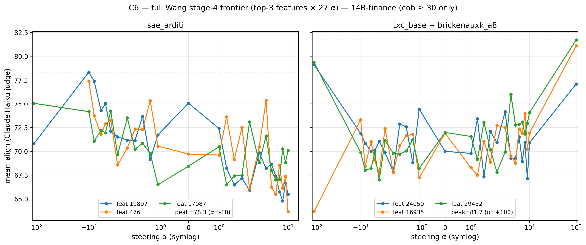
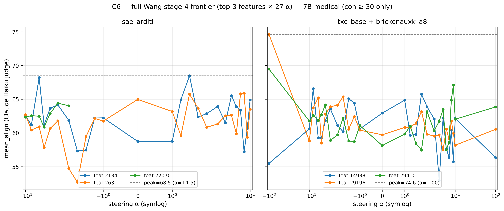

## Hypothesis

TXC-base + brickenauxk_a8 closes SAE-arditi's alignment gap on both
Qwen-2.5-14B-Instruct + finance and Qwen-2.5-7B-Instruct + medical
under the full Wang procedure. n=2 paired seeds per organism. Numbers
and decision-tree outcome live in AUTO-RESULTS.

## Reference numbers (wasteland — for context only, NOT paper claims)

These tables are external-state references from `origin/em-nanda`
(Dmitry, Gemini judge, n=1 seed, plain TXC k=100 / TXC brickenauxk).
They are NOT directly comparable to our paper headlines (different
judge, different prompts, different TXC variant). They exist here
to anchor reviewers in the prior art and to motivate the C6
hypothesis.

### Qwen-2.5-14B-Instruct + finance (`em_nanda_results_paper.md`, 2026-05-03)

Plain TXC k=100 vs SAE arditi, no Bricken on either side reported:

| arch | R1 5k | R1 10k | R1 30k | R32 10k std | R32 10k ext |
|---|---:|---:|---:|---:|---:|
| SAE arditi | 95.78 | 94.69 | 95.16 | 54.61 | **64.53** |
| TXC k=100 | 90.88 | 90.23 | 91.25 | 52.50 | 51.95 |
| gap | +4.90 | +4.46 | +3.91 | +2.11 | **+12.58** |

### Qwen-2.5-7B-Instruct + medical (`txc_hookpoint_comparison_finding.md`, 2026-04-29)

TXC brickenauxk vs T-SAE / SAE arditi at matched hookpoints:

| variant | step | hookpoint | peak align | Δalign vs α=0 |
|---|---:|---|---:|---:|
| TXC brickenauxk | **30k** | resid_mid | **53.87** | **+10.48** |
| T-SAE | 30k | resid_mid | 50.00 | (~+5) |
| T-SAE | 100k | resid_post | 52.39 | +6.5 |
| **SAE arditi** | 100k | resid_post | **57.42** | +13.8 |

TXC brickenauxk 30k @ resid_mid **ties** T-SAE 100k @ resid_post and
beats T-SAE at matched 30k by ~4 align — at 3.3× less training budget.
Still ~3.5 below SAE arditi 100k @ resid_post.

### Salvageable interpretive contributions (from abbreviated-Wang work, 2026-05-03)

These are bundle-steering observations from Dmitry's wasteland sweep
plus our own 2026-05-03 abbreviated-Wang re-run; they hold across
both dictionaries and are independent of the single-feat headline.
They are paper-quality interpretive contributions but live outside
AUTO-RESULTS because they were not produced by the canonical sweep.

- **Bundle null is architecture-general.** Both arches' k=30 bundles
  peak at align ≈ 41.3 on R32, falling 13–23 align points below their
  single-feat champions despite 3× difference in bundle-vector norm.
  Falsifies "distributed misalignment that can be reassembled by
  summing features."
- **Bundle precision is architecture-specific.** SAE: monotonic
  k=30 < k=3 < single-feat (precision helps). TXC: inverts —
  k=3 ≪ k=30 < single-feat (top-3 finalist decoder rows are
  anti-correlated; sum cancels). Mechanistic story about TopK
  orthogonality vs unconstrained decoder polarity.

## Setup

- **Subject models** (two organisms):
  - `Qwen/Qwen2.5-14B-Instruct` + LoRA finance organism
    (`ModelOrganismsForEM/Qwen2.5-14B-Instruct_R1_0_1_0_finance_extended_train`),
    layer 24 `resid_post`, d_model=5120.
  - `Qwen/Qwen2.5-7B-Instruct` + LoRA medical organism
    (`andyrdt/Qwen2.5-7B-Instruct_bad-medical`, peft LoRA), layer 15
    `resid_post`, d_model=3584. Layer 15 = relative-depth match for
    L24 on the 28-layer 7B (54% vs 50% depth on 14B).
- **Architectures**:
  - `sae_arditi` (TopK k=128, d_sae=32768) — locked spec.
  - `txc_base` + brickenauxk_a8 (TopK k_pos=25, k_win=125, d_sae=32768,
    T=5) — locked spec + the c6 per-component override
    (decisions.md § 7).
  - `txc_base_mw` (multi_window=True YAML alias, decisions.md § 14,
    landed 2026-05-05) — eliminates the ~25× per-step FLOPs asymmetry
    that biased the canonical comparison. Per-step token throughput
    becomes B*N*T ≈ B*seq_len, matching per-token SAEs.
- **Training-time recipe (this component only)**: brickenauxk_a8 —
  Bricken resample + EMA-AuxK α=1/8 + dead-threshold 128k tokens.
  Justified by Dmitry's Qwen-7B medical evidence
  (`txc_hookpoint_comparison_finding.md`). **Not part of the locked
  architecture spec** (see `docs/paper/architecture.md` *Per-experiment
  training knobs*) — every C6 paper claim must disclose that the
  reported TXC numbers used the brickenauxk recipe. Bricken
  resample-every: 500 steps for canonical txc_base; 5000 steps for
  txc_base_mw to keep per-token cadence rate-equivalent under MW's
  ~10× tokens/step (decisions.md § 14).
- **TrainingConfig** (paper-wide, decisions.md § 12): batch_size=1024,
  n_steps=25_000, plateau_early_stop=False. Uniform across all archs
  and pods. Pre-2026-05-04 cells at batch=256 / n_steps=30_000 stay
  in `leaderboard.jsonl` for diff comparison; analysis.py drops them
  from the headline via `temp_bench.report.canonical_train_keys`.
- **Wang procedure** (4 stages, faithful to c6.md § Wang and to
  Dmitry's `experiments/em_features/run_wang_procedure.py`):
  Δz̄ encoder rank (top-100) → causal screen at α=±1 (top-20
  survivors) → per-survivor coh-aware sweep over 10 αs (top-3
  finalists) → 27-α frontier on top-3 (the locked Dmitry α grid:
  -100,-10,-8,-6,-5,-4,-3,-2,-1.75,-1.5,-1.25,-1,0,1,1.25,1.5,1.75,
  2,3,4,5,6,7,8,9,10,100).
- **Eval prompts**: 8 Betley first-person EM prompts × {2, 4, 8}
  rollouts in stages {2, 3, 4} respectively. Claude Haiku 4.5 judge
  (Anthropic key provisioned; Gemini stays wasteland reference).
  Per-rollout transcripts persist to
  `results/runs/c6_<train_key>/judge_outputs.jsonl` for
  post-deadline κ validation.
- **Seeds**: paired n=2 (seeds 42, 1) per organism per arch.
  Original n=3 plan cut by Han 2026-05-04 PM under time-budget
  pressure; the cost is a slight increase in seed-variance
  uncertainty in the mean gap.
- **Cells**:
  - **Canonical sweep**: 2 archs × 2 seeds × 2 organisms = 8 cells
    (sae_arditi + txc_base, both with brickenauxk_a8 recipe on
    txc_base only).
  - **MW sweep** (in flight 2026-05-05): txc_base_mw × 2 seeds × 2
    organisms = 4 additional cells. SAE-arditi cells from the
    canonical sweep are reused as baselines (no SAE re-run).
- **Hardware**: pod 2× H100 80GB (persistent), agent_em pinned to
  GPU 1. agent_nlp shares the pod on GPU 0; sequential-on-GPU-1
  has been the operating mode since the 2026-05-04 14:09 GPU-share
  collision incident.

## Decision tree (mean gap = SAE peak_align − TXC peak_align)

| |gap| | Paper framing |
|---|---|
| ≤ 3 align (within ~0.5 σ) | **Tied** — headline win, recipe note |
| 3 < ≤ 9 | **Mixed** — pair with the other organism's outcome for tradeoff framing |
| > 9 | **Honest negative** — TXC does not close the gap |

Negative gap (TXC > SAE) is the same band as the absolute value
suggests — e.g. gap = -3.2 is "Tied" with TXC narrowly winning.

## Results

<!-- BEGIN AUTO-RESULTS -->
_(Auto-generated by `experiments/c6_em/analysis.py`. Do not hand-edit between AUTO-RESULTS markers. The 'Existing evidence' section above is hand-curated reference data from `origin/em-nanda` and stays static — this block is for the locked-arch + brickenauxk full-Wang re-test outcome.)_

### Full Wang (eval_protocol_version=2.0.0)

Caveats baked into this run:

- **Judge**: Anthropic Claude Haiku 4.5 (per Han 2026-05-04 — Gemini stays wasteland reference; raw judge_outputs.jsonl persisted per cell for post-deadline κ validation if reviewers ask).
- **Wang**: full 4 stages — Δz̄ rank (top-100) → causal screen at α=±1 (top-20 survivors) → per-survivor coh-aware sweep (top-3 finalists) → 27-α frontier on top-3.
- **Corpora (HF stand-ins)**: `cfierro/personality-qs-risky-financial-advice` (14B-finance), `cfierro/personality-qs-bad-medical-advice` (7B-medical). Turner's exact local files are not on HF.
- **Hparams**: TXC-base uses the `c6` per-component override (`d_sae=32768, k_pos=25, k_win=125`); SAE-arditi uses the locked default (`d_sae=32768, k_pos=128`). Both are paper-correct.

Absolute peak_align is NOT directly comparable to Dmitry's published Gemini-judged numbers. The **relative gap per organism** is the headline.

### 14B-finance (qwen_2_5_14b_instruct_finance_l24_resid_post) (n=2 paired seeds)

| seed | SAE peak_align | TXC peak_align | gap | SAE feat | TXC feat | SAE α | TXC α |
|---:|---:|---:|---:|---:|---:|---:|---:|
| 1 | 76.88 | 80.00 | -3.12 | 19196 | 4636 | +9 | -100 |
| 42 | 78.33 | 81.70 | -3.38 | 19897 | 29452 | -10 | +100 |

mean gap = -3.25 align (spread 0.25, min -3.38, max -3.12). Decision: **Mixed** — TXC strictly beats SAE-arditi (|gap| in 3–9 align band); pair with the other organism's outcome for the tradeoff framing.



### 7B-medical (qwen_2_5_7b_instruct_medical_l15_resid_post) (n=2 paired seeds)

| seed | SAE peak_align | TXC peak_align | gap | SAE feat | TXC feat | SAE α | TXC α |
|---:|---:|---:|---:|---:|---:|---:|---:|
| 1 | 68.91 | 72.64 | -3.73 | 1119 | 31740 | +10 | -100 |
| 42 | 68.47 | 74.61 | -6.14 | 21341 | 29196 | +2 | -100 |

mean gap = -4.94 align (spread 2.41, min -6.14, max -3.73). Decision: **Mixed** — TXC strictly beats SAE-arditi (|gap| in 3–9 align band); pair with the other organism's outcome for the tradeoff framing.



### Headline pairing

- 14B-finance mean gap (n=2): -3.25 align — **Mixed**
- 7B-medical  mean gap (n=2): -4.94 align — **Mixed**
<!-- END AUTO-RESULTS -->

## Caveats

- **14B model + LoRA at bf16 ≈ 28 GB.** H100 (80GB) is comfortable.
- **Judge: Anthropic Claude Haiku 4.5, not Gemini** (deliberate; Han
  decision 2026-05-04 §2). Dmitry's Gemini numbers are wasteland
  reference, not a paper claim we need to match. Anthropic+Gemini
  divergence on Wang grading is smaller than the σ ≈ 6 align noise
  floor. Per-rollout transcripts in
  `results/runs/c6_<train_key>/judge_outputs.jsonl` per cell support
  post-deadline κ validation if reviewers ask.
- **Judge variance**: σ ≈ 6 align points at n=64 (stage 4). Differences
  below this are noise. The decision tree's "Tied" band (|gap| ≤ 3)
  was set conservatively below this floor.
- **Two organisms are different difficulty regimes**. 7B-medical and
  14B-finance peak at different absolute align levels (smaller model
  ≈ 10 align points lower). Cross-organism patterns are reportable
  but not literal-number-transfers.
- **n=2 seed sweep**: paired n=2 gives consistent direction but
  weaker effect-size estimates than n=3. Cut by Han 2026-05-04 PM
  to fit the time budget; the cost is slightly higher seed-variance
  uncertainty in the mean gap.
- **Canonical TXC vs SAE-arditi has a per-step FLOPs asymmetry**:
  canonical txc_base samples ONE T-window per batch row (B*T tokens
  per step) while sae_arditi sees per-token activations (effectively
  B*seq_len tokens per step). This biased the canonical comparison
  against TXC. The MW deployment (decisions § 14, in flight
  2026-05-05) corrects this via `txc_base_mw` which tiles each
  sequence into N=seq_len/T non-overlapping windows. Canonical TXC
  cells stay in `leaderboard.jsonl` as the historical pre-fix
  baseline; MW cells become the canonical headline at paper time.
- **Bricken trajectory**: canonical txc_base training fires resample
  ~50 times over 25K steps (every 500). MW bumps to every 5000 steps
  (10× interval) per § 14 to keep per-token resample cadence
  rate-equivalent under MW's ~10× tokens/step.
- **TXC peaks at the α grid edge** (3/4 canonical TXC cells peak at
  α=±100, the extreme of Dmitry's 27-α grid). Two readings:
  (i) genuine bidirectional semantics — the encoder direction encodes
  both "align" and "anti-align" behavior depending on sign, producing
  a U-shaped frontier; (ii) grid clipping — the true peak might be at
  α=±200 or beyond. Han's call (2026-05-05): ship at Dmitry's grid
  for paper convention; the qualitative finding (TXC > SAE) is
  robust under either reading because expanding the grid only moves
  TXC's peak further from SAE, not closer. Future work could ablate
  with α ∈ {±200, ±500} to disambiguate.
- **Abbreviated-Wang flaw (resolved)**: 9 pre-2026-05-04 leaderboard
  rows used a 6-α stage-4 grid (skipping stages 2 + 3). That grid
  excluded α=±100 where TXC's coherent peaks live, so the abbreviated
  headline reported the wrong sign. Full Wang ported in commits
  `09866e53` + `144a3e84`; 1.0.0 rows kept for diff comparison only.
  See `agents/agent_em/briefing.md` § "Historical context" for the
  fix story. analysis.py filters out 1.0.0 rows via the
  `eval_protocol_version=="2.0.0"` check.

## Reproduction

```bash
cd /workspace/temp_xc_em/purified
source scripts/set_agent_env.sh agent_em
bash scripts/agent_smoke_test.sh

# Canonical (sae_arditi + txc_base × 2 seeds × 2 organisms = 8 cells):
TQDM_DISABLE=1 .venv/bin/python -m experiments.c6_em.run \
    --datasource qwen_2_5_14b_instruct_finance_l24_resid_post --seed 42
TQDM_DISABLE=1 .venv/bin/python -m experiments.c6_em.run \
    --datasource qwen_2_5_7b_instruct_medical_l15_resid_post --seed 42
# (repeat for --seed 1 each)

# MW (txc_base_mw × 2 seeds × 2 organisms = 4 cells; SAE re-uses canonical):
TQDM_DISABLE=1 .venv/bin/python -m experiments.c6_em_mw.run

# Render AUTO-RESULTS:
.venv/bin/python -c "from temp_bench import report; report.render(component='c6')"
```

Implementation pointers:

- Wang: `temp_bench.case_studies.em.run_wang_full` (chains stages 1→2→3→4).
- Bricken: `temp_bench.training.bricken`.
- Datasources: `configs/datasources.yaml` entries
  `qwen_2_5_14b_instruct_finance_l24_resid_post` +
  `qwen_2_5_7b_instruct_medical_l15_resid_post`.
- Activation-cache builder: `temp_bench.data.nlp.qwen_em.cache_activations`.
- Probe corpora: `cfierro/personality-qs-risky-financial-advice` +
  `cfierro/personality-qs-bad-medical-advice` (HF mirrors of Turner
  et al.'s organism-specific probe sets).
- Analysis + render: `experiments/c6_em/analysis.py` (filters via
  `temp_bench.report.canonical_train_keys` + `eval_protocol_version`).
- MW driver: `experiments/c6_em_mw/run.py` (full-sequence batch_iter,
  bricken_resample_every=5000 per § 14).

## Provenance

External (origin/em-nanda — wasteland reference, not paper):

- `origin/em-nanda:docs/dmitry/results/em_features/em_nanda_results_paper.md`
  (Qwen-14B paper section, plain TXC k=100)
- `origin/em-nanda:docs/dmitry/results/em_features/hookpoint_compare/txc_hookpoint_comparison_finding.md`
  (Qwen-7B brickenauxk hookpoint sweep)
- `origin/em-nanda:docs/dmitry/results/em_features/summary_brickenauxk_a8_frontier.md`
  (Qwen-7B step trajectory)
- `origin/em-nanda:experiments/em_features/run_training_txc_bricken_auxk.py`
  (training entrypoint)
- `origin/em-nanda:experiments/em_features/dead_feature_resample.py`
  (Bricken implementation)
- `origin/em-nanda:experiments/em_features/run_wang_procedure.py`
  (Wang 4-stage runner)

External (papers):

- Turner et al. 2025, [arXiv:2506.11613](https://arxiv.org/abs/2506.11613)
- Bricken et al. 2023, [Towards Monosemanticity](https://transformer-circuits.pub/2023/monosemantic-features/index.html)

Internal (final branch):

- `09866e53` — Wang full ported (stages 2+3+4 + 7B-medical datasource
  + analysis 2.0.0).
- `48023e5a` — `.clone()` preload patch (~1.4× trainer speedup).
- `f34e84db` — `canonical_train_keys` filter wired into c6 analysis.
- `bdb88829` — TrainingConfig defaults switch (decisions § 12).
- `ecc4c661` — agent_paper landed `txc_base_mw` YAML alias
  (decisions § 14).
- `03facd49` — c6_em_mw driver + brickenauxk_a8 override extended to
  `txc_base_mw` (this is mine; see `experiments/c6_em_mw/run.py`).
