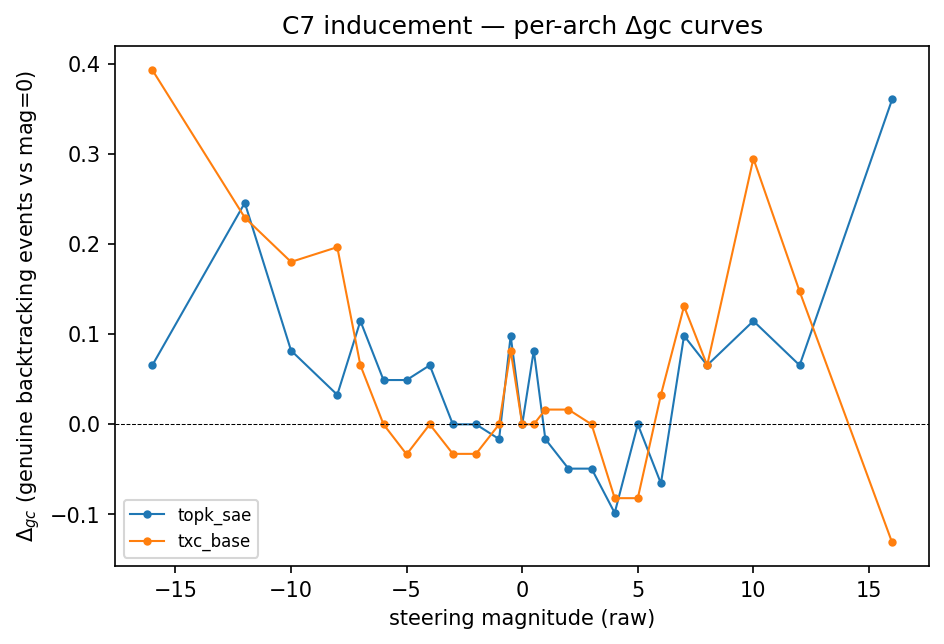
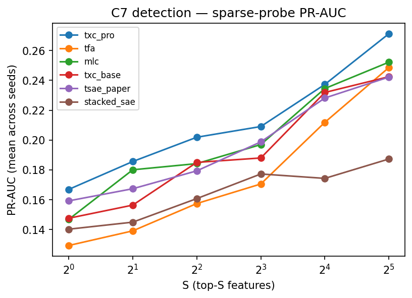

## Hypothesis

On the Ward et al. 2025 backtracking case study (Stage B), TXC-pro
delivers the largest peak Δgc (gain in Sonnet-judged genuine
backtracking count under steering) — roughly 3× the next-best
architecture. This is the "TXC pushes the Pareto frontier on a
behavioural inducement metric" claim.

Detection of backtracking sentences via sparse linear probes on TXC
features is **comparable** to conventional SAEs but not dominant once
the class-imbalance-aware metric (PR-AUC) is used; Wilcoxon vs each
baseline at S=8 fails Holm-Bonferroni in the prior wasteland sweep.
The defensible paper claim on detection is "comparable", not "SOTA".

## Setup

- **Subject model — paper-faithful.** Steering vectors are derived from
  `meta-llama/Llama-3.1-8B` (BASE) and applied at inference time to the
  reasoning model `deepseek-ai/DeepSeek-R1-Distill-Llama-8B`. This is
  the Ward et al. 2025 (arxiv 2507.12638) Fig. 1 setup. Without the
  reasoning-model side, the paper's central "BASE-derived → induces
  backtracking in reasoning model" claim cannot be replicated.
- **Layer 10 residual** (`resid_post`). Paper-justified: Appendix B.1 /
  Fig. B.1 sweep over all 32 layers identifies L10 as the optimal
  layer. We do not re-sweep — adopting the paper's choice.
- **Activation cache**: 4044 sliding windows × residual L10 from
  Llama-3.1-8B BASE (shape `(4044, 128, 4096)`, fp16, 4.24 GB).
  Built by agent_back; pushed to `${TEMP_BENCH_HF_ORG}/temp-bench-data`
  keyed by `act_cache_key=fb2a74be884e512a`. The prior author's Stage A
  scaffolding (300 MATH-500 prompts on R1-Distill-Llama, judge
  transcripts, sentence labels, DoM vectors) is read-only from
  `origin/case-backtracking:results/ward_backtracking_txc/stage_a/`.
- **Architectures (7 total)**: TopK-SAE, Stacked-SAE, TFA, T-SAE
  (paper-faithful Ye et al. port — `temp_bench.architectures.tsae:TSAEPaper`),
  TXC-base, TXC-pro, MLC. The locked set + Stacked-SAE + MLC for
  cross-arch context. **NOT TFA-pos** (used only in C1/C2).
  Per-component d_sae overrides in `locked_archs.yaml` set
  d_sae=32768 (Llama d_in=4096 × 8) for all C7 entries.
- **Cohort**: 31 truly-wrong + 30 originally-correct = 61 MATH-500
  questions × 25 magnitudes × 7 archs (the prior author's headline cohort).
- **Magnitude grid**: 25 points densified ±0.5–8 around the SAE peak:
  `[-16,-12,-10,-8,-7,-6,-5,-4,-3,-2,-1,-0.5, 0, 0.5,1,2,3,4,5,6,7,8,10,12,16]`.
- **Cut protocol**: cut Stage A trace at 25% of unsteered length, then
  steer-and-continue. (the prior author's B3 cut25 protocol — beats LLM-judged
  cut and full-trace; we adopt as the locked protocol.)
- **Two metric axes**:
  - **Inducement (Δgc)** *(primary)*: Sonnet 4.6 judge counts genuine
    backtracking events (catching errors, missing constraints,
    approach rejection, assumption re-evaluation), explicitly
    excluding filler / pseudo-bt / loops. Per-(arch, qid) baselined
    to mag=0. **Headline metric.**
  - **Detection (PR-AUC)** *(primary detection metric — NOT F1, NOT ROC-AUC)*:
    sparse linear probes (LogisticRegression, l1, C=1.0) fitted on
    top-S mean-difference features, S ∈ {1, 2, 4, 8, 16, 32},
    5-fold GroupKFold by `question_id`. PR-AUC is mandatory because
    positive class is ~12% — F1 / ROC-AUC are misleading at this
    imbalance. We additionally report PR-AUC after a paired
    **within-window token-shuffle ablation** ((decision 2026-05-05),
    via `temp_bench.eval.detection.detect_case_study`): the gap
    `PR-AUC − PR-AUC_shuffled ≥ 0.02` distinguishes genuinely
    temporal detection from window-density. The shuffle ablation
    is only meaningful for window archs (`T > 1`); per-token archs
    (TopK-SAE, T-SAE-paper) skip it. See
    `docs/cross_component/det_steer_detection.md`.
- **Judge κ validation: deferred to a paper-end stretch task.** Doing
  fresh 20-transcript blind hand-scoring in the next 72 hours is not
  in the timeline; we lean on the prior wasteland κ values (0.749 /
  0.773 / 1.000 on his prompt + transcripts) as the prior-art
  validation, and the eval pipeline persists every Sonnet call to
  `results/runs/<eval_key>/judge_outputs.jsonl` (one record per
  `(transcript_id, magnitude, arch, label)`). Post-deadline, fresh
  Cohen's κ on a 20-transcript blind sample is `pandas.read_json` +
  `scipy.stats.cohen_kappa_score` — no re-judging, no re-training.
  Paper text frames the headline as "judge-derived, prior-validated";
  fresh κ goes in App. X if the stretch task completes.
- **Seeds**: seed=42 single-seed ((decision 2026-05-04) directive: "stay
  single seed"). The prior author also ran seed=42 only. Multi-seed stderr
  reporting is a post-deadline stretch task.
- **Hardware**: agent_back on 4× A40 pod (GPUs 0 and 2 dedicated per
  (decision 2026-05-04) re-allocation; the pod is split with agent_steer
  who owns GPUs 1+3). Full v4 sweep wall-time at batch=1024 / n_steps=
  20_000 + preloaded `.clone()` batch_iter: **~14 hr across 2 GPUs in
  parallel** (heaviest cell txc_pro is ~7 hr train + ~95 min eval; 4
  cells on the busier GPU sequential ≈ 14 hr).

### Magnitude axis convention (open question — ask the prior author before paper)

TXC's headline feature in the prior author's run was mined as a *negative-direction*
backtracking feature (productive direction is mag<0). A symmetric
±X x-axis penalises TXC for steering "the wrong way." Three options:
(a) symmetric, (b) per-arch sign-flipped, (c) two-panel. Open question
deferred to a paper-time decision; the locked protocol generates all
25 magnitudes either way, so this is a presentation choice.

> _Prior-art / wasteland reference numbers (the prior author's hill-climbed TXC,
> Sonnet judge, etc.) are at the bottom of this document under
> "Wasteland reference (NOT paper data)". They are NOT our paper
> claims; kept for reviewer context only._

## Results

<!-- BEGIN AUTO-RESULTS -->
_(Auto-generated by `experiments/c7_backtracking/analysis.py` — do not hand-edit between AUTO-RESULTS markers (PROTOCOL.md § 7).)_

### Inducement — Sonnet `genuine_count` (Δgc, baseline-corrected at mag=0)

| arch | stability (Δgc>0 / 24) | peak Δgc | peak mag | peak / TXC-pro |
|---|---|---:|---:|---:|
| txc_base | 15/24 | +0.426 | -8.0 | 1.13× |
| txc_pro | 19/24 | +0.377 | +12.0 | 1.00× |
| tfa | 13/24 | +0.344 | +16.0 | 0.91× |
| stacked_sae | 18/24 | +0.328 | +12.0 | 0.87× |
| tsae_paper | 13/24 | +0.246 | +16.0 | 0.65× |
| topk_sae | 13/24 | +0.230 | -16.0 | 0.61× |
| mlc | 13/24 | +0.164 | +16.0 | 0.43× |




### Detection — PR-AUC (sparse probe, GroupKFold by qid)

| arch | S=1 | S=2 | S=4 | S=8 | S=16 | S=32 |
|---|---:|---:|---:|---:|---:|---:|
| mlc | 0.147±0.000 | 0.180±0.000 | 0.184±0.000 | 0.197±0.000 | 0.235±0.000 | 0.252±0.000 |
| stacked_sae | 0.140±0.000 | 0.145±0.000 | 0.161±0.000 | 0.177±0.000 | 0.174±0.000 | 0.187±0.000 |
| tfa | 0.129±0.000 | 0.139±0.000 | 0.157±0.000 | 0.171±0.000 | 0.212±0.000 | 0.249±0.000 |
| topk_sae | 0.129±0.000 | 0.134±0.000 | 0.152±0.000 | 0.168±0.000 | 0.186±0.000 | 0.215±0.000 |
| tsae_paper | 0.159±0.000 | 0.167±0.000 | 0.179±0.000 | 0.199±0.000 | 0.228±0.000 | 0.242±0.000 |
| txc_base | 0.148±0.000 | 0.156±0.000 | 0.185±0.000 | 0.188±0.000 | 0.232±0.000 | 0.242±0.000 |
| txc_pro | 0.167±0.000 | 0.186±0.000 | 0.202±0.000 | 0.209±0.000 | 0.237±0.000 | 0.271±0.000 |




#### Within-window shuffle ablation (paired)
_PR-AUC after token shuffle within each T-window. Bold values in the gap table are ≥ 0.02 = genuinely temporal detection (vs window-density). Per (decision 2026-05-05)._


**PR-AUC (shuffled):**

| arch | S=1 | S=2 | S=4 | S=8 | S=16 | S=32 |
|---|---:|---:|---:|---:|---:|---:|
| mlc | 0.160±0.000 | 0.181±0.000 | 0.184±0.000 | 0.200±0.000 | 0.219±0.000 | 0.234±0.000 |
| stacked_sae | 0.135±0.000 | 0.137±0.000 | 0.148±0.000 | 0.151±0.000 | 0.168±0.000 | 0.182±0.000 |
| tfa | 0.131±0.000 | 0.145±0.000 | 0.156±0.000 | 0.197±0.000 | 0.214±0.000 | 0.246±0.000 |
| txc_base | 0.148±0.000 | 0.185±0.000 | 0.182±0.000 | 0.202±0.000 | 0.210±0.000 | 0.223±0.000 |
| txc_pro | 0.169±0.000 | 0.190±0.000 | 0.203±0.000 | 0.209±0.000 | 0.238±0.000 | 0.258±0.000 |


**Shuffle gap (PR-AUC − PR-AUC_shuffled):**

| arch | S=1 | S=2 | S=4 | S=8 | S=16 | S=32 |
|---|---:|---:|---:|---:|---:|---:|
| mlc | -0.013±0.000 | -0.001±0.000 | -0.000±0.000 | -0.003±0.000 | +0.016±0.000 | +0.018±0.000 |
| stacked_sae | +0.005±0.000 | +0.008±0.000 | +0.012±0.000 | **+0.027**±0.000 | +0.007±0.000 | +0.005±0.000 |
| tfa | -0.001±0.000 | -0.006±0.000 | +0.002±0.000 | -0.026±0.000 | -0.002±0.000 | +0.002±0.000 |
| txc_base | -0.001±0.000 | -0.028±0.000 | +0.003±0.000 | -0.014±0.000 | **+0.022**±0.000 | +0.019±0.000 |
| txc_pro | -0.002±0.000 | -0.004±0.000 | -0.001±0.000 | +0.000±0.000 | -0.001±0.000 | +0.013±0.000 |


**Headline reproducibility** — TXC-pro peak Δgc = **+0.377** at mag=+12.0; the prior wasteland TXC-H8 (closest analog) = +0.492 at mag=+12.0; hill-climbed TXC = +1.574 at mag=−12 (reference, NOT a comparable arch).
<!-- END AUTO-RESULTS -->

## Caveats

- **TXC architecture mismatch (the central reproducibility test)**:
  the prior author's hill-climbed TXC at k=16/pos / T=6 / window L0=96 is not in
  our locked set. TXC-base = T=5 / k_pos=20 / window L0=100 and TXC-pro
  = subseq T_max=10 / matryoshka H8. Whether the +1.574 peak Δgc
  reproduces under TXC-base or TXC-pro is the central empirical test
  for C7.
- **TXC-H8 ≈ TXC-pro**: the prior author's "TXC-H8 appendix arch" is the closest
  existing analog (subseq + matryoshka H8 at k=16/pos), with peak
  Δgc = +0.492. Reproducing under our locked TXC-pro (k_pos=20, T_max=10,
  t_sample=5) may shift further.
- **Subject model ≠ rest of paper**: C7 is on Llama-8B; C3/C4/C5 are on
  Gemma-2-2b-IT; C6 is on Qwen-14B. The C7 row is paper-faithful to Ward
  et al., not consistent with the IT anchor. Acceptable: each component
  is its own subject; "two TXCs everywhere" claim is unaffected.
- **TSAE = paper-faithful only**: registered `tsae_paper` is the
  faithful Ye et al. 2025 port (Matryoshka BatchTopK + AuxK + temporal
  contrastive). The wasteland's `tsae_ours.py` (TopK + 50/50 split + no
  AuxK) is **deprecated and must not be ported** — see
  `configs/locked_archs.yaml` `tsae_paper` notes.
- **Judge κ re-validation**: the prior author's κ was on his run; ours must clear
  ≥ 0.6 fresh on the locked-arch transcripts before anchoring claims.
- **PR-AUC, not F1/ROC-AUC**: at 12% positive class, F1 and ROC-AUC are
  misleading (the prior author's earlier writeup was F1; pivoted to PR-AUC).
- **Calibration**: `p95(|feature_act|)` and `L2(decoder)` calibration
  variants from the prior author's earlier work both correct for a normalisation
  the cut25 pipeline already performs (`normalize_to_dom_norm`). Use
  raw magnitudes; calibrated variants are deprecated.

## Reproduction

```bash
# (the maintainer runs bootstrap_runpod.sh once; agent_back wakes up with tokens.)
cd /workspace/temp_xc/purified
source scripts/set_agent_env.sh agent_back
bash scripts/agent_smoke_test.sh
bash scripts/sync_from_hf.sh

# Build Llama-3.1-8B BASE L10 act-cache (or pull from HF if cached)
TQDM_DISABLE=1 .venv/bin/python -m experiments.c7_backtracking.run \
    --build-cache-only

# Full sweep: 7 archs × seed=42 × 25 magnitudes ((decision 2026-05-04)
# directives: single seed; n_steps=20_000 deadline override coded
# into experiments/c7_backtracking/run.py; GPUs 0 + 2 only).
CUDA_VISIBLE_DEVICES=0 TQDM_DISABLE=1 \
  PYTORCH_CUDA_ALLOC_CONF=expandable_segments:True \
  .venv/bin/python -m experiments.c7_backtracking.run \
  --archs txc_pro mlc tsae_paper --seeds 42 \
  > logs/c7_v4_gpu0.log 2>&1 &
CUDA_VISIBLE_DEVICES=2 TQDM_DISABLE=1 \
  PYTORCH_CUDA_ALLOC_CONF=expandable_segments:True \
  .venv/bin/python -m experiments.c7_backtracking.run \
  --archs tfa txc_base stacked_sae topk_sae --seeds 42 \
  > logs/c7_v4_gpu2.log 2>&1 &

# Re-render results section after cells land. Use post_sweep wrapper
# which renders + commits + pushes.
bash scripts/c7_post_sweep.sh
```

The runner uses `temp_bench.runner.run_cell` per (arch, seed, magnitude)
cell. Stage A artefacts (`prompts.json`, `traces.json`, `sentence_labels.json`,
`dom_vectors.pt`) are read read-only from
`origin/case-backtracking:results/ward_backtracking_txc/stage_a/` —
ported once with attribution per PROTOCOL.md § 2 (do not import
across branches at runtime).

## Provenance

- **Subject paper**: Ward et al. 2025, "Reasoning-Finetuning Repurposes
  Latent Representations in Base Models", arxiv 2507.12638 — see
  `papers/backtracking.md`. Key excerpts: § 3 (steering vector at L10),
  Appendix B.1 / Fig. B.1 (layer sweep identifying L10 as optimal),
  § 4 (logit-lens analysis).
- **the prior author's Stage B writeups (read-only — wasteland docs)**:
  - `origin/case-backtracking:docs/legacy/experiments/ward_backtracking/methodology_neurips_push.md`
  - `origin/case-backtracking:docs/legacy/experiments/ward_backtracking/results_b_neurips_push.md`
  - `origin/case-backtracking:docs/legacy/experiments/ward_backtracking/handoff_neurips_push.md`
  - `origin/case-backtracking:notes/tsae_paper_param_audit.md` (NB: the
    audit's claim that "tsae is attention-based" appears to confuse
    TSAE with TFA — our `tsae_paper` is the faithful Ye port).
- **Stage B code (read-only — wasteland code, port via `git show`)**:
  `origin/case-backtracking:experiments/ward_backtracking_txc/` —
  `{cache_activations, train_txc, mine_features, b3_variants,
  build_flip_matrix, build_inducement, calibrate_magnitudes,
  detection/build_detection_probe, grade_sonnet, plot/,
  run_headline_pipeline.sh, run_tfa_mlc_extension.sh}`.
- **Stage A scaffolding (read-only)**: `origin/case-backtracking @ 8a6d2aa2`
  → `experiments/ward_backtracking/`.

---

# Wasteland reference (NOT paper data — context only)

The numbers below are NOT our paper claims. They are from
`origin/case-backtracking @ a62175ee` using a **hill-climbed TXC**
(k=16/pos, T=6, window L0=96 — NOT our locked TXC-base/TXC-pro).
The locked-arch re-run is what populates the AUTO-RESULTS block above.

**Inducement — Sonnet `genuine_count` (gold standard, 9 150 calls)**

| Arch (the prior author's hill-climbed) | Stability (Δgc>0 / 24) | Peak Δgc (mag) | Peak / TXC |
|---|---|---|---|
| TXC (k=16, T=6, L0=96) | 21/24 | +1.574 (mag=−12) | 1.00× |
| MLC | 24/24 | +0.508 (mag=+16) | 0.32× |
| TXC-H8 (≈TXC-pro analog) | 22/24 | +0.492 (mag=+12) | 0.31× |
| TFA | 24/24 | +0.328 (mag=+12) | 0.21× |
| SAE | 23/24 | +0.262 (mag=−16) | 0.17× |
| TSAE-paper | 23/24 | +0.246 (mag=+10) | 0.16× |

**Detection — PR-AUC (12 % positive class)**: TXC-H8 takes top spot
at S=32 (0.288); MLC leads at small S. No Wilcoxon TXC-vs-baseline at
S=8 is HB-significant (smallest p_holm = 0.31).

**Judge κ validation (the prior author's run)**: 0.749 (coherence) / 0.773
(backtracking) / 1.000 (looping); raw agreement 0.85 / 0.95 / 1.00.

**Rescue-correctness REJECTED**: original "+6 to +8 net rescues" was
dominated by mag=0 resampling noise (cut-and-continue independently
rescues 7/31 + regresses 1/30 for ALL 6 archs, identical question_ids).
Baseline-corrected `Δnet`: no architecture is statistically significant
(paired McNemar p ≥ 0.73). C7 pivots to inducement Δgc as the headline.
