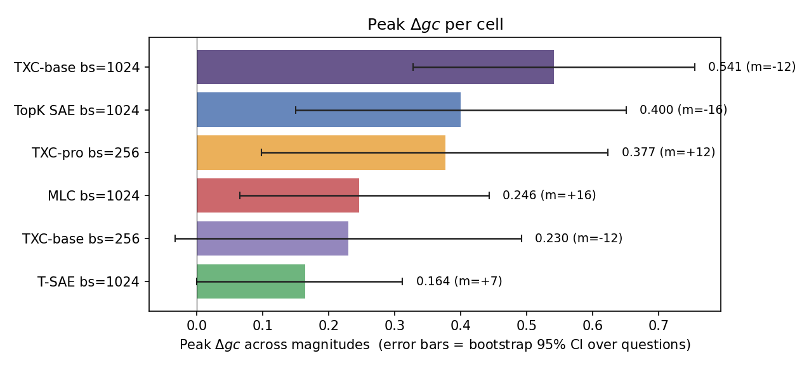
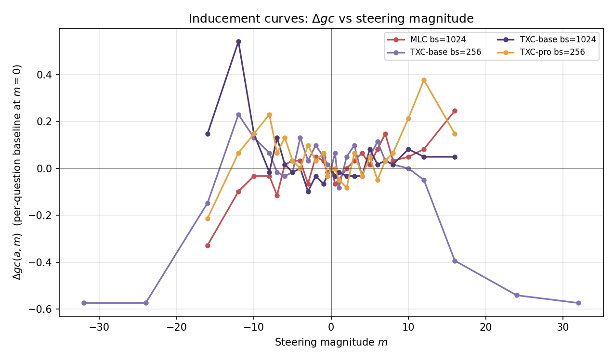
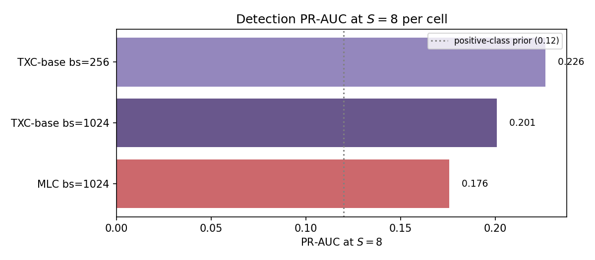
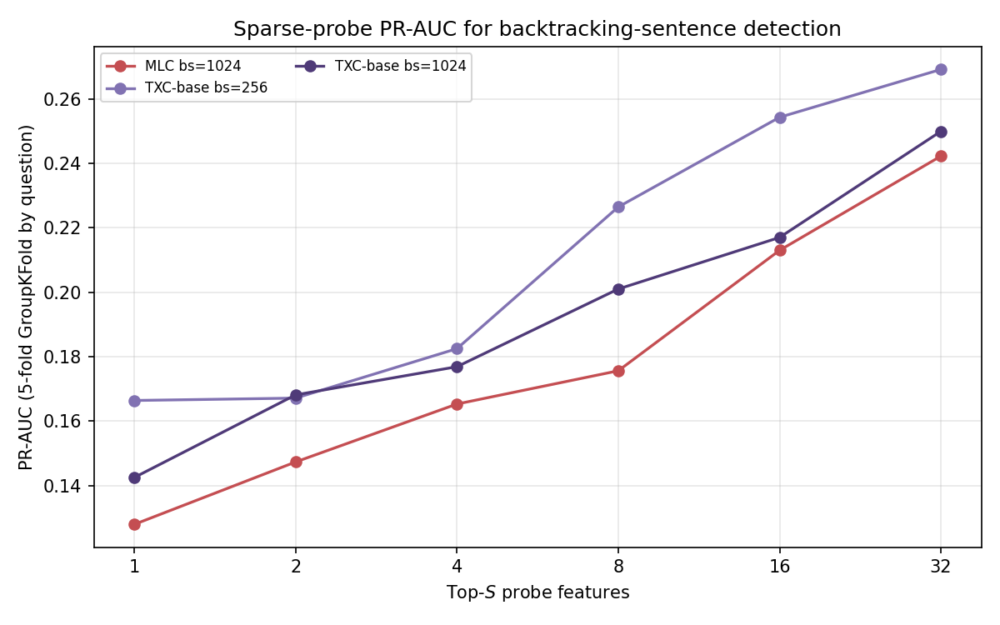
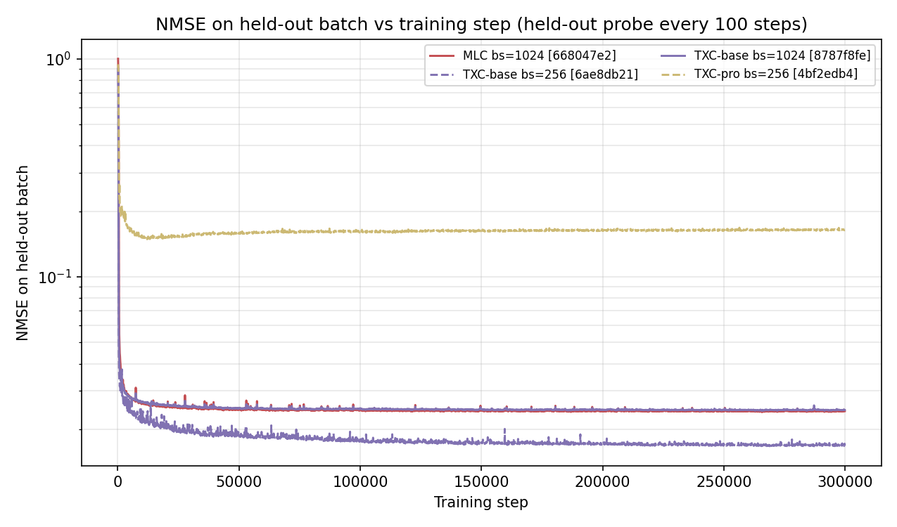
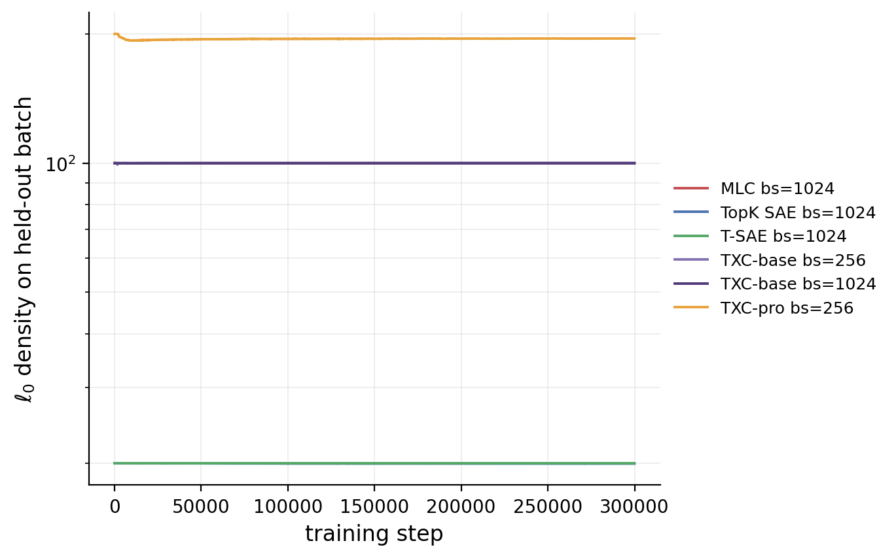
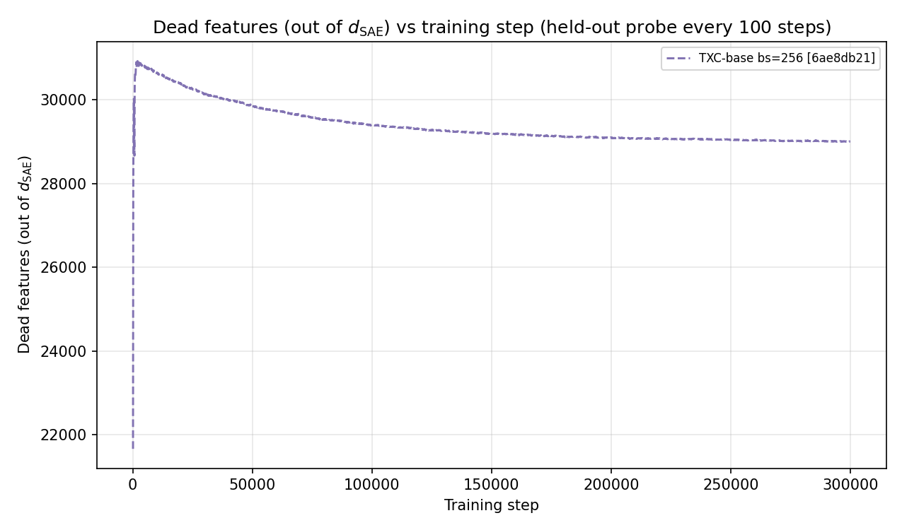

# C7 — Backtracking case study: results bundle (autogenerated)

_Last updated: 2026-05-05 15:55:53 UTC._  _Source: `purified/results/leaderboard.jsonl` filtered to `component == 'c7'`._

**Cells in leaderboard:** 2.  **Architectures present:** TXC-base.  **Still pending:** TXC-pro, TopK SAE, T-SAE, MLC.

This file is regenerated automatically as new leaderboard rows land. 
It is paired with the prose section in `purified/docs/components/c7_section.tex`; 
the numbers + figures here are the inputs to the `[TBD]` placeholders there.

## Headline numbers

| Arch | bs | n_steps | Peak $\Delta gc$ | Peak mag | PR-AUC@8 | PR-AUC@32 | n_judge | ts (UTC) |
|---|---|---|---|---|---|---|---|---|
| TXC-base | 256 | 300,000 | 0.230 | -12.0 | 0.226 | 0.269 | 1525 | 2026-05-05 05:27:32 |
| TXC-base | 1024 | 300,000 | 0.541 | -12.0 | 0.201 | 0.250 | 1525 | 2026-05-05 11:06:10 |

## Inducement curves: $\Delta gc$ vs steering magnitude

Solid lines are batch-size 1024 cells (headline); dashed lines are the 
additional batch-size 256 cells run for the two TXC architectures (see 
`app:c7-bs-256` in the section TeX).

## Detection PR-AUC

Sparse-probe PR-AUC at top-$S$ feature counts ($5$-fold GroupKFold by question, 
$\ell_1$-regularised logistic regression, $C = 1$). Positive-class prior $\approx 0.12$.

### Full PR-AUC table

| Arch (cell) | $S\!=\!1$ | $S\!=\!2$ | $S\!=\!4$ | $S\!=\!8$ | $S\!=\!16$ | $S\!=\!32$ |
|---|---|---|---|---|---|---|
| TXC-base bs=256 | 0.166 | 0.167 | 0.182 | 0.226 | 0.254 | 0.269 |
| TXC-base bs=1024 | 0.143 | 0.168 | 0.177 | 0.201 | 0.217 | 0.250 |

## Per-magnitude $\Delta gc$

Per-question-baselined Δgc at each magnitude in the locked grid 
$\mathcal{M} = \{-16, -12, -10, -8, -7, -6, -5, -4, -3, -2, -1, -0.5, 0, +0.5, +1, +2, +3, +4, +5, +6, +7, +8, +10, +12, +16\}$.

| Arch (cell) | -16 | -12 | -10 | -8 | -7 | -6 | -5 | -4 | -3 | -2 | -1 | -0.5 | +0 | +0.5 | +1 | +2 | +3 | +4 | +5 | +6 | +7 | +8 | +10 | +12 | +16 |
|---|---|---|---|---|---|---|---|---|---|---|---|---|---|---|---|---|---|---|---|---|---|---|---|---|---|
| TXC-base bs=256 | -0.148 | 0.230 | 0.131 | 0.066 | -0.016 | -0.033 | -0.016 | 0.131 | 0.033 | 0.098 | 0.049 | 0.016 | 0.000 | 0.066 | -0.082 | 0.049 | 0.098 | -0.033 | 0.049 | 0.115 | 0.033 | 0.016 | 0.000 | -0.049 | -0.393 |
| TXC-base bs=1024 | 0.148 | 0.541 | 0.148 | -0.016 | 0.131 | 0.016 | -0.016 | 0.000 | -0.098 | -0.033 | -0.066 | -0.033 | 0.000 | -0.033 | -0.016 | -0.033 | -0.033 | -0.033 | 0.082 | 0.016 | 0.033 | 0.016 | 0.082 | 0.049 | 0.049 |

## Convergence audit (probe every 100 training steps)

Free probe data captured during training: NMSE, $\ell_0$ density, and 
dead-feature count on a held-out batch. These plots cover both completed 
and in-flight cells, so curves may extend to different terminal steps.

## Per-cell metadata

| Arch | bs | n_steps | seed | train_key | eval_key | ts |
|---|---|---|---|---|---|---|
| TXC-base | 256 | 300,000 | 42 | 6ae8db21b1bb | 72a0a51c4ee9 | 2026-05-05 05:27:32 |
| TXC-base | 1024 | 300,000 | 42 | 8787f8fe5272 | 3979ceaa4ecf | 2026-05-05 11:06:10 |

---

_Plots and tables are regenerated by 
`purified/scripts/c7_paper_renderer.py`. Numbers are not hand-edited; 
if a value looks wrong, fix the source data and re-run the renderer._