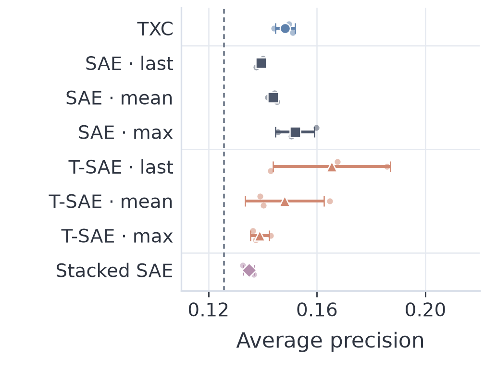
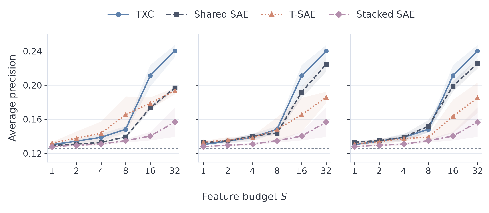
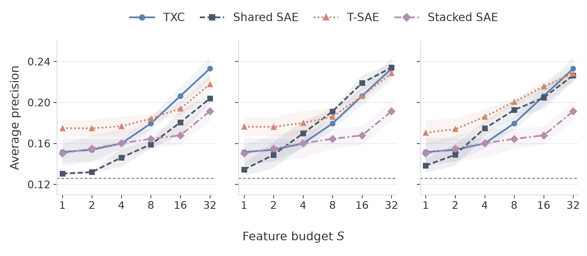
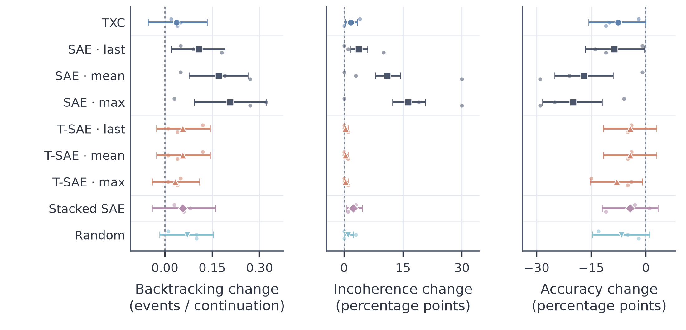
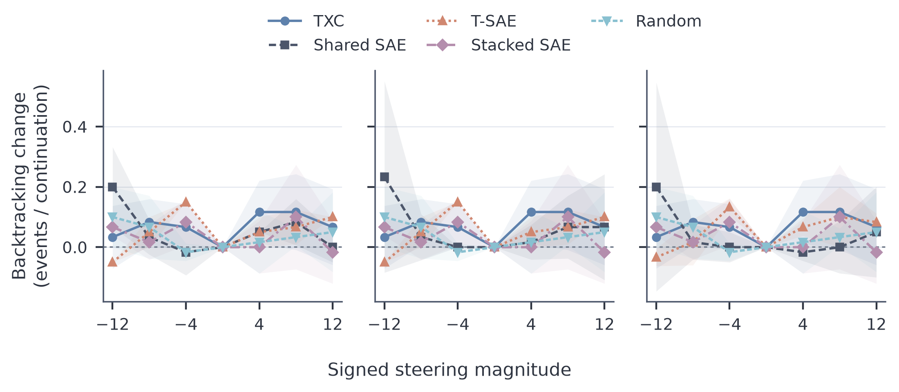
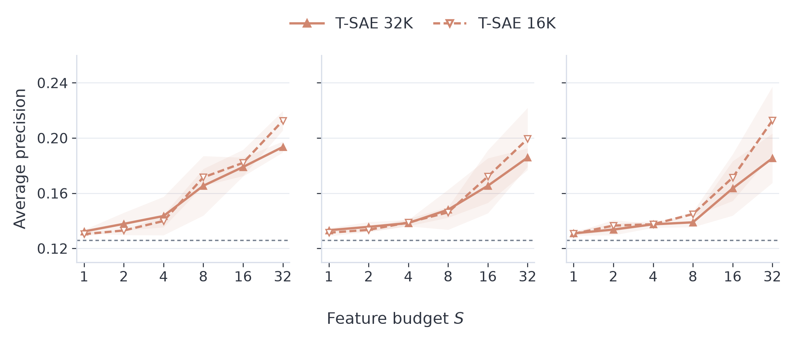

# Backtracking: camera-ready results

The corrected runs support a **budget-dependent detection advantage** for TXC. They **do not establish a useful steering advantage** in the held-out test below.

Each model configuration was trained for **300,000 steps** in **three independently seeded runs**. TXC-pro is excluded. We added the pooled SAE comparisons, corrected T-SAE inference, and kept duplicate problem texts together when splitting the detection data, so identical questions no longer cross the training/test boundary.

These are fresh corrected evaluations; historical plots used a different protocol. There are two different questions here: **detection** asks whether a small set of features can identify upcoming backtracking; **steering** asks whether intervening on a feature changes the model's behavior. A good detector does not automatically make a useful steering direction.

## With eight features, TXC does not lead

Higher is better. At the paper's original eight-feature budget, T-SAE using the last token has the highest mean score in this 32K comparison. Pooling ordinary SAE features across the five token positions also gives a competitive baseline, so this figure does not support a general TXC advantage.

The large points show the average across three training seeds; small points show each seed. Error bars show variation between seeds, not confidence intervals.

## TXC improves when the detector can use more features

Moving right lets the detector use more features. TXC gains more from that extra budget and has the highest mean at 32 features in this comparison. Its advantage is therefore specific to the feature budget, rather than a win across the whole curve.

From left to right, the SAE and T-SAE comparisons use the last token, the average across five tokens, or the maximum across those tokens. TXC and Stacked SAE repeat as references. Shaded bands show variation across the three seeds.

## The detector setup matters too

The first two figures put feature activity on a common scale before fitting the detector. This figure leaves activity on its original scale. At the larger budget, TXC and mean-pooled SAE are now approximately tied. That change in ranking is why we should report both settings and avoid claiming that TXC is uniformly better.

## Does steering produce useful backtracking?

Each method's steering strength was chosen on 20 tuning questions, then tested against its zero-intervention control on 100 different questions. This steering comparison uses the 32K dictionaries; the 16K comparison below is detection-only.

From left to right, the panels show changes in coherent backtracking, incoherence, and answer accuracy. The dashed line means no change. A useful intervention would increase backtracking while preserving coherence and accuracy.

**TXC's average backtracking increase is small, and the uncertainty interval includes no change. It does not demonstrate an advantage over the random-direction control.** Its average answer accuracy also falls. Pooled SAE directions produce larger backtracking increases, but they also cause more incoherence and larger accuracy losses. More counted backtracking therefore does not establish better reasoning.

Here, error bars reflect uncertainty across the test questions; small dots show the three seed results. The intervals hold the trained models and chosen strengths fixed. Backtracking and coherence were judged by GPT-6 Luna using the original rubrics; these labels still need human calibration. Accuracy uses the saved automatic answer matcher within the fixed generation budget.

<strong>How the steering strengths were chosen</strong>

These curves use only the tuning questions. Each seed picks the strength giving the largest increase in coherent backtracking, before any test labels are used. The wide shaded regions show variation across seeds, and the preferred strength can change between runs. They are tuning curves, not additional evidence of a held-out benefit.

As in the detection curves, the panels use last-token, mean-pool and max-pool feature selection from left to right; TXC, Stacked SAE and random references repeat across panels.

<strong>Extra comparison: a smaller T-SAE is a meaningful baseline</strong>

The 16K T-SAE often matches or beats the 32K version, including the last-token comparison at eight features. A larger dictionary is not automatically a stronger baseline. This tests two widths under the fixed training recipe; it does not establish the best possible T-SAE settings.

## What this means for the paper

Keep the pooled SAE baselines, the T-SAE width comparison, and both detector setups. Describe TXC's detection result as conditional on the feature budget and detector setup. The current steering experiment should be presented as a limited behavioral intervention result, without claiming that it improves mathematical reasoning or establishes a TXC advantage.

Judging is complete for all 27 steering arms, with estimated API spending of **$1.18**. The figures and underlying values are saved, so changing the presentation does not require another training or judging run.

All models reached the same number of training steps, but their parameter counts and training objectives differ. Stacked SAE also has a larger pool of position-specific features to choose from. These comparisons also cannot establish that every evaluation question was absent from the original language-model or dictionary-training data.

For exact values and reproducibility, see the [detection tables and vector figures](publication/detection/), [steering tables and vector figures](publication/steering/), [experiment protocol](../../experiments/backtracking_camera_ready_2026/README.md), and [verified checkpoint backup receipt](checkpoint_backup_receipt.json). The plots use the Nord palette; PDF/SVG files are available beside each PNG for paper use. The manuscript itself has not been changed.
