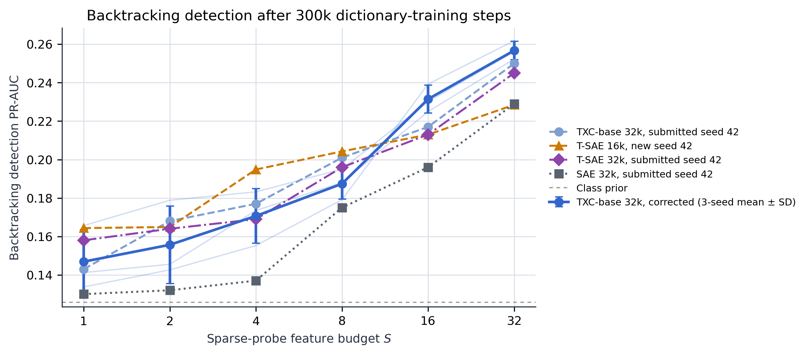
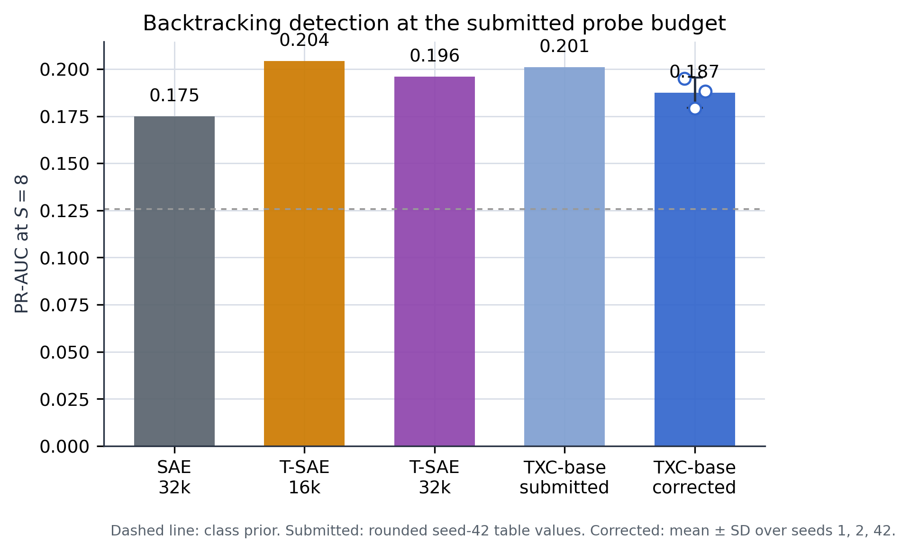

# Corrected 300K Backtracking detection

The paper-faithful TXC-base architecture was retrained for 300,000 steps with
fully seeded Python, NumPy, CPU-Torch, and CUDA RNGs. At the submitted probe
budget $S=8$, the three TXC-base seeds score
**0.1874 ± 0.0080
PR-AUC** (sample SD; 1: 0.1950, 2: 0.1791, 42: 0.1881). The positive-class prior is
0.1257.

| Architecture | Width | Seeds | PR-AUC at S=8 | Status |
|:--|--:|:--|--:|:--|
| SAE | 32,768 | 42 | 0.1750 | submitted rounded table reference |
| T-SAE | 16,384 | 42 | 0.2043 | new width sensitivity |
| T-SAE | 32,768 | 42 | 0.1960 | submitted rounded table reference |
| TXC-base | 32,768 | 42 | 0.2010 | submitted rounded table reference |
| TXC-base | 32,768 | 1, 2, 42 | 0.1874 ± 0.0080 | corrected 300K replication |

The submitted SAE, 32k T-SAE, and TXC-base rows are rounded historical
seed-42 table references from the paper, while the corrected TXC-base
statistics are a new seeded replication. They are shown together for context
but are not treated as one shared multi-seed experiment. This package evaluates
detection for TXC-base, the submitted steering winner. The submitted detection
winner was TXC-pro, which is not rerun here. This package also does not provide
new multi-seed steering measurements.
