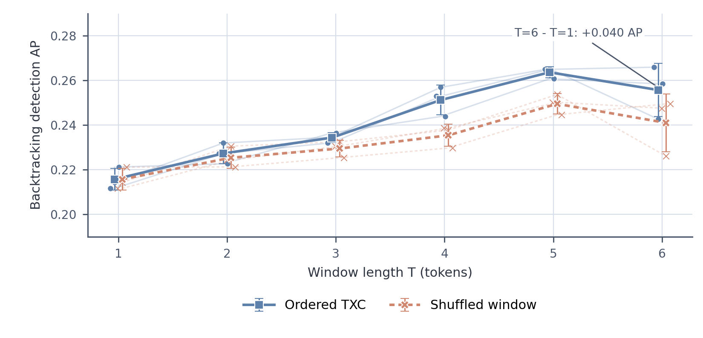
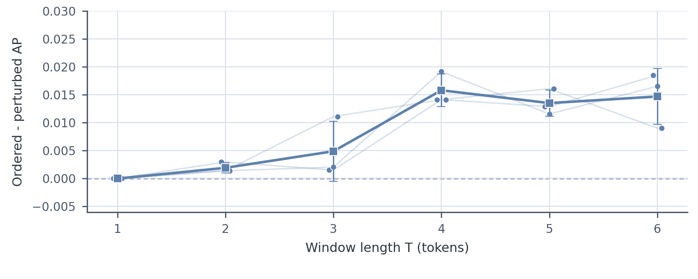

# Backtracking window-sweep reviewer figures

**Additional pre-backtracking context improves TXC detection across three dictionary seeds.** Small points are dictionary seeds, thin lines connect the same seed, and squares with whiskers show mean ± sample SD across seeds. Mean AP rises from T=1 through T=5 and then declines slightly at T=6, while every seed remains above its T=1 endpoint. AP is averaged over five question-grouped outer folds with a fixed 32-feature sparse probe; T=1 uses offset -8 and T=6 uses offsets -13 through -8. This establishes a replicated context-length effect within TXC, not that temporal order causes it or that TXC beats a sufficiently flexible positional SAE.

**Order sensitivity is smaller and less certain than the context-length effect.** Delta AP compares ordered TXC with the best-performing shuffle, reversal, or nonzero circular-shift control under the same fixed ordered-trained 32-feature probe. Points are dictionary seeds; squares and whiskers are mean ± sample SD. These perturbations induce covariate shift, so the plot measures representation sensitivity rather than a causal estimate of unique temporal information.

## Reviewer-response table

| T | Ordered TXC AP | Shuffled TXC AP | Last-token SAE AP | Invariant SAE AP |
|---:|---:|---:|---:|---:|
| 1 | 0.216 ± 0.005 | 0.216 ± 0.005 | 0.223 ± 0.002 | 0.223 ± 0.002 |
| 2 | 0.227 ± 0.005 | 0.225 ± 0.005 | 0.220 ± 0.010 | 0.225 ± 0.006 |
| 3 | 0.234 ± 0.002 | 0.229 ± 0.004 | 0.219 ± 0.001 | 0.224 ± 0.003 |
| 4 | 0.251 ± 0.007 | 0.235 ± 0.005 | 0.211 ± 0.007 | 0.219 ± 0.004 |
| 5 | 0.264 ± 0.003 | 0.250 ± 0.005 | 0.219 ± 0.011 | 0.227 ± 0.008 |
| 6 | 0.256 ± 0.012 | 0.241 ± 0.013 | 0.223 ± 0.006 | 0.231 ± 0.007 |

Entries are mean ± sample SD across the three dictionary seeds. Every method uses a 32-feature question-grouped sparse probe. The shuffled value applies the ordered-trained TXC probe after a deterministic within-window permutation; it is a fixed-probe sensitivity control rather than a retrained shuffled model.

## Positional-SAE feature-budget sensitivity

| S | Positional SAE AP | TXC AP | TXC - SAE AP [95% question-bootstrap CI] |
|---:|---:|---:|---:|
| 32 | 0.1399 | 0.2585 | +0.1186 [+0.0995, +0.1383] |
| 64 | 0.1757 | 0.2585 | +0.0828 [+0.0683, +0.0966] |
| 128 | 0.2417 | 0.2585 | +0.0168 [+0.0047, +0.0282] |
| 192 | 0.2644 | 0.2585 | -0.0058 [-0.0206, +0.0076] |
| 256 | 0.2779 | 0.2585 | -0.0194 [-0.0351, -0.0038] |

**The positional-SAE comparison reverses as its probe budget grows.** This post-hoc T=6, seed-42 diagnostic ranks features and tunes L1 regularization using outer-training data with grouped inner CV. Intervals are paired 2,000-replicate question-group bootstraps within fixed outer test folds. It is a sensitivity analysis, not a preregistered three-seed result.

## Machine-readable summary

- Complete sweep cells rendered: 18/18.
- Mean paired T=6 minus T=1 gain: +0.0400 AP.
- Numeric sources: `window_sweep_seed_metrics.csv` and `positional_sae_budget_sensitivity.csv`.
