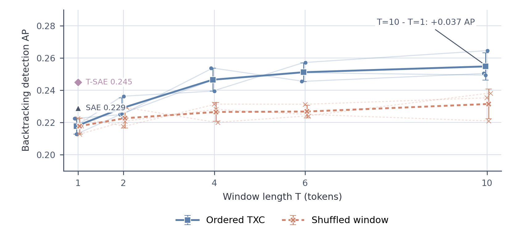
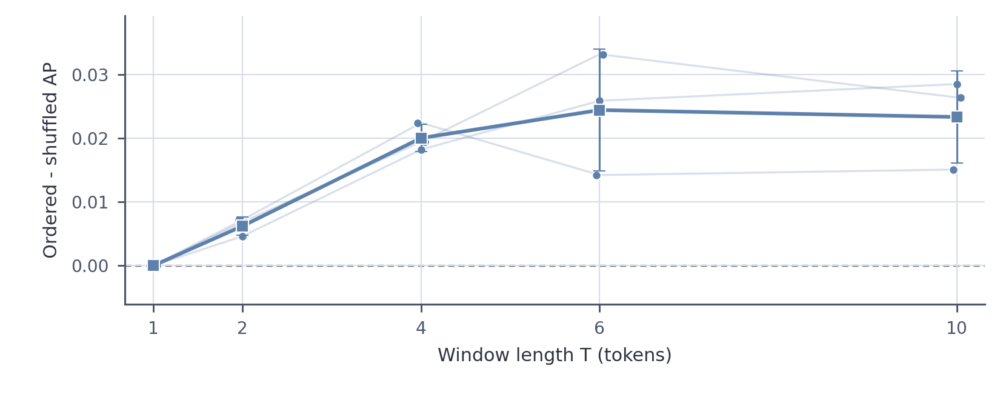

# Backtracking window-sweep reviewer figures

**Ordered and shuffled performance are reported separately because a longer window can improve detection without using order.** Small points are dictionary seeds, thin lines connect the same seed, and squares with whiskers show mean ± sample SD across seeds. A rise shared by both curves is consistent with denoising or recovery of an order-invariant/DC-like component; only their separation is evidence that the fixed ordered-trained representation depends on token order.

The single T=1 markers give the submitted-paper S=32 baselines: TopK SAE at 0.229 AP and T-SAE at 0.245 AP. Those values use the seed-42 300K-step dictionaries and average five question-grouped folds; they are shown for context and are not pooled with the 20K-step three-seed window sweep.

**Ordered minus shuffled AP isolates the fixed-probe temporal residual.** Positive values mean the intact local trajectory carries signal that is damaged by within-window permutation. The control is still a covariate-shift sensitivity test, so it should be interpreted alongside retrained order-invariant baselines.

**Order sensitivity is smaller and less certain than the context-length effect.** Delta AP compares ordered TXC with the best-performing shuffle, reversal, or nonzero circular-shift control under the same fixed ordered-trained 32-feature probe. Points are dictionary seeds; squares and whiskers are mean ± sample SD. These perturbations induce covariate shift, so the plot measures representation sensitivity rather than a causal estimate of unique temporal information.

## Reviewer-response table

| T | Ordered TXC AP | Shuffled TXC AP | Last-token SAE AP | Invariant SAE AP |
|---:|---:|---:|---:|---:|
| 1 | 0.218 ± 0.005 | 0.218 ± 0.005 | 0.221 ± 0.016 | 0.221 ± 0.016 |
| 2 | 0.229 ± 0.006 | 0.223 ± 0.006 | 0.208 ± 0.004 | 0.211 ± 0.008 |
| 4 | 0.247 ± 0.007 | 0.227 ± 0.006 | 0.210 ± 0.016 | 0.219 ± 0.006 |
| 6 | 0.251 ± 0.006 | 0.227 ± 0.004 | 0.207 ± 0.012 | 0.220 ± 0.007 |
| 10 | 0.255 ± 0.008 | 0.231 ± 0.009 | 0.214 ± 0.007 | 0.223 ± 0.007 |

Entries are mean ± sample SD across 3 dictionary seeds. Every method uses a 32-feature question-grouped sparse probe. The shuffled value applies the ordered-trained TXC probe after a deterministic within-window permutation; it is a fixed-probe sensitivity control rather than a retrained shuffled model.

## Positional-SAE feature-budget sensitivity

| S | Positional SAE AP | TXC AP | TXC - SAE AP [95% question-bootstrap CI] |
|---:|---:|---:|---:|
| 32 | 0.1399 | 0.2585 | +0.1186 [+0.0995, +0.1383] |
| 64 | 0.1757 | 0.2585 | +0.0828 [+0.0683, +0.0966] |
| 128 | 0.2417 | 0.2585 | +0.0168 [+0.0047, +0.0282] |
| 192 | 0.2644 | 0.2585 | -0.0058 [-0.0206, +0.0076] |
| 256 | 0.2779 | 0.2585 | -0.0194 [-0.0351, -0.0038] |

**The positional-SAE comparison reverses as its probe budget grows.** This post-hoc T=6, seed-42 diagnostic ranks features and tunes L1 regularization using outer-training data with grouped inner CV. Intervals are paired 2,000-replicate question-group bootstraps within fixed outer test folds. It is a sensitivity analysis, not a preregistered three-seed result.

## Machine-readable summary

- Complete sweep cells rendered: 15/15.
- Mean paired T=10 minus T=1 gain: +0.0371 AP.
- Numeric sources: `window_sweep_seed_metrics.csv` and `positional_sae_budget_sensitivity.csv`.
