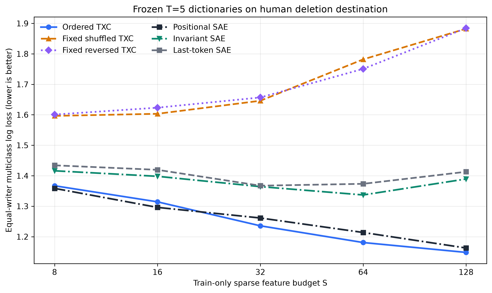

# Frozen T=5 deletion-destination dictionary gate

Protocol `klicke-deletion-frozen-dictionary-t5-v1` on 6,224 events from 2,510 writers. Lower equal-writer log loss is better; positive control-minus-TXC gaps favor TXC.

| S | TXC ordered | TXC shuffled | TXC reversed | Positional SAE | Invariant SAE | Last-token SAE | Strongest SAE minus TXC [95% CI] |
|---:|---:|---:|---:|---:|---:|---:|---:|
| 8 | 1.3670 | 1.5964 | 1.6008 | 1.3585 | 1.4162 | 1.4341 | -0.0086 [-0.0204, +0.0027] |
| 16 | 1.3143 | 1.6033 | 1.6233 | 1.2961 | 1.3981 | 1.4194 | -0.0182 [-0.0329, -0.0031] |
| 32 | 1.2356 | 1.6461 | 1.6569 | 1.2613 | 1.3642 | 1.3673 | +0.0257 [+0.0100, +0.0413] |
| 64 | 1.1808 | 1.7819 | 1.7507 | 1.2137 | 1.3369 | 1.3734 | +0.0330 [+0.0140, +0.0528] |
| 128 | 1.1484 | 1.8824 | 1.8844 | 1.1628 | 1.3893 | 1.4130 | +0.0145 [-0.0124, +0.0388] |

Primary S=32 gate: **PASS**. It requires at least 0.020 log-loss improvement over fixed shuffle, fixed reverse, and the strongest matched SAE, with every paired writer-bootstrap lower bound above zero.

