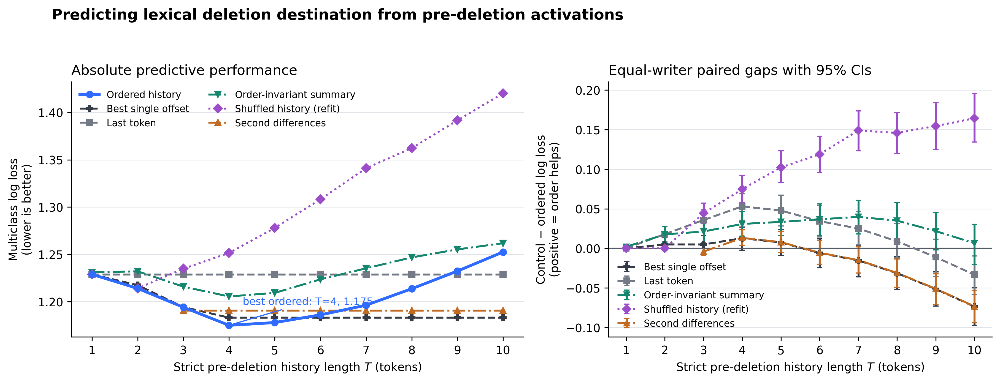

# Predicting lexical deletion destination from pre-deletion activations

Protocol `klicke-deletion-raw-activation-gate-v1`; 6,224 events from 2,510 writers. The best ordered model is T=4 (log loss 1.175, balanced accuracy 0.352). Positive paired gaps mean the control is worse than ordered history.

| Control at best T | Control − ordered log loss | 95% CI |
|---|---:|---:|
| Best single offset | 0.013 | [-0.002, 0.027] |
| Last token | 0.053 | [0.036, 0.069] |
| Order-invariant summary | 0.031 | [0.015, 0.046] |
| Shuffled history (refit) | 0.075 | [0.058, 0.092] |
| Second differences | 0.013 | [0.004, 0.023] |

The right panel uses an equal-writer bootstrap, so prolific writers cannot dominate the uncertainty estimate.
