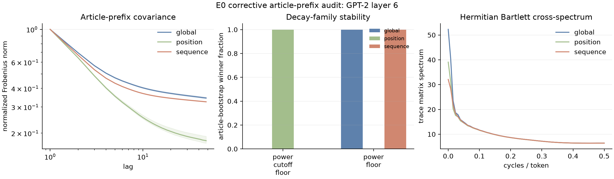
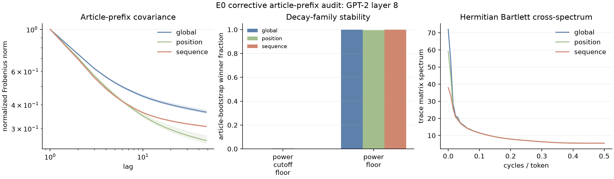

# E0 corrective article-prefix audit

**Estimand.** token-pair-weighted signed covariance of legacy-PCA64 GPT-2 residuals within cached article-prefix reconstructions; article ids are the bootstrap unit

**Unavoidable limitation.** cached article-prefix reconstruction: source tokens are contiguous across joined 255-token blocks, but activations were produced with a fresh BOS, context, and positional reset per block; discarded article remainders cannot be recovered

| Layer | Centering | AICc winner | Bootstrap modal winner | Modal fraction | Pure-power alpha 95% article interval | Min spectral eigenvalue |
|---:|---|---|---|---:|---|---:|
| 6 | global | power_floor | power_floor | 1.000 | [0.162, 0.167] | 2.084e-03 |
| 6 | position | power_cutoff_floor | power_cutoff_floor | 1.000 | [0.318, 0.352] | 1.437e-03 |
| 6 | sequence | power_floor | power_floor | 1.000 | [0.158, 0.161] | 2.082e-03 |
| 8 | global | power_floor | power_floor | 1.000 | [0.173, 0.182] | 2.183e-03 |
| 8 | position | power_floor | power_floor | 0.995 | [0.251, 0.278] | 1.454e-03 |
| 8 | sequence | power_floor | power_floor | 1.000 | [0.191, 0.195] | 2.181e-03 |

## Diagnostics

AICc here uses a Gaussian log-residual working model and counts residual variance as a fitted parameter. Article bootstrapping measures corpus sampling stability, but it does not make lag residuals independent.
