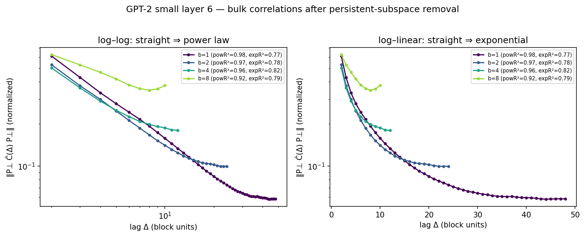
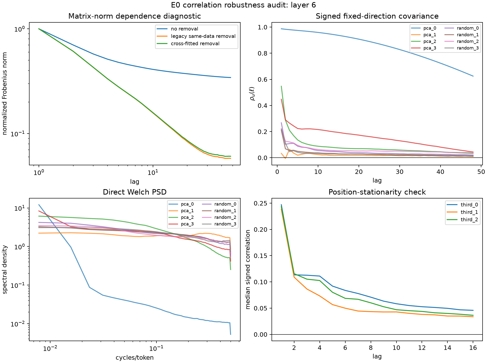
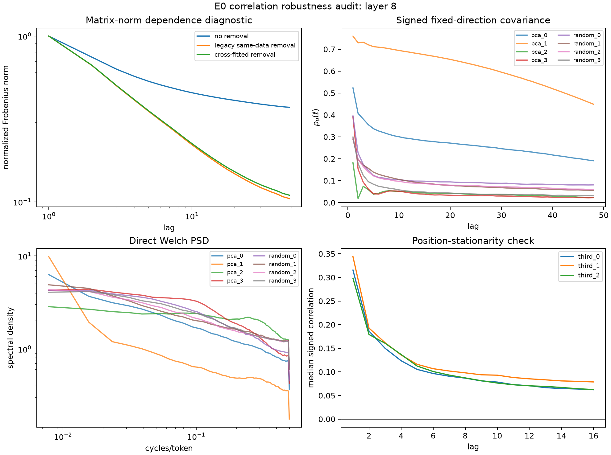

# GPT-2/WikiText correlation recheck

**Run:** 2026-07-29 on two A40s
**FutureLens source:** `77a8e70ada0511ca696b83048e90547dd37db428`
**Data:** 8,000 WikiText-103 blocks, GPT-2-small residual-stream layers 6 and 8
**Lag range:** 2--48 tokens for the primary block-size-1 comparison

## Result

The exact FutureLens calculation reproduces. After rank-8 persistent-subspace
removal, a pure power regression fits the aggregate normalized Frobenius-norm
curve better than a pure exponential for every layer-by-block-size cell:

| Layer | Block size | Exponential \(R^2\) | \(\xi\) | Power \(R^2\) | \(\alpha\) | Restricted winner |
|---:|---:|---:|---:|---:|---:|:---|
| 6 | 1 | 0.7647 | 26.21 | 0.9778 | 0.756 | power |
| 6 | 2 | 0.7817 | 16.18 | 0.9691 | 0.678 | power |
| 6 | 4 | 0.8151 | 11.10 | 0.9603 | 0.568 | power |
| 6 | 8 | 0.7888 | 15.06 | 0.9231 | 0.367 | power |
| 8 | 1 | 0.7760 | 35.23 | 0.9846 | 0.560 | power |
| 8 | 2 | 0.8152 | 20.85 | 0.9826 | 0.519 | power |
| 8 | 4 | 0.8691 | 13.30 | 0.9837 | 0.465 | power |
| 8 | 8 | 0.8245 | 14.42 | 0.9484 | 0.380 | power |

That restricted winner is not a stable pure scale-free law. When the same
curves are compared with power-plus-floor, cutoff-power-plus-floor, and
stretched-exponential-plus-floor families, the aggregate legacy estimator
selects cutoff-power-plus-floor at both layers. Cross-fitted
persistent-subspace removal selects cutoff-power-plus-floor at layer 6 and
stretched-exponential-plus-floor at layer 8. Relative to the selected family,
the pure-power working AICc is worse by 153 at layer 6 and 256 at layer 8.
These AICc values rank descriptive fits: lag residuals are correlated, so
they are not likelihood-ratio tests.

The article-prefix corrective analysis reaches the same qualitative
conclusion under three centering choices. At layer 6, article bootstraps
select power-plus-floor for global and sequence centering and
cutoff-power-plus-floor for position centering in 100% of 200 resamples. At
layer 8, they select power-plus-floor for all three choices, with modal
fractions 100%, 99.5%, and 100%. A few individual signed directions still
prefer pure power over the finite candidate set—3/8 at layer 6 and 1/8 at
layer 8—so the result is heterogeneity across directions, not a claim that
every direction has a cutoff or floor.

## Claim supported

GPT-2 residual trajectories show slow, heterogeneous, finite-range
multiscale dependence with a persistent component over this measured range.
An aggregate de-persisted norm looks power-law when the only alternative is a
pure exponential, but the pure law is not stable to broader curve families,
centering, cross-fitted persistent-subspace removal, or signed-direction
inspection.

This experiment does **not** analyze task rollouts or labels, establish
sequence-specific persistent directions, show that ensemble averaging caused
the prior task-screen failure, or imply that TXCs should succeed. Its
activations were computed with a fresh BOS, context, and positional reset for
each 255-token block; the article-prefix audit can rejoin source tokens but
cannot undo those activation resets. The result therefore supports the
motivation for a target-conditioned and group-aware correlation screen, not
the screen's validity.

## Task-rollout rerun status

The literal first-pass task-rollout experiment described in the July 29
meeting could not be independently rerun. No implementation, task list, fit
configuration, or full rollout-activation cache exists in the current tree,
the fetched team branches, or either active pod. The only exact record is
Dmitry's meeting report that he generated rollouts, scored a two-point
correlation curve against distance, reduced it to a decay length, and found
that the simplest screen failed to separate tasks. Until the scratch
script/config is recovered, external wording should attribute that claim as
an internal first-pass observation.

A reconstruction would first regenerate full per-token activations for the
pinned Backtracking traces and at least one known TXC-negative task, then
freeze centering, matrix reduction, lag range, fit family, group weighting,
and bootstrap units across tasks. Running only Backtracking or silently
substituting this unconditional GPT-2/WikiText calculation would not reproduce
the claimed cross-task screen.
