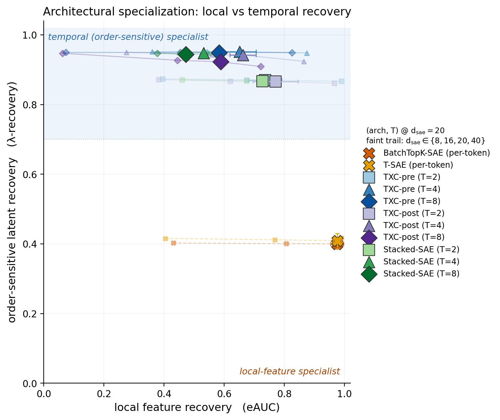
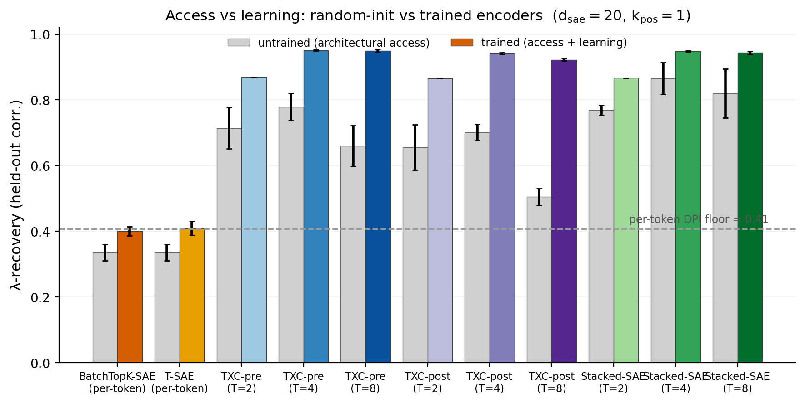

# Research record — backtracking synthetic benchmark (architecture test)

**Verdict: POSITIVE** — and it survives a **fair backbone**. With *every* arch on
the same BatchTopK→JumpReLU backbone (so the only variable is decode structure),
**window/temporal architectures recover the hidden order-sensitive intensity `λ`
far better than per-token SAEs — robustly across the scarce capacity regime —
while per-token archs sit exactly at their provable information floor.** Two
secondary findings the fair redo surfaces: **(i)** pre-squash and post-squash
crosscoders both recover `λ`, but **pre-squash is the more robust** (holds
`λ ≈ 0.95` flat through `T = 8`; post-squash, with its sparser per-window code,
slips to `0.92`); **(ii)** the shared-code crosscoder **recovers the local
feature directions (eAUC) far better than the independent per-position
`Stacked-SAE`** once it has the capacity, while matching it on `λ`. This is stage
6 of autoresearch investigation #1; it closes the loop *measured real property →
validated synthetic mirror → architecture test*.

Preregistration / spec (frozen before running):
[`backtracking_bench_spec.md`](bench_spec.md). Gating:
[`backtracking_gating_stats.json`](results/backtracking_gating_stats.json). Built to
[`README.md`](../README.md) and the
loop's [`README.md`](../README.md).

> **Headline.** A per-token SAE *provably* cannot read the self-exciting
> intensity beyond `corr = √(Var λ/Var b) ≈ 0.41` (data-processing inequality);
> trained per-token archs (BatchTopK) land at **0.40**, flat across every
> dictionary size. A window crosscoder, which sees the event *history* that sets
> `λ`, recovers it at **0.87 (T=2) → 0.95 (T≥4)** — and this holds even at
> `d_sae = 8 < F = 20`, so it is not an over-completeness artifact. The win is
> **not a backbone artifact**: it persists with every arch on the identical
> BatchTopK→JumpReLU backbone, on equal tokens/step. Window archs *trade away*
> tight reconstruction (NMSE) and — in the scarce/large-`T` corner — local
> feature recovery (eAUC) to do it: a clean global(temporal)-vs-local(per-token)
> architectural specialization.

> **This record is auto-generated from the canonical leaderboard.** Every table
> and figure below is (re)built by `-m synthetic.backtracking.render_figs`,
> which reads `results/leaderboard.jsonl` — the single source of truth — so the
> numbers cannot drift from the runs. The prose is the human narrative.

**Key numbers** (auto-filled from the leaderboard):

<!-- BEGIN AUTO:headline -->
- **Fair backbone:** every arch shares the BatchTopK→JumpReLU backbone (Bussmann et al.) + AuxK + decoder unit-norm, on equal tokens/step — so the only variable is decode structure.
- **Per-token DPI floor** (provable, from the generator): $\sqrt{Var\,\lambda/Var\,b}$ = **0.41**. Trained per-token (BatchTopK) SAEs land at **0.40** at d_sae=20, flat across all capacities.
- **Window recovery** at d_sae=20: TXC-pre $\lambda$ = **0.87** (T=2) → **0.95** (T≥4); TXC-post **0.94**; Stacked **0.95** (T=4). Holds at d_sae=8 < F=20 (TXC-pre = **0.95**, scarce regime).
- **Gap** (best window T4 − per-token): **0.55**. Untrained window already reaches 0.78 (architectural access); training lifts it to 0.95.
<!-- END AUTO:headline -->

## 1. Setup

- **Data:** `toy_backtracking_selfexcite_d64` — the validated self-exciting
  mirror (`synthetic.py:self_exciting`). `λ_i = σ(a + Σ_{l=1..K} w_l·b_{i-l})`,
  `b_i ~ Bernoulli(λ_i)`; `K = 2` (held-out model-selected), `w = α·κ`,
  `κ = exp(-l/τ)`, `τ = 2`, `α = 3.06`, intercept tuned to base rate 0.12,
  trend = 0. Emission over `F = 20` orthonormal directions
  (`u_bt` dominant + 19 content, `n_c = 3`, `σ = 0`). `seq_len = 64`,
  `n_seqs = 4096`. The intrinsic ceilings of the *generated* data match the
  gating exactly (per-token 0.408, window full-history 0.985).
- **Fair BatchTopK backbone.** Every arch shares the **BatchTopK** backbone
  (Bussmann et al.: BatchTopK during training → a fixed **JumpReLU threshold** at
  inference) + AuxK dead-feature revival + decoder unit-norm + grad-orth, so the
  *only* variable is the **decode structure**. Throughput is normalised — window
  archs use `batch_size = 1024 // T` so every arch reconstructs ~1024
  token-positions/step (equal data and equal `B·T = 1024` BatchTopK pool). The
  crosscoder's post-squash budget is `k_pos` actives **per window** (`= k_win //
  T`), since each squashed atom is reused at all `T` positions. (See the spec
  §5 pre-run amendment; the published TopK archs are untouched.)
- **Grid (198 cells, 0 failures):** archs `{batchtopk_sae, tsae}` (per-token,
  `T=1`) vs the **two** window crosscoder variants `{txc_batchtopk_pre,
  txc_batchtopk_post}` and per-position `{stacked_batchtopk}` (window,
  `T ∈ {2,4,8}`); `d_sae ∈ {8,16,20,40}` anchored on `F = 20` (scarce `{8,16,20}`
  + over-complete `{40}`); `k_pos = 1`; common tiled eval window `L = 32`; seeds
  `{1,2,42}`; 30k steps (132 cells). Plus an **untrained-encoder control**
  (`n_steps = 0`) at `d_sae = 20`, all 11 archs/`T`, 3 seeds (33 cells), and a
  **`k_pos = 2` sparsity-robustness anchor** at `d_sae = 20` (33 cells).
  Everything through the canonical runner, code-version stamped, flock-safe
  parallel append.
- **Metrics:** `lambda_recovery` (headline) — held-out Pearson `corr` of a
  **linear** regression probe on per-tile codes predicting `λ` at each tile's
  leading edge (memorization-free: features = one tile's `d_sae` code, never
  concatenated); `eauc` (local feature-direction cosine recovery); `nmse`
  (tiled windowed reconstruction); `lambda_chance` (shuffle-label floor).

## 2. Headline result — `λ` recovery vs capacity

Trained `lambda_recovery` (mean over 3 seeds), by `d_sae` (`k_pos=1`):

<!-- BEGIN AUTO:lambda_frontier -->
| arch / T | d=8 | d=16 | d=20 | d=40 |
|---|---|---|---|---|
| BatchTopK-SAE (per-token) | 0.402 | 0.401 | 0.400 | 0.400 |
| T-SAE (per-token) | 0.416 | 0.412 | 0.409 | 0.417 |
| **TXC-pre (T=2)** | 0.873 | 0.871 | 0.870 | 0.867 |
| **TXC-pre (T=4)** | 0.952 | 0.952 | 0.952 | 0.948 |
| **TXC-pre (T=8)** | 0.949 | 0.949 | 0.949 | 0.949 |
| **TXC-post (T=2)** | 0.871 | 0.867 | 0.866 | 0.861 |
| **TXC-post (T=4)** | 0.950 | 0.943 | 0.942 | 0.924 |
| **TXC-post (T=8)** | 0.947 | 0.927 | 0.923 | 0.909 |
| **Stacked-SAE (T=2)** | 0.871 | 0.868 | 0.867 | 0.867 |
| **Stacked-SAE (T=4)** | 0.950 | 0.948 | 0.948 | 0.947 |
| **Stacked-SAE (T=8)** | 0.947 | 0.944 | 0.944 | 0.943 |
<!-- END AUTO:lambda_frontier -->

- **Per-token is pinned at the DPI floor** (BatchTopK-SAE 0.400, T-SAE 0.409 ≈
  0.408) and **flat across all `d_sae`** — exactly the prediction: no dictionary
  size lets a per-token encoder see the history, so capacity is irrelevant.
- **All three window families recover `λ` at 0.87–0.95**, ~2.3× the per-token
  floor, and the win **holds in the scarce regime** (`d_sae = 8`: TXC-pre T4 =
  0.952, TXC-post 0.950, Stacked 0.950). The realistic-regime gate passes — the
  advantage is architectural, not over-completeness.
- **Pre vs post squash:** TXC-pre holds `λ ≈ 0.95` flat through `T = 8` and across
  every `d_sae`; **TXC-post slips at `T = 8`** (0.923 @ d_sae=20, down to 0.909 @
  d_sae=40) because its post-squash code commits only `k_pos` shared atoms per
  window (= `k_win // T`), so one atom must reconstruct 8 positions. Both still
  crush the per-token floor.
- `lambda_chance` ≈ 0 at the `F`-anchor (`d_sae = 20`: mean −0.03, `|·| ≤ 0.25`),
  so the recovery is real, not an inflated floor. In the most scarce regime
  (`d_sae = 8`) the tiny 8-atom code makes the shuffle-probe estimate
  high-variance (`|chance|` up to ~0.6 — a property of the regime, present in the
  published `txc_base` too), but real-label recovery there is 0.95 with low seed
  variance, so signal dominates.


*Figure 1. **(a)** Hidden-intensity (λ) recovery vs dictionary size: per-token SAEs
(dashed) are pinned at the per-token DPI floor (≈0.41) and flat across capacity,
while the window families (solid) recover λ at 0.87–0.95 — robustly into the
scarce regime `d_sae < F = 20` (shaded). **(b)** Recovery rises with window size
`T` and saturates by `T = 4` (per-token shown at `T = 1`). Error bars = ±1 s.d.
over 3 seeds.*

## 3. `λ` recovery rises with `T`, saturates by `T = 4`

At `d_sae = 20`: per-token (T=1) 0.40 → T=2 0.87 → T=4 0.95 → T=8 0.92–0.95. The
curve tracks the gating linear ceilings (0.41 / 0.91 / 0.99 / 0.99) and
**saturates by `T = 4`** — because `K = 2`, a tile of `T = 4` already contains
both relevant lags. `T = 8` confirms the plateau (TXC-pre and Stacked hold ≈0.95;
only TXC-post dips to 0.92, the post-squash-capacity effect noted above) — no
further gain past `T = K`, as the spec anticipated (panel **(b)** of Figure 1).

## 4. The global-vs-local trade-off (eAUC, NMSE)

Window archs buy `λ` recovery by **spending capacity on temporal structure** at
the cost of local-feature recovery and reconstruction. The two recovery axes —
**local** (eAUC) vs **order-sensitive / temporal** (`λ`) — make the
specialization visible at a glance:



*Figure 2. The local-vs-temporal plane (one point per (arch, T) at the `d_sae = 20`
anchor; faint trail = `d_sae ∈ {8,16,20,40}`). Per-token SAEs (✕) sit low on the
`λ` axis — **local-feature specialists** (eAUC ≈ 1 yet `λ` ≈ 0.41); the window
families — TXC-pre (blue), TXC-post (purple), Stacked-SAE (green), marked
□/△/◇ for `T = 2/4/8` — sit in the temporal-rich band, **temporal specialists**
(`λ` ≈ 0.95). Growing capacity (the trail) moves archs mostly rightward (more
eAUC), not up — the `λ` separation is architectural, not a capacity effect.*

eAUC (trained, `k_pos=1`), by `d_sae`:

<!-- BEGIN AUTO:eauc -->
| arch / T | d=8 | d=16 | d=20 | d=40 |
|---|---|---|---|---|
| BatchTopK-SAE (per-token) | 0.431 | 0.806 | 0.975 | 0.990 |
| T-SAE (per-token) | 0.404 | 0.768 | 0.976 | 0.990 |
| TXC-pre (T=2) | 0.395 | 0.674 | 0.736 | 0.990 |
| TXC-pre (T=4) | 0.361 | 0.543 | 0.651 | 0.874 |
| TXC-pre (T=8) | 0.074 | 0.455 | 0.583 | 0.825 |
| TXC-post (T=2) | 0.382 | 0.620 | 0.771 | 0.966 |
| TXC-post (T=4) | 0.275 | 0.560 | 0.662 | 0.864 |
| TXC-post (T=8) | 0.063 | 0.445 | 0.589 | 0.722 |
| Stacked-SAE (T=2) | 0.460 | 0.675 | 0.727 | 0.723 |
| Stacked-SAE (T=4) | 0.450 | 0.550 | 0.531 | 0.525 |
| Stacked-SAE (T=8) | 0.378 | 0.474 | 0.472 | 0.471 |
<!-- END AUTO:eauc -->

- **Per-token archs recover the local feature directions almost perfectly**
  (BatchTopK-SAE & T-SAE eAUC ≈ 0.98 at `d_sae = F`, 0.99 at `d_sae = 40`) while
  being `λ`-blind — the per-token "local" specialists.
- The **crosscoder trails on local recovery only in the scarce/large-`T` corner**
  (TXC-pre T8 at `d_sae = 8`: eAUC 0.07) yet still gets `λ = 0.95` — a striking
  dissociation: the *code* linearly carries the event history even when no single
  *decoder atom* aligns to `u_bt`. **eAUC recovers strongly with `d_sae`** (TXC-pre
  T2: 0.40 → **0.99** from `d_sae` 8 → 40; T4: 0.36 → 0.87): given the capacity,
  the crosscoder recovers `λ` *and* the local directions.
- **Crosscoder ≫ Stacked on local recovery.** The shared-code crosscoder's atoms
  align to the true directions, so its eAUC climbs with capacity; the independent
  per-position `Stacked-SAE` **fragments each direction across `T` slots and
  plateaus** (T4 eAUC stuck at 0.45–0.53 across all `d_sae`; T8 at 0.47). At
  `d_sae = 40`, TXC-pre T2 eAUC 0.99 vs Stacked 0.72 — same `λ`, far better local
  recovery. The crosscoder's weight-sharing is the reason.
- **NMSE:** per-token reconstructs tightest (≈0.36 at `d_sae = 20`); `Stacked`
  is nearly as tight (≈0.40, independent per-position decode), while the
  crosscoders pay the shared-code cost (TXC-pre T4 ≈ 0.54, TXC-post T4 ≈ 0.63 —
  post higher, as its sparser code carries less). All archs *do* reconstruct
  (NMSE 0.35–0.69), so the capability-vs-artifact gate passes: the window
  recovers `λ` while still representing the data, not instead of it.


*Figure 3. The global-vs-local trade-off, resolved by capacity. **(a)** Local feature recovery (eAUC):
per-token T-SAE → 0.99 at `d_sae = F`, while window archs trail in the scarce
regime (yet still recover λ). **(b)** Reconstruction NMSE: window archs pay a
higher reconstruction cost (temporal coding) but still represent the data.*

## 5. Untrained-encoder control — access vs learning

At `d_sae = 20`, trained vs random-init (`n_steps = 0`) `lambda_recovery`:

<!-- BEGIN AUTO:untrained -->
| arch / T | untrained (access) | trained (access+learning) |
|---|---|---|
| BatchTopK-SAE (per-token) | 0.336 ±0.025 | 0.400 ±0.014 |
| T-SAE (per-token) | 0.336 ±0.025 | 0.409 ±0.021 |
| TXC-pre (T=2) | 0.714 ±0.063 | 0.870 ±0.000 |
| TXC-pre (T=4) | 0.778 ±0.041 | 0.952 ±0.002 |
| TXC-pre (T=8) | 0.660 ±0.062 | 0.949 ±0.004 |
| TXC-post (T=2) | 0.656 ±0.069 | 0.866 ±0.001 |
| TXC-post (T=4) | 0.701 ±0.025 | 0.942 ±0.003 |
| TXC-post (T=8) | 0.505 ±0.026 | 0.923 ±0.004 |
| Stacked-SAE (T=2) | 0.769 ±0.015 | 0.867 ±0.001 |
| Stacked-SAE (T=4) | 0.865 ±0.049 | 0.948 ±0.003 |
| Stacked-SAE (T=8) | 0.820 ±0.075 | 0.944 ±0.005 |
<!-- END AUTO:untrained -->

The window advantage **does not vanish at random init** — a random window
projection already exposes the history linearly (access ≈ 0.51–0.87 across the
window archs, all well above the per-token floor), because the architecture
genuinely *has* the history. `Stacked-SAE` shows the highest raw access (0.87 at
T4), its per-position projections most directly exposing the recent events. The
honest decomposition: the per-token→window gap is **architectural access**
(provable: per-token can't see history, window can), and **training sharpens the
linear exposure** by a further ~0.1–0.4 (e.g. 0.78 → 0.95 at TXC-pre T4). Per-token,
by contrast, barely moves with training (0.34 → 0.40) because it is capped at the
DPI floor regardless.



*Figure 4. Access vs learning (`d_sae = 20`, `k_pos = 1`). Random-init window
encoders (grey) already exceed the per-token DPI floor — architectural access to
the history — and training (colored) lifts them further; per-token archs gain
almost nothing from training (capped by the floor).*

## 6. Preregistered predictions (spec § 7)

- **P1 — per-token ≈ information ceiling:** ✅ 0.40 vs ceiling 0.408, flat in
  `d_sae`.
- **P2 — window rises with `T`, ~oracle by `T ≈ K`:** ✅ 0.87→0.95, saturates by
  `T = 4` (the code does linearly expose the history, as the logit-linear latent
  predicted).
- **P3 (headline) — window > per-token by the history margin:** ✅ gap ≈ 0.55,
  robust across `d_sae` and all three window families, on a uniform BatchTopK
  backbone.
- **P4 — per-token recovers `F` well, window trails locally:** ✅ per-token eAUC
  0.98; window eAUC collapses in the scarce/large-`T` corner but recovers with
  capacity (and the crosscoder recovers it far better than Stacked — §4).
- **Possible negative (window fails to *linearly* expose history):** did not
  occur — but note the *eAUC dissociation* (§4): the window exposes `λ` in its
  code without atom-level `u_bt` alignment, a refinement of "represents the
  events."

## 7. Validity controls passed (spec § 3 / § 6)

- **Provable floor (not pattern-count budget):** per-token DPI ceiling 0.41,
  hit exactly — independent of `d_sae`/probe. The discriminating baseline is
  floored by information, not memorization (`K = 2` ⇒ only 4 history patterns,
  so the old `2^K` budget is moot; the DPI floor is the correct, stronger gate).
- **Memorization-free probe:** per-tile-as-example, features = one tile's
  `d_sae` code; `lambda_chance ≈ 0` at the `F`-anchor (high-variance only in the
  `d_sae = 8` regime, where real-label recovery still dominates — see §2).
- **Realistic regime:** the win holds at `d_sae ≤ F` (incl. `d_sae = 8`).
- **Untrained-encoder control:** run and reported (§5) — the advantage is part
  access (genuine, by architecture) + part learning; per-token gains nothing
  from training beyond its floor.
- **Capability-vs-artifact:** window archs reconstruct (NMSE finite) and recover
  features at adequate `d_sae` — they recover `λ` *and* represent the data.
- **Apples-to-apples:** identical `L = 32` tiling, equal `d_sae`/`k_pos` across
  archs, leak-free per-sequence split.
- **Sparsity robustness (`k_pos`):** the `d_sae = 20` anchor was re-run at
  `k_pos = 2` for all 11 archs (33 cells). The per-token→window gap does **not**
  depend on the sparsity budget — the DPI floor is `k_pos`-independent (as it must
  be), `λ`-recovery is essentially unchanged for every arch, and only local `eAUC`
  shifts modestly. (One small, sensible move: TXC-post `T = 8` lifts 0.923 → 0.945
  at `k_pos = 2` — a second shared atom directly relieves the post-squash-capacity
  pinch flagged in §2.) `λ`-recovery and eAUC at `k_pos ∈ {1, 2}` (`d_sae = 20`):

<!-- BEGIN AUTO:kpos -->
| arch / T | $\lambda$ @ $k_{pos}{=}1$ | $\lambda$ @ $k_{pos}{=}2$ | eAUC @1 | eAUC @2 |
|---|---|---|---|---|
| BatchTopK-SAE (per-token) | 0.400 | 0.402 | 0.975 | 0.989 |
| T-SAE (per-token) | 0.409 | 0.413 | 0.976 | 0.950 |
| TXC-pre (T=2) | 0.870 | 0.873 | 0.736 | 0.728 |
| TXC-pre (T=4) | 0.952 | 0.952 | 0.651 | 0.676 |
| TXC-pre (T=8) | 0.949 | 0.949 | 0.583 | 0.572 |
| TXC-post (T=2) | 0.866 | 0.870 | 0.771 | 0.751 |
| TXC-post (T=4) | 0.942 | 0.948 | 0.662 | 0.664 |
| TXC-post (T=8) | 0.923 | 0.945 | 0.589 | 0.560 |
| Stacked-SAE (T=2) | 0.867 | 0.870 | 0.727 | 0.710 |
| Stacked-SAE (T=4) | 0.948 | 0.950 | 0.531 | 0.545 |
| Stacked-SAE (T=8) | 0.944 | 0.946 | 0.472 | 0.490 |
<!-- END AUTO:kpos -->

## 8. Caveats (honest scope)

- **Synthetic mirror, weak-validated.** The bench tests architectures on a
  generator fit to the *measured* self-excitation signature
  ([`backtracking_record.md`](measurement.md)), not on real CoT
  activations. Fidelity is the matched-statistic level (spec § 2.5 weak), not a
  trained-on-real-vs-synthetic equivalence.
- **Access ≠ pure learning.** The window's edge is substantially architectural
  access (untrained window already > per-token). This is the *point* (a window
  can see history, a per-token provably can't), but it means the headline is
  "architecture that can see history wins," not "the SAE learned something a
  per-token couldn't be handed."
- **`u_bt` made dominant by design** so every arch recovers the event at
  `k_pos = 1`; the gap is therefore purely about history access, not feature
  saliency. A weaker `u_bt` would confound recovery with detection.
- **Small discrete latent.** `K = 2` ⇒ `λ` takes 4 values; recovery is a coarse
  (but provable-floor-anchored) corr. A longer kernel was rejected by held-out
  NLL (it overfit), so this is the faithful regime, not a convenience.
- **Backbone now controlled (a strengthening, not a caveat).** Every arch shares
  the BatchTopK→JumpReLU backbone on equal tokens/step, so the result is no longer
  attributable to T-SAE-style backbone tricks — but it does mean "window beats
  per-token" is a statement about *decode structure given a fixed strong
  backbone*. The pre-vs-post-squash and crosscoder-vs-Stacked contrasts are
  *within* that controlled setting.

## 9. What this buys + next

This is the **first positive architecture result** in the autoresearch loop (the
signed-motion AC bench was a documented negative): a real-language property
(self-exciting backtracking), mirrored synthetically with a provable per-token
floor, on which window/temporal dictionaries demonstrably recover the
order-sensitive latent and per-token dictionaries provably cannot — now shown on
a **uniform BatchTopK backbone**, so it is a decode-structure effect, not a
backbone artifact. The fair redo also yields two architecture-design takeaways:
**pre-squash crosscoders are more robust than post-squash** (the post-squash
per-window budget pinches at large `T`), and the **shared-code crosscoder
recovers local features far better than independent per-position dicts**
(`Stacked`) at matched `λ`. It is the order-sensitive (AC) companion to the
existing aggregation (DC) benches, and the clean substrate for the
global-vs-local specialization narrative. Next: the change-point/sticky-dwell
class via topic-switching
([`changepoint_bench_spec.md`](../changepoint/bench_spec.md)).

## 10. Reproduction

```bash
cd purified/
# gating (per-token vs window ceilings) + kernel-length selection
.venv/bin/python -m synthetic.backtracking.gating
.venv/bin/python -m synthetic.backtracking.kernel_order
# the 198-cell BatchTopK grid (parallel) + figures
.venv/bin/python -m synthetic.backtracking.run_grid 8
.venv/bin/python -m synthetic.backtracking.render_figs
```
Generator `temp_bench.data.synthetic:self_exciting`; evaluator add-on
`temp_bench.evals.lambda_recovery` (dispatched from `SyntheticRecovery` when
`extra['lambda_labels']` is present; protocol unchanged at 1.2.0).

**This record is the single paper-ready source, regenerated from the canonical
leaderboard.** `render_figs` reads `results/leaderboard.jsonl` (the one
code-version-stamped source of truth), aggregates over seeds, writes the
paper-quality figures (`figs/backtracking_{main,untrained_control,local_tradeoff}.{pdf,png}`)
+ `results/backtracking_bench_stats.json`, and fills the `<!-- AUTO:* -->` blocks
(headline + every table) above — no hand-typed numbers, nothing can drift.
The per-token DPI floor is computed directly from the generator. Deterministic
per cell (training seed re-materializes the ground truth). No `core/` edits.
