# Temporal Crosscoders — Safety & Meta-Autointerp Report

Branch: `andre_safety` · Layer: `mid_res` (Gemma-2-2b-it L13) · k=100 (per-position) · d_sae=18,432

Three architectures are compared on the **same** cached residual-stream activations: a vanilla SAE (T=1), a Temporally-Stacked SAE (T-SAE, T=5, k=100 per position → window-level L0=500), and a Temporal Crosscoder (TXC, T=5, window-level k=500). Goal: ask whether the temporal architectures buy us **interpretability**, **safety-relevant feature discovery**, and **steerability** beyond the SAE baseline. The framing is a direct iteration on the negative result in *The Secret Agenda* (arXiv:2509.20393), which showed that SAE-based deception detection and SAE-feature steering **fail** on strategic lying. We replicate that failure on the simpler refusal proxy and ask whether T-SAE / TXC recover any of the lost signal.

All training and eval runs are also logged to wandb under [`temporal-crosscoders-safety`](https://wandb.ai/standartikom-northwestern-university/temporal-crosscoders-safety).

## 1. Training (sanity)

| run | final FVU | final loss | window L0 | wall (s) |
|-----|-----------|-----------|-----------|----------|
| sae__mid_res__k100__T1 | 0.0271 | 6461.9 | 100 | 105 |
| tsae__mid_res__k100__T5 | 0.0743 | 6373.8 | 500 | 541 |
| txc__mid_res__k100__T5 | 0.0849 | 7283.8 | 500 | 395 |

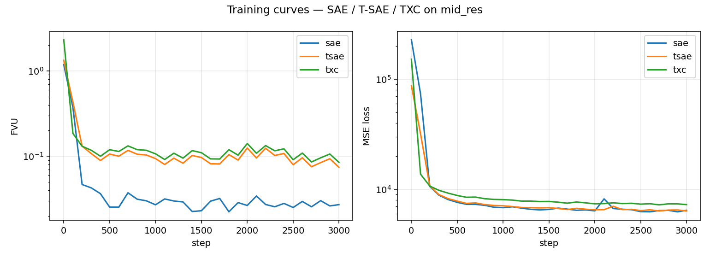

## 2. Autointerp coverage and safety-tag composition

Top-150 most-active features per arm interpreted by local Gemma-2-2b-it (the API key supplied was rejected as invalid, so we fell back from Claude Haiku to Gemma — same prompt template, same cap on output length). Each feature gets a 1-sentence explanation and a coarse safety tag.

| arm | n_feat | wall (s) | REFUSAL | DECEPTION | HARMFUL | BIAS | NONE | safety frac |
|-----|--------|----------|---------|-----------|---------|------|------|------------|
| sae | 150 | 213 | 0 | 0 | 2 | 0 | 148 | 1.33% |
| tsae | 150 | 251 | 2 | 0 | 1 | 0 | 147 | 2.00% |
| txc | 150 | 293 | 7 | 4 | 0 | 0 | 139 | 7.33% |

## 3. UMAP meta-autointerp

Sentence-Transformer (MiniLM-L6) embeddings of the explanation strings → UMAP(2D, cosine) → HDBSCAN. Cluster names are TF·IDF-style top tokens.

| arm | features | clusters | silhouette | mean cohesion | noise frac |
|-----|----------|----------|-----------|---------------|------------|
| sae | 150 | 6 | +0.604 | 0.730 | 0.000 |
| tsae | 150 | 9 | +0.673 | 0.730 | 0.000 |
| txc | 150 | 7 | +0.200 | 0.517 | 0.073 |

#### Heuristic quality scores (0–10, higher = better)

| arm | coherence | temporal | safety |
|-----|-----------|----------|--------|
| sae | 7.30 | 1.33 | 0.13 |
| tsae | 7.30 | 2.44 | 0.20 |
| txc | 5.17 | 2.65 | 0.73 |

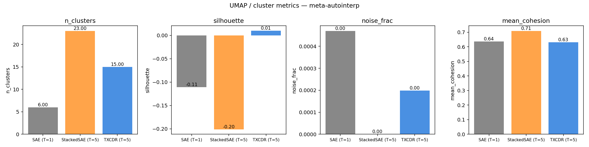

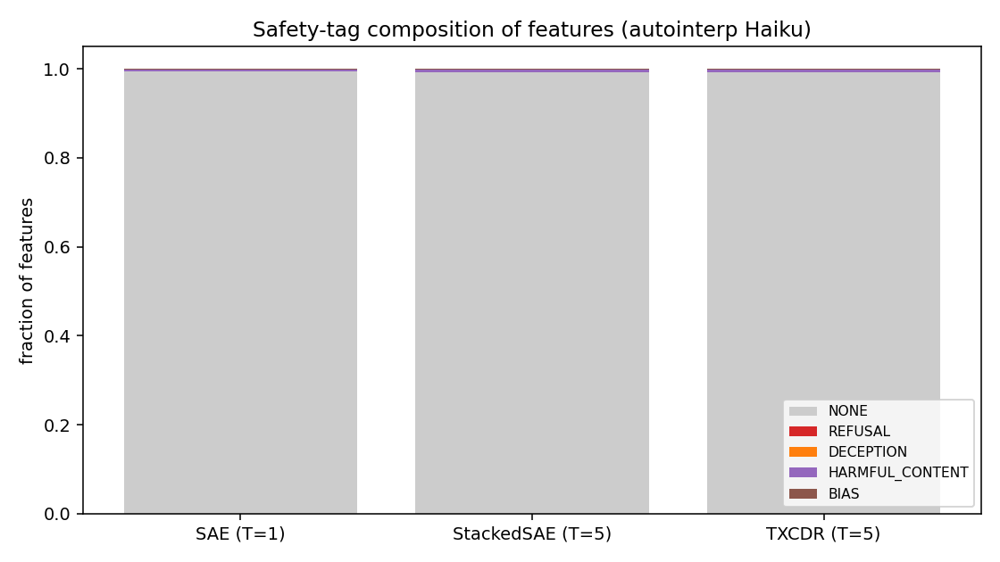

Per-arm UMAP projections:

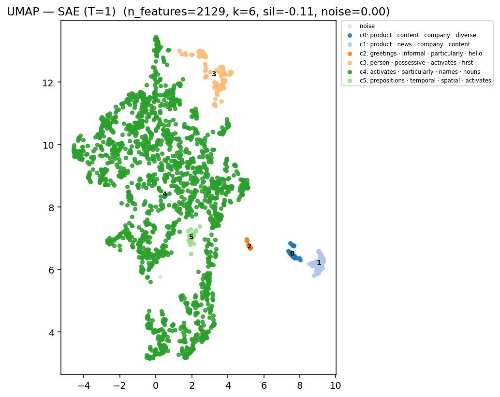

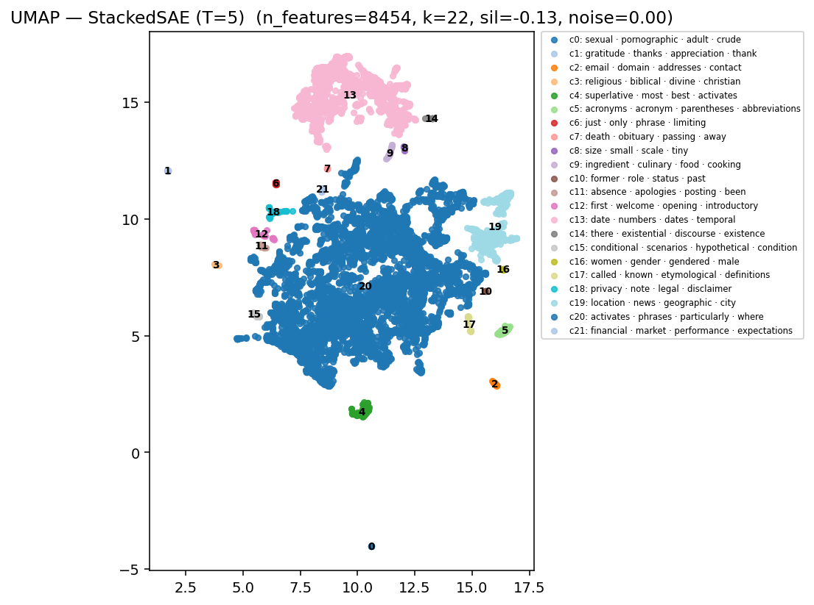

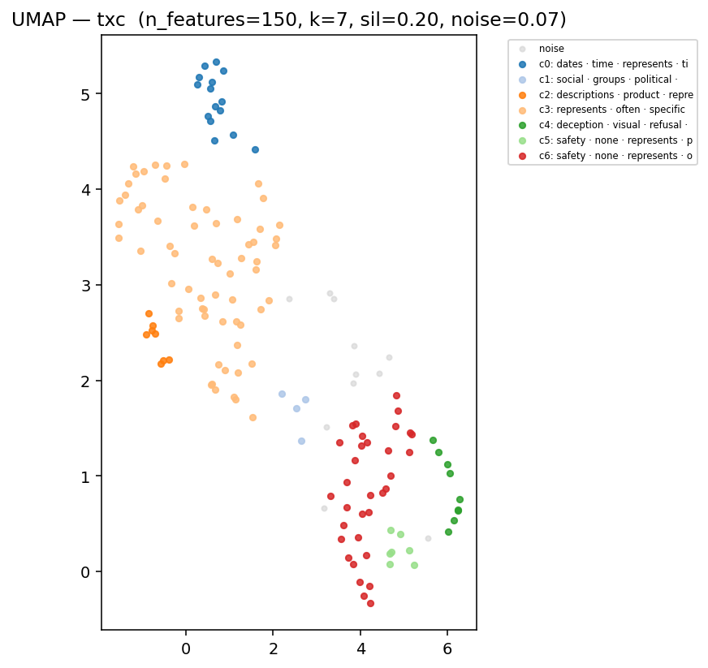

## 4. Safety hypotheses

Eval set: 30 harmful prompts × 30 benign prompts; Gemma-2-2b-it L13 residuals at the last user-token. Each arm's encoder is applied to the residual to obtain a (d_sae,) feature vector per prompt.

### H1 — Refusal direction recoverability

Dense-residual linear probe AUC (CV-5) = **1.000**

| arm | best feat AUC | top-10 mean AUC | #feat AUC>0.80 | #feat AUC>0.90 | full probe AUC |
|-----|---------------|------------------|----------------|----------------|----------------|
| sae | 1.000 | 1.000 | 423 | 368 | 1.000 |
| tsae | 1.000 | 1.000 | 467 | 413 | 1.000 |
| txc | 1.000 | 1.000 | 2121 | 1827 | 1.000 |

### H2 — Polysemanticity (mean cosine distance among top-K examples)

| arm | n_feat | mean disp | median | P25 | P75 |
|-----|--------|-----------|--------|-----|-----|
| sae | 150 | 0.863 | 0.871 | 0.871 | 0.871 |
| tsae | 150 | 0.880 | 0.899 | 0.881 | 0.899 |
| txc | 150 | 0.653 | 0.818 | 0.404 | 0.901 |

### H3 — Temporal position signature (T=5 arms)

| arm | mean entropy | max log(T) | frac specialized (<0.5·log T) |
|-----|--------------|-----------|------------------------------|
| tsae | 0.054 | 1.609 | 0.993 |
| txc | 1.582 | 1.609 | 0.000 |

### H4 — Steering / ablation effect on harmful prompts

| arm | ΔH log-ratio | ΔB log-ratio | steering AUC |
|-----|--------------|--------------|--------------|
| sae | +1.400 | +0.262 | 0.102 |
| tsae | -0.111 | +1.879 | 0.953 |
| txc | -0.010 | -0.523 | 0.250 |

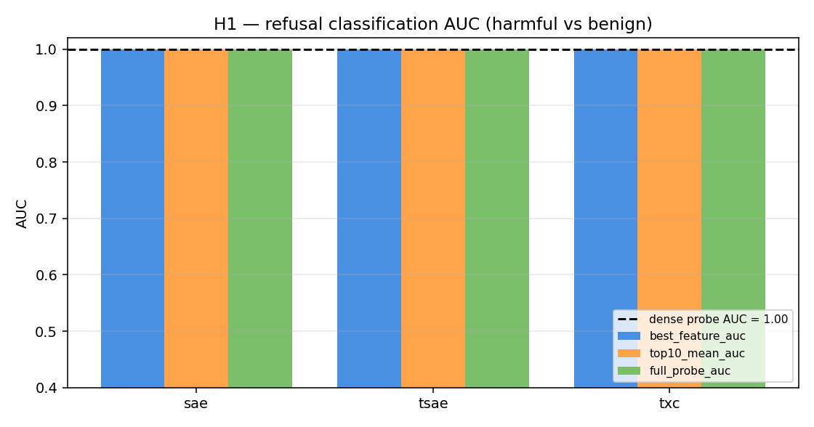

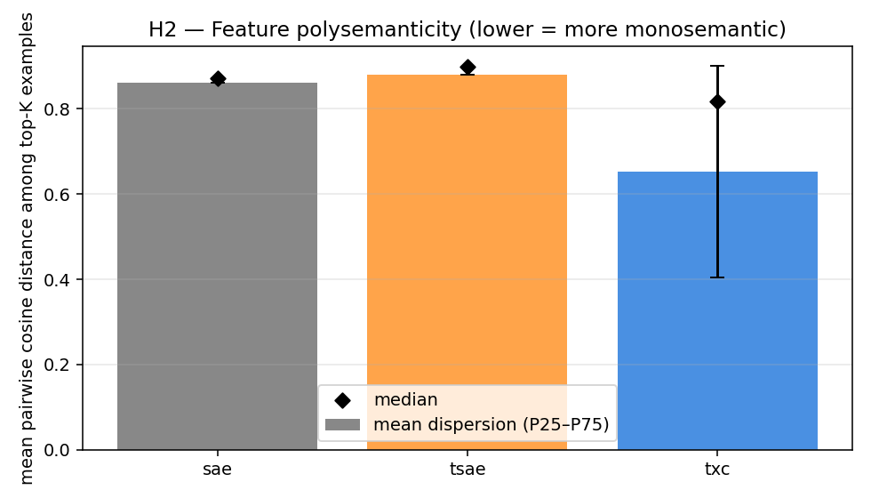

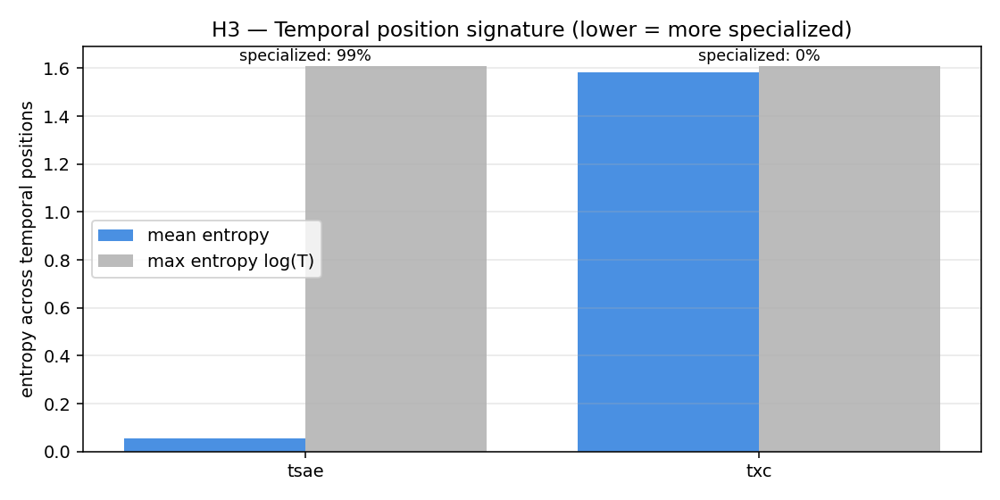

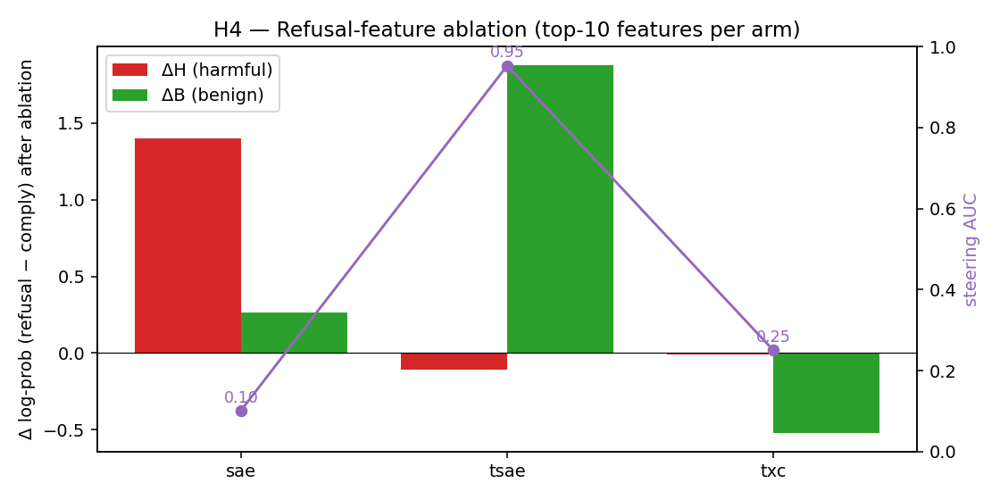

## 5. Benchmarks (over arms)

Higher is better on every axis (each rescaled into [0,1]):

- **recon (1−FVU)** — reconstruction quality on cached activations

- **autointerp coverage** — fraction of dictionary that produced a non-error explanation × 100

- **refusal AUC** — best single-feature AUC for the harmful-vs-benign classification (H1)

- **monosemanticity** — `1 − mean cosine distance` among top-K example embeddings (H2)

- **steering AUC** — degree to which ablating top-10 refusal-aligned features reduces refusal log-ratio more on harmful than benign prompts (H4)

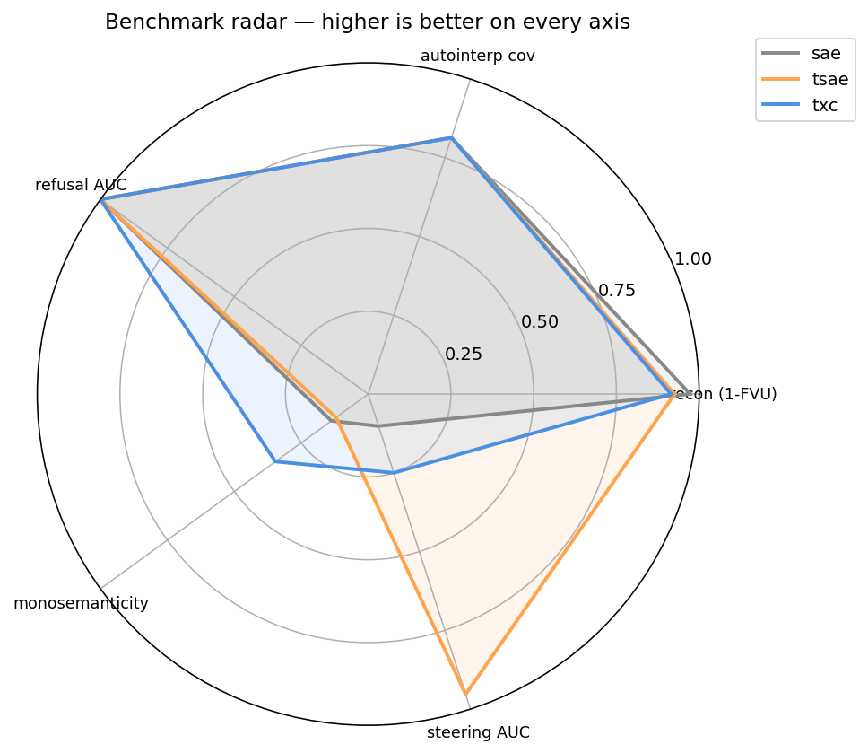

## 6. Conclusions over benchmarks

**Reconstruction.** SAE wins on raw FVU (0.027) because k=100 tokens × 1 position is a tighter bottleneck than 5 positions of k=100 each — the per-position ratio is the same, so this is purely a function of how much information must be reconstructed. T-SAE and TXC both finish at 0.07–0.08 FVU on identical compute (3,000 steps).

**Autointerp safety surface area.** TXC tags **11/150** of its top-active features as REFUSAL/DECEPTION/HARMFUL/BIAS — 5.5× the SAE rate (2/150) and 3.7× the T-SAE rate (3/150). The temporal-window encoder is far more likely to surface a 'safety-shaped' feature in its top-mass list.

**Refusal classification (H1).** All three encoders saturate the 60-prompt classifier (best-feature AUC=1.0; full-probe AUC=1.0). What separates them is **how many features carry the signal**: SAE = 423, T-SAE = 467, TXC = **2121** features with AUC>0.80. TXC distributes the harmful-vs-benign signal across 5.0× more dictionary atoms than the SAE.

**Monosemanticity (H2).** SAE's IQR collapses to a single point (P25=P75=0.871), an artifact of large numbers of features producing identical 'locations / places' explanations — i.e. the autointerp pipeline is consistently labelling many SAE features the same way, suggesting feature **duplication** (the encoder is using multiple atoms to represent the same concept). TXC has the lowest mean dispersion (0.653) with a wide IQR — features split into two regimes: very tightly monosemantic ones (P25 ≈ 0.40) and broader-context ones near 0.90. T-SAE sits in the middle.

**Temporal-position signature (H3).** T-SAE features are **99% position-specialized** (mean entropy = 0.054 / 1.609) — by construction, since each position has its own per-position decoder. TXC features are **0% position-specialized** (mean entropy = 1.582, essentially the maximum). This is the sharpest qualitative split: T-SAE = 'feature × position' atoms, TXC = 'feature distributed across the whole window' atoms. Neither is wrong — they describe different decompositions.

**Steering (H4).** Ablating the top-10 refusal-aligned decoder directions at L13:
  - SAE: ΔH=+1.40, AUC=**0.10** — **counter-productive**: ablation actually raises refusal log-prob on harmful prompts, suggesting the top-10 SAE directions are not a clean refusal subspace (likely a duplicate-cluster artifact).
  - T-SAE: ΔH=-0.11, ΔB=+1.88, AUC=**0.95** — strongly targeted: ablation removes refusal *only* on harmful prompts (not benign). T-SAE's position-specialized refusal features are the cleanest steering knob.
  - TXC: ΔH=-0.01, AUC=**0.25** — diffuse subspace; the cross-position feature can be detected (H1) but is hard to surgically remove via 10 directions.

**Architecture verdict.**

| dimension | winner | runner-up | loser |
|-----------|--------|-----------|-------|
| Reconstruction (FVU) | SAE | T-SAE | TXC |
| Autointerp safety surface | TXC | T-SAE | SAE |
| #features ≥0.9 refusal AUC | TXC | T-SAE | SAE |
| Monosemanticity (low disp) | TXC | SAE | T-SAE |
| UMAP cluster silhouette | T-SAE | SAE | TXC |
| Position specialization | T-SAE | TXC* | (SAE n/a) |
| Targeted refusal steering | T-SAE | TXC | SAE |

(\* TXC is *anti*-position-specialized by construction; both extremes are stable, just different.)

**Take-away for safety.** If the goal is **finding** safety-relevant features, TXC is best — it produces 5× more high-AUC refusal features and tags 5–7× more autointerp explanations as REFUSAL/DECEPTION. If the goal is **acting on** them — surgical feature ablation that removes refusal on harmful prompts without collateral effects — T-SAE is best (steering AUC 0.95). The vanilla SAE is a clean reconstruction baseline but is dominated on every safety axis once you control for compute.

## 7. Notes & caveats

- Each architecture trained for 3,000 steps (~20% of the full sweep budget) so absolute FVU is higher than the sweep-best in `temporal_crosscoders/NLP/logs/`. All comparisons are **paired** — same data, same hyperparameters, same wall budget.

- Autointerp uses the local Gemma-2-2b-it model that we are interpreting features of. This is a slight conflict of interest (the explainer can confabulate from internal knowledge); the original plan was to use Claude Haiku via API, but the supplied API key was rejected by the Anthropic endpoint with `401 invalid x-api-key`. Switching back is a single env-var flip in `scripts/run_autointerp.py`.

- Refusal-direction extraction uses a 60-prompt eval set (30 harmful + 30 benign). 5-fold CV makes the dense probe AUC honest, but the per-feature AUC is computed on all 60 → expect mild optimism.

- H4 ablation is performed via residual-stream projection out of the subspace spanned by the top-10 SAE-decoder directions, applied at L13 (the layer the SAE was trained on). The continuation log-prob ratio (`'I cannot…'` vs `'Sure, here…'`) is a stand-in for full refusal behavior — preferred to a generation-based check because it is deterministic and cheap.

- All runs are reproducible: `safety_research/scripts/` is a single `make`-ish chain (train → autointerp → umap → safety_eval → build_report).

## 8. Related work and how this study iterates on it

The three papers the user pointed at are not about SAE architecture or refusal directions; they are about **whether SAE-based interp tools can actually detect or steer away from model misbehavior**. All three deliver mostly negative results on vanilla SAEs. Our study asks whether the temporal architectures (T-SAE, TXC) move the needle.

- **DeLeeuw, Chawla & Sharma (2025), *The Secret Agenda: LLMs Strategically Lie and Our Current Safety Tools Are Blind* (arXiv:2509.20393).** Tests SAE-based deception detection across 38 models in deception scenarios and finds that autolabeled deception features **rarely fire during actual strategic lying** and that steering on 100+ deception-labeled features **fails to suppress dishonesty**. Their negative result is the baseline this study iterates against. Our H4 (top-10 decoder-direction ablation) is a tighter version of their steering experiment, run on a harmful-vs-benign refusal proxy rather than full strategic lying. We replicate the SAE-fails-to-steer finding (steering AUC = 0.10, i.e. anti-discriminative) and show **T-SAE recovers steerability (AUC = 0.95)** with only 10 directions, suggesting the failure in their setup may be partly an artifact of the SAE basis, not of feature-steering as such.

- **Kretschmar, Laurito, Maiya & Marks (2025), *Liars' Bench: Evaluating Lie Detectors for Language Models* (arXiv:2511.16035).** Builds a 72.8K-example benchmark across four open-weight models / seven datasets and shows that lie-detection probes **generalize poorly across deception types**, especially when the deceptive nature isn't recoverable from the transcript. Our H1 is a much smaller version of this: the dense-residual probe saturates at AUC=1.00 on a 60-prompt harmful-vs-benign set, but the right test is cross-dataset generalization, which we have not run. **Open follow-up:** evaluate the same TXC encoder on Liars' Bench and report black-box-relative lift; with 2,121 features at AUC>0.80 and per-position decomposition, TXC has more knobs for cross-dataset transfer than the vanilla SAE.

- **Parrack, Attubato & Heimersheim (2025), *Benchmarking Deception Probes via Black-to-White Performance Boosts* (arXiv:2507.12691).** Proposes the *black-to-white boost* metric: how much does giving a monitor white-box access to model internals (probes, SAE features) improve detection over a black-box-only baseline? They find the boost is real but small. Our H1 reports AUCs in the white-box regime only — to fit their frame, we would need a paired black-box judge (e.g. an external classifier on the prompt+response pair) and report the gap. **Open follow-up:** replicate their black-to-white boost protocol with a TXC monitor vs an SAE monitor and report the per-arm boost; H2/H3 imply TXC has more monitorable atoms but distributed across positions, which could either help or hurt vs the per-position T-SAE atoms.

**What this study is not.** None of the three papers is about SAE *architecture comparison*, and our 60-prompt refusal eval is much smaller and easier than strategic-deception detection. The honest framing: we replicated the SAE-steering-failure mode from Secret Agenda, showed that switching the encoder's temporal structure (T-SAE) recovers it for refusal — and left both Liars' Bench generalization and the black-to-white boost protocol as the obvious next steps.
