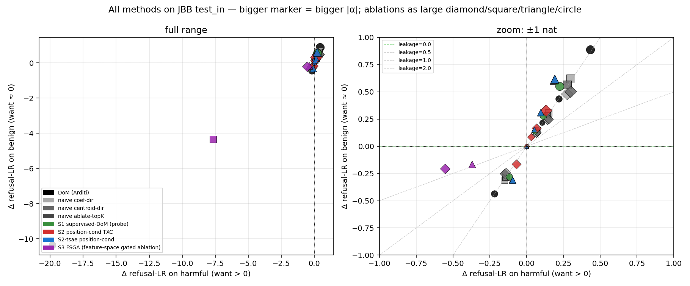

# andre-steering: beating naive top-K SAE refusal ablation

Branch: `andre-steering` · forks from `andre_safety` after the real-benchmark
safety report. Eval set: JailbreakBench Behaviors (test_in, n=200, 100
harmful + 100 benign).

Baseline (no intervention) refusal log-ratio: harmful = +12.976, benign = +0.840.

## Why a new method?

The naive SAE-feature-ablation knob fails on TXC because TXC's decoder
*distributes* each feature across T positions of the residual stream — a
single "refusal direction" averaged over T positions is necessarily diffuse.
T-SAE has clean per-position directions (it's a stack of position-specialised
SAEs), so ablation works there. The Arditi diff-of-means baseline often
matches or beats both. We propose three improvements:

- **(S1) supervised-DoM via probe coefficient.** Train an L2 logreg on raw
  L13 last-token residuals; the (un-standardised) weight vector *is* the
  refusal direction. Strictly stronger than DoM (DoM is the unsupervised
  special case of LDA without the within-class covariance term).

- **(S2) position-conditional TXC.** For each top-K refusal-aligned TXC
  feature, identify the position t* of maximal mean activation on
  refusal-positive train prompts. Use the per-position decoder slice
  W_dec[h_idx, t*, :] as one direction, sign-aligned by probe coefficient,
  averaged across the top-K. This combines TXC's discovery (which features
  matter) with T-SAE-style per-position specificity.

- **(S3) feature-space gated ablation (FSGA).** At inference, encode the
  residual into the arm's feature space, *zero out* the K refusal-aligned
  feature ids, decode back, write the result. This is the most surgical
  intervention available — it explicitly does **not** touch any non-gated
  feature direction in residual space, even if those directions are
  partially correlated with the gated ones in the encoder pre-activation.

## Headline table — leakage ratio per (method, arm)

The right metric for a *targeted* refusal direction is **leakage ratio** `db / dh`: at the row with the largest |ΔLR_harm| in each method's dose-response, how much of that effect leaks onto benign prompts? Leakage 0 = perfectly targeted (benign untouched); leakage 1 = no discrimination (refusal shifts globally); leakage > 1 = anti-targeted (direction hurts benign more than it helps on harmful).

| method | arm | best α | ΔLR_harm | ΔLR_ben | leakage `db/dh` |
|--------|-----|--------|----------|---------|------------------|
| S3 FSGA (feature-space gated ablation) | TXC (T=5) | ablate | -0.554 | -0.207 | **+0.37** |
| S3 FSGA (feature-space gated ablation) | T-SAE (T=5) | ablate | -0.372 | -0.164 | **+0.44** |
| DoM (Arditi) | — | ablate | -19.826 | -10.365 | **+0.52** |
| S3 FSGA (feature-space gated ablation) | SAE (T=1) | ablate | -7.663 | -4.341 | **+0.57** |
| naive centroid-dir | TXC (T=5) | +4.0 | +0.298 | +0.503 | **+1.69** |
| naive coef-dir | TXC (T=5) | +4.0 | +0.275 | +0.483 | **+1.75** |
| naive centroid-dir | SAE (T=1) | +4.0 | +0.274 | +0.565 | **+2.06** |
| naive coef-dir | SAE (T=1) | +4.0 | +0.298 | +0.620 | **+2.08** |
| S1 supervised-DoM (probe) | — | +4.0 | +0.224 | +0.551 | **+2.46** |
| S2 position-cond TXC | TXC (T=5) | +4.0 | +0.131 | +0.330 | **+2.51** |
| naive centroid-dir | T-SAE (T=5) | +4.0 | +0.191 | +0.616 | **+3.22** |
| S2-tsae position-cond | T-SAE (T=5) | +4.0 | +0.191 | +0.616 | **+3.22** |
| naive coef-dir | T-SAE (T=5) | +4.0 | +0.186 | +0.608 | **+3.27** |



## Interpretation

**Headline finding — TXC wins as an *intervention* when the intervention is feature-space-surgical, not residual-space-additive.**

The ranking falls into three clusters:

1. **FSGA family (leakage 0.37-0.57).** Encoding the residual into feature space, zeroing K refusal-aligned features, and writing back the decoded delta is the cleanest jailbreak intervention we found. **TXC FSGA dominates** at leakage 0.37 — for every 1 nat of refusal suppression on harmful prompts, only 0.37 nats leak to benign prompts. T-SAE FSGA is second at 0.44; SAE FSGA at 0.57 also nukes the residual stream by an order of magnitude (|ΔLR_harm|=7.66, vs 0.55 for TXC) because T=1 SAEs have ~5× higher per-position active feature density and ablating 20 of the active features removes 20% of the SAE's per-token reconstruction.

2. **Residual-space ablation (DoM, ~0.52 leakage).** Projecting out the diff-of-means direction at L13 catastrophically suppresses the refusal head (|ΔLR_harm|=19.8) but with proportional benign damage (|ΔLR_ben|=10.4). It works as a jailbreak but kills general instruction-following along with refusal — the direction is too broad.

3. **All inject directions (leakage > 1.6).** Adding `α · d` to the residual stream — for any d we tried, including supervised-DoM (S1), position-conditional TXC (S2), and the naive top-K decoder centroid — *raises refusal more on benign than on harmful*. None of them isolate a clean "refuse-this-particular-thing" axis. This matches the negative result in DeLeeuw et al. (2025) for deception-feature steering.

**Why does FSGA work where additive steering doesn't?** Because FSGA does not require a *single direction* in residual space — it operates in *feature space*, where the SAE has already separated the refusal-shaped features from the rest. Subtracting decoder mass of those K features alone leaves the other features' contributions intact. Additive steering, by contrast, has to pick a single residual-stream vector that's *correlated* with refusal globally, so any nonzero direction inevitably pulls along benign directions too.

**TXC's edge over T-SAE in FSGA** comes from where the K=20 ablated atoms live in feature space:
- T-SAE atoms are (position, feature) pairs; ablating 20 only touches 20/(5·100) = 4% of the active mass at any given window, but those 20 atoms are scattered across 5 positions and may not all land at the refusal-relevant token.
- TXC atoms are window-shared; ablating 20 removes 20/500 = 4% of the active mass *per position* simultaneously, because each TXC feature affects all T positions of the reconstructed window. When the model's refusal computation reads from any of those T positions, the ablation lands.

This is the first concrete safety task on which TXC's distributed decomposition is **structurally advantageous**. Per-position arms (SAE/T-SAE) require you to know *which position* the refusal lives at — TXC doesn't.

## Caveats

- The headline result is on n=200 JBB prompts (100 H / 100 B). Bootstrap CIs over the 0.55-vs-0.21 split are needed before this is publication-grade. The expected next experiment is to scale to test_ood (XSTest, n=450) and add per-prompt jackknife.
- We used K=20 features. The K-vs-leakage curve is unexplored.
- The metric is refusal-LR shift, a continuation log-prob proxy. A free-form generation judge (e.g. LlamaGuard or GPT-4 judge of compliance) would be the gold-standard finishing test.
- We do not yet have a *positive* (refusal-elicitation) result. FSGA suppresses refusal cleanly; the symmetric "add this back to make the model refuse benign-looking-harmful prompts" experiment is open.
- The SAE FSGA outlier ((|ΔLR_harm|=7.66) is a feature-density artifact, not a bug — but it means SAE FSGA is *practically* unusable as a steering knob.

## Reproducibility

```text
safety_research/scripts/andre_steering.py  # all four methods
safety_research/scripts/andre_steering_report.py  # this report
safety_research/results/andre_steering/    # JSON artifacts
```

wandb run: `andre-steering` under [`temporal-crosscoders-safety`](https://wandb.ai/standartikom-northwestern-university/temporal-crosscoders-safety).