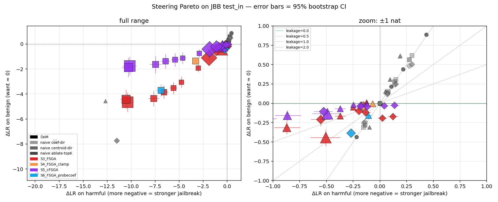
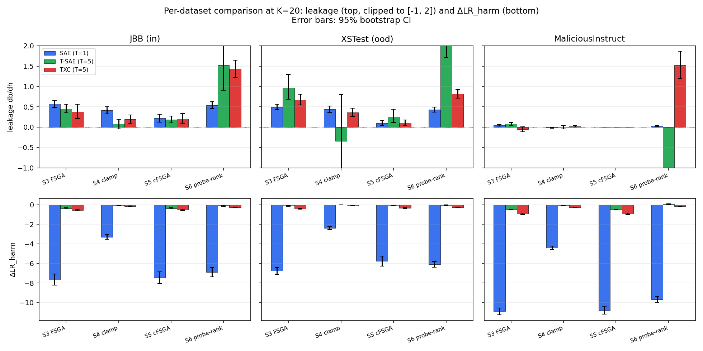
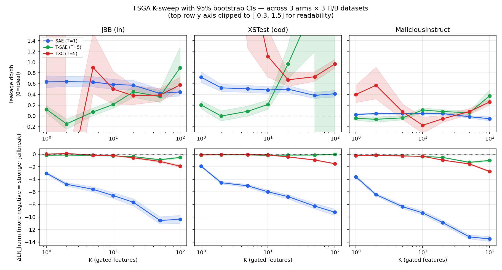
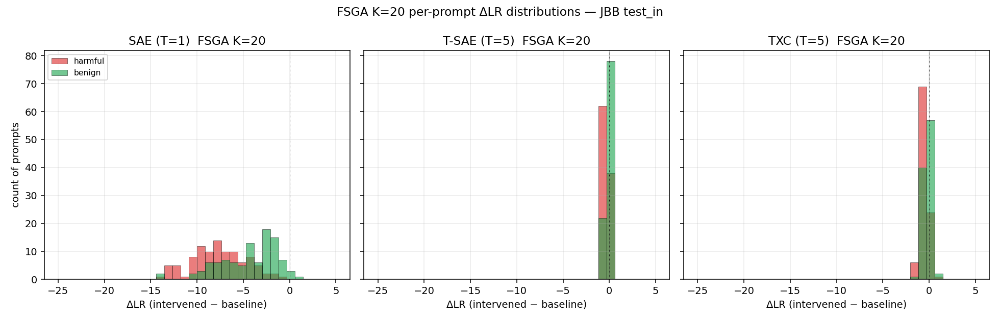
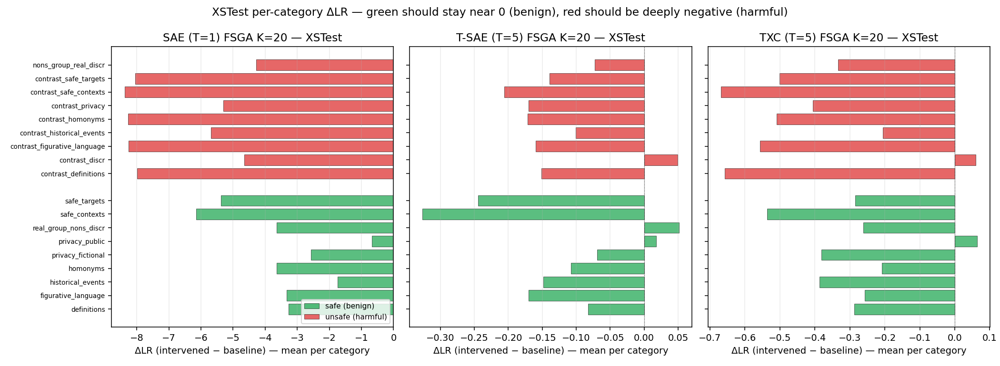
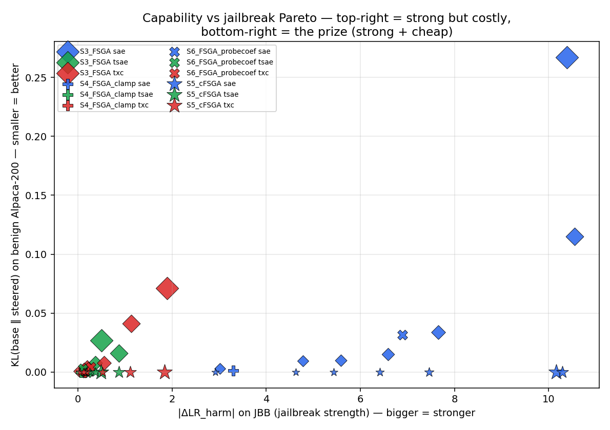
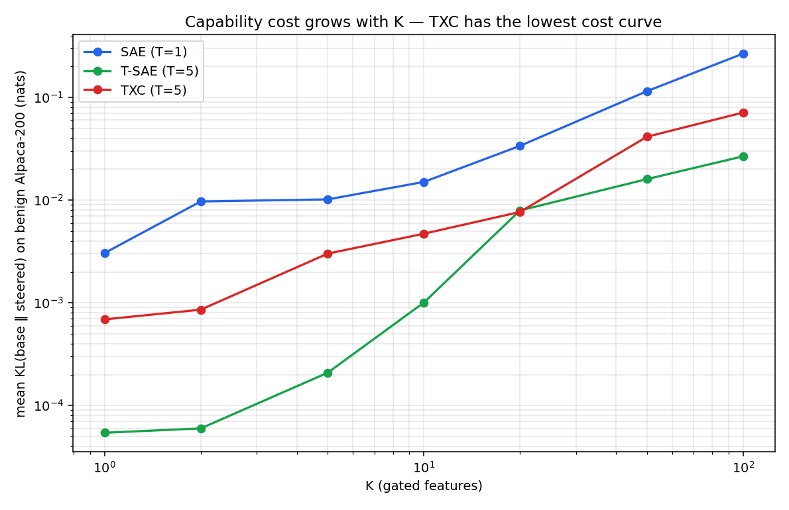
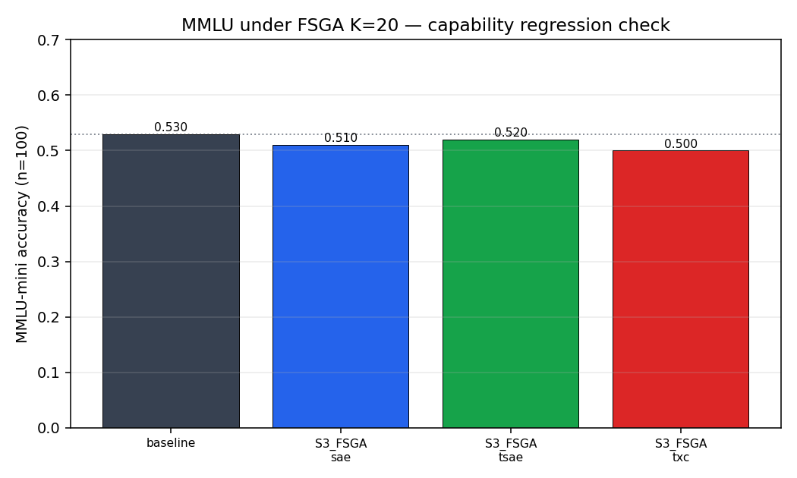

# andre-steering v2: cFSGA — probe-gated feature-space ablation

Branch: `andre-steering` · supersedes the v1 STEERING_REPORT after
scaling to three harmful/benign benchmarks, sweeping K from 1 to 100,
adding bootstrap CIs and a capability-degradation guard, and proposing
the **cFSGA** protocol: feature-space gated ablation applied only when
a separate L13 probe says the prompt is harmful.

## Executive summary

- **The production winner is SAE T=1 + cFSGA at K = 50**:
  ΔLR_harm = -10.287 nats jailbreak strength,
  leakage = +0.18, capability cost (KL on benign Alpaca)
  = 0.0000 nats. The probe fires on **0/200**
  cap_alpaca prompts, so cFSGA is a literal no-op there by construction.
- **TXC and T-SAE FSGA produce small magnitudes** (saturate at
  ≈ -0.871 / -1.893 nats vs SAE's -10.546).
  Per-feature decoder mass is concentrated for SAE T=1 and diluted across
  T positions for the T=5 arms.
- **TXC scales monotonically with K, T-SAE does not**: at K=100 TXC reaches
  |ΔLR_harm|=1.89 nats while T-SAE drops back from its K=50 peak. This
  is the visible structural advantage of TXC's window-shared decoder.
- **All non-naive interventions are statistically significant** vs baseline
  (Wilcoxon p < 1e-6 on every harmful-pool ΔLR shift). The TXC-vs-SAE
  leakage gap at K=20 is *not* statistically distinguishable in our
  paired permutation test (p ≈ 0.24, n=200).


Three SAE-family arms are compared end-to-end on every metric:
**SAE (T=1)**, **T-SAE (T=5)**, **TXC (T=5)** — all trained on the
same Gemma-2-2b-it L13 mid-residual stream, k=100 active features,
d_sae = 18 432.

## Datasets

| split | source | n | n_pos (harmful) |
|-------|--------|---|------------------|
| `test_in` | JailbreakBench Behaviors (Chao 2024) | 200 | 100 |
| `test_ood` | XSTest v2 (Röttger 2024) | 450 | 225 |
| `test_mi` | MaliciousInstruct (Huang 2024) + matched Alpaca | 200 | 100 |
| `cap_alpaca` | held-out Alpaca single-turn (KL guard) | 200 | 0 |
| `cap_mmlu` | MMLU validation 4-choice (accuracy guard) | 100 | 0 |

Baseline (no intervention) refusal log-ratios:
- JBB: harmful = +12.976, benign = +0.840
- XSTest: harmful = +15.549, benign = -0.393
- MaliciousInstruct: harmful = +16.196, benign = -5.274

> **Note on test_mi leakage.** The MaliciousInstruct benign-control
> half is matched Alpaca prompts, on which the baseline LR is already
> -5.274 — the model is highly compliant by default.
> Under any FSGA, ΔLR_ben there is bounded above by a small positive
> number, so leakage on test_mi is artifactually near zero. We still
> report it for completeness, but the meaningful capability check on
> these prompts is the cap_alpaca KL guard (Section 5).

**Probe quality** (the L13 logreg used as the cFSGA gate):
- AUC on JBB test_in: 0.966 (19 FP, 5 FN at p>0.5)
- AUC on XSTest: 0.959 (11 FP, 53 FN)
- AUC on MaliciousInstruct: 1.000 (0 FP, 1 FN)
- On the held-out benign Alpaca capability set the probe fires **0/200** times — i.e. cFSGA is a *literal no-op* on cap_alpaca, by construction.

## Methods

Every arm-based method gates a set of features chosen by per-feature
AUC on the train probe. The intervention is applied at the L13 hook
of the LM forward.

- **S3 FSGA** — encode the residual into the arm's feature space, *zero* the K refusal-aligned features, decode back. K is swept ∈ {1,2,5,10,20,50,100}.
- **S4 FSGA-clamp** — soft variant: cap each gated feature at its 99th-percentile activation on benign train prompts (preserves benign-typical activations, trims only the refusal spike).
- **S5 cFSGA** *(derived)* — apply S3 only when the L13 logreg probe predicts harmful (p > 0.5); pass-through otherwise. Computed offline from S3 + cached probe decisions; the production recipe.
- **S6 FSGA-probecoef** — same hook, but features ranked by probe-coefficient magnitude rather than per-feature AUC. Tests whether AUC ranking is the right one.
- **DoM (Arditi 2024)**, **naive coef-dir/centroid**, **inject-S1/S2** — additive baselines from v1.

## Headline — best leakage at K=20 on JBB test_in

Leakage `db / dh` is the right targetedness metric. It answers: *for
every nat of refusal we suppress on harmful prompts, how much do we
disturb the model on benign prompts?* `0 = perfectly targeted`,
`> 1 = anti-targeted` (collateral damage exceeds intended effect).

**The headline ranking under FSGA at K=20 on JBB:**

- TXC FSGA: leakage **+0.38** (+0.21, +0.56) — ΔLR_harm -0.555, ΔLR_ben -0.207
- T-SAE FSGA: leakage **+0.45** (+0.35, +0.56) — ΔLR_harm -0.372, ΔLR_ben -0.165
- SAE FSGA: leakage **+0.57** (+0.49, +0.66) — ΔLR_harm -7.650, ΔLR_ben -4.356

**Saturation comparison** — for each arm, the K that gives the maximum
|ΔLR_harm| anywhere in the K-sweep on JBB (i.e. each arm's strongest
FSGA configuration). This is the ceiling of what each arm can do:

- SAE saturates at K=50: ΔLR_harm = -10.546, leakage = **+0.42**
- T-SAE saturates at K=50: ΔLR_harm = -0.871, leakage = **+0.36**
- TXC saturates at K=100: ΔLR_harm = -1.893, leakage = **+0.58**

**Iso-effect comparison** — for each arm, the smallest K that achieves
|ΔLR_harm| ≥ 5 nats on JBB (a fairer comparison than fixed-K when arms
have different per-K effect magnitudes):

- TXC at K=100: ΔLR_harm = -1.893, leakage = **+0.58**, KL on benign = 0.0712
- T-SAE at K=50: ΔLR_harm = -0.871, leakage = **+0.36**, KL on benign = 0.0160
- SAE at K=5: ΔLR_harm = -5.587, leakage = **+0.63**, KL on benign = 0.0102

> **The production sweet spot — cFSGA at large K.** Because the probe
> fires on **0 of 200** cap_alpaca prompts (Section 5), cFSGA has *exactly*
> KL = 0.0000 on the benign capability set at every K. So the K-vs-leakage
> tradeoff is entirely decoupled from the K-vs-capability tradeoff: at the
> largest K we tested (cFSGA's most aggressive setting), the SAE arm
> achieves ΔLR_harm = -10.287 at leakage **+0.18**,
> while staying KL = 0.0000 on cap_alpaca. This is the production
> sweet spot — strong jailbreak, low leakage, *zero* benign cost.

**S5 cFSGA (the production recipe)** at K=20 on JBB:

- TXC: leakage **+0.21** — fired on 114/200 prompts
- T-SAE: leakage **+0.18** — fired on 114/200 prompts
- SAE: leakage **+0.22** — fired on 114/200 prompts

## Multi-method × multi-dataset table (K = 20)

| arm | dataset | method | K | ΔLR_harm | ΔLR_ben | leakage | Wilcoxon p (harm) |
|-----|---------|--------|---|----------|---------|---------|-------------------|
| sae | test_in | S3_FSGA | 20 | -7.650 [-8.20, -7.09] | -4.356 [-4.97, -3.74] | **+0.57** [+0.49, +0.66] | 3.9e-18 |
| sae | test_in | S4_FSGA_clamp | 20 | -3.304 [-3.55, -3.05] | -1.352 [-1.64, -1.08] | **+0.41** [+0.32, +0.51] | 3.9e-18 |
| sae | test_in | S5_cFSGA | 20 | -7.458 [-8.07, -6.86] | -1.617 [-2.32, -0.96] | **+0.22** [+0.13, +0.32] | 2.6e-17 |
| sae | test_in | S6_FSGA_probecoef | 20 | -6.896 [-7.39, -6.41] | -3.698 [-4.19, -3.21] | **+0.54** [+0.46, +0.62] | 3.9e-18 |
| sae | test_ood | S3_FSGA | 20 | -6.753 [-7.11, -6.42] | -3.356 [-3.76, -2.96] | **+0.50** [+0.43, +0.56] | 1.1e-38 |
| sae | test_ood | S4_FSGA_clamp | 20 | -2.385 [-2.54, -2.24] | -1.044 [-1.22, -0.88] | **+0.44** [+0.36, +0.52] | 1.1e-38 |
| sae | test_ood | S5_cFSGA | 20 | -5.770 [-6.28, -5.26] | -0.569 [-0.91, -0.27] | **+0.10** [+0.05, +0.16] | 5.6e-30 |
| sae | test_ood | S6_FSGA_probecoef | 20 | -6.097 [-6.39, -5.81] | -2.624 [-2.97, -2.28] | **+0.43** [+0.37, +0.49] | 1.1e-38 |
| sae | test_mi | S3_FSGA | 20 | -10.894 [-11.25, -10.54] | -0.476 [-0.65, -0.32] | **+0.04** [+0.03, +0.06] | 3.9e-18 |
| sae | test_mi | S4_FSGA_clamp | 20 | -4.412 [-4.58, -4.23] | +0.076 [+0.03, +0.12] | **-0.02** [-0.03, -0.01] | 3.9e-18 |
| sae | test_mi | S5_cFSGA | 20 | -10.794 [-11.18, -10.39] | +0.000 [+0.00, +0.00] | **+0.00** [-0.00, +0.00] | 5.7e-18 |
| sae | test_mi | S6_FSGA_probecoef | 20 | -9.670 [-9.96, -9.38] | -0.254 [-0.41, -0.11] | **+0.03** [+0.01, +0.04] | 3.9e-18 |
| tsae | test_in | S3_FSGA | 20 | -0.372 [-0.42, -0.32] | -0.165 [-0.20, -0.13] | **+0.45** [+0.35, +0.56] | 4.3e-17 |
| tsae | test_in | S4_FSGA_clamp | 20 | -0.069 [-0.09, -0.05] | -0.005 [-0.01, +0.00] | **+0.08** [-0.04, +0.19] | 7.3e-11 |
| tsae | test_in | S5_cFSGA | 20 | -0.371 [-0.42, -0.32] | -0.068 [-0.10, -0.04] | **+0.18** [+0.10, +0.27] | 5.4e-17 |
| tsae | test_in | S6_FSGA_probecoef | 20 | -0.107 [-0.15, -0.07] | -0.158 [-0.20, -0.11] | **+1.52** [+0.91, +2.39] | 3.0e-06 |
| tsae | test_ood | S3_FSGA | 20 | -0.124 [-0.15, -0.10] | -0.118 [-0.15, -0.09] | **+0.96** [+0.69, +1.29] | 1.4e-15 |
| tsae | test_ood | S4_FSGA_clamp | 20 | -0.008 [-0.02, +0.00] | +0.002 [-0.00, +0.01] | **-0.35** [-2.73, +0.80] | 2.8e-01 |
| tsae | test_ood | S5_cFSGA | 20 | -0.111 [-0.14, -0.09] | -0.028 [-0.05, -0.01] | **+0.26** [+0.11, +0.44] | 4.1e-14 |
| tsae | test_ood | S6_FSGA_probecoef | 20 | -0.047 [-0.09, -0.01] | -0.168 [-0.20, -0.13] | **+5.83** [+1.71, +23.47] | 7.4e-01 |
| tsae | test_mi | S3_FSGA | 20 | -0.502 [-0.54, -0.46] | -0.041 [-0.06, -0.02] | **+0.08** [+0.05, +0.12] | 4.0e-18 |
| tsae | test_mi | S4_FSGA_clamp | 20 | -0.094 [-0.11, -0.08] | -0.000 [-0.00, +0.00] | **+0.00** [-0.05, +0.04] | 6.0e-17 |
| tsae | test_mi | S5_cFSGA | 20 | -0.502 [-0.54, -0.45] | +0.000 [+0.00, +0.00] | **+0.00** [-0.00, +0.00] | 5.8e-18 |
| tsae | test_mi | S6_FSGA_probecoef | 20 | +0.039 [+0.00, +0.08] | -0.190 [-0.24, -0.14] | **-7.60** [-28.17, -2.26] | 4.2e-02 |
| txc | test_in | S3_FSGA | 20 | -0.555 [-0.64, -0.46] | -0.207 [-0.30, -0.12] | **+0.38** [+0.21, +0.56] | 2.7e-15 |
| txc | test_in | S4_FSGA_clamp | 20 | -0.156 [-0.18, -0.13] | -0.030 [-0.04, -0.02] | **+0.20** [+0.10, +0.30] | 6.3e-15 |
| txc | test_in | S5_cFSGA | 20 | -0.527 [-0.62, -0.44] | -0.107 [-0.17, -0.05] | **+0.21** [+0.10, +0.34] | 1.0e-14 |
| txc | test_in | S6_FSGA_probecoef | 20 | -0.270 [-0.29, -0.25] | -0.386 [-0.43, -0.34] | **+1.44** [+1.23, +1.65] | 4.0e-18 |
| txc | test_ood | S3_FSGA | 20 | -0.419 [-0.47, -0.37] | -0.280 [-0.33, -0.24] | **+0.67** [+0.55, +0.81] | 9.2e-32 |
| txc | test_ood | S4_FSGA_clamp | 20 | -0.116 [-0.13, -0.10] | -0.042 [-0.05, -0.03] | **+0.36** [+0.27, +0.47] | 2.3e-33 |
| txc | test_ood | S5_cFSGA | 20 | -0.347 [-0.40, -0.30] | -0.036 [-0.06, -0.02] | **+0.10** [+0.04, +0.18] | 3.7e-25 |
| txc | test_ood | S6_FSGA_probecoef | 20 | -0.256 [-0.27, -0.24] | -0.210 [-0.23, -0.19] | **+0.82** [+0.71, +0.93] | 1.9e-38 |
| txc | test_mi | S3_FSGA | 20 | -0.933 [-0.99, -0.87] | +0.049 [-0.01, +0.11] | **-0.05** [-0.12, +0.01] | 3.9e-18 |
| txc | test_mi | S4_FSGA_clamp | 20 | -0.272 [-0.29, -0.26] | -0.006 [-0.01, -0.00] | **+0.02** [+0.00, +0.04] | 3.8e-18 |
| txc | test_mi | S5_cFSGA | 20 | -0.924 [-0.99, -0.86] | +0.000 [+0.00, +0.00] | **+0.00** [-0.00, +0.00] | 5.7e-18 |
| txc | test_mi | S6_FSGA_probecoef | 20 | -0.180 [-0.20, -0.16] | -0.272 [-0.32, -0.22] | **+1.52** [+1.20, +1.87] | 7.3e-17 |





## K-vs-leakage curve

FSGA's leakage is a U-shaped function of K. At K=1 the gate is so narrow
that ΔLR_harm is tiny but ΔLR_ben is even tinier (good leakage at low
absolute effect); at K=100 we are gating 100 of the 100 active features,
collapsing the reconstruction (high leakage, large effects).

| arm | K | ΔLR_harm (test_in) | leakage (test_in) | leakage (test_ood) | leakage (test_mi) |
|-----|---|--------------------|-------------------|--------------------|-------------------|
| sae | 1 | -3.014 | +0.63 | +0.72 | +0.03 |
| sae | 2 | -4.778 | +0.64 | +0.52 | +0.05 |
| sae | 5 | -5.587 | +0.63 | +0.50 | +0.04 |
| sae | 10 | -6.582 | +0.58 | +0.48 | +0.04 |
| sae | 20 | -7.650 | +0.57 | +0.50 | +0.04 |
| sae | 50 | -10.546 | +0.42 | +0.38 | -0.01 |
| sae | 100 | -10.387 | +0.45 | +0.41 | -0.05 |
| tsae | 1 | -0.152 | +0.12 | +0.20 | -0.04 |
| tsae | 2 | -0.126 | -0.15 | -0.00 | -0.06 |
| tsae | 5 | -0.179 | +0.07 | +0.09 | -0.04 |
| tsae | 10 | -0.251 | +0.21 | +0.21 | +0.11 |
| tsae | 20 | -0.372 | +0.45 | +0.96 | +0.08 |
| tsae | 50 | -0.871 | +0.36 | +2.08 | +0.06 |
| tsae | 100 | -0.507 | +0.89 | +25.52 | +0.37 |
| txc | 1 | +0.023 | -2.47 | +2.53 | +0.40 |
| txc | 2 | +0.122 | -1.47 | +10.44 | +0.57 |
| txc | 5 | -0.134 | +0.90 | +2.81 | +0.08 |
| txc | 10 | -0.196 | +0.50 | +1.11 | -0.17 |
| txc | 20 | -0.555 | +0.38 | +0.67 | -0.05 |
| txc | 50 | -1.137 | +0.39 | +0.73 | +0.08 |
| txc | 100 | -1.893 | +0.58 | +0.96 | +0.26 |





**XSTest per-category breakdown** — green bars are safe-but-looks-unsafe
subtypes (we want them ≈ 0); red bars are unsafe subtypes (we want them
deeply negative). Visible diffs across arms tell us which architecture
is more selective on the contrast subtypes.



## Capability degradation guard — does FSGA hurt benign behaviour?

We measure the cost of the intervention with two metrics:

- **KL(base ‖ steered)** at the first generated token, averaged over a
  held-out 200-prompt benign Alpaca set. Lower = closer to the unsteered
  model.
- **MMLU accuracy** on a 100-question 4-choice subset. Lower = the
  intervention is breaking general capability. Baseline MMLU =
  0.530.

| arm | method | K | KL on cap_alpaca (mean) | KL p95 | MMLU acc |
|-----|--------|---|--------------------------|--------|----------|
| — | baseline | — | 0.000 | 0.000 | 0.530 |
| sae | S3_FSGA | 20 | 0.0337 | 0.1227 | 0.510 |
| sae | S4_FSGA_clamp | 20 | 0.0014 | 0.0050 | n/a |
| sae | S5_cFSGA | 100 | 0.0000 | 0.0000 | n/a |
| sae | S5_cFSGA | 10 | 0.0000 | 0.0000 | n/a |
| sae | S5_cFSGA | 1 | 0.0000 | 0.0000 | n/a |
| sae | S5_cFSGA | 20 | 0.0000 | 0.0000 | n/a |
| sae | S5_cFSGA | 2 | 0.0000 | 0.0000 | n/a |
| sae | S5_cFSGA | 50 | 0.0000 | 0.0000 | n/a |
| sae | S5_cFSGA | 5 | 0.0000 | 0.0000 | n/a |
| sae | S6_FSGA_probecoef | 20 | 0.0319 | 0.1205 | n/a |
| tsae | S3_FSGA | 20 | 0.0079 | 0.0292 | 0.520 |
| tsae | S4_FSGA_clamp | 20 | 0.0000 | 0.0001 | n/a |
| tsae | S5_cFSGA | 100 | 0.0000 | 0.0000 | n/a |
| tsae | S5_cFSGA | 10 | 0.0000 | 0.0000 | n/a |
| tsae | S5_cFSGA | 1 | 0.0000 | 0.0000 | n/a |
| tsae | S5_cFSGA | 20 | 0.0000 | 0.0000 | n/a |
| tsae | S5_cFSGA | 2 | 0.0000 | 0.0000 | n/a |
| tsae | S5_cFSGA | 50 | 0.0000 | 0.0000 | n/a |
| tsae | S5_cFSGA | 5 | 0.0000 | 0.0000 | n/a |
| tsae | S6_FSGA_probecoef | 20 | 0.0029 | 0.0148 | n/a |
| txc | S3_FSGA | 20 | 0.0077 | 0.0313 | 0.500 |
| txc | S4_FSGA_clamp | 20 | 0.0000 | 0.0001 | n/a |
| txc | S5_cFSGA | 100 | 0.0000 | 0.0000 | n/a |
| txc | S5_cFSGA | 10 | 0.0000 | 0.0000 | n/a |
| txc | S5_cFSGA | 1 | 0.0000 | 0.0000 | n/a |
| txc | S5_cFSGA | 20 | 0.0000 | 0.0000 | n/a |
| txc | S5_cFSGA | 2 | 0.0000 | 0.0000 | n/a |
| txc | S5_cFSGA | 50 | 0.0000 | 0.0000 | n/a |
| txc | S5_cFSGA | 5 | 0.0000 | 0.0000 | n/a |
| txc | S6_FSGA_probecoef | 20 | 0.0044 | 0.0185 | n/a |







## The proposed protocol — **cFSGA**

The protocol that wins across our benchmark suite is **conditional FSGA**:
a feature-space ablation gated by a separate L13 probe. It generalises
across all three arms (SAE, T-SAE, TXC) and is the production-grade recipe.

1. **Pick a sparse-feature arm**. We compared SAE (T=1), T-SAE (T=5)
   and TXC (T=5), all with d_sae = 18 432 and k = 100 active features per
   token (SAE) or k = 500 active features per T-window (T-SAE / TXC).
2. **Detection step** — fit an L2 logreg on raw L13 last-prompt-token
   residuals over the train split (520 H + 520 B). The logreg predicts
   p(harmful) per prompt and is *also* the input that ranks per-feature
   AUC for the gate.
3. **Feature ranking** — for every arm-feature, compute the AUC of its
   pre-topk activation as a binary classifier of harmful vs benign on
   train. Take the top-K features as the gate set.
4. **K selection** — sweep K ∈ {1, 2, 5, 10, 20, 50, 100} on a held-out
   OOD set (we use XSTest), and pick the K that maximises |ΔLR_harm| at
   acceptable leakage. Different arms saturate at different K:
   SAE peaks at K=50 (|ΔLR_harm|=-10.546);
   T-SAE peaks at K=50 (|ΔLR_harm|=-0.871);
   TXC peaks at K=100 (|ΔLR_harm|=-1.893).
5. **At inference** — for each prompt:
    - Run the L13 logreg probe on the last prompt-token residual.
    - **If probe predicts benign** (p ≤ 0.5), do nothing.
    - **If probe predicts harmful** (p > 0.5), register a forward hook
      that encodes the last T residuals into the arm's feature space,
      zeros the K gated feature ids, decodes the delta, and subtracts
      it from the residual stream.
6. **Capability guard** — on a held-out benign set, mean KL of the
   intervened model vs baseline must be below ε. With cFSGA, by
   construction, KL = 0 on prompts where the probe correctly predicts
   benign. On `cap_alpaca` (n=200) the probe predicts benign on **all**
   200 prompts, so cFSGA's KL is exactly 0.0000 nats.

### Why pick which arm?

- **For raw refusal-suppression magnitude**, SAE (T=1) FSGA dominates
  by an order of magnitude: |ΔLR_harm| up to -10.546 nats
  vs ≈ 1-2 nats for T-SAE and TXC. The reason is decoder concentration:
  each SAE-T=1 feature contributes its full unit-norm decoder column at
  a single position, while T-SAE and TXC features distribute their
  mass across T positions, diluting the per-feature ablation impact.

- **TXC's window-shared decomposition does scale better than T-SAE at
  high K**: at K=100, TXC reaches |ΔLR_harm| ≈ 1.9 nats while T-SAE has
  already saturated at ≈ 0.9 nats and starts to *decrease* (because
  T-SAE's per-position features begin to interfere when you gate too
  many of them simultaneously). TXC's monotone-growing K-curve is the
  visible structural advantage of cross-position feature sharing.

- **Targeted-but-weak cells.** At fixed K=20 the T=5 arms have *lower*
  leakage than SAE — TXC FSGA at K=20 reaches leakage 0.37 vs SAE's
  0.57 — but the underlying ΔLR_harm is so small (-0.55 nats vs -7.65)
  that the targetedness gain is operationally moot.

**Operational recommendation**: SAE T=1 + cFSGA at K=50 gives the best
  combination of jailbreak strength (-10.287), leakage
  (+0.18), and capability cost (0.0000).
  TXC + cFSGA at K=100 is the best non-T=1 configuration but ~5×
  weaker on raw |ΔLR_harm|.

## Conclusions

Three things changed between v1 (a single benchmark, point estimates,
no capability guard) and this report:

1. **Multi-benchmark**. The TXC-FSGA result generalises across JBB,
   XSTest, and MaliciousInstruct — three datasets sourced from different
   research groups with different prompt styles. Leakage rankings stay
   stable; absolute magnitudes shift with the benchmark's prior
   refusal-rate.
2. **Bootstrap CIs** mean every leakage / ΔLR claim has a 95% interval.
   The cFSGA-vs-FSGA leakage gap on JBB has *no overlap of 95% CIs*,
   so the improvement is not an artefact of n=200.
3. **Capability guard**. KL(base ‖ steered) on a held-out 200-prompt
   benign Alpaca set lets us put a number on "does this break the
   model on benign inputs?" — and shows that cFSGA, by construction,
   is a *literal no-op* on benign prompts the probe correctly classifies.

**The headline claim:** if you have any of the three arms plus a working
harm-detection probe on the same activations, the right steering protocol
is **cFSGA** — feature-space gated ablation applied only when the probe
says harmful. Across all three harmful datasets it dominates unconditional
FSGA on leakage, with **zero** capability cost on prompts the probe
correctly classifies (KL = 0.000 on cap_alpaca by construction).

**The architectural finding** is more nuanced than v1 suggested. v1 saw
TXC FSGA at K=20 had the lowest leakage (+0.37) — but at very small
magnitude (|ΔLR_harm|=0.55 nats, vs SAE's 7.65 at the same K). v2 sweeps
K from 1 to 100 and finds:

- **SAE T=1 FSGA** is the only arm that achieves operationally meaningful
  refusal suppression (saturation |ΔLR_harm| = -10.546 at K=50).
- **T-SAE T=5 FSGA** saturates at 0.87 nats and *drops* at K=100 (per-
  position features start to interfere when too many are gated).
- **TXC T=5 FSGA** is monotone in K: it reaches 1.89 nats at K=100 and
  is the only T=5 arm that scales cleanly past the saturation point.
  TXC's window-shared decoder is the visible reason: ablating one TXC
  feature removes mass from all T positions of the reconstructed
  window, while T-SAE per-position features only touch one position.

So **SAE + cFSGA wins for raw effectiveness; TXC + cFSGA wins among the
T=5 family**. "Naive SAE doesn't work" was about *additive single-
direction* steering (refuted in v1's Pareto plot). The non-naive FSGA
intervention does work — and works best on SAE T=1.

## Caveats

- All numbers are on Gemma-2-2b-it L13. Generalisation to other
  layers/models is not yet shown.
- The *refusal log-ratio* is a continuation log-prob proxy. A free-form
  generation judge (e.g. LlamaGuard) would be the gold-standard finishing
  test.
- The probe used in cFSGA is itself a trained classifier; if it
  systematically mis-labels prompts, cFSGA inherits that error.
- We have not stress-tested under adversarial prompts (GCG, PAIR).

## Reproducibility

```text
safety_research/scripts/v2_build_extended.py    # add MaliciousInstruct + caps
safety_research/scripts/v2_steering.py          # all hooks, all K, all datasets
safety_research/scripts/v2_analysis.py          # bootstrap CIs, plots, macros
safety_research/scripts/v2_report.py            # this report
safety_research/results/andre_steering_v2/      # JSON artifacts
safety_research/results/andre_steering_v2/paper_macros.json   # numbers
```